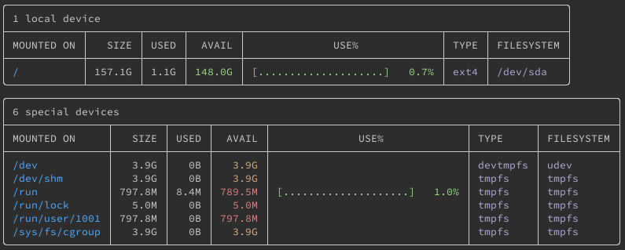
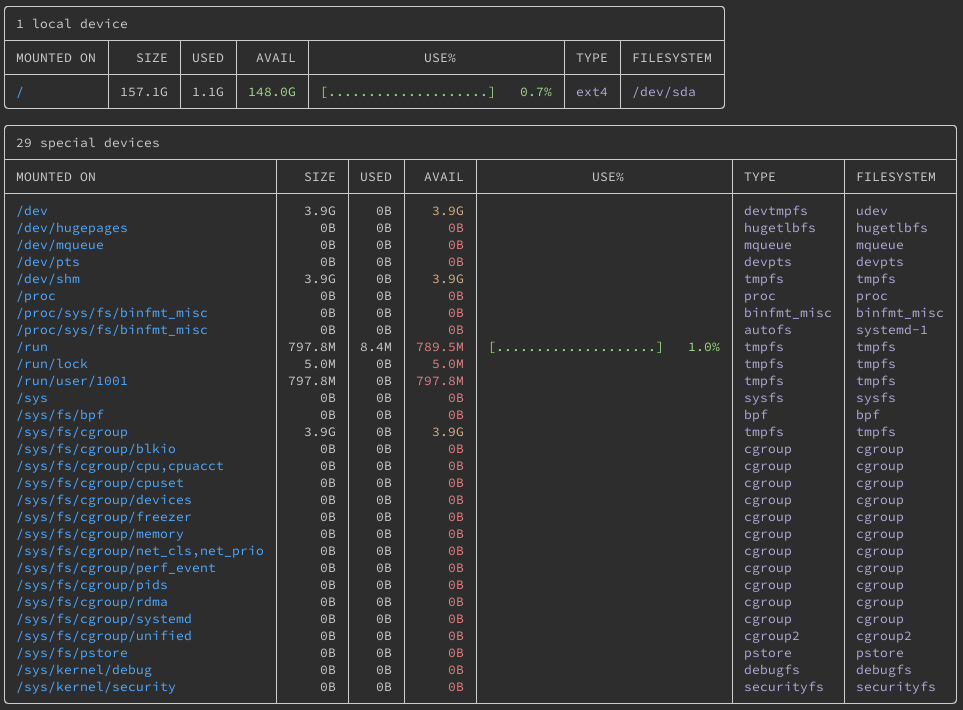
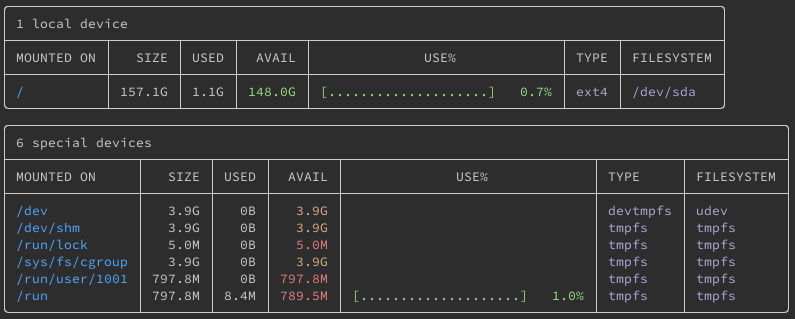

Duf is a command-line tool for viewing your system's disk usage and free space. It combines into one place the information you might otherwise get from the `du` and `df` commands and presents that information in a clean and modern interface. In this guide, you learn more about duf, how it compares to the `du` and `df` commands, and how to install it on your Linux system.

## Before You Begin

1.  If you have not already done so, create a Linode account and Compute Instance. See our [Getting Started with Linode](/docs/guides/getting-started/) and [Creating a Compute Instance](/docs/guides/creating-a-compute-instance/) guides.

1.  Follow our [Setting Up and Securing a Compute Instance](/docs/guides/set-up-and-secure/) guide to update your system. You may also wish to set the timezone, configure your hostname, create a limited user account, and harden SSH access.


The steps in this guide are written for non-root users. Commands that require elevated privileges are prefixed with `sudo`. If you’re not familiar with the `sudo` command, see the [Linux Users and Groups](/docs/guides/linux-users-and-groups/) guide.


## What is duf?

[duf](https://github.com/muesli/duf) gives you a single tool for checking disk usage and free space. By default, Linux systems provide the du and df tools for viewing disk usage and space, respectively, from the command line. Duf presents the same information as du and df and renders it in a modern and easy-to-read command-line display.

Where `du` and `df` give you limited control over how information is shown, duf gives you options for sorting, filtering, and otherwise altering the display. You can learn more about `du` and `df` in our [How to Check and Clean a Linux System's Disk Space](/docs/guides/check-and-clean-linux-disk-space/) guide.

In the following sections, you can see some examples of how duf compares to du and df. Specifically, take a look at the [How to Use duf](/docs/guides/duf-command-on-linux-installation/#how-to-use-duf) section below to see side-by-side comparisons.

## How to Install duf

1. Visit the duf [releases page](https://github.com/muesli/duf/releases), find the latest release, and identify the package file appropriate for your machine. Then, copy the URL for the file you identify.

    To do this, you need to know your system's CPU architecture, which you can get via the command below:

        lscpu | grep Architecture

    - For `x86_64` (like in the example output below), use a package ending in `linux_amd64` from the duf releases page.
    - For `i386` or `i686`, use a package ending in `linux_386` from the duf releases page.
    - Otherwise, you should generally be able to find a package ending in `linux_` followed by your system's listed architecture.

    
Architecture:        x86_64
    

    Use the corresponding package file ending in `.deb` if you are on a **Debian** or **Ubuntu** distribution or a `.rpm` file extension if you are on an RHEL distribution like **AlmaLinux**, **CentOS**, or **Fedora**.

    So, for example, on a Debian system with an **x86_64** (AMD64) architecture, use the `duf_0.6.2_linux_amd64.deb` file (assuming **0.6.2** is the latest release).

1. Download the package file using the command below. Replace the URL with the one you copied in the step above.

        curl -LO https://github.com/muesli/duf/releases/download/v0.6.2/duf_0.6.2_linux_amd64.deb

1. Install duf from the downloaded package. You can use one of the following methods, depending on your Linux distribution. Be sure to replace the example filename with the actual filename of the package file you downloaded.

    - On **Debian** and **Ubuntu** distributions, use the following command:

            sudo dpkg -i duf_0.6.2_linux_amd64.deb

    - On **AlmaLinux**, **CentOS**, and **Fedora**, use the following command:

            sudo rpm -i duf_0.6.2_linux_amd64.rpm

1. Verify your installation by checking the installed version of duf.

        duf --version

    
duf 0.6.2 (d1d2865)
    

## How to Use duf

For basic usage, you can just run the `duf` command alone, and you should see an output similar to the following:

This provides roughly the equivalent of the `sudo df -h` command, as you can see from the output below:


Filesystem      Size  Used Avail Use% Mounted on
udev            3.9G     0  3.9G   0% /dev
tmpfs           798M  8.4M  790M   2% /run
/dev/sda        158G  1.1G  149G   1% /
tmpfs           3.9G     0  3.9G   0% /dev/shm
tmpfs           5.0M     0  5.0M   0% /run/lock
tmpfs           3.9G     0  3.9G   0% /sys/fs/cgroup
tmpfs           798M     0  798M   0% /run/user/1001


You can use a command like `sudo du / -sh` to get local drive usage alone.


1.1G	/


Notice that, compared to the `du` and `df` commands, `duf` makes the information much easier to read, separating information by device type and clearly demarcating fields.

You can go even deeper with duf, listing information for pseudo, duplicate, and inaccessible devices as well.

    duf --all

Duf gives an array of additional options to let you control what information you see. You can see the examples of these options presented in the following sections.

### Limit Results by Path

You can limit your results by passing one or more paths to the `duf` command, separated by spaces. For each path, `duf` includes an entry for the relevant device, and all non-matching devices are excluded from the output.

The example below gives `duf` three paths. Notice that the output has three entries, each corresponding to a device for one of the input paths.

    duf /dev /etc/opt /var/log

### Sorting and Arranging

Duf allows you to define how its displayed tables should be sorted, via the `--sort` option. You can sort by `avail`, `filesystem`, `inodes`, `inodes_avail`, `inodes_usage`, `inodes_used`, `mountpoint`, `size`, `type`, `usage`, or `used`.

Below is an example sorting the tables by `used`:

    duf --sort used

Similarly, duf allows you to define what columns you want to show in each table, by way of the `--output` option. This option accepts the same set of columns used for sorting (above), and you can list multiple columns as a comma-separated list (no spaces).

Below is an example that produces tables with device size, available space, used space, and usage percentage.

    duf --output size,avail,used,usage

### Filtering

Duf gives you two options for filtering out devices.

- You can filter by display table using the `--only` and `--hide` options. Duf displays devices in one of six tables, based on the kinds of devices: `local`, `network`, `fuse`, `special`, `loops`, and `binds`.

    So, to show only devices included in the `local` and `network` tables, use the following command:

        duf --only local, network

    Similarly, to exclude devices included in the `fuse`, `loops`, and `binds` tables, use the following command:

        duf --hide fuse,loops,binds

- You can filter by devices' file systems using the `--only-fs` and `--hide-fs` options.

    To show only devices with `tmpfs` file systems, for instance, use the following command:

        duf --only-fs tmpfs

### Export to JSON

Duf also supports exporting your results in a JSON format. This export option allows the output to be easily used in custom applications.

    duf --json


[
 {
  "device": "sysfs",
  "device_type": "special",
  "mount_point": "/sys",
  "fs_type": "sysfs",
  "type": "sysfs",
  "opts": "rw,nosuid,nodev,noexec,relatime",
  "total": 0,
  "free": 0,
  "used": 0,
  "inodes": 0,
  "inodes_free": 0,
  "inodes_used": 0,
  "blocks": 0,
  "block_size": 4096
 },
 [...]
 

## Conclusion

Duf makes an easy and capable everyday replacement for du and df, with its quick and clear presentation and much wider range of features. You can learn more about duf, and a few more options it offers, on its official [GitHub page](https://github.com/muesli/duf).
