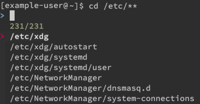
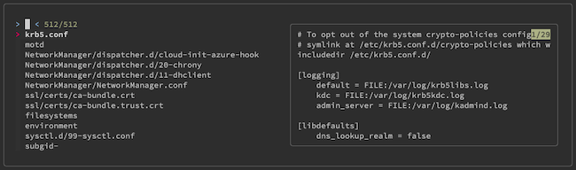

`fzf` is an adaptable command-line fuzzy finder with an interactive interface. `fzf` is flexible and works seamlessly with many other command-line commands to give you a powerful interface for searching files, navigating processes, autocompleting paths, and more.

Learn more about `fzf` in this guide, including how to install and get started using it on your Linux System.

## Before You Begin

1. Familiarize yourself with our [Getting Started with Linode](/docs/getting-started/) guide and complete the steps for setting your Linode's hostname and timezone.

1. This guide uses `sudo` wherever possible. Complete the sections of our [How to Secure Your Server](/docs/security/securing-your-server/) guide to create a standard user account, harden SSH access, and remove unnecessary network services.

1. Update your system.

    - On **Debian** and **Ubuntu**, use the following command:

            sudo apt update && sudo apt upgrade

    - On **AlmaLinux**, **CentOS** (8 or later), or **Fedora**, use the following command:

            sudo dnf upgrade

    - On **CentOS** 7 or earlier, use the following command:

            sudo yum update


The steps in this guide are written for non-root users. Commands that require elevated privileges are prefixed with `sudo`. If you’re not familiar with the `sudo` command, see the [Linux Users and Groups](/docs/tools-reference/linux-users-and-groups/) guide.


## What is fzf?

[`fzf`](https://github.com/junegunn/fzf) is a fuzzy finder for the command line. Your `fzf` searches are conducted in an interactive and dynamic interface that lets you easily navigate and select from matching options. The interface is customizable, too, so you can control the look and feel and even add file previews.

But `fzf` also stands out for its adaptability. It's able to integrate with numerous other commands, and two particular features make that fact useful:

- `fzf` acts as a Unix command-line filter. This means that it can be used in conjunction with many other command-line commands. Whatever list another command pipes into `fzf`, `fzf` can then use its fuzzy finder search and pipe your selection to another command. Check out the [How to Use fzf on the Command Line](#interactive-searches) section below for some examples of this ability in action.

- Because of the ability of `fzf` to integrate with other commands, it can be used directly for a wide array of other commands. In other words, `fzf` allows you to give an interactive interface to many commands that otherwise don't have one. For instance, you can use the `fzf` interface with `cd` to have an interactive search and selection for your directory navigation.

## How to Install fzf

You have two options when it comes to installing `fzf`. The main option provides you with the `fzf` command-line tool, which is generally the most useful. However, you can also install `fzf` just as a Vim plugin, if you only intend to use it in Vim. The preferred approach, however, is to install the command-line tool and additionally install the Vim plugin if you plan to use `fzf` in Vim.

### Command-line Tool

1. Clone the necessary files from the `fzf` Git repository to a new directory in your user's home directory:

        git clone --depth 1 https://github.com/junegunn/fzf.git ~/.fzf

1. Run the `fzf` installation script:

        ~/.fzf/install

1. Verify your installation by checking the `fzf` version:

        fzf --version

    ```output
    0.27.2 (e086f0b)
    ```

### Vim Plugin

1. Install a plugin manager for Vim. The preferred manager for `fzf` is vim-plug, which you can install using the following command::

        curl -fLo ~/.vim/autoload/plug.vim --create-dirs https://raw.githubusercontent.com/junegunn/vim-plug/master/plug.vim

    If you're using NeoVim, refer to our [How to Install NeoVim and Plugins with vim-plug](/docs/guides/how-to-install-neovim-and-plugins-with-vim-plug/#install-the-vim-plug-plugin-manager) guide instead.

1. Add the `Plug` line for `fzf`, as shown below, to the plugin section of your `.vimrc` (or `init.vim`, if you're using NeoVim):

    ```file {title="~/.vimrc" lang="vim"}
    " [...]

    call plug#begin('~/.vim/plugged')
    " [...]
    Plug 'junegunn/fzf', { 'do': { -> fzf#install() } }
    " [...]
    call plug#end()

    " [...]
    ```

1. Use vim-plug to install the `fzf` plugin by executing the following commands in Vim while you have your `.vimrc` open.

        :source %
        :PlugInstall

## How to Use fzf on the Command Line

There are a few ways of using `fzf` such as default path searches, integration with other command-line tools, and auto-completion. All of these, along with how to customize your `fzf` command-line experience are covered in the sections below. There, you can see how to define the default behavior for `fzf` as well as how to control its look and feel.

### Interactive Searches

By default, the `fzf` command by itself starts searching a list of file paths under the current directory. In the background, this uses the `find` command to pipe a list of files to `fzf`, the equivalent of the command below:

    find * -type f | fzf

You can quickly run the default `fzf` command with the <kbd>Ctrl**</kbd> + <kbd>T</kbd> keybinding. Using this method, `fzf` prints the results right to your cursor's current position on the command line. Here's an example that lets you use `fzf` to select a file or directory to open in Vim.

    vim <CTRL+T>

But `fzf` is most useful when you use it with other command-line tools. It allows you to interactively search whatever list you pipe to it via the `|` operator. For instance, you can use the following command to select from a list of services and automatically restart the one you select.

    systemctl --no-legend --type=service --state=running | fzf | awk '{print $1}' | xargs sudo systemctl restart

The initial `systemctl` command lists running services, then pipes the results to `fzf` for you to select from. Once you make a selection, the `awk` command selects the service name from the first column, and `xargs` submits the result back to the `systemctl restart` command.

You can similarly use `fzf` directly as an argument by surrounding the `fzf` command in backtick operators. As an example, the next command uses `fzf` with the `cat` command to find and display a file in the `/etc` directory.

    cat `find /etc/* -type f | fzf`

### Autocompletion

`fzf` comes with a shortcut to use its search function to autocomplete files and directory paths on the command line. After typing an initial directory, use `**` followed by the **Tab** key to use `fzf` to complete the path. The following example, for instance, lists files and directories under `/etc` for autocompletion with the `cd` command below:

    cd /etc/**<TAB>



### Configuration

`fzf` comes with two primary configuration options, each of which is controlled by an environment variable.

First, the `FZF_DEFAULT_COMMAND` variable lets you define the default command to pipe into `fzf`. As shown above, the default is equivalent to `find * -type f`, which has `fzf` search all file paths in the current directory.

In the example below, the default behavior is modified to use the `~+` path with the `find` command. This makes all paths in the results absolute instead of relative:

    export FZF_DEFAULT_COMMAND="find ~+ -type f"

However, this doesn't change the behavior of the <kbd>Ctrl</kbd> + <kbd>T</kbd> keybinding. To change that, you can use the `FZF_CTRL_T_COMMAND` environment variable instead.

Second, the `FZF_DEFAULT_OPTS` variable lets you define the default command-line options for `fzf`. This allows you to run the command with the behavior you want without having to provide the command-line flags each time.

The example below customizes the way `fzf` displays, even adding a preview window.

    export FZF_DEFAULT_OPTS="--height=40% --layout=reverse --info=inline --preview 'cat {}' --border --margin=1 --padding=1"

[](fzf-custom-display.png)

You can add `export` lines like the ones above to your `~/.bashrc` or `~/.zshrc` file to make your choices persistent between shell sessions.

`fzf` has numerous command-line options. The example for `FZF_DEFAULT_OPTS` above covers the main display options but is by no means exhaustive. You can get the full list, along with succinct and helpful descriptions for each option, using the below `fzf` man page:

    man fzf

`fzf` also lets you customize its color theme using the `--color` flag. You can see examples, which include a selection of useful themes, on the `fzf` page for [advanced examples](https://github.com/junegunn/fzf/blob/master/ADVANCED.md#color-themes).

## How to Use fzf as a Vim Plugin

Once you have the `fzf` plugin installed on Vim, you just need to use the `:FZF` command to start searching the current directory. You can also provide a path to that base command to instead base the search in a particular directory. In the command below, the `fzf` plugin begins an interactive search in the `/var` directory.

    :FZF /var

The plugin, additionally, takes most of the options available to the `fzf` command-line tool:

    :FZF --reverse /var

The Vim plugin reads the same environment variables used by the command-line tool. You can look through the [Configuration](#configuration) section above to see your options for these variables.

The `fzf` Vim plugin comes with several configuration options that you can control from within Vim, too. You can review the `fzf` documentation of the [Vim plugin's configuration options](https://github.com/junegunn/fzf/blob/master/README-VIM.md#configuration) for a full list. But, for an example to get started, here are a couple of useful variables to work within your `.vimrc` file:

```file {title="~/.vimrc" lang="vim"}
" If using NeoVim, sets fzf to use a popup window in the center of the main Vim window.
" Otherwise, sets fzf to use a frame in the bottom quarter of the main Vim window.
if has('nvim')
    let g:fzf_layout = { 'window': { 'width': 0.9, 'height': 0.6, 'relative': v:true } }
else
    let g:fzf_layout = { 'down': '25%' }
endif

" Aligns the fzf color scheme with your Vim color scheme.
let g:fzf_colors =
\ { 'fg':      ['fg', 'Normal'],
  \ 'bg':      ['bg', 'Normal'],
  \ 'hl':      ['fg', 'Comment'],
  \ 'fg+':     ['fg', 'CursorLine', 'CursorColumn', 'Normal'],
  \ 'bg+':     ['bg', 'CursorLine', 'CursorColumn'],
  \ 'hl+':     ['fg', 'Statement'],
  \ 'info':    ['fg', 'PreProc'],
  \ 'border':  ['fg', 'Ignore'],
  \ 'prompt':  ['fg', 'Conditional'],
  \ 'pointer': ['fg', 'Exception'],
  \ 'marker':  ['fg', 'Keyword'],
  \ 'spinner': ['fg', 'Label'],
  \ 'header':  ['fg', 'Comment'] }
```

## Examples of Other fzf Integrations

`fzf` integrates relatively easily with other tools since it's designed to work well with other commands through piping. For instance, here is an example that integrates with [ripgrep](/docs/guides/ripgrep-linux-installation/), providing interactive navigation of the results:

    rg test | fzf

In the above, `ripgrep` finds all files containing matches for the `test` search pattern in the current directory and pipes the resulting list to `fzf` for you to view.

And here is a more advanced example, integrating `fzf` with both [The Silver Searcher](/docs/guides/silver-searcher-on-linux/) and [bat](/docs/guides/how-to-install-and-use-the-bat-command-on-linux/):

    ag --count test | fzf --preview "echo {} | cut -d: -f1 | xargs bat --style=numbers --color=always --line-range :100"

To explain what's happening from the command above:

- `ag --count test | `: The Silver Searcher finds files containing matches to the `test` pattern. Each file is listed with a count of the number of times the pattern matched in the file.

- `fzf --preview "echo {} | cut -d: -f1 | `: The Silver Searcher's results are piped to `fzf`, which lays out a command to preview each file's content. The `echo` and `cut` parts here extract the file path from the lines given by The Silver Searcher.

- `xargs bat --style=numbers --color=always --line-range :100"`: The `fzf` preview command ends with the extracted file path being fed into `bat`. `bat` then gives a syntax-highlighted view of the selected file's first 100 lines.

As you can see, `fzf` provides you with unlimited possibilities for combinations with other command-line tools. You can learn more about any of the above tools by searching for our guides on them using the search bar at the top of this page.

Additionally, the `zoxide` tool, a fast and intuitive alternative to `cd`, directly integrates with `fzf` to give you an interactive directory selection. Read our guide on [How to Install and Use zoxide](/docs/guides/how-to-use-zoxide/) to learn more.

## Conclusion

The versatile tool that is`fzf` offers much more than this guide has been able to cover. Hopefully, though, it's been able to give you a solid foundation and enough to start enjoying what `fzf` has to offer. In fact, it's probably covered everything you need for most use cases.

But, when you're itching to see what more `fzf` has to offer, check out the links to the official guides provided below. In particular, the "Advanced" guide can take your `fzf` usage much further, and the "Vim" guide can help you get the most out of `fzf` in Vim.
