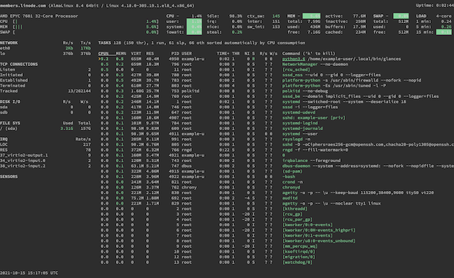
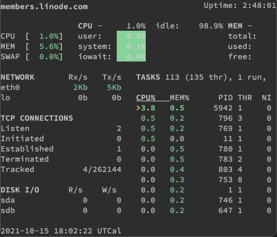
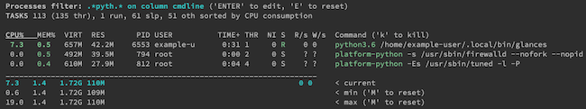

`glances` is a monitoring dashboard that you can run from the command line or for your web browser, and either locally or remotely. It aims to fit as much data as possible onto a single screen, and dynamically adapts to the current screen size.

In this guide, learn how to get started with `glances`, with installation instructions and examples of common tasks.

## Before You Begin

1. Familiarize yourself with our [Getting Started with Linode](/docs/getting-started/) guide, and complete the steps for setting your Linode's hostname and timezone.

1. This guide uses `sudo` wherever possible. Complete the sections of our [How to Secure Your Server](/docs/security/securing-your-server/) guide to create a standard user account, harden SSH access, and remove unnecessary network services.

1. Update your system.

    - On Debian and Ubuntu, you can do this with:

            sudo apt update && sudo apt upgrade

    - On AlmaLinux, CentOS (8 or later), or Fedora, use:

            sudo dnf upgrade


This guide is written for a non-root user. Commands that require elevated privileges are prefixed with `sudo`. If you’re not familiar with the `sudo` command, see the [Users and Groups](/docs/tools-reference/linux-users-and-groups/) guide.


# What is glances?

`glances` gives you an extensive dashboard for monitoring your system, with the goal of giving you everything you need at a single glance.

It follows on the precedent set by system-monitoring tools like `htop` and more recent iterations like `gtop` and `bottom`. You can learn more about these last two in our guides [How to Install and Use gtop on Linux](/docs/guides/installing-and-using-gtop-on-linux/) and [How to Install and Use bottom on Linux](/docs/guides/installing-and-using-bottom-on-linux/), respectively.

`glances` sets itself apart primarily in two ways.

- First, it aims to efficiently display as much information as reasonably possible at one time. `gtop`, in contrast, gives a minimalist display, focusing only on key pieces of information. `bottom`, while providing more information than `gtop`, prioritizes customization over efficiency of the display.

- Second, `glances` comes with the ability to be run as a server. You can run `glances` as a simple server, which you can access with `glances` from another machine. Or you can run it as a web server, which you can access from a web browser on the local or a remote machine.

These features make `glances` ideal for monitoring your system remotely and having all the system information you need at immediately available.

## How to Install glances

1. Install Python 3 (if it isn't already installed), along with the Pip package manager, and the Python developer package.

    - On Debian and Ubuntu, use:

            sudo apt install python3 python3-pip python3-dev

    - On AlmaLinux and CentOS, use:

            sudo dnf install python3 platform-python-devel

    - On Fedora, use:

            sudo dnf install python3 python3-pip python3-devl

1. Install `glances` using the Pip package manager:

        pip3 install --user glances

1. You may need to either restart your shell session (logging out and logging back in) or run the following command for the `glances` command to become available:

        source ~/.bashrc

1. You can then verify your installation with:

        glances --version


Glances v3.2.3.1 with PsUtil v5.8.0
[...]


### Installing Optional Modules

`glances` has numerous modules to enable optional features. You have two options if you want to install these:

- To install all of the optional modules, just use:

        pip3 install --user glances[all]

- To install select modules only, use the same command, but replace `all` with the name of each module you want, separating modules with commas. So, to install the modules for the folders section, the GPU display, and the web server, you can use:

        pip3 install --user glances[folders,gpu,web]

Some of these modules require you to install other dependencies on your system. You can get a full list of these dependencies on the [README](https://github.com/nicolargo/glances#requirements) for `glances`.

You can also use the command below to get a full list of `glances` modules:

    glances --modules-list

The rest of this guide assumes that you've installed all of the modules, using the `glances[all]` command above. However, it doesn't require you to have installed any of the other dependencies listed in the `glances` README.

## How to Use glances

At its simplest, you can immediately start using `glances` to monitor your system. But, on the other hand, `glances` offers plenty of options, from interactive commands, to client–server arrangements, to fine-grained configurations.

The next few sections walk you through some of these options, aiming to get you started with the most useful of them as a foundation. Afterward, you're ready to start using `glances` and start diving deeper into tuning it precisely to fit your needs.

### Basic Usage

You can open up the default glances view with the basic command alone. This includes any modules you've set up using the `glances` configuration file, which you can learn more about in the [Example Configurations](/docs/guides/how-to-use-glances-command/#example-configurations) section below:

    glances

Resizing the screen housing the `glances` interface, you can see how `glances` dynamically adapts:

Once you're in `glances`, there are plenty of interactive commands you can use to control the interface. You can find the full list in the section of the [official documentation on interactive commands](https://glances.readthedocs.io/en/latest/cmds.html#interactive-commands). But, below, you can find a selection of some of the most useful interactive commands to get you started:

- Use the **Up** and **Down** arrow keys to move up and down, respectively, the list of processes.

- Use the **Left** and **Right** arrow keys to select different columns of the processes list. Doing so automatically sorts the list by the newly-selected column.

- Press **Enter** to start filtering the processes list. A prompt allows you to enter a regular expression (regex) that the list gets filtered by. You can also prefix the regex with the designation for a specific column to search. The available designations are listed on the filtering prompt.

    Here's an example that filters for any occurrences of `pyth` within the `Command` column:

        cmdline:.*pyth.*

    

    Once you have filtered the processes, you can press **Enter** again to edit your filter or press **E** (case sensitive) to reset the filter.

- The **1** key toggles the CPU display between a summary view and a per-CPU view.

- The **2** key toggles the left side bar, which, by default, includes network, file usage, and sensor information, among others.

- The **3** key toggles the "quick look" block on the top bar, which provides a graphical summary of CPU and memory usage.

- The **4** key toggles everything but the "quick look" and load displays on the top bar.

- The **5** key toggles the top bar, which displays details about CPU, memory, and load.

- The **6** key toggles the GPU display mode. This only applies for systems with GPUs and with the appropriate module installed. See the [Installing Optional Modules](/docs/guides/how-to-use-glances-command/#installing-optional-modules) section above for more on this.

`glances` also has a suite of command-line options, a few of which you can see in the next section ([Setting Up Clients and Servers](/docs/guides/how-to-use-glances-command/#setting-up-clients-and-servers)). The full list is available in the [official documentation](https://glances.readthedocs.io/en/latest/cmds.html#command-line-options). The list below aims to give you two of the other most useful kinds of command-line options for getting you started with `glances`.

- You can use the `--enable-plugin` and `--disable-plugin` flags to enable and disable, respectively, particular plugins. For example:

        glances --enable-plugin connections --disable-plugin sensors

- You can export the information from `glances` using the `--export` flag followed by the format for the export, `csv` or `json`. You then need to use either the `--export-csv-file` or `--export-json-file` flag alongside the `--export` flag to specify the output filename.

    This example shows you how you can export a JSON file for a default `glances` execution:

        glances --export json --export-json-file glances-output.json

### Setting Up Clients and Servers

`glances` has the ability to be run as a server, which lets you access the dashboard remotely and/or from a web browser.

Before running `glances` as a server, you need to open the appropriate port on the server machine's firewall to allow remote access. The default port for `glances` is **61209**, so the options below show how to open that port based on your Linux distribution.

- On Debian and Ubuntu, make sure you have UFW installed and enabled, which you can learn about in our guide [How to Configure a Firewall with UFW](/docs/guides/configure-firewall-with-ufw/). Then, you can use the command below to open the port for `glances`:

        sudo ufw allow 61208
        sudo ufw reload

- On AlmaLinux, CentOS, and Fedora, use the following command to open the port with FirewallD. You can read the [Introduction to FirewallD on CentOS](/docs/guides/introduction-to-firewalld-on-centos/) guide for more on this firewall tool:

        sudo firewall-cmd --zone=public --add-port=61208/tcp --permanent
        sudo firewall-cmd --reload

To start a `glances` server for command-line access, follow these steps:

1. On the machine you want to serve `glances` from, issue the following command:

        glances -s

    `glances` indicates that it's started up a server, with an output similar to the following. The IP address in the example below (`192.0.2.0`) is replaced with your server machine's IP address. You can stop the server at any time with **Ctrl** + **C**:

    
Glances XML-RPC server is running on 0.0.0.0:61209
Announce the Glances server on the LAN (using 192.0.2.0 IP address)
    

1. On the machine you want to access `glances` on, make sure you have `glances` installed, and then use the command below to connect to your server. Replace `192.0.2.0` with the IP address for the machine you're serving `glances` from:

        glances -c @192.0.2.0

To start a `glances` web server, so that you can access the monitoring dashboard from either a local or remote web browser, follow these steps:

1. On the machine you want to serve `glances` from, issue the following command:

        glances -w

    `glances` indicates that it's started up a web server, with an output similar to the following. You can stop the server at any time with **Ctrl** + **C**:

    
Glances Web User Interface started on http://0.0.0.0:61208/
    

1. In a web browser, navigate to your server machine's IP address and the `glances` port number, given in the output when you started up the web server.

    - For local access, you can use an address like:

            localhost:61208

    - For remote access, use something like the following, replacing `192.0.2.0` with your server machine's actual IP address:

            http://192.0.2.0:61208

    The output from `glances` displays in your web browser:

    

### Example Configurations

Every module in `glances` can be finely and independently configured using the `glances` configuration file. Your `glances` installation doesn't include the configuration file by default, but you can find a comprehensive example on the `glances` [GitHub repository](https://raw.githubusercontent.com/nicolargo/glances/master/conf/glances.conf). Each section in this example configuration file comes with descriptions to help you figure out what parameters to use and how.

To make getting started even more painless, below you can find a shorter example, focused on some key kinds of configuration options.

- First, `global` configuration options can let you control how `glances` behaves overall. In this example, the duration before `glances` refreshes its information is extended and `glances` is told to check for updates at each startup.

- Second, several modules require basic configuration before they display in `glances`. `folders` and `ports` are two such modules. Below, both get configurations identifying what should be monitored, as well as some additional controls for the monitoring.


[global]
refresh=10
check_update=True

[folders]
disable=False
folder_1_path=/home/example-user
folder_1_careful=2500
folder_1_warning=3000
folder_1_critical=3500
folder_1_refresh=60

[ports]
refresh=30
timeout=3
port_default_gateway=True
port_1_host=google.com
port_1_port=80
port_1_description=Google


## Conclusion

And now you're ready to start using `glances` for your system-monitoring needs! But `glances` has far more to offer than can reasonably be covered in a guide like this. If you're ready to go deeper, take a look at the links below to the official documentation for `glances`. Specifically, the Read the Docs for `glances` is extensive, with many details to get your system monitoring setup where you want it to be.
