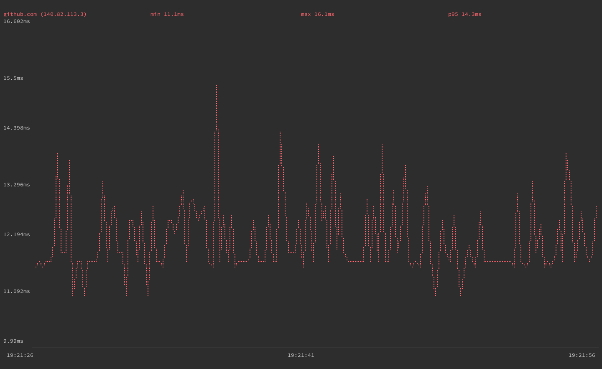
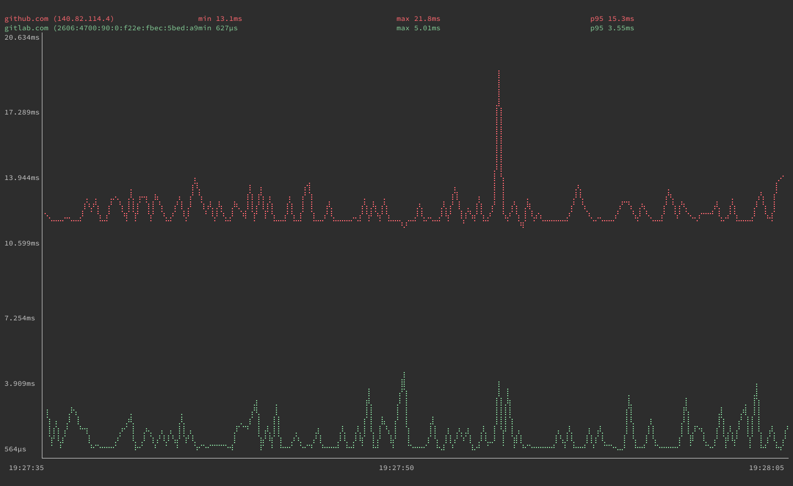
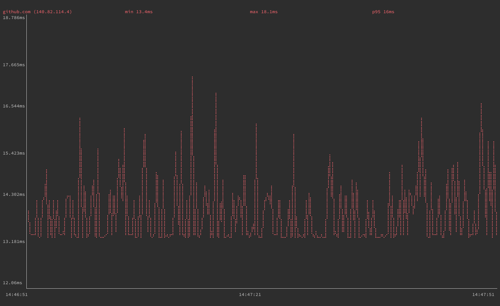
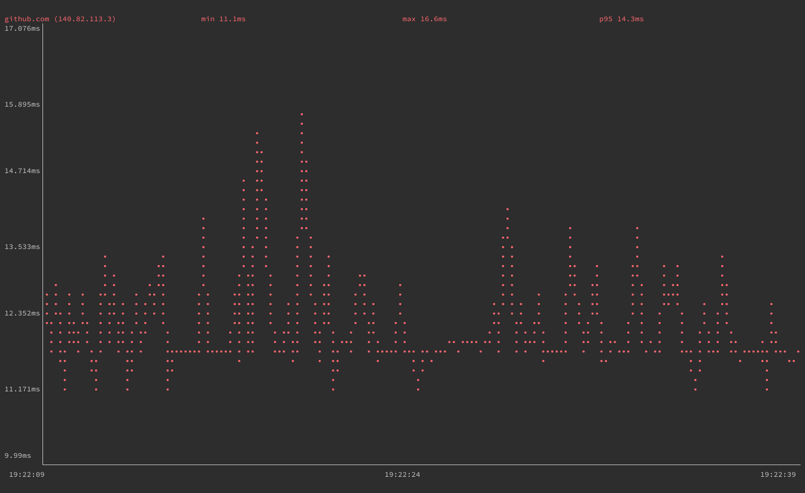
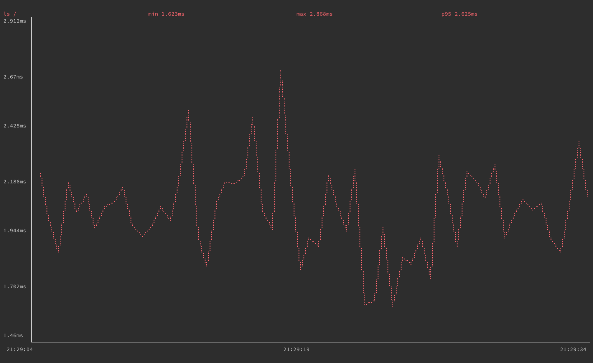
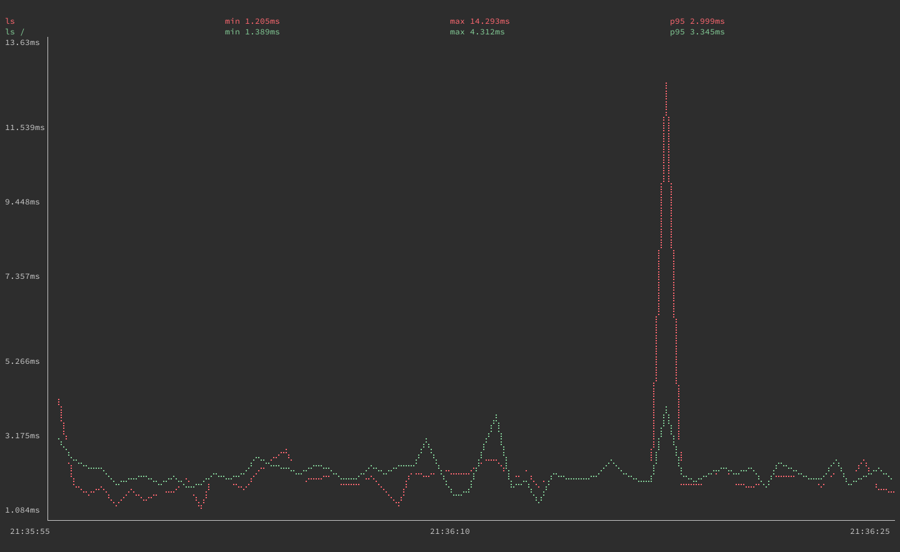

The gping tool takes the functionality of the ping tool and displays its data on a graph. With gping you can track the response time for hosts, and compare the data side by side. This guide shows you how to install gping and get started using it on your Linux system.

## Before You Begin

1.  If you have not already done so, create a Linode account and Compute Instance. See our [Getting Started with Linode](/docs/guides/getting-started/) and [Creating a Compute Instance](/docs/guides/creating-a-compute-instance/) guides.

1.  Follow our [Setting Up and Securing a Compute Instance](/docs/guides/set-up-and-secure/) guide to update your system. You may also wish to set the timezone, configure your hostname, create a limited user account, and harden SSH access.


This guide is written for a non-root user. Commands that require elevated privileges are prefixed with `sudo`. If you’re not familiar with the `sudo` command, see the [Users and Groups](/docs/guides/linux-users-and-groups/) guide.


## What is gping?

[gping](https://github.com/orf/gping) is a Linux tool that provides the same functionality as ping with information displayed on a graph. If you need to measure the response time of a host over time, gping is a tool for the task. With gping, you can ping multiple hosts simultaneously, making it easy to compare response times. You can customize how your gping graph displays information and it is able to graph the execution time of Linux commands.

## How to Install gping

This guide provides installation steps for Debian, Ubuntu, AlamaLinux, CentOS, and Fedora. Find the section below that corresponds to your system's distribution to learn how to install gping.

### Debian and Ubuntu

On Debian and Ubuntu distributions, use the following steps to install gping.

1.  Install the `gnupg` package, which is used for adding a repository key to APT:

        sudo apt install gnupg

1.  Add the Azlux repository to APT. Replace `buster` in the command below with the codename for your Debian release:

        echo "deb http://packages.azlux.fr/debian/ buster main" | sudo tee /etc/apt/sources.list.d/azlux.list

    On Debian, you can find your release's codename with the following command:

        lsb_release -a | grep Codename

    For example, if you are on a Debian 10 system, the above command returns the following output:

    
Codename: buster
    

    On Ubuntu, you can find the Debian codename with the command below:

        cat /etc/debian_version

    If you are on an Ubuntu 20.04 system, the above command returns the following output:

    
bullseye/sid
    

1.  Add the Azlux repository key to APT:

        wget -qO - https://azlux.fr/repo.gpg.key | sudo apt-key add -

1.  Update the APT registry, and install `gping`:

        sudo apt update
        sudo apt install gping

### AlmaLinux, CentOS, and Fedora

On AlmaLinux, CentOS (8 and later), and Fedora, use the following steps to install gping.

1.  Use the COPR plugin to enable the repository for `gping`:

        sudo dnf copr enable atim/gping

1.  Install gping:

        sudo dnf install gping

## How to Use gping

To use the gping, issue the `gping` command followed by a hostname or IP address. The example below pings `github.com`:

    gping github.com

You can also use gping to graph multiple hosts' ping times simultaneously. The next example pings `github.com` and `gitlab.com`, each graphed in a distinct color for readability:

    gping github.com gitlab.com

Should you need a specific kind of IP address resolution, gping supports `-4` and `-6` options for resolving addresses to IPv4 and IPv6, respectively.

gping provides options you can use to fine-tune its graph and also has an option to graph execution time of system commands. The next sections dive deeper into these command options and provide examples that show you how to use them.

### Adjusting Display Options

gping gives you control over the following two aspects of its graph:

- The buffer time, using the `--buffer` option followed by a number of seconds. This determines how much time is shown on the graph screen. You can see in the screenshots above, from the times given below the graphs, that the default buffer time is **30** seconds.

- The watch interval, using the `--watch-interval` option followed by a number of seconds, including fractions of a second. This controls how frequently `gping` measures ping time. The default is **0.5** seconds.

The example employs both of these options to alter the display. The command below has `gping` display 60 seconds at a time and has it graph the ping time of `github.com` once every second:

    gping github.com --buffer 60 --watch-interval 1

If you need to simplify how gping renders the graph line, you can use the option `--simple-graphics`. With this option, gping uses dot characters instead of braille to render its graph lines. This can be useful on terminals that do not support braille rendering:

### Graphing Command Execution Time

As a bonus feature, gping allows you to graph execution time for command-line commands. Using the `--cmd` option, gping lets you provide commands much as you would normally provide hostnames or IP addresses. For example:

    gping --cmd 'ls /'

As with hosts, you can pass gping multiple commands when using this option to see the commands' execution times graphed side by side:

    gping --cmd 'ls' 'ls /'

Since graphing command execution times is a bonus gping feature, it may not perform reliably for all kinds of commands. This is especially the case for commands that are more complicated.

If you are looking to measure a command's performances, consider using the hyperfine tool. Hyperfine is a tool for benchmarking command-line commands, with an emphasis on clearly rendering side-by-side comparisons. If you are interested, check out our guide on [getting started with hyperfine](/docs/guides/installing-and-using-hyperfine-on-linux/).

## Conclusion

You are now ready to start using gping to measure response times. Due to the ping tool's simplicity, gping might not fully replace it, however, gping fills a highly useful niche. If you need to measure a host's response times over some duration, it is useful to have gping installed and ready on your system.
