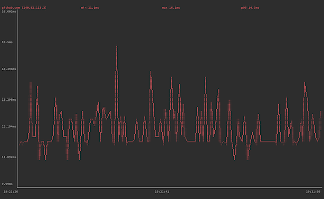
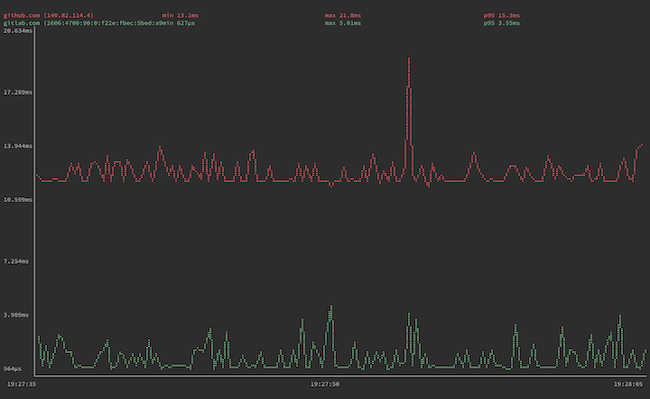
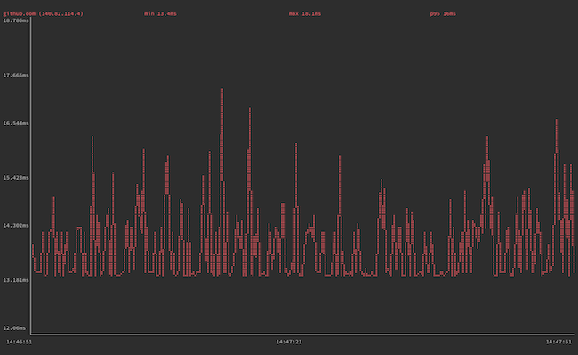
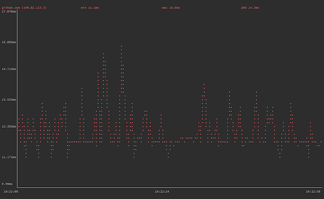
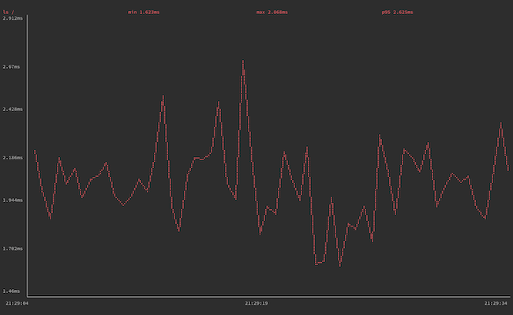
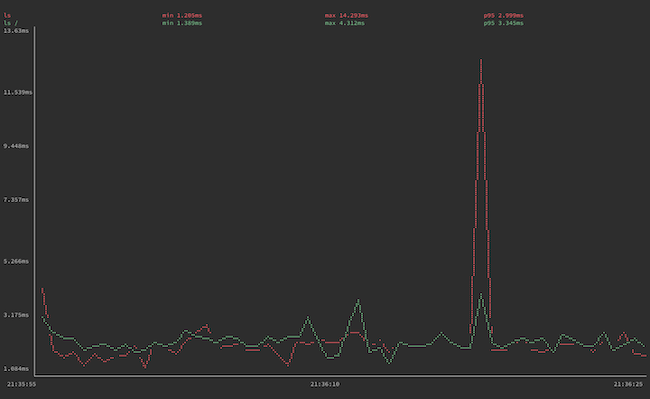

`gping` takes the functionality of `ping` and puts it on a graph, letting you track the response time for hosts, and even compare them side by side. This guide shows you how to install `gping` and get started using it on your Linux system.

## Before You Begin

1. Familiarize yourself with our [Getting Started with Linode](/docs/getting-started/) guide, and complete the steps for setting your Linode's hostname and timezone.

1. This guide uses `sudo` wherever possible. Complete the sections of our [How to Secure Your Server](/docs/security/securing-your-server/) guide to create a standard user account, harden SSH access, and remove unnecessary network services.

1. Update your system.

    - On Debian and Ubuntu, you can do this with:

            sudo apt update && sudo apt upgrade

    - On AlmaLinux, CentOS (8 or later), or Fedora, use:

            sudo dnf upgrade


This guide is written for a non-root user. Commands that require elevated privileges are prefixed with `sudo`. If you’re not familiar with the `sudo` command, see the [Users and Groups](/docs/tools-reference/linux-users-and-groups/) guide.


## What is gping?

[`gping`](https://github.com/orf/gping) is a tool that gives the functionality of `ping` on a graph. If ever you have wanted to measure the response time of a host over time, `gping` is a tool for the task. `gping` even allows you to ping multiple hosts simultaneously, making it easy to compare response times.

Beyond that, `gping` gives you control over how the graph displays, and even comes with a feature for graphing the execution time of command-line commands.

## How to Install gping

This guide breaks down the installation into two paths for different Linux distributions. Check out the section below that names your distribution to learn how to install `gping` on your system.

### Debian and Ubuntu

On Debian and Ubuntu distributions, use the following steps to install `gping`.

1. Install the `gnupg` package, which is used for adding a repository key to APT:

        sudo apt install gnupg

1. Add the Azlux repository to APT. Replace `buster` in the command below with the codename for your Debian release:

        echo "deb http://packages.azlux.fr/debian/ buster main" | sudo tee /etc/apt/sources.list.d/azlux.list

    On Debian, you can find your release's codename with:

        lsb_release -a | grep Codename

    For example, the output should look like the following if you are on Debian 10:

    
Codename:	buster
    

    On Ubuntu, you can find the Debian codename with:

        cat /etc/debian_version

    As an example, your output should resemble this on Ubuntu 20.04, indicating a codename of `bullseye`:

    
bullseye/sid
    

1. Add the Azlux repository key to APT:

        wget -qO - https://azlux.fr/repo.gpg.key | sudo apt-key add -

1. Update the APT registry, and install `gping`:

        sudo apt update
        sudo apt install gping

### AlmaLinux, CentOS, and Fedora

On AlmaLinux, CentOS (8 and later), and Fedora, use the following steps to install `gping`.

1. Use the COPR plugin to enable the repository for `gping` on DNF:

        sudo dnf copr enable atim/gping

1. Install `gping`:

        sudo dnf install gping

## How to Use gping

Getting started with `gping` is as simple as providing the command with a hostname or IP address. Here is an example that pings `github.com`:

    gping github.com

You can also use `gping` to graph multiple hosts' ping times simultaneously. This next example pings `github.com` and `gitlab.com`, each graphed in a distinct color for readability:

    gping github.com gitlab.com

Should you need a specific kind of IP address resolution, `gping` supports `-4` and `-6` options for resolving addresses to IPv4 and IPv6, respectively.

`gping` comes with a few other options you can use to fine-tune the graphing — and even an option to graph commands' execution times. Take a look at the following sections to learn about these options and see examples of them in action.

### Adjusting Display Options

`gping` gives you control over two aspects of the graph.

- The buffer time, using the `--buffer` option followed by a number of seconds. This determines how much time is shown on the graph screen. You can see in the screenshots above, from the times given below the graphs, that the default buffer time is **30** seconds.
- The watch interval, using the `--watch-interval` option followed by a number of seconds, including fractions of a second. This controls how frequently `gping` measures ping time. The default is **0.5** seconds.

Here, you can see an example employing both of these options to alter the display. The command below has `gping` display 60 seconds at a time and has it graph the ping time of `github.com` once every second:

    gping github.com --buffer 60 --watch-interval 1

Should you need to simplify how `gping` renders the graph line, you can use the option `--simple-graphics`. With this option, `gping` uses dot characters instead of braille to render its graph lines. This can be useful on terminals that do not support the braille rendering:

### Graphing Command Execution Time

As a bonus feature, `gping` allows you to graph execution time for command-line commands. Using the `--cmd` option, `gping` lets you provide commands much as you would normally provide hostnames or IP addresses. For example:

    gping --cmd 'ls /'

As with hosts, you can give `gping` multiple commands when using this option to see the commands' execution times graphed side by side:

    gping --cmd 'ls' 'ls /'

Be aware that, with this feature being more of a bonus in `gping`, it may not perform reliably on all kinds of commands. This seems especially to be the case as commands become more complicated.

If you are looking to measure commands' performances in earnest, we recommend that you take a look at `hyperfine`. It is a tool for benchmarking command-line commands, with an emphasis on clearly rendering side-by-side comparisons. Check out our guide on getting started with `hyperfine` if you are interested.

## Conclusion

With that, you are ready to start using `gping` to measure response times. For everyday use, `gping` may not replace `ping` for simplicity, but it fills a highly useful niche. If ever you find yourself wanting to measure hosts response times over some duration, it is useful to have `gping` on the ready.
