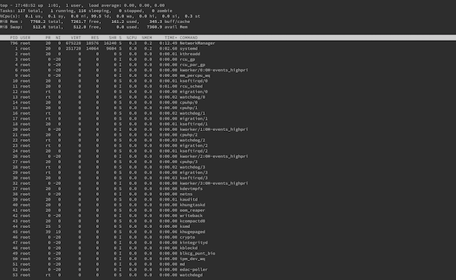
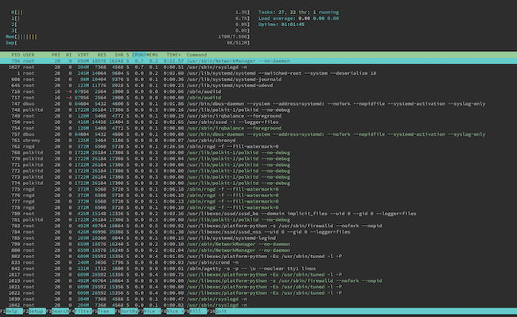
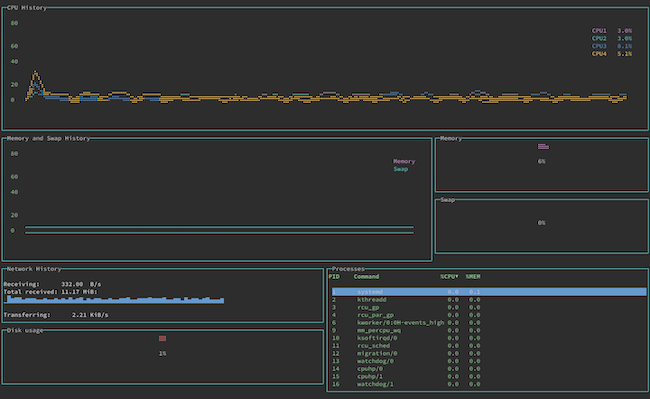

`gtop` is a system monitoring dashboard for your terminal, with a rich graphical display to get you up to date quickly and easily. In this guide, learn more about `gtop`, including how it compares to `top` and `htop`. Then, see how to install and get started using `gtop` on your Linux system.

## Before You Begin

1. Familiarize yourself with our [Getting Started with Linode](/docs/getting-started/) guide and complete the steps for setting your Linode's hostname and timezone.

1. This guide uses `sudo` wherever possible. Complete the sections of our [How to Secure Your Server](/docs/security/securing-your-server/) guide to create a standard user account, harden SSH access, and remove unnecessary network services.

1. Update your system.

    - On **Debian** and **Ubuntu**, you can do this with the following commands:

            sudo apt update && sudo apt upgrade

    - On **AlmaLinux**, **CentOS** (8 or later), or **Fedora**, use the following command:

            sudo dnf upgrade


The steps in this guide are written for non-root users. Commands that require elevated privileges are prefixed with `sudo`. If you’re not familiar with the `sudo` command, see the [Linux Users and Groups](/docs/tools-reference/linux-users-and-groups/) guide.


## What is gtop?

[`gtop`](https://github.com/aksakalli/gtop) is a graphical system monitoring dashboard for your terminal. `gtop` shows your system's memory, CPU, and disk usage at a glance in an easy-to-read visual layout. And, alongside that, you get a list of running processes with information about their CPU, and memory consumption.

### gtop vs htop

`gtop` is built on the precedent of `htop`, which aims to be a more interactive and graphical version of `top`. If you are unfamiliar, `top` is a command included by default on most Unix systems for viewing running processes and system usage information. To the basic listing approach of `top`, `htop` added vertical and horizontal scrolling, mouse input, more information about processes, and additional features for interacting with them.

`gtop` takes up the graphical direction of `htop`. But unlike `htop`, which still focuses on listing processes, `gtop` seeks to provide an almost entirely graphical representation of the system's usage. With `gtop`, you get various graphs in widgets that break up your monitoring into visual sections. `gtop` employs distinct coloring in its displays, making it all the more readable, too.

Take a look at the screenshots below, which contrast the displays of `top`, `htop`, and `gtop`.

## How to Install gtop

1. Install NPM. The recommended way to do this is by first installing the Node Version Manager (NVM). You can use the following commands to install NVM and then use it to install the current version of Node (which includes NPM). You may want to check the NVM [installation guide](https://github.com/nvm-sh/nvm#installing-and-updating) and replace `v0.38.0` below with the latest version you see in the guide.

        curl -o- https://raw.githubusercontent.com/nvm-sh/nvm/v0.38.0/install.sh | bash
        source ~/.bashrc
        nvm install node

    You can then verify your `npm` installation with the `--version` command.

        npm --version

    
7.21.0
    

1. Install `gtop` via `npm`. Use the `-g` option to install `gtop` as a global NPM package.

        npm install gtop -g

## How to Use gtop

One advantage of `gtop` is that, despite its graphical displays, it is a simple, easy-to-use system monitoring application. Just run the following command, and `gtop` starts showing your system's usage and process information.

    gtop

What follows is a breakdown of the parts, or widgets, of the `gtop` display. You can refer to the screenshots in the [What is gtop?](/docs/installing-and-using-gtop-on-linux/#what-is-gtop) section above to follow along.

- **CPU History** gives a graph of CPU usage over the last minute. Each line on the graph represents one of your system's CPUs. In addition, the right side of the widget includes the current percentage usage for each CPU.
- **Memory and Swap History** provides the same graphical information but for your system's memory, both physical and swap.
- The **Memory** and **Swap** widgets display the current percentage usage for physical memory and swap memory, respectively.
- **Network History** shows information related to network traffic and includes a graph of bytes-per-second being received over the last minute.
- The **Disk Usage** widget displays the current percentage of disk usage on the system.
- **Processes** gives you a simplified version of the process listing you could expect from the `top` command.

`gtop` is limited in its interactive options. You can navigate the **Processes** table with the up and down arrow keys. You can also control the table's sort order. Press **p** key to sort by PID (process ID), **c** key to sort by CPU usage, and **m** key to sort by memory usage.

## Conclusion

For all its simplicity, `gtop` provides an effective at-a-glance summary of your system. Tools like `top` and `htop` focus on providing more comprehensive information about running processes — and, in the case of `htop`, more control of those processes. But `gtop` excels if you want to be able to quickly gather your system's current performance.

Do you like the graphical system monitoring of `gtop` but want more control and customization? You may want to check out `bottom` in that case, which takes the visual direction of `gtop` and gives you the reigns. Take a look at our guide [How to Install and Use bottom](/docs/guides/installing-and-using-bottom-on-linux/) to learn more.
