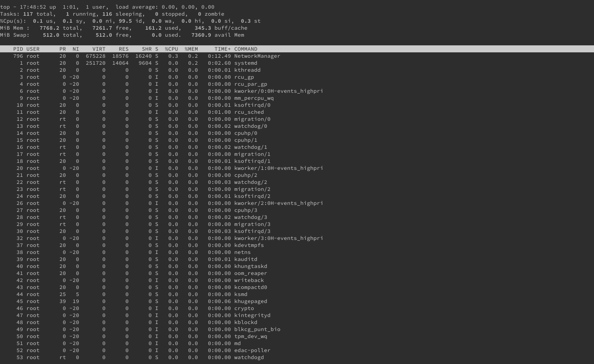
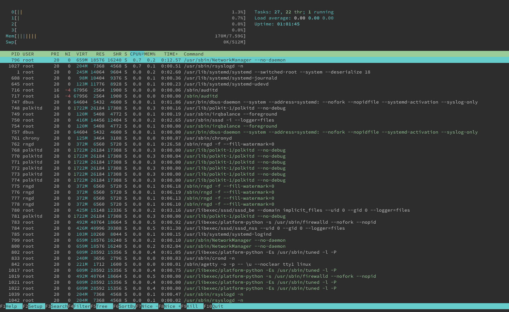
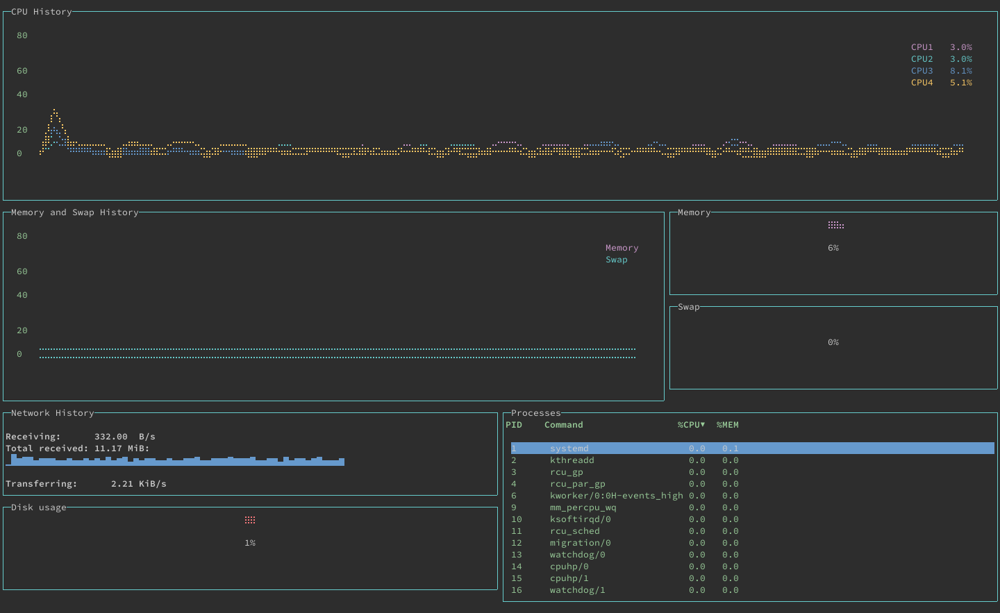

Gtop is a system monitoring dashboard for your terminal, with a rich graphical display. In this guide, you learn more about gtop and how it compares to the Linux utilities, top and htop. This guide also shows you how to install and get started using gtop on your Linux system.

## Before You Begin

1.  If you have not already done so, create a Linode account and Compute Instance. See our [Getting Started with Linode](/docs/guides/getting-started/) and [Creating a Compute Instance](/docs/guides/creating-a-compute-instance/) guides.

1.  Follow our [Setting Up and Securing a Compute Instance](/docs/guides/set-up-and-secure/) guide to update your system. You may also wish to set the timezone, configure your hostname, create a limited user account, and harden SSH access.


The steps in this guide are written for non-root users. Commands that require elevated privileges are prefixed with `sudo`. If you’re not familiar with the `sudo` command, see the [Linux Users and Groups](/docs/guides/linux-users-and-groups/) guide.


## What is gtop?

[Gtop](https://github.com/aksakalli/gtop) is a graphical system monitoring dashboard for your terminal. Gtop displays your system's memory, CPU, and disk usage at a glance in an easy-to-read visual layout. Alongside that information, you get a list of running processes with statistics about their CPU, and memory consumption.

### gtop vs. htop

Gtop is built on the precedent of htop, which aims to be a more interactive and graphical version of top. If you are unfamiliar, top is a command included by default on most Unix systems for viewing running processes and system usage information. Htop adds vertical and horizontal scrolling, mouse input, more information about processes, and additional features.

Gtop takes up the graphical direction of htop. But unlike htop, which still focuses on listing processes, gtop seeks to provide an almost entirely graphical representation of the system's usage information. With gtop, you get various graphs in widgets that break up your monitoring into visual sections. Gtop employs distinct coloring in its displays, making it all the more readable, too.

Take a look at the screenshots below, which contrast the displays of top, htop, and gtop.

**top**

**htop**

**gtop**

## How to Install gtop

In order to install gtop you need to instal the Node Package Manager (npm). This section shows you how to install npm, using the Node Version Manager (nvm), and then, how to install gtop.

1. You can use the following commands to install nvm and then use it to install the current version of Node (which includes npm). You may want to consult the nvm [installation guide](https://github.com/nvm-sh/nvm#installing-and-updating) and replace `v0.38.0` below with the latest version you see in the guide.

        curl -o- https://raw.githubusercontent.com/nvm-sh/nvm/v0.38.0/install.sh | bash
        source ~/.bashrc
        nvm install node

    You can then verify your npm installation with using the `--version` option.

        npm --version

    
7.21.0
    

1. Install gtop using npm. Use the `-g` option to install gtop as a global system package.

        npm install gtop -g

## How to Use gtop

One advantage of gtop is that, despite its graphical display, it is a straight-forward system monitoring application. When you run gtop it immediately starts showing your system's usage and process information.

    gtop

What follows is a breakdown of the parts, or widgets, of the gtop display. You can refer to the screenshots in the [What is gtop?](/docs/guides/installing-and-using-gtop-on-linux/#what-is-gtop) section above to follow along.

- **CPU History** displays a graph of CPU usage over the last minute. Each line on the graph represents one of your system's CPUs. In addition, the right side of the widget includes the current percentage usage for each CPU.
- **Memory and Swap History** provides the same graphical information but for your system's memory, both physical and swap.
- The **Memory** and **Swap** widgets display the current percentage usage for physical memory and swap memory, respectively.
- **Network History** shows information related to network traffic and includes a graph of bytes-per-second being received over the last minute.
- The **Disk Usage** widget displays the current percentage of disk usage on the system.
- **Processes** gives you a simplified version of the process listing you could expect from the `top` command.

Gtop is limited in its interactive options. You can navigate the **Processes** table with the **up** and **down arrow** keys. You can also control the table's sort order. Press **p** key to sort by PID (process ID), **c** key to sort by CPU usage, and **m** key to sort by memory usage.

## Conclusion

For all its simplicity, gtop provides an effective at-a-glance summary of your system. Tools like top and htop focus on providing more comprehensive information about running processes — and, in the case of htop, more control of those processes. Gtop excels if you want to be able to quickly gather your system's current performance.

Do you like the graphical system monitoring of `gtop` but want more control and customization? You may want to check out bottom in that case, which takes the visual direction of gtop and gives you more control. Take a look at our guide [How to Install and Use bottom](/docs/guides/installing-and-using-bottom-on-linux/) to learn more.
