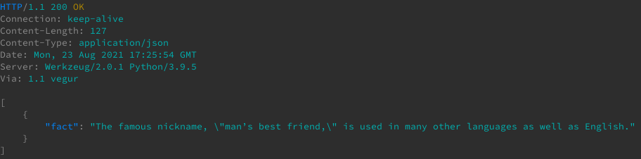

[HTTPie](https://httpie.io/) is a command-line HTTP client built for modern web APIs. It provides intuitive commands and a user-friendly interface. In this guide, you learn about HTTPie's features and how it compares to cURL. You also learn how to install and start using HTTPie on your Linux system.

## Before You Begin

1.  If you have not already done so, create a Linode account and Compute Instance. See our [Getting Started with Linode](/docs/guides/getting-started/) and [Creating a Compute Instance](/docs/guides/creating-a-compute-instance/) guides.

1.  Follow our [Setting Up and Securing a Compute Instance](/docs/guides/set-up-and-secure/) guide to update your system. You may also wish to set the timezone, configure your hostname, create a limited user account, and harden SSH access.


The steps in this guide are written for a non-root user. Commands that require elevated privileges are prefixed with `sudo`. If you’re not familiar with the `sudo` command, see the [Linux Users and Groups](/docs/guides/linux-users-and-groups/) guide.


## What is HTTPie?

HTTPie is a command-line HTTP client similar to cURL. But unlike cURL, HTTPie is designed to make working with modern web APIs easier. HTTPie's syntax is geared towards working with web services. Its interface is built to be more readable and user-friendly than cURL. These features make HTTPie a great tool for testing, debugging, or otherwise working with web services from the command line.

### HTTPie vs curl

This section explores why you might choose to use HTTPie over cURL, especially since cURL is installed by default on many Linux distributions. cURL excels at covering a wide range of HTTP needs through a proliferation of options. HTTPie focuses on supporting queries against modern web APIs. It provides the most relevant details when working with web APIs and hides information that you are unlikely to need. HTTPie's focused output lets you interact with web services more intuitively and clearly.

If you are looking to work with web APIs, especially RESTful APIs that use JSON data you should consider using HTTPie. Alternatively, consider cURL if you want an HTTP client that fits more general needs, since it comes with options to make it more adaptable.

You can learn more about curlie, a modern command-line HTTP client with the readability of HTTPie and the adaptability of cURL, from our [How to Install and Use the curlie Command on Linux](/docs/guides/installing-and-using-the-curlie-command-on-linux/) guide.

## How to Install HTTPie

HTTPie is available from the package managers of most major Linux distributions. Below are the commands you can use to install HTTPie through the package managers of various distributions.

- On **Debian** and **Ubuntu**, use the following command:

        sudo apt install httpie

- On **AlmaLinux** and **CentOS**, use the following command:

        sudo yum install httpie

- On **Fedora**, use the following command:

        sudo dnf install httpie

Once you have HTTPie installed, you can verify your installation and access it using the `http` command.

    http --version


0.9.8


## How to Use HTTPie

If you are familiar with other HTTP clients, HTTPie should be easier to learn. Much of its basic usage is similar to cURL`, but it allows you to simplify the required commands.

The sections that follow introduce you to working with HTTPie for the most common kinds of HTTP requests when working with web services.

### Basic Usage

You can see the most basic usage of HTTPie with GET requests. Like cURL, HTTPie does not require that you specify the request method. Simply provide the command followed by the request URL.

The following example request fetches a random fact about dogs from a "Dog Facts" web service. The request includes a URL parameter for the number of facts to be returned by the web service.

    http dog-facts-api.herokuapp.com/api/v1/resources/dogs?number=1


HTTP/1.1 200 OK
Connection: keep-alive
Content-Length: 127
Content-Type: application/json
Date: Mon, 23 Aug 2021 17:25:54 GMT
Server: Werkzeug/2.0.1 Python/3.9.5
Via: 1.1 vegur

[
    {
        "fact": "The famous nickname, \"man’s best friend,\" is used in many other languages as well as English."
    }
]


HTTPie's output includes response header information by default. It uses syntax highlighting to make the response even easier to read, as you can see in the following screenshot:

Adding header data to a request in HTTPie requires appending the data after the URL, as shown in the command below. The following example fetches a random "dad joke" from a web service. You can see that the command also adds the `--follow` option, which has HTTPie follow any URL redirects (the equivalent of `-L` in `curl`). HTTPie includes the header information for the redirect response in its output.

    http --follow icanhazdadjoke.com/ 'Accept: application/json'


HTTP/1.1 200 OK
CF-Cache-Status: DYNAMIC
CF-RAY: 683615495874187d-EWR
Connection: keep-alive
Content-Encoding: gzip
Content-Type: application/json
Date: Mon, 23 Aug 2021 17:32:57 GMT
Expect-CT: max-age=604800, report-uri="https://report-uri.cloudflare.com/cdn-cgi/beacon/expect-ct"
NEL: {"success_fraction":0,"report_to":"cf-nel","max_age":604800}
Report-To: {"endpoints":[{"url":"https:\/\/a.nel.cloudflare.com\/report\/v3?s=LogkwJTikLYzmXf5GKMoxhxcr7Jvkc6rIE0rD5hlOIKDxJxrB4UlinYAodtOvOpaUT%2FG839R3aktgVuK4EOQGyB4vUpkWgP7Gp4xXODKUcO1GkgQSsrB%2BmPux%2B1jH0hipNABYY3AxfIb6NBx81PUp6k%3D"}],"group":"cf-nel","max_age":604800}
Server: cloudflare
Strict-Transport-Security: max-age=15552000; includeSubDomains
Transfer-Encoding: chunked
X-Content-Type-Options: nosniff
alt-svc: h3-27=":443"; ma=86400, h3-28=":443"; ma=86400, h3-29=":443"; ma=86400, h3=":443"; ma=86400
cache-control: max-age=0, must-revalidate, no-cache, no-store, public, s-maxage=0
x-frame-options: DENY
x-xss-protection: 1; mode=block

{
    "id": "WvsHlyszkyd",
    "joke": "Why did the man put his money in the freezer? He wanted cold hard cash!",
    "status": 200
}


### Request Methods

To specify a request method in HTTPie, just include the method designation — `GET`, `POST`, `PUT`, `DELETE`, etc — as the first part of the `http` command. You can see this in the next example, which uses HTTPie's own web service for testing.

    http DELETE pie.dev/delete


HTTP/1.1 200 OK
CF-Cache-Status: DYNAMIC
CF-RAY: 6836ee9bfbdc32f4-EWR
Connection: keep-alive
Content-Encoding: gzip
Content-Type: application/json
Date: Mon, 23 Aug 2021 20:01:18 GMT
NEL: {"success_fraction":0,"report_to":"cf-nel","max_age":604800}
Report-To: {"endpoints":[{"url":"https:\/\/a.nel.cloudflare.com\/report\/v3?s=DnOoAWOq7jRjiJRXmGNytYPttmCbCZeUpUCm%2B4C4svpUHW1IICEudRbVHFkyr3wcnEHqG%2BIlXLLubP6IU%2FOZVQPnIHi6O0iuJRqOGO5u%2FJvOlG6Wh6yyL%2FUzALzT8E5OjDQUDrvA"}],"group":"cf-nel","max_age":604800}
Server: cloudflare
Transfer-Encoding: chunked
access-control-allow-credentials: true
access-control-allow-origin: *
alt-svc: h3-27=":443"; ma=86400, h3-28=":443"; ma=86400, h3-29=":443"; ma=86400, h3=":443"; ma=86400

{
    "args": {},
    "data": "",
    "files": {},
    "form": {},
    "headers": {
        "Accept": "*/*",
        "Accept-Encoding": "gzip",
        "Cdn-Loop": "cloudflare",
        "Cf-Connecting-Ip": "192.0.2.0",
        "Cf-Ipcountry": "US",
        "Cf-Ray": "6836ee9bfbdc32f4-FRA",
        "Cf-Visitor": "{\"scheme\":\"http\"}",
        "Connection": "Keep-Alive",
        "Content-Length": "0",
        "Host": "pie.dev",
        "User-Agent": "HTTPie/0.9.8"
    },
    "json": null,
    "origin": "192.0.2.0",
    "url": "http://pie.dev/delete"
}


### Submit JSON Data

Because HTTPie is designed with modern web APIs in mind, it makes submitting JSON data exceptionally easy. For the most basic requests provide the request's parameters after the URL. HTTPie automatically assembles the parameters into a JSON object.

The following example sends a POST request that capitalizes the letters in a string provided in JSON format. The response is a JSON object with the original string (`INPUT`) and its capitalized version (`OUTPUT`).

    http POST api.shoutcloud.io/V1/SHOUT INPUT="hello, world!"


HTTP/1.1 200 OK
Connection: keep-alive
Content-Length: 50
Content-Type: APPLICATION/JSON
Date: Mon, 23 Aug 2021 18:07:21 GMT
Server: Cowboy
Via: 1.1 vegur

{"INPUT":"hello, world!","OUTPUT":"HELLO, WORLD!"}


HTTPie also provides options for using files for the request and response JSON objects. You can see this feature in action by creating a JSON file like the one below for the "Shout Cloud" service used above.


{
    "INPUT": "this sentence needs to be shouted!"
}


Then, use HTTPie to submit that JSON data in a `POST` request to the web service.

    http POST api.shoutcloud.io/V1/SHOUT < to-shout.json


HTTP/1.1 200 OK
Connection: keep-alive
Content-Length: 92
Content-Type: APPLICATION/JSON
Date: Mon, 23 Aug 2021 18:27:22 GMT
Server: Cowboy
Via: 1.1 vegur

{"INPUT":"this sentence needs to be shouted!","OUTPUT":"THIS SENTENCE NEEDS TO BE SHOUTED!"}


Conversely, you can have HTTPie save a JSON response as a file, as shown below:

    http POST api.shoutcloud.io/V1/SHOUT INPUT="another shout over here!" > shouting.json


{"INPUT":"another shout over here!","OUTPUT":"ANOTHER SHOUT OVER HERE!"}


## Conclusion

You should now be ready to start using HTTPie to send request to web APIs. If you find yourself looking for more advanced features, you can find them as you dig deeper into HTTPie. Check out the official [HTTPie documentation](https://httpie.io/docs), and also reference the `http --help` command to start learning more about HTTPie's features.
