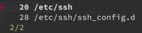

`zoxide` is a fast and smart alternative to the `cd` command. Built on Rust, `zoxide` outperforms many similar commands, and its directory ranking algorithm helps you navigate quick.

Learn more about `zoxide` in this guide, including how to install and get started using it on your Linux system.

## Before You Begin

1. Familiarize yourself with our [Getting Started with Linode](/docs/getting-started/) guide, and complete the steps for setting your Linode's hostname and timezone.

1. This guide uses `sudo` wherever possible. Complete the sections of our [How to Secure Your Server](/docs/security/securing-your-server/) guide to create a standard user account, harden SSH access, and remove unnecessary network services.

1. Update your system.

    - On **Debian** and **Ubuntu**, use the following command:

            sudo apt update && sudo apt upgrade

    - On **AlmaLinux**, **CentOS** (8 or later), or **Fedora**, use the following command:

            sudo dnf upgrade

    - On **CentOS** 7 or earlier, use the following command:

            sudo yum update


The steps in this guide are written for non-root users. Commands that require elevated privileges are prefixed with `sudo`. If you’re not familiar with the `sudo` command, see the [Linux Users and Groups](/docs/tools-reference/linux-users-and-groups/) guide.


## What is zoxide?

[`zoxide`](https://github.com/ajeetdsouza/zoxide) is an alternative to the `cd` command, offering faster performance and smarter navigation capabilities. Like the tools mentioned below, much of the power of `zoxide` is in its directory ranking based on your usage. Its ranking algorithm can quickly match partial paths, even single search terms, with one of your most used directories.

### zoxide vs Similar Tools

Several similar `cd` alternatives exist. Most notably, there is [`z`](https://github.com/rupa/z), [`autojump`](https://github.com/wting/autojump), and [`fasd`](https://github.com/clvv/fasd).

So, what sets `zoxide` apart?

First, `zoxide` is fast. This is the case not only compared to `cd` itself but even to the other alternatives. `zoxide` is built on Rust, and, like many tools taking advantage of the Rust environment, `zoxide` is performant.

Second, `zoxide` aims for a minimal and ergonomic interface rather than an abundance of features. A tool like `autojump` has more abilities, but a deeper understanding is needed to use it. Even more so with `fasd`, which aspires to be a "command-line productivity booster". It includes a suite of methods for short-cutting common navigation and file related commands. In fact, if what you're looking for is a full-featured productivity booster, `fasd` is a tool worth exploring.

`zoxide` focuses on providing a handy, fast, and intelligent `cd` alternative. It avoids the other embellishments to hone its interface into something sharp and intuitive. So, if what you're looking for is just that — a tight and performant `cd` replacement — `zoxide` is a good choice.

## How to Install zoxide

1. Install `zoxide` from you system's package manager:

    - On **Debian** and **Ubuntu**, install `zoxide` using APT:

            sudo apt install zoxide

    - On **AlmaLinux** and **CentOS**, use the COPR plugin to enable the `zoxide` repository on DNF, and then install `zoxide` from there:

            sudo dnf copr enable atim/zoxide
            sudo dnf install zoxide

        If you are on **CentOS** 7, you need to install DNF and the COPR plugin before executing the above commands:

            sudo yum install dnf
            sudo dnf install 'dnf-command(copr)'

    - On **Fedora**, install `zoxide` directly using DNF:

            sudo dnf install zoxide

1. Have your shell initialize `zoxide` with each shell session. You can do so by adding the following line to the end of your `~/.bashrc` or `~/.zshrc` file, depending on the shell you're using:

    ```file {title="~/.bashrc" lang="bash"}
    # [...]

    eval "$(zoxide init bash)"
    ```

    If you're using Zsh, replace `bash` with `zsh` in the line shown above.

1. Confirm your installation using the following command:

        zoxide --version

    ```output
    zoxide v0.7.5
    ```

### Set Up fzf Integration (Optional)

`zoxide` can integrate with [`fzf`](https://github.com/junegunn/fzf) to provide you with interactive selection when you have multiple matching directories. All you need to do is install `fzf`, which you can learn how to do in our guide [How to Install and Use fzf](/docs/guides/how-to-use-fzf).

## How to Use zoxide

As with similar tools, `zoxide` has to first "learn" directories for its ranking algorithm. So, to begin, navigate to some directories just like you would with `cd`, but using the `z` command instead.

You can use the following series of commands to do just that. The examples that follow in this guide use these commands as a baseline to show you how the `zoxide` algorithm operates:

    z /etc/opt
    z /etc/ssh
    z /etc/ssh/ssh_config.d
    z /usr/local/bin
    z /var/log

Once you've taught `zoxide` your frequently visited directories, you can begin using abbreviated directory searches. For instance, to navigate into the `/etc/ssh` directory after using the above commands, you can enter `z ssh`.

Notice that using `z ssh` command takes you to `/etc/ssh`. However, try using the following command three or four times:

    z config

After doing that, the next time you use the `z ssh` command, you are taken to the `/etc/ssh/ssh_config.d` directory. Why? Because `zoxide` has ranked it as your most frequent visited directory that matches the search query `ssh`.

You can use the following command to get back to `/etc/ssh`. This works because the provided search terms more closely match the directory.

    z etc ssh

`zoxide` also supports partial search terms, as you can see above with `config`. You can also use this feature for something like the following command, which still gets you to `/usr/local/bin`:

    z lo b

Be aware that your `zoxide` search needs to include something of the destination directory. For instance, `z var` doesn't get you to the `/var/log` directory, but searches like `z log` or `z var l` do.

### Interactive Searches with fzf

If you have `fzf` installed, `zoxide` can use it to let you select from a list of all directories it matches for a given search term or terms. For instance, the following command matches both `/etc/ssh` and `/etc/ssh/ssh_config.d`, and so the interactive `zoxide` command gives you an option to select between the two directories:

    zi ssh



Take a look at the [Set Up fzf Integration](/docs/guides/how-to-use-zoxide/#set-up-fzf-integration-optional) section above to learn how to install `fzf` if you don't have it already.
