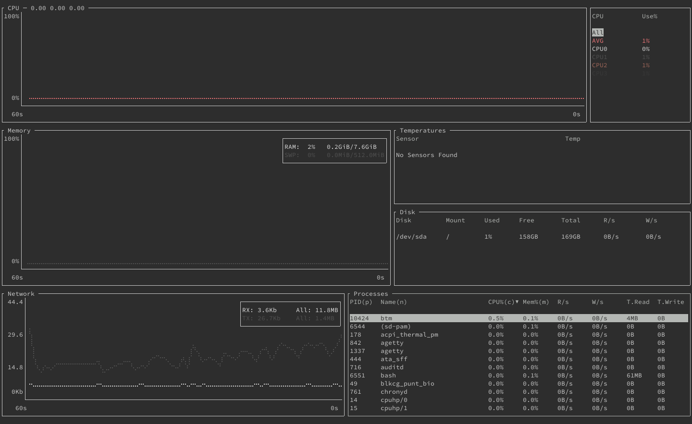
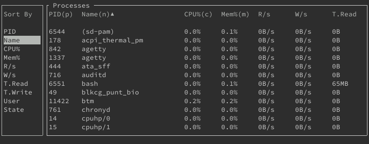
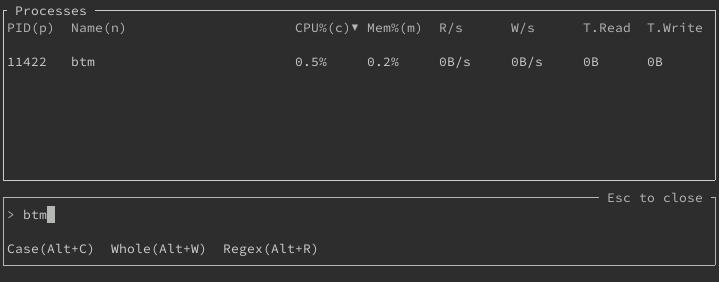
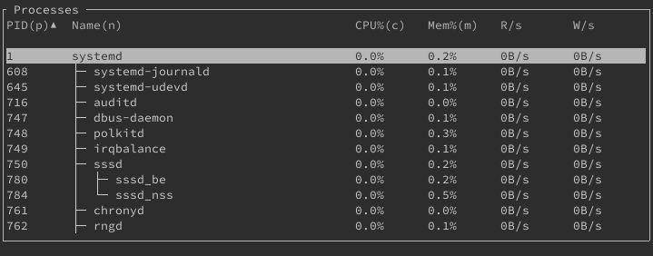
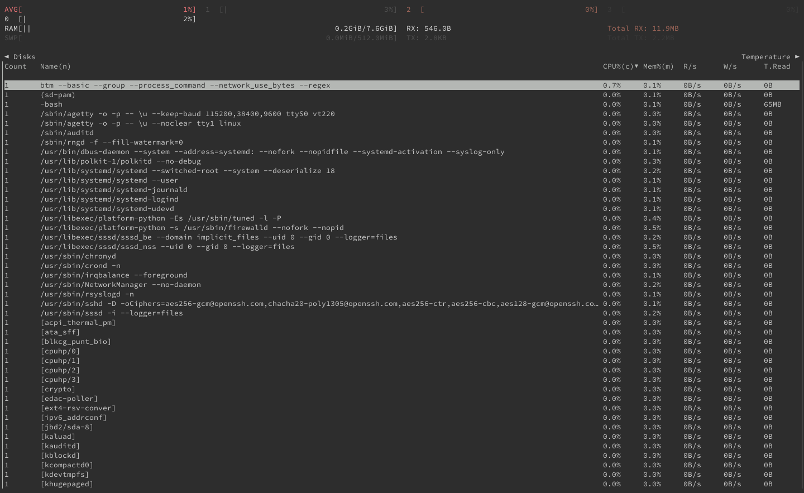

Bottom is a terminal-based graphical dashboard for system monitoring. It comes with a range of customization options and display features that set it apart from other system monitoring dashboards.

This guide provides more information about bottom, including a comparison between bottom and similar tools like htop and gtop. You also learn how to install bottom and how to get started using it on your Linux system.

## Before You Begin

1.  If you have not already done so, create a Linode account and Compute Instance. See our [Getting Started with Linode](/docs/guides/getting-started/) and [Creating a Compute Instance](/docs/guides/creating-a-compute-instance/) guides.

1.  Follow our [Setting Up and Securing a Compute Instance](/docs/guides/set-up-and-secure/) guide to update your system. You may also wish to set the timezone, configure your hostname, create a limited user account, and harden SSH access.


The steps in this guide are written for non-root users. Commands that require elevated privileges are prefixed with `sudo`. If you’re not familiar with the `sudo` command, see the [Linux Users and Groups](/docs/guides/linux-users-and-groups/) guide.


## What is bottom?

Bottom is a graphical system monitoring dashboard for the terminal. What sets it apart from similar tools is the high degree of customization options and features it offers. Whether you want to get a quick graphical summary of your system or dive through its running processes, bottom is a great tool to use.

### bottom vs gtop

Bottom, like gtop, follows in the legacy of htop, a popular alternative to the `top` command that is installed by default on most Linux systems. Where htop adds more graphical and interactive features to top, gtop adds even more graphical elements to its interface. Gtop provides an easy-to-read dashboard to view information on your system's performance.

Bottom, like gtop, emphasizes the graphical display if system monitoring information. It also adds layers of customization and navigation features. While gtop is less complicated to use, bottom gives you immense control of the dashboard while keeping the readability of graphical displays.

In short, bottom is a good choice if you want a graphical system monitoring dashboard that gives you control over every detail of the display. Gtop is a good option if you want uncomplicated system monitoring and find the default display useful.

You can learn more about gtop, and how it compares to top and htop, in our [How to Install and Use gtop](/docs/guides/installing-and-using-gtop-on-linux) guide.

## How to Install bottom

Currently, bottom is not available in the default package managers for most major Linux distributions. However, you can install it by following the steps in the section below that corresponds to your system's distribution.

### On Debian and Ubuntu

Use the following commands to install bottom on Debian or Ubuntu distributions:

    curl -LO https://github.com/ClementTsang/bottom/releases/download/0.6.3/bottom_0.6.3_amd64.deb
    sudo dpkg -i bottom_0.6.3_amd64.deb

Check the [bottom releases page](https://github.com/ClementTsang/bottom/releases), and replace the version number above (`0.6.3`) with the latest version number you find in the releases page.

### On AlmaLinux, CentOS, and Fedora

Use the commands below to install bottom on AlmaLinux, CentOS, or Fedora. The installation process uses DNF's copr plugin to enable the repository for bottom.

    sudo dnf copr enable atim/bottom
    sudo dnf install bottom

## How to Use bottom

You can start bottom with the command displayed below. Once opened, Bottom displays an array of widgets for you to immediately start monitoring your system's performance.

    btm

The following sections teach you more about bottom's display features and how to navigate it and customize it.

### Widgets in bottom

By default, bottom displays the following widgets:

- The **CPU** widget shows a graph of CPU usage over the last minute. Additionally, the widget includes the current percentage usage for each CPU and an average among them.
- The **Memory** widget graphs memory usage over the last minute and shows current RAM and swap memory usage percentages.
- The **Temperatures** widget displays current temperatures for any temperature sensors in your machine. However, the widget only displays information if you have at least one temperature sensor.
- The **Disk** widget lists your system's drives and provides usage information for each.
- The **Network** widget shows received (**RX**) and transmitted (**TX**) network traffic, both in a graph over the last minute and in a current percentage.
- The **Processes** widget lists running processes with their usage information. This is a simplified version of the process listing that is similar to top's.

You can customize bottom's display with a **Battery** widget, which provides information on your machine's battery life, if relevant. The widget's information includes current charge and usage percentage, time until empty, and health percentage.

You can enable this widget by adding the `--battery` option when running the `btm` command. You can learn more about bottom's command-line options in the [Command-line Options](#command-line-options) section below.

### Navigating bottom

The list below includes some useful keyboard shortcuts you can use to navigate bottom, however, it is not an exhaustive list. You can use the **?** key in bottom to view a help menu, which shows you all keyboard shortcuts.

- Navigate among the widgets using the **Shift** and **arrow keys** together. Alternatively, you can use **w**, **a**, **s**, or **d** keys to navigate through the widgets. If the widget contains a list, you should see a list item selected when you select the widget. Otherwise, you may not be able to tell that a widget is selected until you use one of the widget-related key combinations explained in the subsequent steps.
- Use the arrow keys to navigate the list in a widget, if the widget has one. This includes the **Disk**, **Temperatures**, and **Processes** widgets.
- You can quickly navigate to the beginning of a list using the **g** + **g** key combination. To navigate to the end of the list use the **G** key.
- The **e** key allows you to expand a widget's contents to fill the display. You can see an example below with the **Network** widget. Pressing **e** again reduces the widget.

    

- You can control the zoom level of the graph in a selected widget using the **+** and **-** keys. Pressing **=** resets the zoom level to its default.
- Use the **q** key to exit bottom.

The **Processes** widget has numerous additional keybindings to help you navigate the extensive list. The list below highlights the most commonly useful keybindings.

- Use the **s** key to bring up a sort menu. Selecting an item on the sort menu and pressing **Enter** updates the list using the selected criteria for its sort order.

    

- Use the **/** key to open the search menu. You can type a search string there to start filtering the processes by matching names. Pressing **Esc** exits the search menu, but keeps your filtering. You need to open the search menu and remove your search string to remove the filtering.

    

- Use the **Tab** key to toggle grouping processes with the same name. Bottom then replaces the **PID** field with a **Count** field, showing the number of processes under that name. You can use the sort feature to sort by the **Count** field when you have grouped processes in this way.
- Use the **P** key to toggle showing the full commands used to run each process. This is useful if you want to see what options were used for running processes.
- Use the **t** key to toggle displaying the process list in tree mode. In tree mode, processes are nested beneath their parent processes.

    

## How to Configure bottom

Bottom allows for extensive customization, whether you want command-line options to get a one-time display or you want to set the default behavior.

### Command-line Options

Bottom has numerous command-line options to customize your experience. You can get a full list of options, along with descriptions of each, using the command below:

    btm --help

The example below shows how you could use command-line options with bottom.

    btm --basic --group --process_command --network_use_bytes --regex

The options in the above example run bottom with:

- Basic mode (`--basic`), which disables graphs and uses a minimalist display.
- Processes grouped (`--group`) and their full commands displayed (`--process_command`) by default.
- Network usage shown in bytes (`--network_use_bytes`).
- Regex enabled by default on the search menu for the **Processes** widget (`--regex`).

### Configuration File

Bottom also has a configuration file that defines its default behavior. You can find in the following location `~/.config/bottom/bottom.toml`. The file includes an extensive array of options, all already present but commented-out. So, it is relatively easy to jump in and start tinkering with the configurations.

Most of the command-line options are available as flags in the configuration file. You can, thus, use this file to use a series of command-line options each time you run bottom. You can get a full list of options for the configuration file on the [bottom configuration file](https://clementtsang.github.io/bottom/0.6.3/configuration/config-file/flags/) documentation page.

The configuration file is especially useful in letting you manage how the display in bottom is arranged and themed. Using the appropriate tagging pattern, you can completely control the arrangement of widgets and the coloring in bottom.

To help you see how this works, below is the default widget arrangement. You can find a version of this commented-out in the default configuration file, `bottom.toml`. This example also includes the brief explanation of each tag's role that is also included in the default configuration file.



# Layout - layouts follow a pattern like this:
# [[row]] represents a row in the application.
# [[row.child]] represents either a widget or a column.
# [[row.child.child]] represents a widget.
#
# The default widget layout:
[[row]]
  ratio=30
  [[row.child]]
  type="cpu"
[[row]]
    ratio=40
    [[row.child]]
      ratio=4
      type="memory"
    [[row.child]]
      ratio=3
      [[row.child.child]]
        type="temperature"
      [[row.child.child]]
        type="disk"
[[row]]
  ratio=30
  [[row.child]]
    type="network"
  [[row.child]]
    type="processes"
    default=true


You can learn more about the possible `type` values and `ratio` usage in [bottom's official documentation page on configuring layouts](https://clementtsang.github.io/bottom/0.6.3/configuration/config-file/layout/).

Bottom also allows you to customize the color theme via the configuration file. The easiest way to customize the color theme is through the `color` option in the configuration file, which accepts one of the following pre-defined color themes: `default`, `default-light`, `gruvbox`, `gruvbox-light`, `nord`, and `nord-light`.

If you want more control over your bottom's theme, you can set individual colors under the `[color]` tag in the configuration file. The default configuration file shows you the default settings, all commented-out and ready for you to provide custom values. You can get a list of the options, along with descriptions of each and possible color values, in the [official documentation's page on configuring themes](https://clementtsang.github.io/bottom/0.6.3/configuration/config-file/theming/).
