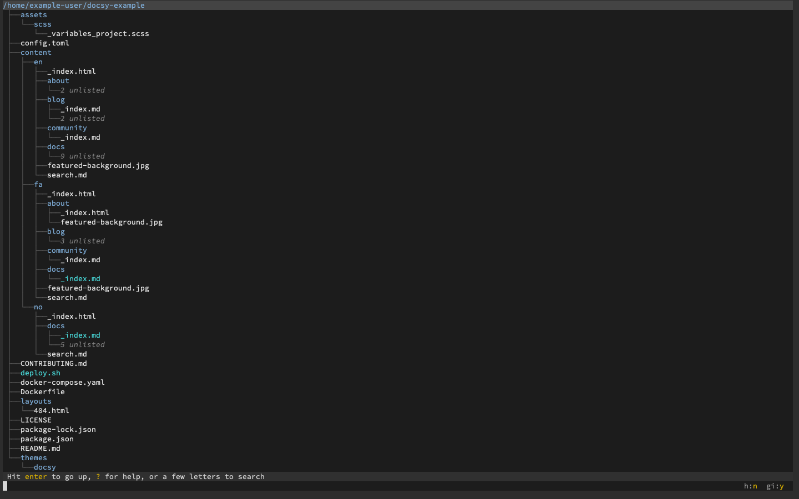
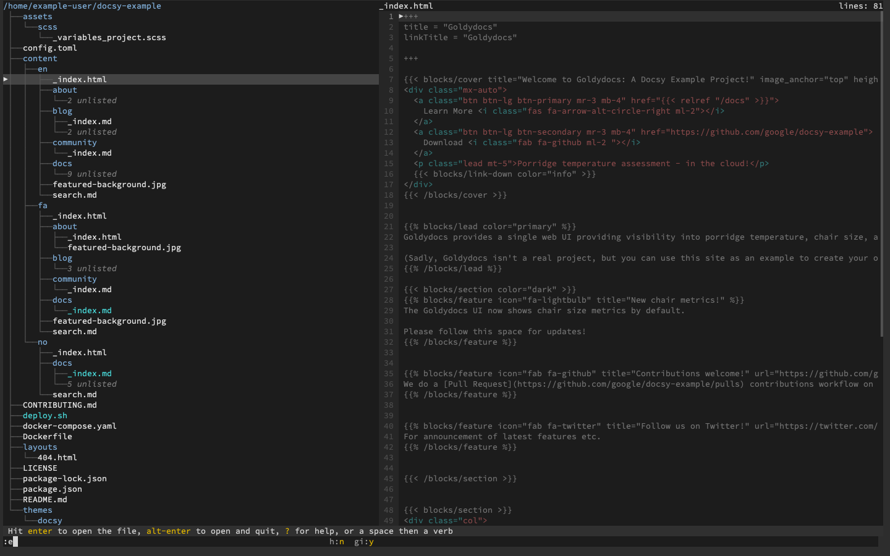
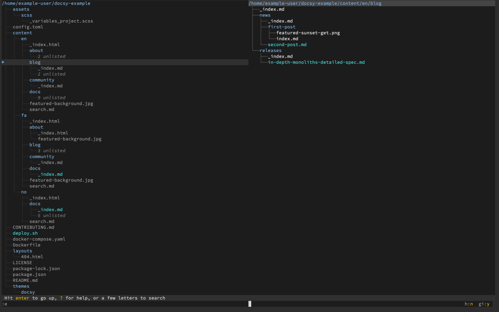
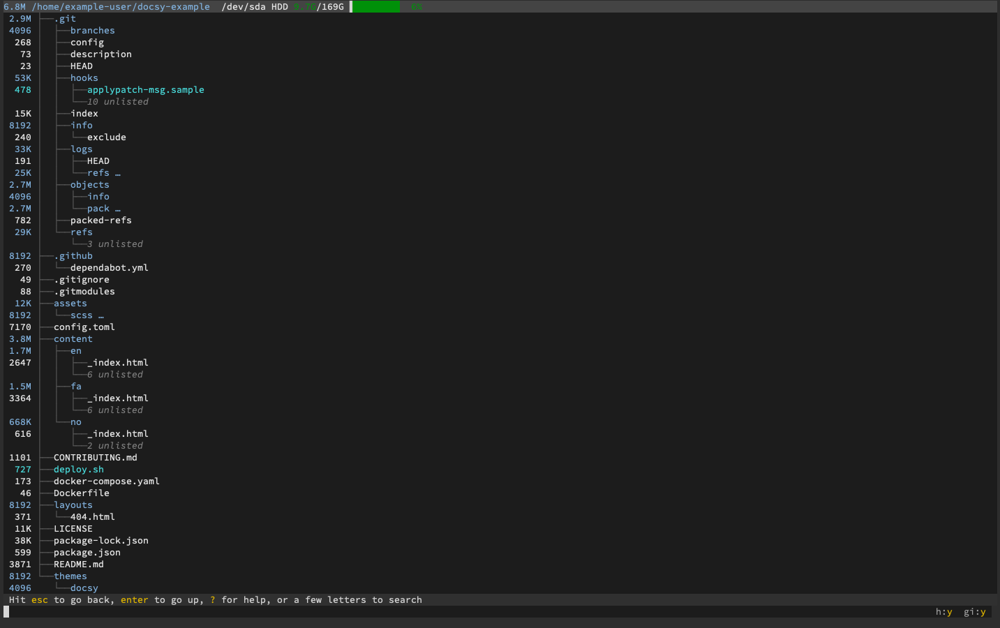
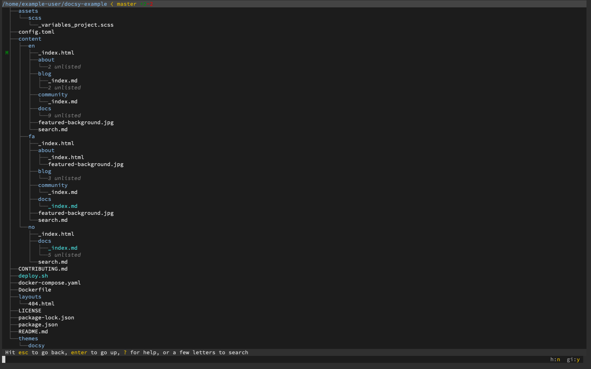
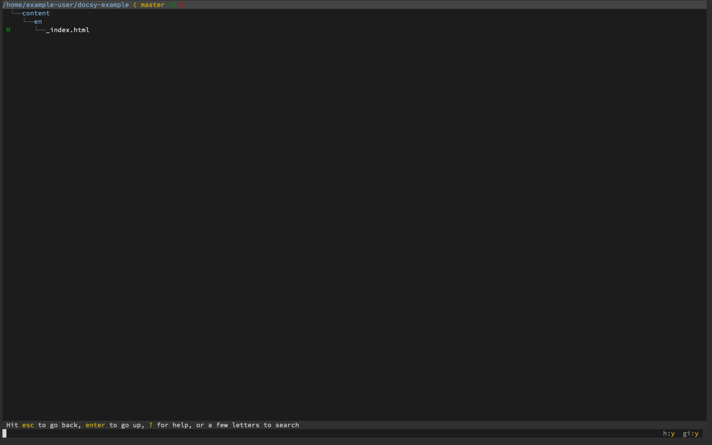
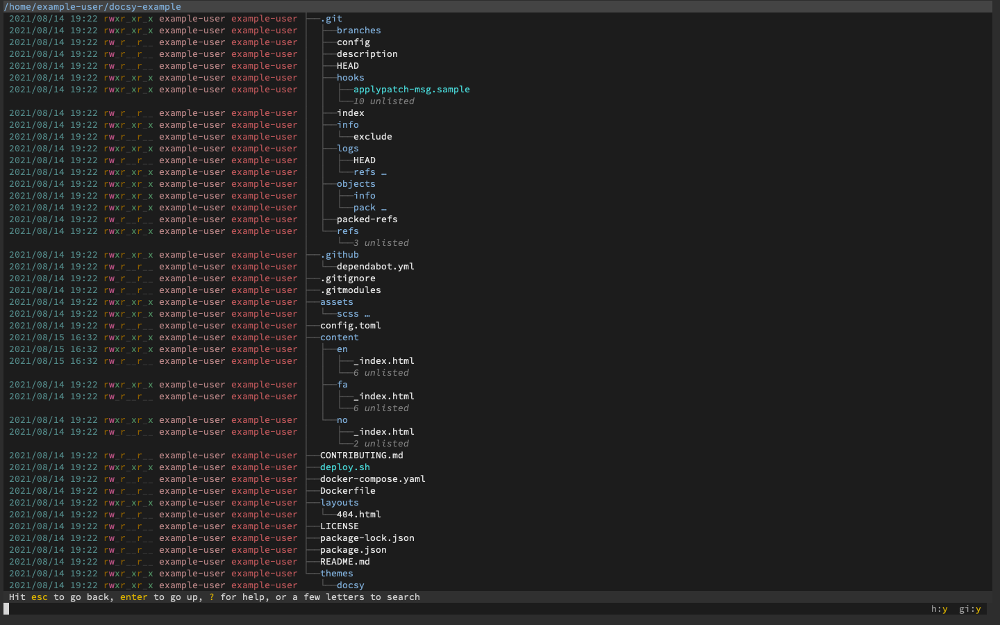
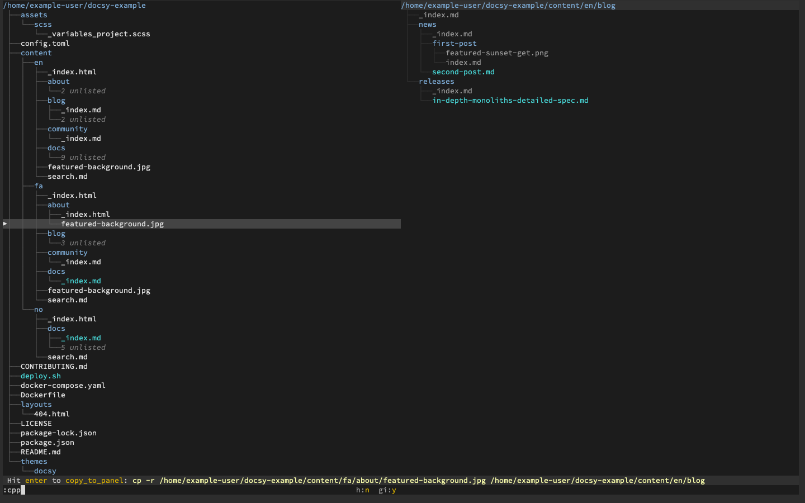

The `broot` command provides a modern approach to generating directory trees on the Linux command line. It renders the tree in a succinct and intuitive layout that helps you navigate around your computer's directories. Additionally, `broot` offers advanced features for managing and retrieving details about your files and directories. This guide shows you how to install `broot` on your Linux system and get started using it.

## Before You Begin

1.  If you have not already done so, create a Linode account and Compute Instance. See our [Getting Started with Linode](/docs/guides/getting-started/) and [Creating a Compute Instance](/docs/guides/creating-a-compute-instance/) guides.

1.  Follow our [Setting Up and Securing a Compute Instance](/docs/guides/set-up-and-secure/) guide to update your system. You may also wish to set the timezone, configure your hostname, create a limited user account, and harden SSH access.


The steps in this guide are written for non-root users. Commands that require elevated privileges are prefixed with `sudo`. If you’re not familiar with the `sudo` command, see the [Linux Users and Groups](/docs/guides/linux-users-and-groups/) guide.


## What is broot?

The `broot` tool gives you a convenient and capable directory tree. It specializes in making directories easy to navigate and to get its overview — even when the directory is massive and complex. `broot` accomplishes this with features like abbreviated subdirectory contents and an advanced file search that does not lose your place in the tree.

The `broot` command-line tool also brings a lineup of file management features you can use right from the displayed directory tree. In this way, `broot` is much more than a tool for reviewing directory contents. For instance, `broot` lets you copy and move files between side-by-side panels and preview file contents.

## How to Install broot

1. Download the `broot` binary for your system from the [`broot` installation page](https://dystroy.org/broot/install/).

    - If you are using **Debian**, **Ubuntu**, or **Fedora**, use the link for [x86_64-linux](https://dystroy.org/broot/download/x86_64-linux/broot).

    - If you are using **AlmaLinux** or **CentOS**, use the link for [x86_64-unknown-linux-musl](https://dystroy.org/broot/download/x86_64-unknown-linux-musl/broot).

    - Once you have your download link, use cURL to download the `broot` binary. Replace the URL in the command below with the appropriate one for your operating system.

            curl -o broot -L https://dystroy.org/broot/download/x86_64-linux/broot

1. Move the `broot` binary to the `/usr/local/bin` directory, and give the file execute permission:

        sudo mv broot /usr/local/bin
        sudo chmod +x /usr/local/bin/broot

1. Run `broot` with the following command:

        broot

    You are prompted to install the `broot` shell function. Choose **Yes** (**Y**) to continue.

1. Restart your shell session by exiting and logging back in, or source your `~/.bashrc` file:

        source ~/.bashrc

1. Verify the `broot` installation.

        br --version

    
broot 1.6.3
    

## How to Navigate the File System with broot

You can start `broot` with the `br` command. You can also provide a path to a directory you want to start `broot` in.

The examples in this section runs `broot` in a cloned Git repository. This makes it easier to demonstrate how `broot` integrates with Git. You can get clone the repository used in this guide by running the following commands in your user's home directory. Replace `apt` with `yum` on AlmaLinux and CentOS or with `dnf` on Fedora:

    sudo apt install git
    git clone https://github.com/google/docsy-example.git

Now, you can open `broot` in that repository's directory with the following command:

    br ~/docsy-example

Here are some useful commands for exploring the file tree once you are in `broot`.

- Navigate the `broot` file tree with the **up** and **down** arrows. Press **Enter** on a given directory to make it the new root of your directory tree. Pressing **Enter** on the current root (at the top of the tree) moves the tree's root up a directory.

- You can search the directory tree by typing at any point. `broot` dynamically updates the tree to show the matching files and directories as you type. Pressing **Esc** resets the search form.

    `broot` also comes with some more advanced search options. Among them, you can do a "fuzzy" search on file names by typing `f/` followed by the text to search for. You can also do a full regular expression (regex) search by typing `/` followed by your regex.

- `broot` can `cd` you into a directory. Select the directory, then press **Alt** + **Enter**. `broot` changes your shell's current working directory and exits you back into the shell.

- Use the combination of **Ctrl** and the **right arrow** key to open a separate panel for the selected file or directory.

    If you used the combination on a file, the new panel previews the file's contents, even if it is an image file. You can use the combination again to focus on the file contents. Once focused on the file contents, you can navigate them with the **up** and **down arrow** keys:

    

    If you used the combination on a directory, the new panel displays a directory tree with the selected directory as the root:

    

    Use the **Ctrl** and **left arrow** key combination to shift focus back to the original panel, if the focus was on the new panel. Then, use the combination again to close the new panel.

## How to Use broot Commands

`broot`, in addition to using assigned keyboard keys, has a dedicated command system. Typing a space or colon while the search field is blank starts a command entry, similar to the system in the [Vi text editor](/docs/guides/what-is-vi/). Pressing **Enter** then executes the command.

One of the most useful commands available is the `exit` command. Typing `:q` and pressing **Enter** exits `broot`, putting you back in the shell in the same working directory where you started.

You can get a full list of commands for `broot` by typing **?** when the search/command form is empty.

The sections below also highlights useful commands to help you get started managing files and directories using `broot`.

## How to Get Information About Files and Directories in broot

`broot` has numerous options to display more information about files and directories. You have access to everything from Git annotations to the level of detail provided in the `ls -al` command.

- Use the `:sizes` command to have `broot` list usage information alongside files and directories.

    

- When you are in a directory for a Git repository, the `:gf` command shows Git annotations, allowing you to quickly assess what files have changed.

    

    You can also isolate the modified files in a Git repository using the `:gs` command.

    

- Similar to the shell's `ls` command, `broot` is capable of displaying details about files and directories. Below is an example with results similar to the `ls -al`:

    Use the `:dates` command to show last modified dates, then the `:perm` command to show permissions information. Finally, use `:h` to show hidden files. The result resembles the image below:

    

## How to Manage Files and Directories with broot

The file management capabilities of `broot` set it apart from other Linux utilities. `broot` offers a set of file-management option along with an easy-to-read tree. Below are some examples that cover basic file-management needs.

- Press **Enter** on a file to have `broot` attempt to call a program to open the file. You can also use the `:e` command to have `broot` attempt to open the file with the default editor program.

    
`broot` uses the `$EDITOR` environmental variable to determine what editor to use. If you do not have this variable set, you can set it with a shell command like the one below. The below example command sets the default editor to Vim.

    export EDITOR=$(which vim)

You can add the above command to your `~/.bashrc` file to make the setting persistent.
    

- Copy a file or directory using the `:cp` command followed by the location to copy to (relative to the location of the file/directory being copied).

    Move files and directories using the `:mv` command followed by the location to move to.

- `broot` has a more convenient method for copying and moving files if you are using panels.

    Open a panel for the directory you either want to copy/move an item into or out of the directory. Select the file or directory you want to copy/move. Then, use the `:cpp` command to copy the item to the root of the other panel's directory tree. Use the `:mvp` command to move the item to the other panel.

    

- Use the `:rm` command within `broot` to delete a selected file or directory.

- Create a new directory within the one you currently have selected using the `:md` command followed by the name of the new directory.

## Conclusion

`broot` has many more features and capabilities to explore. It is a good option if you want more search options and the ability to export directory trees. You can keep going with some of the basics of `broot` by referring to [their GitHub readme](https://github.com/Canop/broot). To go deeper into some of the more advanced features of `broot`, take a look at the [official broot documentation](https://dystroy.org/broot/).
