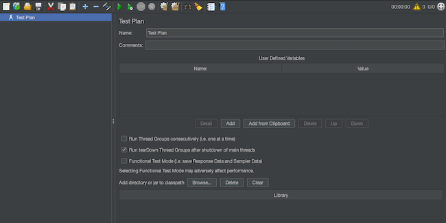
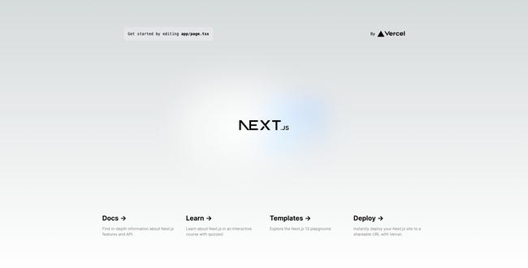
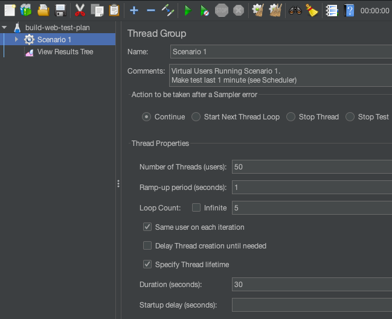
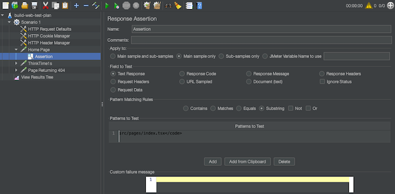
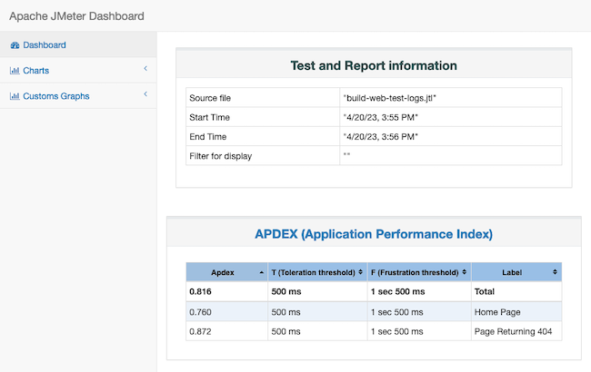

Apache's JMeter offers a robust and portable open source solution for load testing. JMeter can measure the performance of web applications and provide insights about the kinds of loads applications can handle.

Through this tutorial, learn more about load testing and how to get started using JMeter to load test web applications.

## Before You Begin

1.  If you have not already done so, create a Linode account and Compute Instance. See our [Getting Started with Linode](/docs/guides/getting-started/) and [Creating a Compute Instance](/docs/guides/creating-a-compute-instance/) guides.

1.  Follow our [Setting Up and Securing a Compute Instance](/docs/guides/set-up-and-secure/) guide to update your system. You may also wish to set the timezone, configure your hostname, create a limited user account, and harden SSH access.


This guide is written for a non-root user. Commands that require elevated privileges are prefixed with `sudo`. If you’re not familiar with the `sudo` command, see the [Users and Groups](/docs/guides/linux-users-and-groups/) guide.


The commands, file contents, and other instructions provided throughout this guide may include example values. These are typically domain names, IP addresses, usernames, passwords, and other values that are unique to you. The table below identifies these example values and explains what to replace them with:

| Example Values: | Replace With: |
| -- | -- |
| `EXAMPLE_USER` | The username of the current user on your local machine. |
| `apache-jmeter-5.6.2` | The actual version of JMeter you download, if different. |

## What Is Load Testing?

*Load testing* is a type of performance testing used specifically to ensure that web applications perform effectively under projected usage loads. Load tests help anticipate application performance and resource needs, which can aid in finding the best solutions for uninterrupted user experiences.

Load tests most often use test plans to model both normal and peak traffic along with typical user behavior. From there, the load test should provide metrics on response times, resource usage, and more.

The data gathered from load tests can be invaluable. It can show whether your infrastructure is enough to handle the expected traffic, or if you have more resources than you actually need.

Using load testing to fine-tune your infrastructure and allocated resources can ensure more consistent user experiences and save money.

## Why Use JMeter?

[Apache JMeter](https://jmeter.apache.org/index.html) is an open source load testing tool built entirely in Java. JMeter is a robust option for measuring and analyzing web application performance under various loads.

JMeter is easy to get started with as it is open source, popular, and widely used. This makes JMeter both accessible and price efficient, all while having the community support that comes with popular open source solutions.

## How to Install JMeter

JMeter should be installed on the machine from which you want to run tests, not the machine running the application you want to test. Additionally, JMeter strongly prefers use of its GUI to create test plans, so whatever system it's installed on should have GUI access.

1.  Install Java. Java version 8 or higher is required for JMeter. Use one of the following methods to install Java on your system:

    -   Oracle provides [installation documentation](https://www.java.com/en/download/help/download_options.html) for installing its version of Java on a variety of systems. Download the corresponding installation files through Oracle's [Java downloads](https://www.java.com/en/download/manual.jsp) page.

    -   Alternatively, install the [OpenJDK](https://openjdk.org/), an open source alternative to Oracle's JDK that can operate fully in place of it. Follow the instructions on the [OpenJDK installation](https://openjdk.org/install/) page to install OpenJDK on your system.

        Additionally, on macOS, you can install the OpenJDK conveniently through the [Homebrew](https://brew.sh/) package manager, using the [openjdk](https://formulae.brew.sh/formula/openjdk) formula.

1.  Download the JMeter binaries package from the [Apache JMeter download page](https://jmeter.apache.org/download_jmeter.cgi).

    This tutorial uses the zip file with the binaries for JMeter `5.6.2`. If you download a different version be sure to replace the naming throughout this guide with the appropriate version.

    Optionally, to verify the download, use the link for the SHA512 corresponding to your download. Then follow the commands in the [Checking Hashes](https://www.apache.org/info/verification.html#CheckingHashes) section of Apache's documentation on verifying Apache software.

1.  Extract the downloaded package to a directory you want your JMeter instance installed to. This tutorial assumes that you extract the package in your current user's home directory (e.g. `/home/EXAMPLE_USER/apache-jmeter-5.6.2` or `C:\Users\EXAMPLE_USER\apache-jmeter-5.6.2`)

1.  Locate the JMeter executable for your system within the `bin/` subdirectory of the extracted directory.

    -   On Linux and Mac, the executable is `jmeter`

    -   On Windows, the executable is `jmeter.bat`

1.  Use the command line to run the executable file for JMeter. The example commands below to start up JMeter assume you installed version 5.6.2 within the current user's home directory.

    
    
    On Linux and Mac, start the executable with a command like this:

    ```command
    ~/apache-jmeter-5.6.2/bin/jmeter
    ```
    
    
    ```command
    C:\Users\EXAMPLE_USER\apache-jmeter-5.6.2\bin\jmeter.bat
    ```
    
    

    -   On Linux and Mac, start the executable with a command like this:

        ```command {title="Local Machine Terminal"}
        ~/apache-jmeter-5.6.2/bin/jmeter
        ```

    -   On Windows, start the executable with a command like this, replacing `EXAMPLE_USER` with your actual username:

        ```command {title="Local Machine Terminal"}
        C:\Users\EXAMPLE_USER\apache-jmeter-5.6.2\bin\jmeter.bat
        ```

You should see the JMeter GUI start up:

[](jmeter-startup.png)


For Linux and Mac, you can follow our guide on how to [Add a Directory to the PATH on Linux](/docs/guides/how-to-add-directory-to-path/). Add the `bin/` directory to your shell path, and you are able to start up JMeter from the command line with the simple `jmeter` command.


## How to Start Load Testing with JMeter

You can now start using JMeter to load test web application. JMeter's GUI provides a set of tools for building a test plan, including recording browser actions for modeling user behavior. Afterward, execute the plan using JMeter's CLI and see how your applications respond to testing.

To help get started, this tutorial also includes steps for creating a simple web application to run JMeter against. This provides a clear demonstration of how JMeter works. Try it out before using JMeter on your own applications.

### Preparing an Example Application

To create a base web application to test with JMeter, follow the steps here on an application server. These steps specifically assume a Linode Compute Instance server. The instructions should work with most Debian-based and RHEL-derived distributions.

1.  Follow our guide on how to [Install and Use the Node Package Manager (NPM) on Linux](/docs/guides/install-and-use-npm-on-linux/). NPM handles the installation of the application framework and its dependencies as well as running the example application itself.

1.  Next.js works well for this example as it can create a base web application with only a few commands. Use the commands here to create a base Next.js project named `example-app` using the `create-next-app` executor. These commands put the application in the current user's home directory and then changes into the new application directory.

    ```command {title="Linode Instance Terminal"}
    cd ~/
    npx create-next-app example-app
    cd example-app/
    ```

    Answer the prompts however you like or simply stick with the default values.

    Learn more about building web applications with Next.js in our guide [Getting Started with Next.js](/docs/guides/getting-started-next-js/).

1.  Open port `3000` on your system's firewall. This is the default port for the example Next.js application. This port needs to be open for your browser and JMeter to access the application.

    -   For **Debian** and **Ubuntu**, refer to our guide on [How to Configure a Firewall with UFW](/docs/guides/configure-firewall-with-ufw/).

    -   For **CentOS**, **Fedora**, and similar distributions, refer to our guide on [Enabling and Configuring FirewallD on CentOS](/docs/guides/introduction-to-firewalld-on-centos/)

1.  Start up the Next.js application. This runs the included "Welcome" application on a development server. While this should not be used for production applications, it should work fine to demonstrate JMeter's capabilities.

    ```command {title="Linode Instance Terminal"}
    npm run dev
    ```

1.  To verify that the example application is running, open a web browser and navigate to port `3000` on your system's public IP address. For example, if your system's public IP address is `192.0.2.0`, you would navigate to `http://192.0.2.0:3000`.

    

### Creating a JMeter Test Plan

JMeter test plans are created within the JMeter GUI. From there, JMeter provides a range of tools for specifying how web application should be accessed and tested. JMeter even includes a recording feature for recording user behavior using browser actions.

Learn more about building test plans in JMeter's [Building a Test Plan](https://jmeter.apache.org/usermanual/build-test-plan.html) documentation. For the particular kind of test plan shown here, also refer to JMeter's [Building a Web Test Plan](https://jmeter.apache.org/usermanual/build-web-test-plan.html) documentation.

The example test plan developed in this section specifically models web application access by several simultaneous users. The test verifies that users are able to access the page and that the page delivers the expected content.

From this base test, you can easily expand both the number of modeled users and extent of scenarios to fit your particular needs.

1.  In the JMeter GUI, choose **File** then **Templates** from the top menu bar.

1.  Select **Building a Web Test Plan** from the dropdown, and click the **Create** button. This creates a test plan from a template specifically for testing web applications.

1.  The left pane should now have a test plan named **build-web-test-plan**. Under it, select the **Scenario 1** item.

    Doing so opens a **Thread Group** form. A thread group essentially defines a group of modeled users to run against a web application.

    For this example test plan, complete the form as follows and leave any values not mentioned here at their defaults:

    -   **Number of Threads (users)**: `50`

    -   **Ramp-up period (seconds)**: `1`

    -   **Loop Count**: `5`

    -   **Duration (seconds)**: `30`

    

1.  Use the arrow to expand **Scenario 1**, and you should see HTTP and other configurations. These define how the modeled users (threads) should interact with the web application.

1.  Select the **HTTP Requests Default** item. This sets up the default values for HTTP requests to be made by the modeled users. Use the values here, leaving anything not mentioned at its default value:

    -   **Server Name or IP**: The public IP address or domain name for your web application (e.g. `192.0.2.0`)

    -   **Port Number**: `3000`

    [](jmeter-http-defaults.png)

1.  **Optional:** Select the **Home Page** item. This defines a specific HTTP request to be made by the modeled users. For this example, you do not need to change anything. However, it's helpful to familiarize yourself with this item to understand how to customize it later.

    For example, you would likely want similar HTTP request items, spaced with waiting intervals, for each page on your web application. These would then model a user's journey through the application.

    Should you want to add a new HTTP request item, you could do so with the following steps.

    1.  Right-click (or control-click on Mac) the thread group, named **Scenario 1** in the template.

    1.  Select **Add** > **Sampler** > **HTTP Request** from the menu.

    1.  Select the resulting item from the left menu, and use the form to customize it to your needs.

1.  Nested beneath the **Home Page** item is an **Assertion** item. Select this to get a **Response Assertion** form, which has JMeter look for a particular feature in the response.

    Under **Patterns to Test**, remove the default content, and replace it with the following:

    ```command
    src/pages/index.tsx</code>
    ```

    [](jmeter-assertion.png)

    This establishes a test condition that when a modeled user accesses the home page, they should have the given text within the response.

1.  When finished, use the **Save** option from the top toolbar or from the **File** menu to save the test plan. For this example, the test plan is saved as:

    -   On Linux and Mac: `~/build-web-test-plan.jmx`

    -   On Windows: `C:\Users\example-user\build-web-test-plan.jmx`

The test plan is now ready to run. Exit the JMeter GUI, and continue on to the next section to see how the test plan performs.

### Running the JMeter Load Test

To start running a load test with JMeter, you need to use its command-line interface (CLI). Access the CLI just as you would the GUI, but add the `-n` option to the command.

There are a few other command-line options you should leverage to effectively run load tests with JMeter.

-   `-t`: designates the location of your test plan

-   `-l`: designates a location for a log file

-   `-e`: tells JMeter to create a report

-   `-o`: designates a directory to store the report in

Use all of these together to run a load test using the test plan developed above. The example command here assumes the JMeter installation and the test plan are stored as described further above. Additionally, the command creates a log file in the same directory as the test plan along with another directory for the report.

-   On Linux and Mac:

    ```command {title="Local Machine Terminal"}
    ~/apache-jmeter-5.6.2/bin/jmeter -n -t ~/build-web-test-plan.jmx -l ~/build-web-test-logs.jtl -e -o ~/build-web-test-reports/
    ```

-   On Windows:

    ```command {title="Local Machine Terminal"}
    C:\Users\example-user\apache-jmeter-5.6.2\bin\jmeter -n -t C:\Users\example-user\build-web-test-plan.jmx -l C:\Users\example-user\build-web-test-logs.jtl -e -o C:\Users\example-user\build-web-test-reports\
    ```

The load test begins immediately, and you should see summary output in command-line terminal similar to the following:

```output
Creating summariser <summary>
Created the tree successfully using ../build-web-test-plan.jmx
Starting standalone test @ 2023 Apr 20 15:55:51 CDT (1682024151151)
Waiting for possible Shutdown/StopTestNow/HeapDump/ThreadDump message on port 4445
Warning: Nashorn engine is planned to be removed from a future JDK release
summary =    500 in 00:00:11 =   44.2/s Avg:   474 Min:    84 Max:  1319 Err:     0 (0.00%)
Tidying up ...    @ 2023 Apr 20 15:56:03 CDT (1682024163082)
... end of run
```

When the load test finishes, the report is available as a generated HTML webpage, located in the report directory specified in the command. Using the example above, the webpage is located at either `~/build-web-test-report/index.html` or `C:\Users\example-user\build-web-test-report\index.html`.

[](jmeter-report.png)

## Conclusion

This lays the basis to start using JMeter to load test web applications. The features covered above provide plenty to establish basic web application testing. However, JMeter has more features to offer. Explore them further in the JMeter documentation linked below and throughout this tutorial.