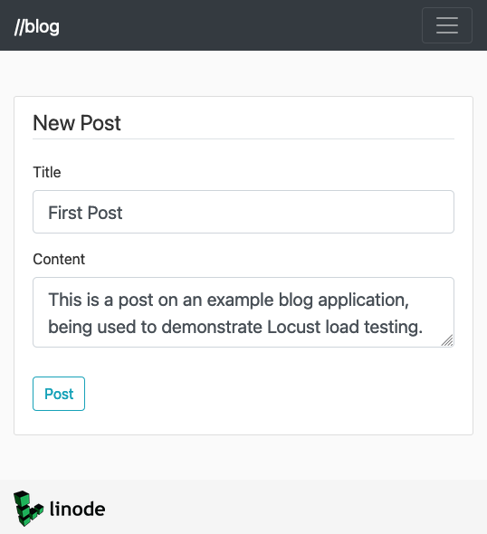
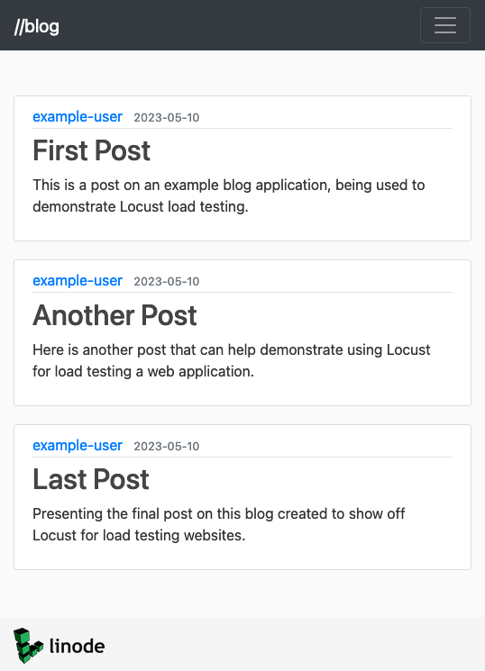
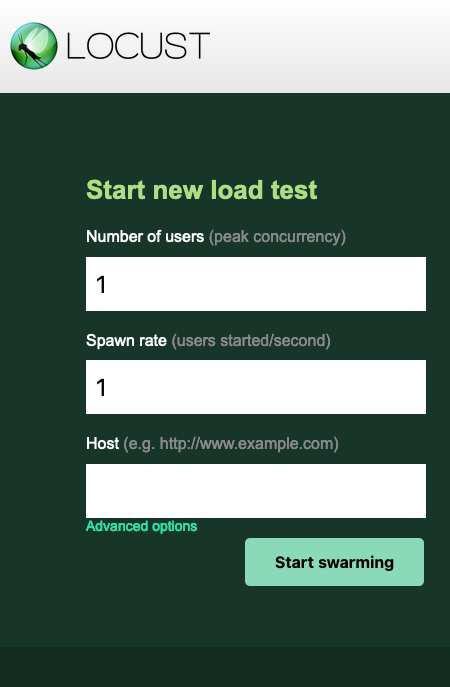
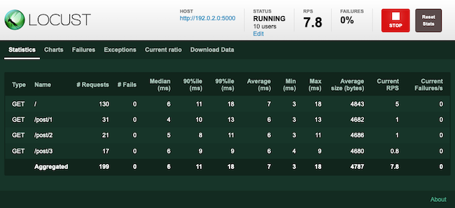

Locust offers scalable load testing using test plans defined in plain Python code. With this open-source tool, take advantage of distributed load tests ideal for CI/CD pipelines, all while keeping your toolset adaptable and developer friendly.

In this tutorial, learn more about Locust's features, how to install it, and how to start using it for your load testing needs.

## Before You Begin

1. If you have not already done so, create a Linode account and Compute Instance. See our [Getting Started with Linode](/docs/guides/getting-started/) and [Creating a Compute Instance](/docs/guides/creating-a-compute-instance/) guides.

1. Follow our [Setting Up and Securing a Compute Instance](/docs/guides/set-up-and-secure/) guide to update your system. You may also wish to set the timezone, configure your hostname, create a limited user account, and harden SSH access.


This guide is written for a non-root user. Commands that require elevated privileges are prefixed with `sudo`. If you’re not familiar with the `sudo` command, see the [Users and Groups](/docs/guides/linux-users-and-groups/) guide.


## What Is Load Testing?

*Load testing* is a type of performance testing used specifically to ensure that applications perform effectively under projected usage loads. Load tests help you anticipate your applications' performance and resource needs so that you can use the best solutions for uninterrupted user experiences.

Typically, a load test lets you model user behavior and run that behavior against your application at various traffic levels. From that, your load test provides metrics on response time, resource usage, and more.

Such load tests can give a range of insights. For instance, they can tell you how much traffic your infrastructure can handle. That can help you determine where you need more or fewer resources to meet your needs, letting you fine-tune your infrastructure.

## What Is Locust?

[Locust](https://locust.io/) provides open-source load testing using Python scripts and a distributed, event-based architecture. These features — Python scripts and an event-based architecture — give Locust several compelling features.

- Accessible. Locust has a convenient web UI for monitoring tests, and the UI even includes some mid-flight control of tests. But Locust's strongest convenience is using plain Python for test scripts. Its scripts thus take advantage of the familiarity and rich language features of Python, without idiosyncrasies. And test scripts can easily by version controlled in this case.

- Scalable. Locust uses an event-based architecture designed for running distributed tests. This gives Locust an advantage in setting up robust tests modeling numerous concurrent users. As the Locust documentation itself emphasizes, other tools may be faster in requests per second, but Locust stands out in its ability to run concurrent tasks.

- Adaptable. Locust's process is small and light and also readily manipulated for a wider range of use cases than load testing web applications. For instance, you can build clients that enable Locust to test a wider range of applications and system processes.

One of the best fits for Locust, however, leverages its distributed and script-based approach for integration with CI/CD pipelines. Locust can run without its web UI, and thus fits neatly providing load tests on new deployments.

## How to Install Locust

Locust is built around Python technologies, and its installation follows that. As such, you first need Python 3 and the Python package manager, Pip, installed. Do so using the commands here, depending on your distribution.

- On Debian and Ubuntu systems, use APT to install Python and Pip.

    ```command
    sudo apt install python3 python3-pip
    ```

- On CentOS and similar distributions (like AlmaLinux and Rocky Linux), use DNF to install Python and Pip.

    ```command
    sudo dnf install python3 python3-pip
    ```

With Python 3 and Pip on your system, you can install Locust via Pip.

```command
pip3 install locust
```

Exit and reopen your terminal session, and Locust should be ready and available to start using.

To verify successful installation, try the `locust` command with the flag to check the installed Locust version.

```command
locust -V
```

```output
locust 2.15.1 from /home/example-user/.local/lib/python3.9/site-packages/locust (python 3.9.14)
```

As a last step, you may want to open the default port for Locust's web UI — `8089` — in your system's firewall. This tutorial later makes use of the web UI and accesses it remotely using this port.

- On Debian and Ubuntu, manage firewall rules using UFW. Learn more about UFW in our guide [How to Configure a Firewall with UFW](/docs/guides/configure-firewall-with-ufw/). With UFW configured and running, you should be able to open the necessary port with the command here.

    ```command
    sudo ufw allow 8089/tcp
    ```

- On CentOS and similar distributions, manage the firewall rules using Firewalld. Learn more in our guide [Configure a Firewall with Firewalld](/docs/guides/introduction-to-firewalld-on-centos/). With Firewalld configured and running, you should be able to open the necessary port with a set of commands like this.

    ```command
    sudo firewall-cmd --zone=public --add-port=8089/tcp --permanent
    sudo firewall-cmd --reload
    ```

## How to Use Locust for Load Testing

Locust is now ready to start load testing your applications. You just need to build a Python script defining a Locust test plan (called a *Locustfile*). From there, Locust can run its load tests against your application.

The Locust documentation linked at the end of this tutorial provides your most comprehensive resource for working with Locust scripts. However, probably the best way to get started using Locust is with a practical example.

To that end, the rest of this tutorial walk you through using Locust to conduct a relatively simple load test against an example application. After setting up the example application, follow along as the tutorial breaks down a full Locustfile designed to show off a range of useful Locust features.

### Building an Example Application

You need a web application to run Locust's load testing against for this demonstration. While you could use your own existing application, this tutorial sets up a simple new application. By doing so, it aims to provide a strong base for highlighting Locust's features.

The example application uses Python's [Flask](https://flask.palletsprojects.com/en/) web application framework. Since Locust is already running with Python, using Flask here minimizes other dependencies you need to run the example.

The Linode Marketplace also offers an easy way to start with a fresh and ready Flask application of your own. You can learn more about htat in our guide [Deploy Flask through the Linode Marketplace](/docs/products/tools/marketplace/guides/flask/).

#### Installing and Starting the Example

For the application itself, the tutorial uses the [abalarin/Flask-on-Linode](https://github.com/abalarin/Flask-on-Linode) web application developed for our [Deploying a Flask Application on Ubuntu](/docs/guides/flask-and-gunicorn-on-ubuntu/) guide. (But you do not need to be on Ubuntu to run the application following the steps below.)

1. Install Python's Virtualenv. This tool lets you set up virtual Python environments. For this example and in many other case, it allows you to install project dependencies in an isolated environment, rather than on your system overall.

    ```command
    pip3 install virtualenv
    ```

1. Open the application's port (`5000`) in your system's firewall. You could, alternatively, skip this and have Locust access the application on `localhost`. But opening the port lets you treat the application as remote and provides a more representative example.

    - On Debian and Ubuntu, use UFW to open the port.

        ```command
        sudo ufw allow 5000/tcp
        ```

    - On CentOS and similar distributions, use Firewalld to open the port.

        ```command
        sudo firewall-cmd --zone=public --add-port=5000/tcp --permanent
        sudo firewall-cmd --reload
        ```

1. Download the example application code from its GitHub repository. This example stores the project in a new directory of `example-flask-app/` within the current user's home directory, then changes into the project directory.

    You may need to install Git before running the commands here. You should be able to do that through your system's package manager.

    ```command
    cd ~/
    git clone https://github.com/abalarin/Flask-on-Linode.git example-flask-app
    cd example-flask-app/
    ```

1. Initialize the project's virtual environment, and then activate it. The rest of the project-related commands to follow assume you this virtual environment is active.

    ```command
    virtualenv venv
    source venv/bin/activate
    ```

    You are now operating within the virtual environment, and you should see a `(venv)` marker at the start of your terminal input line. You can leave the virtual environment at any time with the command here.

    ```command
    deactivate
    ```

    And you can reenter the virtual environment using the `source` command above again, so long as are in the project's base directory.

1. Install the project dependencies within the virtual environment. The dependencies are defined in the `requirements.txt` file.

    ```command
    pip install -r flask_app/requirements.txt
    ```

1. Additionally install the `python-dotenv` package. With this, you do not need to manually set environment variables for each shell session before running Flask. Flask can pull the variables from the file created in the next step.

    ```command
    pip install python-dotenv
    ```

1. Create a `.flaskenv` file in the project's base directory, and give that file the contents shown here. The stores the environment variables needed to run the Flask app, identifying the initial application file and its current environment.

    ```file {title=".flaskenv" lang="sh"}
    FLASK_APP=flask_app/__init__.py
    FLASK_ENV=development
    ```

1. Start up the application using Flask. Add the `--host` option to the command to make it accessible remotely; by default the application only runs for `localhost`.

    ```command
    flask run --host 0.0.0.0
    ```

    ```output
     * Serving Flask app 'flask_app/__init__.py'
     * Debug mode: off
    WARNING: This is a development server. Do not use it in a production deployment. Use a production WSGI server instead.
     * Running on all addresses (0.0.0.0)
     * Running on http://127.0.0.1:5000
     * Running on http://192.0.2.0:5000
    Press CTRL+C to quit
    ```

    The `192.0.2.0` in the output above should actually instead match the public IP address for the server you are running the application on.

#### Populating the Example

To demonstrate Locust, it can be helpful to give the example application some content to work with. Following the steps in this section also gets you familiar with the example's interface, which makes the Locust test plan defined below much clearer.

1. Navigate to port `5000` on your server's public IP address. This leads you to the main page for the example application. To start, this is mostly empty except for a navigation bar.

1. Select **register** from the top menu, and enter some login information to create a new user. The information can be fabricated, just so long as you can remember your credentials to log in later.

    Completing the registration logs you into the application.

1. Use the **new post** option from the top menu to create content for the example site.

    

    For this example, the application has three posts created in this way.

    

### Creating a Test Script

With an application in place to load test, now you can begin crafting a test plan script — your first Locustfile. The steps that follow walk through creating a basic Locustfile. Each step covers one part of the script, keeping things clear as the test plan develops.

You could, alternatively, use a tool like [har2locust](https://github.com/SvenskaSpel/har2locust) to convert browser recordings — `.har` files — to Locustfiles. But that process is in a beta stage. Additionally, creating scripts manually introduces one of Locust's strongest features — Python scripting — and so makes a better place to start.


The commands that follow assume you are working in a different shell session than the one running the example Flask application. The Flask virtual environment should not be active in your current session.


1. Create a `locustfile.py` script. For this tutorial, the script is stored in a `example-locust-testing/` directory in the current user's home directory.

    ```command
    mkdir ~/example-locust-testing/
    cd ~/example-locust-testing/
    ```

1. The initial step is to import the necessary features from the `locust` Python module. In this case, you need the `HttpUser`, `task`, and `constant` features, each of which gets explained further on.

    ```file {title="locustfile.py" lang="py"}
    from locust import HttpUser, task, constant
    import random
    from pyquery import PyQuery as pq
    ```

    This example also imports from two other packages. PyQuery gives JQuery-like functionality to Python, which makes it relatively easy to pick out links from webpage content. The `random` package gives the script access to random decisions.

    Including these additional packages in this example provides a nice illustration of how Locust test scripts can take advantage of all the richness of Python.

1. The main part of most Locust test scripts is the user class. This is a Python class the extends on the `HttpUser` class imported above.

    ```file {title="locustfile.py" lang="py"}
    class ExampleFlaskAppUser(HttpUser):
    ```

    When you run your Locust test, Locust creates an instance of this class for each user in the test run. Each instance gets its own thread and executes each of the class's defined tasks (below) in turn.

1. Locust includes a `wait_time` method that can define the amount of time between each of the simulated user's tasks. You have five options when it comes to the `wait_time` for a script.

    - Leave it undefined (omit the line below): A new task starts immediately after the previous task has been executed

    - Use the `constant` method: A new task starts only after a given number of seconds have passed after the previous task execution — `wait_time = constant(5)`

    - Use the `between` method: A new task starts only after a random number of seconds between given values have passed from the previous task's execution — `wait_time = between(1, 5)`

    - Use the `constant_pacing` method: A new task starts after at least a given number of seconds have passed from the execution of the previous task — `wait_time = constant_pacing(5)`

    - Use the `constant_throughput` method: Each task execution waits to fall within a given maximum number of task executions per second — `wait_time = constant_throughput(0.2)`

    The example script here just uses the `constant` wait time. Notice that this method was imported earlier, and be sure to change that import based on whatever method you choose to use here.

    ```file {title="locustfile.py" lang="py"}
    wait_time = constant(2)
    ```

1. Each task is defined by a method decorated with `@task` within the user class. To start, the method below gives the simulated user a simple task of visiting the website's homepage, giving a baseline.

    ```file {title="locustfile.py" lang="py"}
    @task
    def homepage(self):
        self.client.get("/")
    ```

1. With that baseline set, the next task can dive a little deeper. The method here takes up the two other packages the script imported — `random` and `PyQuery`. Doing so, the task does the following:

    - Fetches the applications homepage content and prepares that content for processing with PyQuery (`pq`)

    - Parses the homepage content for the post headings, which are links `a` with the `article-title` class

    - Makes a random choice between the list of posts and navigates to the post URL contained in the post's heading link

    ```file {title="locustfile.py" lang="py"}
    @task
    def article_check(self):
        res = self.client.get("/")
        page_content = pq(res.content)

        post_headings = page_content("a.article-title")

        chosen_post = random.choice(post_headings)
        self.client.get(chosen_post.attrib["href"])
    ```

    Using PyQuery to parse links keeps the script abstract enough to be useful even as the application expands — regardless of the number of posts.

Here is the finished product, which you can now use in the next section to load test the example application.

```file {title="locustfile.py" lang="py"}
from locust import HttpUser, task, constant
import random
from pyquery import PyQuery as pq

class ExampleFlaskAppUser(HttpUser):
    wait_time = constant(2)

    @task
    def homepage(self):
        self.client.get("/")

    @task
    def article_check(self):
        res = self.client.get("/")
        page_content = pq(res.content)

        post_headings = page_content("a.article-title")

        chosen_post = random.choice(post_headings)
        self.client.get(chosen_post.attrib["href"])
```

One more preparatory step is needed before you can move ahead with running this Locust script. Since the script uses PyQuery, you also need to install the Python package for that.

```command
pip3 install pyquery
```

### Running the Tests

With an example application running and a test plan prepared, you are ready to execute your first Locust load test.

Locust by default uses its web UI to finalize the test, defining the desired number of simulated users and the host to test against. This lets you readily alter your test configuration as needed, expanding or reducing the number of users.

Follow along with the steps here to start up and access the Locust web UI and from there to start running your load test. Further on, you can see an equivalent "headless" command for running the test without the web UI.

The examples here assume that the public IP address for the server running your Locust instance and the example application is `192.0.2.0`. Replace that below with your actual public IP address or domain name.

1. Make sure you are in the directory with your `locustfile.py` file, and start up Locust.

    ```command
    locust
    ```

1. Navigate in a web browser to Locust's port — `8089` — on your server's public address. For this example, that would mean navigating to `http://192.0.2.0:8089`.

    

1. Complete the fields, providing a number of simultaneous simulated users to be created for the test and a number of seconds to space out the creation of these users.

    For the **Host**, provide the base URL for your example application. Using the configuration for this tutorial, that URL should be `http://192.0.2.0:5000`.

1. When you are ready, select the **Start swarming** option to begin the load test. Locust takes you to a monitoring interface, where you can see, in real time, the tests results.

    [](locust-reporting.png)

1. Stop the test using the **Stop** when you are satisfied — you can wait until all of the simulated users have been created and are running.

At this point your first Locust load test is complete. Navigate the web UI to get more details on the test results, and even to download reports should you want.

You can also run the test above headlessly with a command like the one here.

```command
locust --headless --users 10 --spawn-rate 1 --host http://192.0.2.0:5000
```

Locust outputs the results directly to the terminal, displaying an updated table every few task executions. You can stop the test with the <kbd>Ctrl</kbd> + <kbd>C</kbd> key combination.

```output
Type     Name           # reqs      # fails |    Avg     Min     Max    Med |   req/s  failures/s
--------|-------------|-------|-------------|-------|-------|-------|-------|--------|-----------
GET      /                 120     0(0.00%) |      7       3      18      6 |    5.00        0.00
GET      /post/1            17     0(0.00%) |      5       3      10      5 |    0.70        0.00
GET      /post/2            18     0(0.00%) |      5       3      10      5 |    0.80        0.00
GET      /post/3            16     0(0.00%) |      5       3      10      4 |    0.40        0.00
--------|-------------|-------|-------------|-------|-------|-------|-------|--------|-----------
         Aggregated        171     0(0.00%) |      6       3      18      6 |    6.90        0.00
```

Locust's command line options include several ways for you to export the results as well. You can review those using the `locust --help` command, trying out options until you arrive at the headless load testing flow to meet your needs.

## Conclusion

You are all set to start building out Locust load tests for your own applications. Like the example above highlights, Locust's living in Python gives an incredible degree of flexibility and an immense toolset for crafting test scripts. To get some ideas, fitting far more intricate and advanced use cases, you can look into Locust's own [set of example scripts](https://github.com/locustio/locust/tree/master/examples).

And to keep learning more about Locust and its capabilities, you can check out the official documentation linked below.
