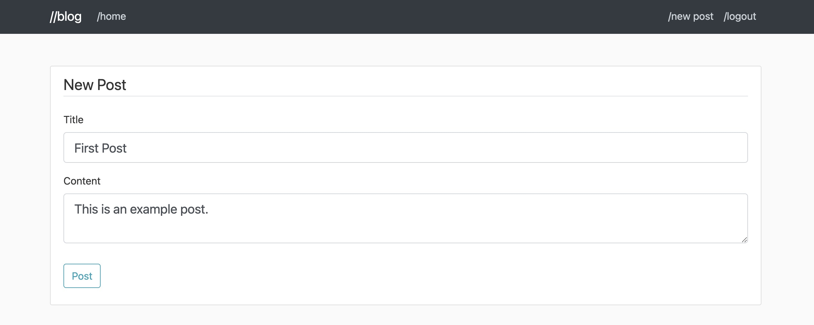
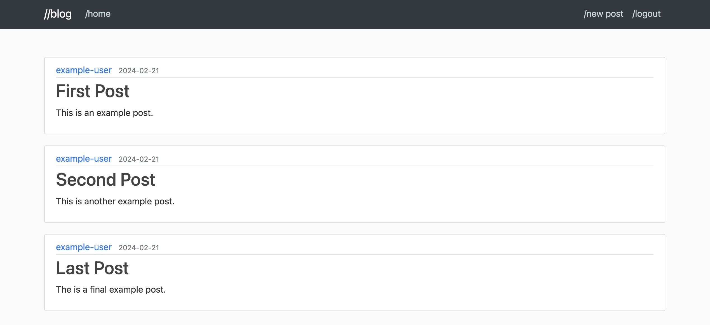
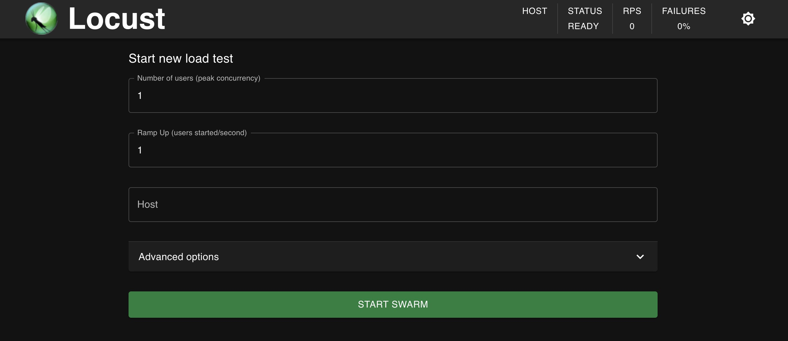
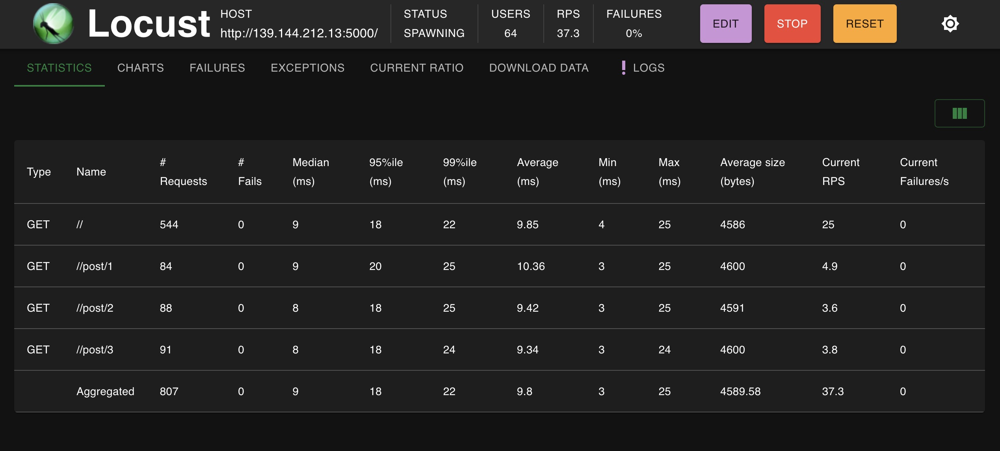

[Locust](https://docs.locust.io/en/stable/what-is-locust.html) is an open-source, scalable load testing tool that uses Python scripts and a distributed, event-based architecture. Locust can be configured to run distributed load testing across multiple instances, and tests can be run via the command line or Locust's web-based UI. Use cases include website and service testing, CI/CD pipelines, and numerous other protocol testing scenarios.

This guide walks you through installing Locust on an individual Compute Instance, accessing the Locust web interface, and getting started using Locust for load testing using an example application.

## What Is Load Testing?

*Load testing* is a type of performance testing used specifically to ensure that applications perform effectively under projected usage loads. Load tests help you anticipate your applications' performance and resource needs so that you can use the best solutions for uninterrupted user experiences.

Typically, a load test lets you model user behavior and run that behavior against your application at various traffic levels. Based on the results you receive, you can determine what resources you need and fine-tune your infrastructure.

## Installation Methods

There are a few methods available for installing Locust. These are outlined below. The method you choose depends on your load testing needs.

- Single instance installation (covered in this guide)
- [Distributed deployment](https://docs.locust.io/en/stable/running-distributed.html) across multiple instances
- Using Locust's [Docker image](https://docs.locust.io/en/stable/running-in-docker.html)
- Provisioning Locust using [Terraform](https://docs.locust.io/en/stable/running-cloud-integration.html)

The installation method covered in this guide is for a single Compute Instance. See [Locust's official documentation](https://docs.locust.io/en/stable/index.html) for more installation details and configuration options.

### Hardware Requirements

The amount of requests Locust can run depends on the hardware itself. As a general rule, Locust recommends [**one Locust process per CPU core**](https://docs.locust.io/en/stable/running-distributed.html#running-distributed). See our [Pricing page](https://www.linode.com/pricing/) for available plan options and specifications.

Locust also includes multiple HTTP clients for managing throughput while testing. By default, Locust uses the [python-requests](http://www.python-requests.org/) client, but it also comes with FastHttpUser (which uses the [geventhttpclient](https://github.com/gwik/geventhttpclient/) client) for increasing throughput while using less CPU resources. See Locust's documentation on using FastHttpUser: [Increase performance with a faster HTTP client](https://docs.locust.io/en/stable/increase-performance.html#increase-performance-with-a-faster-http-client).

## How to Install Locust on a Compute Instance

Since Locust is built around Python, its installation requires Python to be installed on your system first. If you already have Python and pip installed, skip step 2 below.

1.  Install any available system and repository updates:

    ```command
    sudo apt update && sudo apt upgrade
    ```

1.  Install Python 3 and the Python package manager (pip) using the following commands depending on your distribution:

    
    
    On **Debian** and **Ubuntu** systems, use APT to install Python and pip.
    ```command
    sudo apt install python3 python3-pip
    ```
    
    
    On **CentOS** and other RHEL derivatives (like **AlmaLinux** and **Rocky Linux**), use DNF to install Python and pip.
    ```command
    sudo dnf install python3 python3-pip
    ```
    
    

1.  Once Python 3 and pip are fully installed on your system, install Locust via pip:

    ```command
    pip3 install locust
    ```

1.  Exit and reopen your terminal session. Locust should be ready and available to use. You can verify the successful installation using the `locust` command with the `-V` flag to check the installed Locust version.

    ```command
    locust -V
    ```

    ```output
    locust 2.23.1 from /usr/local/lib/python3.10/dist-packages/locust (python 3.10.12)
    ```

1.  As an optional last step, open the default port for Locust's web UI (port `8089`) within your system's firewall rules. This guide later makes use of the web UI and accesses it remotely using this port. Use the command option specific to your system:

    
    
    On **Debian** and **Ubuntu** systems, UFW is preinstalled and can be used to manage firewall rules. With UFW configured and running, you can open the necessary port with the command below:
    ```command
    sudo ufw allow 8089/tcp
    ```
    Learn more about UFW in our [How to Configure a Firewall with UFW](/docs/guides/configure-firewall-with-ufw/) guide.
    
    
    On **CentOS** and other RHEL derivatives (like **AlmaLinux** and **Rocky Linux**), you can manage firewall rules using firewalld. With firewalld configured and running, you can open the necessary port with the following commands:
    ```command
    sudo firewall-cmd --zone=public --add-port=8089/tcp --permanent
    sudo firewall-cmd --reload
    ```
    Learn more in our [Configure a Firewall with Firewalld](/docs/guides/introduction-to-firewalld-on-centos/) guide.
    
    

## Load Testing with Locust

To start load testing your applications with Locust, you need to build a Python script defining a Locust test plan. This is called a [*locustfile*](https://docs.locust.io/en/stable/writing-a-locustfile.html).

Follow the instructions below to run a basic load test against an example application using an example locustfile.

### Building an Example Application

A web application is required to run a load test using the example in this guide. You may use your own existing application or set up the below application that uses Python's [Flask](https://flask.palletsprojects.com/en/) web application framework. Since Locust is already running with Python, using Flask minimizes other dependencies needed to run an example load test.

If you'd rather use a preinstalled Flask application, you can deploy our [Flask Marketplace app](/docs/products/tools/marketplace/guides/flask/). Note that the Flask Marketplace app does not include Locust and would require Locust installation after deployment.


Should you prefer to use your own web application, you can skip the steps for **Installing and Starting the Example Application** and move ahead to [Creating a Test Script](#creating-a-test-script). When asked to provide **host** information when running your load test, replace the URLs for the example Flask application with your own.


#### Installing and Starting the Example Application

This guide uses the [abalarin/Flask-on-Linode](https://github.com/abalarin/Flask-on-Linode) web application developed for our [Deploying a Flask Application on Ubuntu](/docs/guides/flask-and-gunicorn-on-ubuntu/) guide. Note that running Ubuntu is not required to complete the steps below.

1.  Install Python's virtualenv tool. This lets you set up virtual Python environments so that you can install project dependencies in an isolated environment rather than on your entire system.

    ```command
    pip3 install virtualenv
    ```

1.  Open the application's port (`5000`) within your system's firewall rules so that you can access the example Flask application.

    
    
    On **Debian** and **Ubuntu** systems, use UFW to open the port:
    ```command
    sudo ufw allow 5000/tcp
    ```
    
    
    On **CentOS** and other RHEL derivatives (like **AlmaLinux** and **Rocky Linux**), use firewalld to open the port:
    ```command
    sudo firewall-cmd --zone=public --add-port=5000/tcp --permanent
    sudo firewall-cmd --reload
    ```
    
    

    
    You can skip this step if you would rather have Locust access the application on `localhost`, however, running the test on a remote application is more representative of real-world use cases.
    

1.  Confirm you have git installed on your system by checking the version. Git should come preinstalled on most current Debian, Ubuntu, and RHEL systems:

    ```command
    git --version
    ```

    ```output
    git version 2.34.1
    ```

    If you do not have git installed, install it using your system's package manager:

    
    
    ```command
    sudo apt install git
    ```
    
    
    ```command
    sudo dnf install git
    ```
    
    

1.  Using git, download the example application code from its GitHub repository. This stores the project in a new `example-flask-app/` directory within the current user's home directory, then navigates into the new directory.

    ```command
    cd ~/
    git clone https://github.com/abalarin/Flask-on-Linode.git example-flask-app
    cd example-flask-app/
    ```

1.  Initialize the project's virtual environment, and then activate it. Note that the remaining steps assume your virtual environment is active.

    ```command
    virtualenv venv
    source venv/bin/activate
    ```

    Once initialized and activated, you should see a `(venv)` marker at the start of your terminal input line indicating you are now operating within the virtual environment. You can leave the virtual environment at any time using the `deactivate` command:

    ```command
    deactivate
    ```

    You can reenter the virtual environment by navigating to the project's base directory (`example-flask-app/` in this example) and rerunning the `source` command above:

    ```command
    source venv/bin/activate
    ```

1.  Install the project dependencies within the virtual environment. The dependencies are defined in the `requirements.txt` file.

    ```command
    pip install -r flask_app/requirements.txt
    ```

1.  Install the `python-dotenv` package so that you do not need to manually set environment variables for each shell session before running Flask. Flask can pull the variables from the file created in the next step.

    ```command
    pip install python-dotenv
    ```

1.  Using a text editor, create a `.flaskenv` file in the project's base directory and paste the file contents shown below into the file. This stores the environment variables needed to run the Flask app that identify the initial application file and its current environment.

    ```file {title=".flaskenv" lang="sh"}
    FLASK_APP=flask_app/__init__.py
    FLASK_ENV=development
    ```

1.  Start the application using Flask. By default, the application runs on `localhost`, and the `--host` option makes the application accessible remotely:

    ```command
    flask run --host 0.0.0.0
    ```

    You should see output similar to the following, with `192.0.2.17` replaced by your instance's IP address.

    ```output
     * Serving Flask app 'flask_app/__init__.py'
     * Debug mode: off
    WARNING: This is a development server. Do not use it in a production deployment. Use a production WSGI server instead.
     * Running on all addresses (0.0.0.0)
     * Running on http://127.0.0.1:5000
     * Running on http://192.0.2.17:5000
    Press CTRL+C to quit
    ```

#### Populating the Example

The steps below show you how to navigate to your example application's web interface and add example blog content. This helps provide context while familiarizing yourself with the Locust test plan defined later on.

1.  In your browser, access the web page for your example application by navigating to the URL in the output above: `http://:5000`. Replace  with your instance's IP address.

1.  Select **/register** from the top menu, and create a new user. Once you create your user, you will automatically be logged in. Save these credentials.

1.  Use the **/new post** option from the top menu to create a new blog post for the example site:

    

    Repeat the process as many times as you would like:

    

### Creating a Test Script

With an application in place, follow the steps below to create a basic locustfile script for load testing. Lines for building your locustfile script are broken up into multiple steps (starting with step 3) and should be entered after one another prior to saving the file.

When creating your script, use a different shell session than the one running your Flask virtual environment.


An alternative option for creating locustfiles is using a tool like [har2locust](https://github.com/SvenskaSpel/har2locust). har2locust works by converting browser recordings (`.har` files) to locustfiles using browser developer tools along with a [jinja2 template](https://github.com/SvenskaSpel/har2locust/tree/main/har2locust/locust.jinja2) to define output.


1.  While logged into your instance (in a shell session **not** running your Flask virtual environment (`venv`)), create an `example-locust-testing/` directory in the current user's home directory, and then navigate into the new directory. This directory will store your `locustfile.py` script.

    ```command
    mkdir ~/example-locust-testing/
    cd ~/example-locust-testing/
    ```

1.  Using a text editor, create your `locustfile.py` Python script file:

    ```command
    nano locustfile.py
    ```

1.  Paste the following contents into your `locustfile.py` file. The initial steps import the necessary features from the `locust` Python module using the `HttpUser`, `task`, and `constant` features, each of which are explained later on.

    The next options import from two other packages. `PyQuery` gives JQuery-like functionality to Python and can make it easier to pick out links from webpage content. The `random` package gives the script access to random decisions.

    ```file {title="locustfile.py" lang="py"}
    from locust import HttpUser, task, constant
    import random
    from pyquery import PyQuery as pq
    ```

1.  The main part of most Locust test scripts is the user class. This is a Python class that extends on the `HttpUser` class imported above. Paste this line below the initial steps above.

    ```file {title="locustfile.py" lang="py" linenostart="5" }
    class ExampleFlaskAppUser(HttpUser):
    ```

    When you run your Locust test, Locust creates an instance of this class for each user in the test run. Each instance gets its own thread and executes each of the class's defined **tasks** (below) in turn.

1.  Within the user class, you can define the amount of time between each simulated user's tasks using Locust's included `wait_time` method. When defining `wait_time`, make sure it is indented underneath the `class` (see step 8 for reference):

    ```file {title="locustfile.py" lang="py" linenostart="6" }
        wait_time = constant(2)
    ```

    This example uses the `constant` wait time with a value of 2 seconds. Notice that this method was imported earlier (step 3). If you choose a different `wait_time` option, replace `constant` in step 3 to match the method you choose here.

    You have five options when defining the `wait_time`:

    - Leave it undefined by omitting the line entirely. A new task starts immediately after the previous task has been executed.

    - Use the `constant` method. A new task starts only after a given number of seconds have passed after the previous task execution. Example: `wait_time = constant(5)`.

    - Use the `between` method. A new task starts only after a random number of seconds between given values have passed from the previous task's execution. Example: `wait_time = between(1, 5)`.

    - Use the `constant_pacing` method. A new task starts after at least a given number of seconds have passed from the execution of the previous task. Example: `wait_time = constant_pacing(5)`.

    - Use the `constant_throughput` method. Each task execution waits to fall within a given maximum number of task executions per second. Example: `wait_time = constant_throughput(0.2)`.

1.  Also within the user class, each **task** is defined by a method denoted with `@task`. The method below gives the simulated user the task of visiting the website's homepage, giving a baseline. Task lines should live within the `class` and indented.

    ```file {title="locustfile.py" lang="py" linenostart="8" }
        @task
        def homepage(self):
            self.client.get("/")
    ```

1.  The next task method utilizes the two other packages the script imported: `random` and `PyQuery`. Using PyQuery to parse links allows the script to be useful as the application expands, regardless of the number of posts:

    ```file {title="locustfile.py" lang="py" linenostart="12" }
        @task
        def article_check(self):
            res = self.client.get("/")
            page_content = pq(res.content)

            post_headings = page_content("a.article-title")

            chosen_post = random.choice(post_headings)
            self.client.get(chosen_post.attrib["href"])
    ```

    The options within the task above perform the following actions:

    - Fetches the applications homepage content and prepares that content for processing with PyQuery (`pq`)

    - Parses the homepage content for the post headings, which links `a` with the `article-title` class

    - Makes a random choice between the list of posts and navigates to the post URL contained in the post's heading link

1.  Check to make sure your locustfile looks like the one below. Then, save your changes. This file is used in the next section to load test your example application.

    ```file {title="locustfile.py" lang="py"}
    from locust import HttpUser, task, constant
    import random
    from pyquery import PyQuery as pq

    class ExampleFlaskAppUser(HttpUser):
        wait_time = constant(2)

        @task
        def homepage(self):
            self.client.get("/")

        @task
        def article_check(self):
            res = self.client.get("/")
            page_content = pq(res.content)

            post_headings = page_content("a.article-title")

            chosen_post = random.choice(post_headings)
            self.client.get(chosen_post.attrib["href"])
    ```

1.  Once your locustfile has been saved, install the Python package for PyQuery. This package is needed in order for your script to run:

    ```command
    pip3 install pyquery
    ```

### Running the Tests

There are two methods for running your load test with Locust: from Locust's web UI or via the command line.

By default, Locust uses its web UI to finalize the test, defining the desired number of simulated users and the host to test against. This lets you readily alter your test configuration as needed, expanding or reducing the number of users.

Follow the steps below to start up and access the Locust web UI to run your load test. If you would rather run your test via the command line, skip ahead to [Running Your Test From the Command Line](#running-your-test-from-the-command-line).

*Remember to have your application running before starting your test.*

#### Running Your Test From the Web UI

In the steps below, replace  with your instance's IP address.

1.  Start Locust using the `locust` command. Make sure you are in the directory with your `locustfile.py` file:

    ```command
    locust
    ```

1.  In a browser, navigate to Locust's default port (`8089`) on your server's public address. This brings you to the Locust web UI: `http://:8089`

    

1.  Complete the fields, providing a number of simultaneous simulated users (**Number of users**) to be created for the test along with the number of seconds to space out the creation of the users (**Ramp Up**).

    In the **Host** field, provide the base URL for your example application (`http://:5000`). If you are using your own web application, substitute your URL here.

1.  Click the **Start Swarm** button to begin the load test. Locust takes you to a monitoring interface, where you can see the test results in real-time.

    

1.  Stop the test using the **Stop** button when you are satisfied. Navigate the web UI to get more details on the test results and to download report data.

#### Running Your Test From the Command Line

In order to run load tests from the command line, use the `locust` command with the `--headless` option to disable the web UI. Specify the `--users` and `--spawn-rate` values as you did with the **Number of users** and **Ramp Up** fields in the web UI:

```command
locust --headless --users 10 --spawn-rate 1 --host http://:5000
```

Locust outputs the results directly to the terminal, displaying an updated table every few task executions. You can stop the test with the <kbd>Ctrl</kbd> + <kbd>C</kbd> key combination.

```output
Type     Name           # reqs      # fails |    Avg     Min     Max    Med |   req/s  failures/s
--------|-------------|-------|-------------|-------|-------|-------|-------|--------|-----------
GET      /                 120     0(0.00%) |      7       3      18      6 |    5.00        0.00
GET      /post/1            17     0(0.00%) |      5       3      10      5 |    0.70        0.00
GET      /post/2            18     0(0.00%) |      5       3      10      5 |    0.80        0.00
GET      /post/3            16     0(0.00%) |      5       3      10      4 |    0.40        0.00
--------|-------------|-------|-------------|-------|-------|-------|-------|--------|-----------
         Aggregated        171     0(0.00%) |      6       3      18      6 |    6.90        0.00
```

Use the `locust --help` command to view the available command-line options for running your load tests, including options for exporting your results.