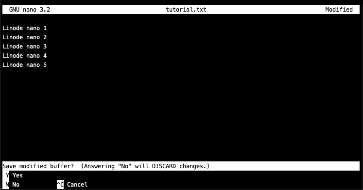
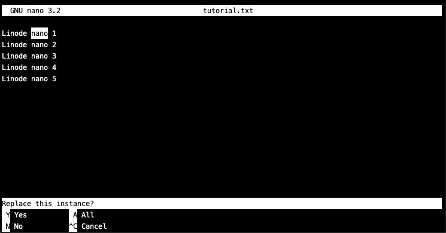

## What is Nano?

[GNU nano](https://www.nano-editor.org/) is a popular command-line text editor that is included in most Linux distributions. Its interface is comparable to other common GUI-based text editors, which makes it a popular choice for those who find vi or emacs commands non-intuitive. This guide shows you how to use Nano Text Editor Commands in Linux.

## Why Edit Files in Linux Using Nano?

Editing files in Linux using nano is popular as compared to other editors like Vim because nano’s GUI makes it very easy to edit, save, and interact with your files. Other editors like Vim have relatively complicated usage requirements like switching to edit mode in order to input text.

## Nano Set Up and Basic Commands

Nano is included with many Linux distributions by default, but you may need to install it through your distribution’s [package management](/docs/guides/linux-package-management) tool.

### How to Install Nano Text Editor in Linux

**Debian/Ubuntu**:

    apt install nano

**CentOS/Fedora**:

    yum install nano

### Using Command Keys in Nano

When using nano, control characters (**CTRL**) are represented by a carat (**^**). For example, to cut a line of text, press **CTRL**, then simultaneously press **K**. This sequence of commands is represented as **^K** in nano.

Some commands use the **ALT** key in order to function, which is represented by **M-**. A command represented as **M-R** in nano is performed by pressing **ALT**, then simultaneously pressing **R**.


By default, Mac users use **ESC** as the **ALT** key in nano.


## Using Nano to Create And Open Files in Linux

### Create a New File using Nano

Enter `nano` without any arguments to open a blank file for editing:

    nano

This opens up a blank new file in your terminal, where you can immediately make changes by entering text. Use the arrow keys to move the cursor.

The top bar displays your nano version, the filename or "New Buffer" for a blank file, and the modified status of the file. A partial menu of available commands/shortcuts is displayed at the bottom of the screen.

For this tutorial, enter the following text into a blank nano file:


Linode nano 1
Linode nano 2
Linode nano 3
Linode nano 4


## Save Your Work Using Nano

To save your work, use **CTRL+O** (**^O**) or "WriteOut". Nano prompts you to enter the name of the file if you are saving a new file. This saves the document and leaves nano open for you to continue working.

In your open file, enter **CTRL+O** (**^O**) to save the text you entered above, type in `tutorial.txt` for the filename, then press **ENTER** or **RETURN** to save the file and continue.

## Exit Commands for Nano Text Editor

Enter **CTRL+X** (**^X**) to exit nano. If you have unsaved changes in your file, nano prompts you to save prior to exiting. Otherwise, nano exits without any prompts.

In `tutorial.txt`, enter a fifth line to the file so that it contains the following:


Linode nano 1
Linode nano 2
Linode nano 3
Linode nano 4
Linode nano 5


Enter **CTRL+X** (**^X**) to exit `tutorial.txt`. Nano prompts you to save your changes:

Next, enter **Y** to save your changes to `tutorial.txt`, then press **ENTER** or **RETURN** to save the file and exit nano.

From your terminal, check the contents of `tutorial.txt` to confirm that your new file has been created and saved as expected:

    cat tutorial.txt

    
Linode nano 1
Linode nano 2
Linode nano 3
Linode nano 4
Linode nano 5
    

### Save with Backups Using Nano

Use the `-B` option when starting nano to create backups of the previously saved version a file when new changes are saved. Backups are placed in the same directory as the modified file by default, or you can use the `-C` option to specify a directory.

For example, to open `tutorial.txt` and save backup files to the `~/backups` directory, exit nano and enter the following commands:

    mkdir ~/backups
    nano -BC ~/backups tutorial.txt

Now, when you save changes, you are also prompted to enter a filename for the backup. Enter the original filename for the backup, in this case `tutorial.txt`, to write the backup to a unique filename in `~/backups`.


When using the `-C` flag, changing the backup filename causes nano to save the backup file in the original file's directory instead of the specified backup directory.


### Open an Existing File Using Nano

To open a file with nano within your current working directory, pass the filename as an argument:

    nano <filename>


If the file does not exist, nano creates it when you save any changes.


To practice, open your `tutorial.txt` file:

    nano tutorial.txt

To open a file in a different directory, you can provide a path instead. To practice, exit nano (**^X**) and create a new directory in your user home:

    mkdir ~/linode-nano-tutorial

Copy `tutorial.txt` to the practice directory:

    cp tutorial.txt ~/linode-nano-tutorial

Now open `tutorial.txt` from this new path:

    nano ~/linode-nano-tutorial/tutorial.txt

You can also open files with nano with the cursor at a specific line. The following command opens `tutorial.txt` at line 3:

    nano +3 ~/linode-nano-tutorial/tutorial.txt

Or you can open files at a specific line and column number. This command opens `tutorial.txt` at line 3 and column 8:

    nano +3,8 ~/linode-nano-tutorial/tutorial.txt

To open a file with nano as read-only:

    nano -v <filename>

### Open Configuration Files Using Nano

When editing lengthy files used to configure applications or system utilities, start nano with the `-w` flag:

    nano -w <filename>

This flag prevents nano from wrapping lines that are too long to fit on your screen, which can create problems if configuration directives are saved across multiple lines.

## Edit Files Using Nano Text Editor in Linux

### Cut and Paste Lines of Text Using Nano

To cut a line of text, enter **CTRL+K** (**^K**).

To paste, move the cursor to where you want to place the text and enter **CTRL+U** (**^U**).

To cut multiple lines, use a series of **CTRL+K** (**^K**) commands until you have removed all lines you wish to cut. When you paste them back with **CTRL+U** (**^U**), the lines are all pasted at once.

### Valid Shortcuts in Nano Text Editor

To open up a list of valid shortcuts in nano, enter **CTRL+G** (**^G**) to view the nano help text and use the arrow keys to navigate.

Here is a full list of shortcuts (and their alternative keys):


The following are the shortcuts for GNU nano 3.2. These shortcuts may differ for you depending on which version of nano you are using.


    ^G    (F1)      Display this help text
    ^X    (F2)      Close the current buffer / Exit from nano
    ^O    (F3)      Write the current buffer (or the marked region) to disk
    ^R    (Ins)     Insert another file into current buffer (or into new buffer)

    ^W    (F6)      Search forward for a string or a regular expression
    ^\    (M-R)     Replace a string or a regular expression
    ^K    (F9)      Cut current line (or marked region) and store it in cutbuffer
    ^U    (F10)     Uncut from the cutbuffer into the current line

    ^J    (F4)      Justify the current paragraph
    ^T    (F12)     Invoke the spell checker, if available

    ^C    (F11)     Display the position of the cursor
    ^_    (M-G)     Go to line and column number

    M-U             Undo the last operation
    M-E             Redo the last undone operation

    M-A   (^6)      Mark text starting from the cursor position
    M-6   (M-^)     Copy current line (or marked region) and store it in cutbuffer

    M-]             Go to the matching bracket

    ^Q              Search backward for a string or a regular expression
    M-Q   (M-▲)     Search next occurrence backward
    M-W   (M-▼)     Search next occurrence forward

    ^B    (◀)       Go back one character
    ^F    (▶)       Go forward one character
    ^◀    (M-Space) Go back one word
    ^▶    (^Space)  Go forward one word
    ^A    (Home)    Go to beginning of current line
    ^E    (End)     Go to end of current line

    ^P    (▲)       Go to previous line
    ^N    (▼)       Go to next line
    M--   (M-_)     Scroll up one line without moving the cursor textually
    M-+   (M-=)     Scroll down one line without moving the cursor textually

    ^▲    (M-7)     Go to previous block of text
    ^▼    (M-8)     Go to next block of text
    M-(   (M-9)     Go to beginning of paragraph; then of previous paragraph
    M-)   (M-0)     Go just beyond end of paragraph; then of next paragraph

    ^Y    (PgUp)    Go one screenful up
    ^V    (PgDn)    Go one screenful down
    M-\   (^Home)   Go to the first line of the file
    M-/   (^End)    Go to the last line of the file

    M-◀   (M-<)     Switch to the previous file buffer
    M-▶   (M->)     Switch to the next file buffer

    ^I    (Tab)     Insert a tab at the cursor position
    ^M    (Enter)   Insert a newline at the cursor position

    ^H    (Bsp)     Delete the character to the left of the cursor
    ^D    (Del)     Delete the character under the cursor
    Sh-^Del         Cut backward from cursor to word start
    ^Del            Cut forward from cursor to next word start
    M-T             Cut from the cursor position to the end of the file

    M-J             Justify the entire file
    M-D             Count the number of words, lines, and characters
    M-V             Insert the next keystroke verbatim

    ^L              Refresh (redraw) the current screen
    ^Z              Suspend the editor (if suspension is enabled)

    M-}   (Tab)     Indent the current line (or marked lines)
    M-{   (Sh-Tab)  Unindent the current line (or marked lines)

    M-3             Comment/uncomment the current line (or marked lines)
    ^]              Try and complete the current word

    M-:             Start/stop recording a macro
    M-;             Run the last recorded macro

    M-Del           Throw away the current line (or marked region)

    M-B             Invoke the linter, if available

    ^S              Save file without prompting
    M-X             Help mode enable/disable
    M-C             Constant cursor position display enable/disable
    M-S             Smooth scrolling enable/disable
    M-$             Soft wrapping of overlong lines enable/disable
    M-#             Line numbering enable/disable
    M-P             Whitespace display enable/disable
    M-Y             Color syntax highlighting enable/disable

    M-I             Auto indent enable/disable
    M-K             Cut to end enable/disable
    M-L             Hard wrapping of overlong lines enable/disable
    M-O             Conversion of typed tabs to spaces enable/disable

    M-M             Mouse support enable/disable
    M-Z             Suspension enable/disable

### Search Text Using Nano

To search for text in a document, enter **CTRL+W** (**^W**). This opens a search prompt and a submenu of search-specific commands.

To practice searching for text with nano, open the `tutorial.txt` file you created in the [Create a New File using Nano](#create-a-new-file-using-nano) section above:

    nano tutorial.txt

Next, open the search prompt by entering **CTRL+W** (**^W**), type in the word "nano", then press **ENTER** or **RETURN**. The cursor jumps to the first instance of "nano" in line 1.

To find the next instance of "nano", enter **ALT+W** (**M-W**). The cursor moves to the next instance of "nano" in line 2.

### Find and Replace Text using Nano

To find and replace text, open the search menu with **CTRL+W** (**^W**), then enter **CTRL+R** (**^R**) to open the "Search (to replace)" prompt.

In your `tutorial.txt` file, search to replace "nano" and enter the replacement text "rocks". Nano highlights the first instance of "nano" following your current cursor position, and provides several options on how to proceed with replacement:

Enter **Y** to replace the single, highlighted instance of the searched term.

Enter **A** to replace all instances of the searched term.

Enter **N** to skip the highlighted instance of the searched term and find the next instance.

Enter **CTRL+C** (**^C**) to cancel the search to replace function.

### Go to a Line Number using Nano

To go to a specific line number, enter **CTRL+\_** (**^\_**) and enter a line number with an optional, comma-separated column number. For example, enter `3,8` to place the cursor at column 8 of line 3.

You can also find this prompt by opening the search submenu with **CTRL+W** (**^W**), then entering **CTRL+T** (**^T**).

Alternatively, you can jump to a specific line and column when you first [open a file](#open-an-exiting-file-using-nano) with nano.

### Spell Check Using Nano

Nano has a built-in spell checking feature, though it requires installation of the `spell` package.

Exit nano if it is open, then enter the following to install the `spell` package for your distribution:

**Debian/Ubuntu**:

    apt install spell

**CentOS/Fedora**:

    yum install spell

Once you have installed `spell`, you can use the nano spell checking feature by pressing **CTRL+T** (**^T**) while editing a file. For newer versions of nano, this command opens an execute function submenu, from which you can enter **CTRL+S** (**^S**) to spell check.
