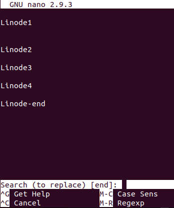

GNU nano is a popular command-line text editor that is included in most Linux distributions. The interface is comparable to GUI-based text editors, which makes nano a popular choice for those who find `vi` or `emacs` commands non-intuitive. This guide shows you how to use Nano Text Editor Commands in Linux.

## Why Edit Files in Linux Using Nano?

Editing files in Linux using Nano is a popular option. Compared to other editors such as Vim, Nano’s GUI makes it very easy to edit, save and interact with the files. On other editors such as Vim, you have to change to edit mode to input text.

## Installing the Nano Text Editor in Linux

Nano is included with many Linux distributions by default. However, some users may need to install Nano on Linux using the [package management](/docs/guides/linux-package-management-overview/) tool of the distribution.

**Debian/Ubuntu**:

    apt install nano

**CentOS/Fedora**:

    yum install nano

## Nano Command Keys

When using nano commands, control characters (CTRL) are represented by a carat `(^)`. For example, if you wish to cut a line of text, you would use the *CTRL* key followed by the *K* key. This sequence of commands is represented as `^K` in nano. Some commands use the *Alt* key in order to function, which is represented by the letter *M*.

A command represented as M-R in nano is performed by pressing the *Alt* key followed by the *R* key. Mac users may need to use the *Escape* (Esc) key instead of the *Alt* key to use these commands.

## Using Nano to Create And Open Files in Linux

### Create a New File using Nano

Typing `nano` in the terminal without any arguments opens a blank file for editing:

    nano

A blank new file in the terminal similar to the following appears:

You can make changes to the file using the Nano editor. You may exit the file by pressing *Ctrl + X*. It prompts you to save the file and name it before you exit.


Nano only prompts you if actual changes were made to the file. If you didn't make any changes, you simply exit the editor and you get no prompts.


When prompted, select press *Y* and then write the name of the file.

After you enter a filename, press the *Enter* key to save the file. In this guide, the file is saved as a `tutorial.txt` with the following content:

### Open an Existing File Using Nano

To open a file, provide the filename as an argument in the following command:

    nano <filename>

The editor opens an existing file in the current working directory.

To practice, use the file in the current working directory that was created earlier: `tutorial.txt`.

    nano  tutorial.txt

If you wish to open a file in a different directory, you can provide a path instead. To do that, provide the path to the file relative to your current working directory. For instance, if the path to `tutorial.txt` is `/nano-text-editor-tutorial/tutorial.txt`, you could use the following command:

    nano /nano-text-editor-tutorial/tutorial.txt

If `tutorial.txt` does not exist in `/nano-text-editor-tutorial/`, nano creates a file named `tutorial.txt` in the directory.

You can also open files at a specific line or column number:

    nano +LINE,COLUMN /nano-text-editor-tutorial/tutorial.txt

For example, to open the `tutorial.txt` file at Line `2`:

    nano +2 /nano-text-editor-tutorial/tutorial.txt

To open a file as read-only:

    nano -v myfile.txt

### Open Configuration Files Using Nano

When editing files used to configure applications or system utilities, start nano with the `-w` flag:

    nano -w /etc/mysql/my.cnf

This flag prevents nano from wrapping lines that are too long to fit on the screen. Wrapping lines can create problems if configuration directives are saved across multiple lines.

## Edit Files Using Nano Text Editor in Linux

Type `nano` to enter nano text editor. Use the arrow keys to move the cursor. A partial menu of available nano editor commands appear at the bottom of the terminal window.

### Cut and Paste Lines of Text Using Nano

To cut a line of text, use `^K`. To paste, move the cursor where you want the text to be placed and use `^U`. To cut multiple lines, use a series of `^K` commands until all lines you wish to cut have been removed. When you paste them back with `^U`, the lines are pasted at once.

### Valid Shortcuts in Nano Text Editor

To open up a list of Nano's commands in Linux, for example, in the `tutorial.txt` file, use *Ctrl+G*.

Nano help menu appears and displays the following commands:

Below is an abbreviated list of commands:

|Keyboard Shortcut|Alternative Command Key|Description|
|:--|:--|:--|
|^G|F1|Display this help text|
|^X|F2|Close the current file buffer / Exit from nano|
|^O|F3|Write the current file to disk|
|^R|F5|Insert another file into the current one|
|^W|F6|Search forward for a string or a regular expression|
|^\|M-R|Replace a string or a regular expression|
|^K|F9|Cut the current line and store it in the cut buffer|
|^U|F10|Uncut from the cut buffer into the current line|
|^J|F4|Justify the current paragraph|
|^T|F12|Invoke the spell checker, if available|
|^C|F11|Display the position of the cursor|
|^_|M-G|Go to line and column number|
|M-U|  |Undo the last operation|
|M-E|  |Redo the last undone operation|
|M-A|^6|Mark text starting from the cursor position|
|M-6|M-^|Copy the current line and store it in the cut buffer|
|M-]| |Go to the matching bracket|
|M-W|F16|Repeat the last search|
|M-▲|  |Search next occurrence backward|
|M-▼|  |Search next occurrence forward|
|^B|◀|Go back one character|
|^F|▶|Go forward one character|
|^◀|M-Space|Go back one word|
|^▶|^Space|Go forward one word|
|^A|Home|Go to beginning of current line|
|^E|End|Go to end of current line|

### Search Text Using Nano

To search for a specific text in the document, use `^W` The editor opens a search prompt and a submenu of search-specific commands.

|Search Option Command|Command Description|
|:--|:--|
|^G|Get Help|
|^Y|First Line|
|^T|Go To Line|
|^W|Beginning of Paragraph|
|M-J|Full Justify|
|M-B|Backwards|
|^C|Cancel|
|^V|Last Line|
|^R|Replace|
|^O|End of Paragraph|
|M-C|Case Sensitive|
|M-R|Regexp|

For example, make some changes to the existing `tutorial.txt file` and save it with the following text in it:


test 1

test 2

test 3

test 4

Linode1

Linode2

Linode3

Linode4

Linode-end


Search for any word that contains **end**. To do so, use *Ctrl+W* and the editor opens an option to search that appears at the bottom of the editor.

Type **end** in the search option and press enter to see the text that contains “end” in it. In this case, the editor highlights Linode-end. If there were multiple words that had **end** in them, move to other search results by using *Alt+W* to see the next match.

**Go to Line Number**

To go to a line number, enter `^T` at the search prompt and enter the line number.

**Find and Replace Text**

At the search menu, enter *Alt+R*. Type the text to be replaced and press *Enter*, then type the replacement text. You are prompted to confirm the replacement for each instance found, or to select *All* to confirm all instances.

Now try that with **end** in the `tutorial.txt` file. The goal is to find **end** in the `tutorial.txt` file and replace it with **launch**. To get started, press *Alt+R* and the following menu appears:

Next, type the text you want to replace. In this case, it is **end**. And, then press *Enter*.

Nano prompts you to enter the replacement text for **end** now. Replace **end** with **launch**, so type it here.
Nano highlights the text to be replaced and prompts you to confirm. Press *Y* and replace **end** with **launch**.

### Spell Check Using Nano

Nano has a built-in spell checking feature, but you need to install the spell package. Issue the following command depending on what distribution you are using.

**Debian/Ubuntu**:

    apt install spell

**CentOS/Fedora**:

    yum install spell

After you have installed spell, you can use the spell-checking feature by using `^T` while editing a file.

## Save Your Work Using Nano

To save your work, use `^O `or *WriteOut*. This saves the document and leaves nano open for you to continue working.

### Save with Backups

Nano can create backups of files when you exit. These backups can be placed in a directory of your choice. By default, they are placed in the same directory as the modified file.

Using the `-B` option when starting nano creates backups of the file for you. Using the `-C` option allows you to specify the directory to place backup files in.

    nano -BC ~/backups index.php

The command listed above creates a backup copy of *index.php* in the backups folder in the current user’s home directory.

## Exit Commands for Nano Text Editor

Use `^X` to exit nano. If you have not saved your work, you are prompted to save the changes or cancel the exit routine.
