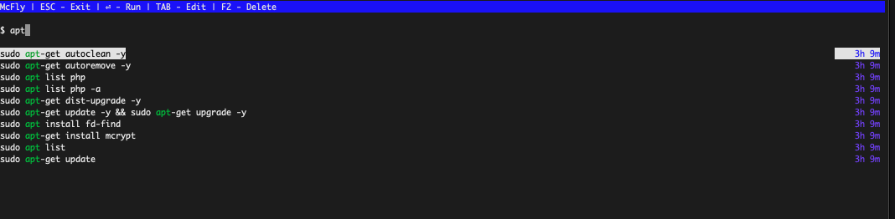
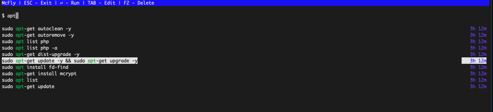
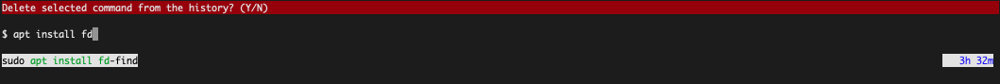
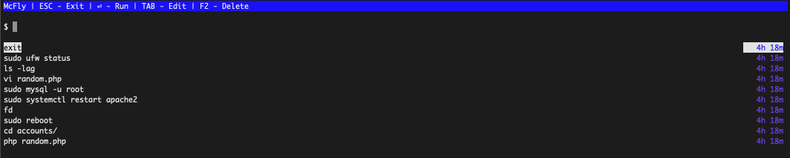
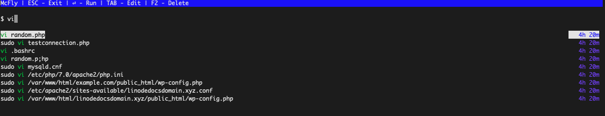
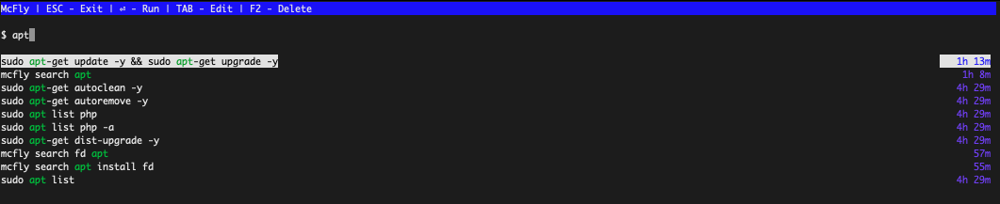
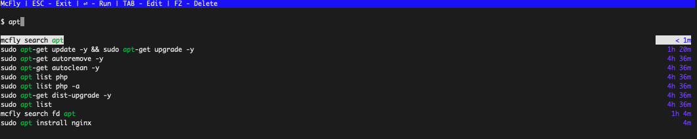
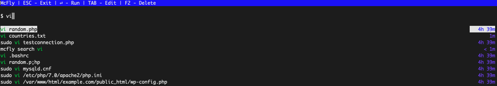

Many Linux users run certain commands regularly. Newcomers might resort to retyping the command or using the **up** and **down** keys to scroll through previous commands. More experienced users typically search their terminal history using the built-in `Control-r` command. The free and open-source [*McFly*](https://github.com/cantino/mcfly) application is designed as an alternative to these traditional methods. McFly is a bash search history utility that uses AI techniques to display the most relevant commands. This guide provides a brief introduction to the McFly application and its methodology. It also explains how to install McFly and how to use the `mcfly` command to search through the terminal history.

## An Introduction to McFly

McFly incorporates an AI-based algorithm to bring context and intelligence to its search results rather than relying on a purely linear search. This allows it to preferentially display commands from the terminal history that are more likely to be useful. Although McFly uses a neural network and maintains a SQLite database, it still retrieves results in real-time. Some of the ways McFly prioritizes items from the history log are as follows:

- It enhances the traditional search history with information about when the command is run and the directory where it is executed. It also keeps track of the exit status of each command, so it can detect failed commands.
- It considers the current working directory and is more likely to suggest commands that you have run from that directory before.
- It takes into account the most recent commands and prioritizes commands that have typically followed those commands in the past.
- It highlights commands that are used regularly, along with recent commands.
- If a command is selected directly from the McFly interface, it is prioritized in future searches.
- Commands that resulted in an exit status of `Error` are less likely to be recommended.

Unlike `Control-r`, McFly displays its results using a full-screen display, with all available options at the top of the terminal. It also allows users to scrub any command from the database or add additional commands. However, McFly does not replace or overwrite the terminal history maintained by the system. The regular built-in record of the previous commands is still available and can be used at any time. Many users toggle between the two alternatives. McFly is written in the Rust programming language, for extra speed and security, and features full Unicode support. It is available for most systems and can be installed using one of several popular package managers.

## Comparing McFly to a Standard Terminal Search

The easiest but least efficient method of searching the terminal command history is with the **up** arrow. This cycles through the most recent commands one by one. This is fairly efficient for running a command that was recently executed but is tedious otherwise. It is also possible to run the `history` command. This displays all the commands from the terminal's history, subject to buffer capacity.

A quicker and better way of searching through the terminal history is by using `Control-r`. This allows users to specify a search term. Commands matching the search are displayed one at a time, starting with the most recent selection. In the example below, when you type **Control-r** and `vi`, the most recent command matching the `vi` string is displayed. In this example, it is `vi submenu.json`.

    <ctrl-r>
    vi


(reverse-i-search)`vi': vi submenu.json


If you again enter **Control-r**, the second-most recent match is displayed. When the user finds the command they are looking for, they have two choices. They can hit the **return** key to re-run it, or use the **left** and **right** arrow keys to edit it before execution.

This works well enough in many cases, but it often forces the user to cycle through multiple iterations before they find the command they want. There is no context or nuance to the search. `Control-r` begins with the most recent match and works back through the commands in a linear manner, displaying one match at a time. It lacks any of the functionality of McFly. It does not take into account the exit status of the commands, how often the commands were run, or the execution directory of the command. It is also much easier to inadvertently select an unwanted command because `Control-r` does not use a full-screen interface. McFly is an obvious upgrade over any type of built-in terminal history search on Linux.

## Before You Begin

1.  If you have not already done so, create a Linode account and Compute Instance. See our [Getting Started with Linode](/docs/guides/getting-started/) and [Creating a Compute Instance](/docs/guides/creating-a-compute-instance/) guides.

1.  Follow our [Setting Up and Securing a Compute Instance](/docs/guides/set-up-and-secure/) guide to update your system. You may also wish to set the timezone, configure your hostname, create a limited user account, and harden SSH access.


The steps in this guide are written for non-root users. Commands that require elevated privileges are prefixed with `sudo`. If you are not familiar with the `sudo` command, see the [Linux Users and Groups](/docs/guides/linux-users-and-groups/) guide.


## How to Install McFly

You can install McFly using the [*Homebrew*](https://brew.sh/) package manager or via McFly's install script.


McFly can also be installed from GitHub or manually from the source. In this case, Rust must also be installed. See the [McFly GitHub page](https://github.com/cantino/mcfly#installing-manually-from-github) for more information.


### Install McFly Using Homebrew

The Homebrew package manager installs programs into their own directory and adds all appropriate soft links. To use Homebrew to install McFly, follow the steps below:

1. Download and install Homebrew using the following command. Enter the `sudo` password to install Homebrew into its own directory in the `/home` directory. To install it in your user directory, enter `Control-D`.

        /bin/bash -c "$(curl -fsSL https://raw.githubusercontent.com/Homebrew/install/HEAD/install.sh)"

1. Add Homebrew to the `$PATH` variable using the following commands. In the first command, substitute your user name for `userid`.

        echo 'eval "$(/home/linuxbrew/.linuxbrew/bin/brew shellenv)"' >> /home/userid/.profile
        eval "$(/home/linuxbrew/.linuxbrew/bin/brew shellenv)"

1. (**Optional**) For added functionality, install the `build-essential` package.

        sudo apt-get install build-essential

1. Use the `brew` command to install the `gcc` package.

        brew install gcc

1. To verify Homebrew is installed and working properly, run the `brew doctor` command.

    
Use the `brew help` command to see a full list of the Homebrew commands.
    

        brew doctor

    
Your system is ready to brew.
    

1. Install the Homebrew "tap" for McFly.

        brew tap cantino/mcfly

1. Install McFly.

        brew install mcfly

1. Add one of the following lines to the shell configuration file, depending on the shell you are using.

    For a **Bash** shell, add the following line to `~/.bashrc`.

        eval "$(mcfly init bash)"

    For the **Zsh** shell, add the following line to `~/.zshrc`.

        eval "$(mcfly init zsh)"

1. Source the `.bashrc` or `.zshrc` file, depending on the shell you are using.

    For a **Bash** shell, source the configuration file using the command below:

        source ~/.bashrc

    For a **Zsh** shell, source the configuration file using the command below:

        source ~/.zshrc

1. McFly confirms it has imported the history. If the terminal history is very long, you might experience a one-time delay.

    
McFly: Importing shell history for the first time. This may take a minute or two...done.
    

### Install McFly Using the Install Script

To download McFly using the installation script, follow the instructions below:

1. Log in to the system as the `root` user to avoid problems with permissions.

1. Use `curl` to run the install script.

        curl -LSfs https://raw.githubusercontent.com/cantino/mcfly/master/ci/install.sh | sh -s -- --git cantino/mcfly

1. Add one of the following lines to the shell configuration file, depending on the shell you are using.

    For a **Bash** shell, add the following line to `~/.bashrc`.

        eval "$(mcfly init bash)"

    For the **Zsh** shell, add the following line to the `.zshrc` file.

        eval "$(mcfly init zsh)"

1. Source the `.bashrc` or `.zshrc` file, depending on the shell you are using.

    For a **Bash** shell, source the configuration file using the command below:

        source ~/.bashrc

    For a **Zsh** shell, source the configuration file using the command below:

        source ~/.zshrc

1. McFly confirms it has imported the shell history. If you have a lengthy shell history, you might experience a moderately-long one-time delay.

    
McFly: Importing shell history for the first time. This may take a minute or two...done.
    

### Install McFly on macOS

The same methods that is used for Linux systems can also be used on macOS. macOS users can also install McFly using MacPorts. For more information, see the [McFly GitHub page](https://github.com/cantino/mcfly#install-with-macports-on-os-x).

## Configure McFly

McFly uses shell environment variables for configuration. Add the variables shown in the below sections to the shell configuration file, depending on whether you are using `~/.bashrc` or `~/.zshrc`. When you are done, apply the changes using `source ~/.bashrc` or `source ~/.zshrc`.

### Change to Light Mode

With the default settings, McFly runs in "Dark Mode". To change the display to suit for a light terminal, export the `MCFLY_LIGHT` variable to the shell configuration file.


export MCFLY_LIGHT=TRUE


### Set the Key Scheme

McFly uses a key scheme based on `emacs`. For a scheme more similar to **vi** or **vim** inspired editors, change the `MCFLY_KEY_SCHEME` variable.


export MCFLY_KEY_SCHEME=vim


### Enable Fuzzy Searching

*Fuzzy Searching* applies a more lenient search algorithm, where closely related terms are also counted as matches. Some examples might be different tenses of a verb form, plural or collective forms of a noun, and slightly misspelled words. It is also known as *Approximate String Matching*. To enable fuzzy searching, export the `MCFLY_FUZZY` variable.


export MCFLY_FUZZY=true


### Set the Interface View

The McFly interface appears on the top of the screen by default. It can be shifted to the bottom through the use of the `MCFLY_INTERFACE_VIEW` variable.


export MCFLY_INTERFACE_VIEW=BOTTOM


### Set the Number of Results Displayed or Used

McFly allows users to adjust the number of results that are displayed and the depth of the search. The `MCFLY_RESULTS` variable determines how many results are shown. `MCFLY_HISTORY_LIMIT=x` limits the depth of the search to the `x` most recent commands. This variable can increase performance when the McFly database is very large.


export MCFLY_RESULTS=50
export MCFLY_HISTORY_LIMIT=5000


## How to Use McFly

Because it uses an interface, McFly is straightforward to use. There are very few commands to remember. To see more information about all of the options, use the `mcfly --help` command. The `help` command explains all of the flags, options, and subcommands.

To use the `mcfly` command to search the terminal history, follow the steps below.

1. To run the search, use the command `mcfly search <search_term>`. The following command searches the McFly database for the term `apt`.

        mcfly search apt

1. McFly enters full-screen mode. It displays the possible actions at the top along with a list of all items sorted from most to least relevant. Scroll through the items using the **up** and **down** keys.

    

1. When you have located the relevant entry, hit the **return** key to run the command. For example, to run the command `sudo apt-get update -y && sudo apt-get upgrade -y`, select it from the list and then hit the **return** key.

    

1. To edit the command before running it, locate the command following the same procedure as in the previous step. Then select it using the **TAB** key. This pastes the selected command into the terminal. You can then edit it on the command line like any other command.

1. To exit the McFly application without running any commands, use the **ESC** key.

1. To delete a command from the McFly database, choose the item and type the **F2** key. To delete the `mcfly search fd` command from the list, first select it using the **down** arrow, then enter **F2**.

        mcfly search fd

    

1. To launch McFly without any search terms, use the `mcfly search` command without any parameters. You can also use `mcfly search ""`.

        mcfly search

    

    You can select an item from the list or start typing to begin a search. McFly updates the results as you type. The display below illustrates how the list is updated after you enter `vi`.

    

### A Demonstration of McFly's AI Capabilities

McFly displays different results depending on the context of the command and your search history. While it is difficult to predict exactly what commands are displayed, the following examples demonstrate how the results might change.

Once a command is selected from the McFly interface, it is prioritized in future searches. In the earlier example, the command `sudo apt-get update -y && sudo apt-get upgrade -y` was selected. From now on, it ranks higher in this list when the command `mcfly search apt` is run. Compare the results of the new search with the earlier results to see the difference.

    mcfly search apt

McFly gives lower priority to commands that result in an error. For example, the command `sudo apt instrall nginx` results in an error due to the typo in `instrall`. McFly records the exit status of the command and downgrades it in the results. When `mcfly search apt` is run again, the command `sudo apt instrall nginx` is not near the top of the list, even though it occurred recently.

McFly displays different results depending on the directory. In the example below, `vi countries.txt` is always run from the `accounts` directory. If a user runs `mcfly search vi` from the same directory, `vi countries.txt` appears as one of the top choices.

    mcfly search vi

When the user returns to their home directory and runs the same command, `vi countries.txt` command is no longer at the top of the list. Other commands rank higher even though they were not run recently. This is because the `vi countries.txt` command is not typically run from the home directory. These results continue to improve as you use McFly because it learns more about when and where different commands are run.

## Conclusion

McFly is a lightweight open-source utility offering an improved terminal history search compared to typical methods, such as `Control-r`. It can be installed using a package manager or by using McFly's own install script. McFly uses a neural network to keep track of when and where each command is run along with its exit status. It prioritizes commands that have been run frequently or have been run from the current working directory before and penalize failed commands.

McFly uses an intuitive full-screen interface. Users can run the `mcfly search` command to search their bash history for a specific command or display all commands in priority order. From the McFly interface, users can run a command immediately or copy it to the terminal to edit it first. Unwanted commands can be deleted, while several configuration options allow users to customize the application. More information can be found at the [*McFly GitHub page*](https://github.com/cantino/mcfly).
