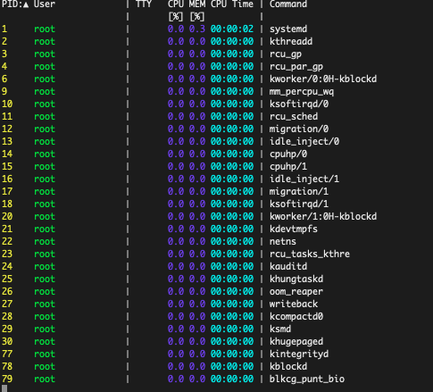
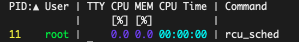
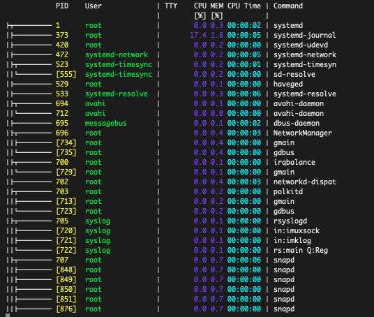
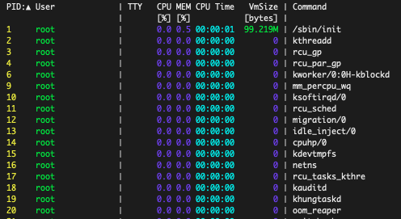
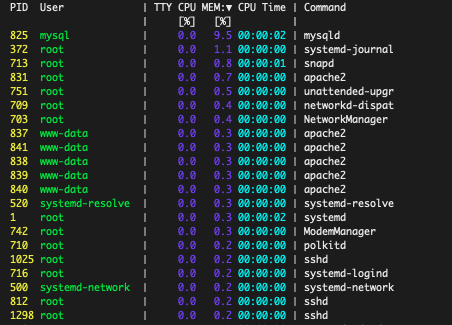

The [*procs*](https://github.com/dalance/procs) utility is a useful and informative alternative to the original Linux [*`ps` (process status) command*](/docs/guides/use-the-ps-aux-command-in-linux/). Like ps, procs displays information about the active processes running on the system, including their CPU and memory usage. However, procs enhances its output with additional columns, an intuitive color scheme, and other helpful features. This guide provides some background on procs, and explains how to install and use it.

## An Introduction to procs

Procs is an open source replacement for the `ps` command. It is written in the Rust programming language, which is known for its performance and maintainability. Procs is fully supported on Linux, and experimentally supported on macOS and Windows systems with some limitations. Here are some of its highlights and advantages:

- By default, procs displays the Process Id, User, CPU Usage, Memory Usage, CPU Time, and the command name.
- It can additionally display information that is not available in `ps`. Some of these columns include the TCP or UDP port, the read/write throughput, and information about virtual memory usage.
- It contains support for Docker containerization.
- Output is presented in a color-coded and human-readable format. A configuration file allows users to customize the display and the information that is shown. Tree view is supported.
- It adds pagination support, where users can inspect the output one page at a time.
- It allows users to search for multi-column keywords.
- It supports "watch mode", which is similar to the `top` command in Linux.
- It has additional keyboard shortcuts not found in `ps`.

The [*procs GitHub page*](https://github.com/dalance/procs#kind-list) has a complete list of all the attributes it can display.

## Comparing ps to procs

The procs utility is very similar to the `ps` command which it seeks to replace. Procs can do everything ps does, but it can also display additional fields and has more options. For this reason it is the better choice in most cases. However, both commands have the most significant information available. The `ps` command is often supplemented with the `top` command. top displays a real-time view of the most resource-intensive processes. In procs, the `--watch` and `--watch-interval` options provide the same information. Procs supports tree format and customization, while ps does not.

Because the `ps` command's output is relatively sparse, users often append the `-ef` option for more meaningful results. `ps` is often used in conjunction with other commands, such as `grep`, to extract and summarize information. For more information about the `ps` command, see the [*Linode ps guide*](/docs/guides/use-the-ps-aux-command-in-linux/).

## Before You Begin

1.  If you have not already done so, create a Linode account and Compute Instance. See our [Getting Started with Linode](/docs/guides/getting-started/) and [Creating a Compute Instance](/docs/guides/creating-a-compute-instance/) guides.

1.  Follow our [Setting Up and Securing a Compute Instance](/docs/guides/set-up-and-secure/) guide to update your system. You may also wish to set the timezone, configure your hostname, create a limited user account, and harden SSH access.


This guide is written for a non-root user. Commands that require elevated privileges are prefixed with `sudo`. If you are not familiar with the `sudo` command, see the [Users and Groups](/docs/guides/linux-users-and-groups/) guide.


## How to Install procs

Procs can be installed using one of several package installers or by downloading the binary. Some Linux distributions include procs as part of the default package. However, a package is not available in the standard Ubuntu distribution.

### Installing procs with a Package Manager

Both the [*Homebrew*](https://brew.sh/) and [*snap*](https://snapcraft.io/) package managers can be used to install procs.

Follow the steps below to install procs using Homebrew:

1. If Homebrew is not already installed, install it using the Homebrew script.

        /bin/bash -c "$(curl -fsSL https://raw.githubusercontent.com/Homebrew/install/HEAD/install.sh)"

1. Follow the instructions in the script and run the following commands. These instructions add Homebrew to the `$PATH` variable and install some additional components.

        echo 'eval "$(/home/linuxbrew/.linuxbrew/bin/brew shellenv)"' >> /home/userid/.profile
        eval "$(/home/linuxbrew/.linuxbrew/bin/brew shellenv)"
        sudo apt-get install build-essential
        brew install gcc

1. Verify Homebrew is working properly using the `brew doctor` command.

    
Use the `brew help` command to see a full list of the Homebrew commands.
    

        brew doctor

    
Your system is ready to brew.
    

1. Install procs using the `brew` command.

        brew install procs

The snap package manager can also install procs. Snap should already be installed on most Linux systems. If it is not available, consult the [*snap website*](https://snapcraft.io/) for more instructions.

Use the following command to install procs using snap.

    sudo snap install procs


procs v0.11.8 from dalance installed



On certain Linux distributions, the default system package manager can be used to install procs:

- For Fedora systems, use the command `sudo dnf install procs`.
- Use `sudo apk add procs` on Alpine Linux.
- On an Arch Linux system use `sudo pacman -S procs`.
- If Rust and its package manager Cargo are already installed, install procs using the `cargo install procs` command.


### Installing procs from Binary Files

You can also install procs using the binary file. To download and install procs using this method, follow these steps.

1. Select the correct file for the system from the [*procs GitHub releases page*](https://github.com/dalance/procs/releases/tag/v0.11.10). Download the file directly to the system using `curl` or `wget`, or transfer it from another system using a utility such as `scp`.

        wget https://github.com/dalance/procs/releases/download/v0.11.10/procs-v0.11.10-x86_64-lnx.zip

1. Unzip the file with the `unzip` program. If necessary, use `sudo apt install unzip` to install `unzip` first.

        unzip procs-v0.11.10-x86_64-lnx.zip

1. Copy the file to a directory referenced within `$PATH`, such as `/usr/local/bin/`.

        sudo mv procs /usr/local/bin/

1. Change the file permissions.

        sudo chmod +x /usr/local/bin/procs

## How to Use procs to View Linux System Processes

The procs application is very simple to use. To ensure it is installed correctly and to confirm the version number, use the `-V` option.

    procs -V


procs 0.11.10


To view a list of all the flags and options, use the `procs -h` command.

    procs -h


procs 0.11.10
A modern replacement for ps

please see https://github.com/dalance/procs#configuration to configure columns

USAGE:
    procs [FLAGS] [OPTIONS] [--] [KEYWORD]...

FLAGS:
    -a, --and          AND  logic for multi-keyword
    -o, --or           OR   logic for multi-keyword
    -d, --nand         NAND logic for multi-keyword
    -r, --nor          NOR  logic for multi-keyword
    -l, --list         Show list of kind
        --thread       Show thread
    -t, --tree         Tree view
    -w, --watch        Watch mode with default interval (1s)
        --config       Generate configuration sample file
        --no-header    Suppress header
    -h, --help         Prints help information
    -V, --version      Prints version information

OPTIONS:
    -W, --watch-interval <second>    Watch mode with custom interval
    -i, --insert <kind>...           Insert column to slot
        --only <kind>                Specified column only
        --sorta <kind>               Sort column by ascending
        --sortd <kind>               Sort column by descending
    -c, --color <color>              Color mode [possible values: auto, always, disable]
        --theme <theme>              Theme mode [possible values: auto, dark, light]
    -p, --pager <pager>              Pager mode [possible values: auto, always, disable]
        --interval <millisec>        Interval to calculate throughput [default: 100]
        --completion <shell>         Generate shell completion file [possible values: zsh, bash,
                                     fish, powershell, elvish]

ARGS:
    <KEYWORD>...    Keywords for search


### Basic procs Usage

On some systems, special characters can scramble the procs display. To avoid this problem, add the following line to your `.bashrc` file.


export LESSCHARSET=utf-8


Then, run the command `source ~/.bashrc` to initialize the changes.

By default, `procs` displays the following fields:

- The process ID (PID).
- The name of the user who owns the resource (User).
- The filename of the terminal connected to standard input (TTY).
- The percentage of CPU the process is using (CPU %).
- The percentage of memory the process is using (MEM %).
- The CPU time.
- The command associated with the process (Command). Additional arguments or parameters are not displayed.

To display basic information about all processes, use `procs` without any other commands.

    procs

To see the rest of the processes, use the `ENTER` key or scroll through the list using the `up` and `down` arrows.

Type `q` to exit the procs application. On some systems, the `CONTROL-c` key also ends the program.

    q

To search for a process, enter a search term in either string or numeric format. If a non-numeric string is used, procs displays any processes where either the user name or command name match the keyword. The following command lists all the processes that match the term `dev`.

    procs dev

If a numeric search term is used, procs matches it against the process ID. For example, `procs 11` searches for a process with a process ID of `11`.

Search terms can be joined together using logical operators. If the option `--and` is specified, the process must match all terms. With the `--or` option, processes that match any of the terms are displayed.

    procs --or 11 21

Procs can display results in "tree" format. Subprocesses are shown as leafs of the parent process. Use the `procs --tree` command to display processes in this format.

    procs --tree

For real-time information about the top processes, use the `--watch` keyword. The resulting behavior is very similar to the Linux `top` command. The watch function automatically updates the results every second. Results are ordered based on the currently active column, which is highlighted. The active column can be sorted in ascending order using the **a** key, or in descending rank with a **d**. Use the **q** key to quit. The **n** key is used to select the next column.

    procs --watch

For a longer update interval, use the `--watch-interval` option along with the interval. The same shortcuts for the `--watch` option are applicable.

    procs --watch-interval 5

### Advanced procs Usage

Users can display additional columns and sort results by any column. Procs also allows users to use a configuration file to customize the default behavior.

In the latest release, users can temporarily add a new column on a case-by-case basis without defining it in the configuration file. In earlier releases, users had to add a default "wild card" slot to the configuration file and use it to display a new column.

To add an additional column to the procs display, use the `--insert` option and the column identifier. For a list of all possible column identifiers, see the `kind` table in the [*Configuration section of the procs GitHub page*](https://github.com/dalance/procs#configuration).

    procs --insert VmSize

The output can be sorted based on any column using the `--sorta` and `--sortd` options plus the name of the column. `--sorta` sorts the output in ascending order, while `--sortd` orders it in descending order. A list of the column identifiers are found in the `kind` table on the [*procs GitHub page*](https://github.com/dalance/procs#configuration). The following command orders the processes based on the amount of memory they are using.

    procs --sortd UsageMem

Users can personalize the default procs behavior using a `config.toml` file. When procs is first installed, there is no configuration file and the program uses the default settings. To modify the behavior on an ongoing basis, create a default `.toml` file and paste in the default configuration. Add or modify the columns or change the display or color scheme as required. For more information, see the [*procs GitHub site*](https://github.com/dalance/procs#configuration). To modify the procs settings, follow these steps.

1. Create a configuration file for procs at `~/.config/procs/config.toml`.

        mkdir ~/.config/procs
        touch ~/.config/procs/config.toml

1. Display the default configuration using the `--config` option.

        procs --config

1. Copy the output from the beginning of the `[[columns]]` section to the bottom of the file.

1. Paste the entirety of the copied text into the new `config.toml` file.

1. Change or add any formatting as required. Sample configuration files can be found on the [*procs GitHub site*](https://github.com/dalance/procs/tree/master/config). For example, the following configuration snippet adds the `VmData` field to the configuration. Paste this text into the file right before the final separator in the `[[columns]]` section.

    
[[columns]]
kind = "VmData"
style = "ByUnit"
numeric_search = false
nonnumeric_search = false
align = "Right"
    

1. Save the file.

1. Launch the procs application again. The new column should now appear as part of the display.

    


It can be somewhat difficult to change the configuration using the method outlined in this section. New columns must be added in a certain order and in the proper format. Procs silently ignores non-compliant or improperly formatted configuration. For a ready-made configuration file that displays most of the useful columns, use the standardized [*large.toml template file*](https://github.com/dalance/procs/blob/master/config/large.toml). It might be easier and less error-prone to start with this file and remove any unwanted columns or configuration.


## A Summary of the procs Application

The procs program is a handy application offering numerous upgrades over the standard Linux `ps` command. It provides a color-coded display in a more intuitive format and offers additional information that is not available in `ps`. Additional features include a paging system, an option to view results in tree format, and a `watch` option that is similar to the Linux `top` command.

It is easy to search processes using a string or numerical identifier, and to order results by any column. The standard procs display can be customized using a configuration file. Procs is available for most Linux systems and can be installed using one of several different package managers.