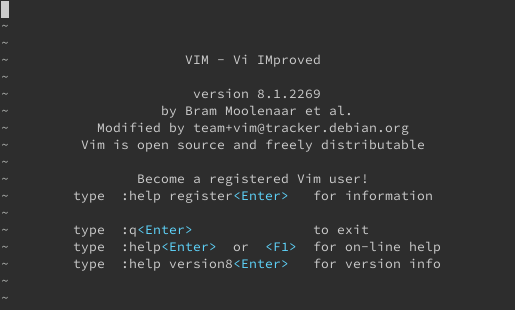
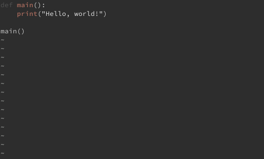
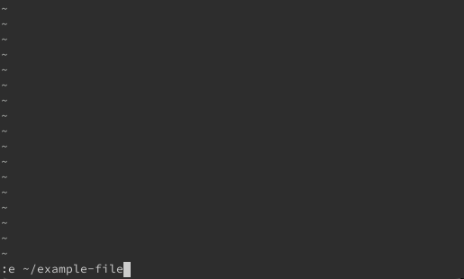

You may have heard of the text editor Vi, and probably also its relative Vim. But what is Vi, and why do many users on Unix systems continue to use it? Keep reading to learn more about Vi and what sets this text editor apart. You can also find some help getting started using Vi.

## What Is Vi?

Vi is a visual text editor included by default on Unix operating systems. It is a character-based screen editor that is easy to access and use even without a GUI or over an SSH connection.

One of Vi's major draws is its ubiquity and accessibility. You do not need to have a desktop environment to use it, and it is already installed. So, whatever Unix environment you find yourself working in, you can be assured that you can use Vi on it right off the bat.

But perhaps even more important for Vi's popularity is its reputation for a highly efficient command system. As an editor, Vi has the goal of giving its user a robust editing experience without ever having to leave the keyboard's home row. With a dedicated command mode, Vi utilizes the full keyboard for tasks like navigating a file, manipulating text, and searching and replacing phrases.

This gives Vi a high learning curve. Switching modes and finding the right commands for your needs takes practice. But many users claim that Vi's ability to improve their text-editing efficiency makes the learning well worth the wait.

Little shows how appreciated Vi's key bindings are than their availability in other editors. From editors like Emacs to Atom, you can find highly popular extensions dedicated to replicating the Vi command system.

Historically, Vi was designed as a visual mode for the Ex line editor. The name "Vi" comes from the Ex command used to enter that mode, `visual`, which could be executed using the shorthand `vi`.

### What Is Vim?

You may also have heard of Vim and be wondering what the differences are. Vim is short for "**V**i **im**proved." It takes Vi as its base and adds numerous features to update the experience. Among those features are mouse support, a visual selection mode, and support for graphical versions.

For many Linux systems, Vim is actually the version of Vi that you get pre-installed. However, the fundamental experience remains largely the same between Vi and Vim. This guide focuses on operations available in both Vi and Vim. That way, your knowledge applies whatever version your environment gives you.

## Opening Vi

To start, you can open up Vi with the `vi` command. Generally, if your system uses Vim, this command still links to it, but you could also use the `vim` command in that case.

You can, alternatively, open Vi with a file using this command, replacing `example-file` with the path to the desired file:

    vi example-file

## Vi Modes

Vi has two distinct modes, which you need to get familiar with using to get the most out of Vi.

- *Normal* mode: Also known as "command mode," this is where you enter most of your Vi commands. Keys pressed in this mode are evaluated as commands, not as text entered on the file you are editing. For instance, pressing the **j** key in this mode moves the cursor down a line, and pressing the **k** key moves it up a line.

    You can enter this mode by pressing the **Esc** key while you are in *Insert* mode.

- *Insert* mode: This mode is your main place for entering text. Here, your key presses tends to operate how you would expect in a text editor — pressing the **j** key types a "j" character at the cursor.

    You can enter this mode by pressing the **i** key while you are in *Normal* mode. Alternatively, you can press the **o** key to insert a new line and immediately enter *Insert* mode on it.

Vim adds an additional mode — *Visual* mode. From *Normal* mode, you can enter *Visual* mode by pressing one of the following:
- **v**, to start visual selection under the cursor
- **V**, to start a line-by-line visual selection
- **Ctrl** and **v**, to start a columnar visual selection under the cursor

If you have mouse support enabled, you can also temporarily enter this mode by selecting text using the mouse.

## Common Vi Commands

What follows are explanations and examples of several of the most commonly used Vi commands. All of these commands are input from *Normal* mode, and all of them are case sensitive.

Several of the commands begin with a colon, as in `:e`. Typing a colon in *Normal* mode takes you to the command input line, which you can see at the bottom of the screen. There, you can type and edit commands as you would on a command line. Pressing **Enter** is required to complete and execute these commands. This same behavior also applies for commands beginning with the `/` character.

### Opening and Writing to Files

To open a file, use the `:e` command followed by the file path. Here is an example that opens the `example-file` in the current user's home directory:

    :e ~/example-file

You can then write changes to a file using the `:w` command. If you want to specify the file to save as, add the path after the command, as in:

    :w ~/example-file

### Moving Around

You can navigate text in Vi using the arrow keys, whether in *Normal* or *Insert* mode. However, you can also use the following keys in *Normal* mode. Some of these just help keep you from leaving the home row for the arrow keys, but most add handy and efficient navigation shortcuts:
- `j` moves the cursor down a line
- `k` moves the cursor up a line
- `h` moves the cursor one character to the left
- `l` moves the cursor one character to the right
- `w` moves the cursor forward by one word
- `b` moves the cursor backward by one word
- `$` moves the cursor to the end of the line
- `0` moves the cursor to the beginning of the line
- `^` moves the cursor to the first non-space character in the line
- `gg` moves the cursor to the first line in the file
- `G` moves the cursor to the last line in the file

### Undoing and Redoing

To undo a change, use the `u` command. You can then redo a change with `:redo`.

### Copying, Cutting, and Pasting

The base Vi command for copying is `y`. Here, you can see a variety of ways you can quickly define what text gets copied:
- `yw` copies from the cursor to the end of the word
- `4yw` copies from the cursor to the end of the fourth word after
- `y^` copies from the cursor to the first non-space character in the line
- `y$` copies from the cursor to the last character in the line
- `yy` copies the current line
- `4yy` copies four lines from the current line down

The same motif applies for cutting. Vi's base command for cutting is `d`. So, you can take all of the above commands for copying text and replace `y` with `d` to cut the text instead. In Vi, the cut commands are also generally what you use for deleting text.

When you want to paste text that you have copied or cut, Vi provides two commands to define where the text goes:
- `p` pastes after the cursor
- `P` pastes before the cursor

### Searching and Replacing

Vi uses the `/` command to start a search. Once you enter that command, you can begin entering your search text. Here is an example, looking for the word `TODO`. Note that Vi's searches are case sensitive:

    /TODO

Pressing **Enter** once you have entered your search text takes you to the first instance of that text in the file. You can then navigate the search results using the `n` command to go forward and the `N` command to go backward.

To search for and replace text in a file, you use the `:s/` command followed by the search text, the replacement text, and `g` to make the search and replace global. Here is an example that replaces all instances of `TODO` in the file with `DONE`:

    :s/TODO/DONE/g

Vi has its own syntax for search and replace that can quickly make sophisticated changes in a file. You can learn more about Vi's search patterns and flags through its own help menu. In Vi, use one of the following commands to get more information on searching and replacing text:

    :help /
    :help :s
    :help pattern
    :help :s_flags

You can also reference the Vim Fandom [page on search and replace](https://vim.fandom.com/wiki/Search_and_replace) for additional explanations and examples.

### Exiting

To exit Vi, use the `:q` command. Additionally, if you want to save your changes and exit in a single command, you can combine the individual commands, as in: `:wq`.

You can also exit Vi without saving your changes. To do so, add a `!` to the end of the quit command: `:q!`.

## Conclusion

If you are looking to take your Vi usage to the next level, you may want to check out Vim and NeoVim. Each of these evolves from Vi and is highly customizable through numerous configuration options and community-developed plug-ins. Check out our guides [Introduction to Vim Customization](/docs/guides/introduction-to-vim-customization/) and [How to Install NeoVim and Plugins with vim-plug](/docs/guides/how-to-install-neovim-and-plugins-with-vim-plug/), where you can find an introduction to each editor and help getting started using them.

Many of the customization options described in the first of these guides apply to Vi as well. The guide can be a great start if you want to fine tune your Vi experience.
