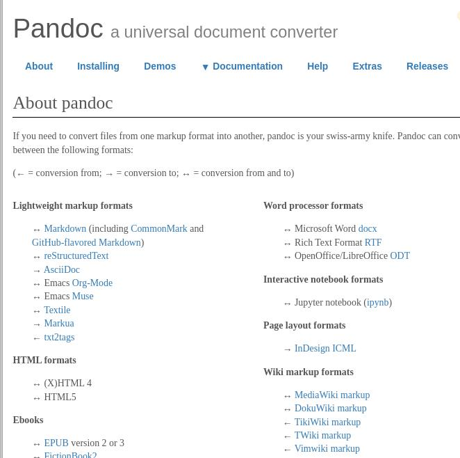
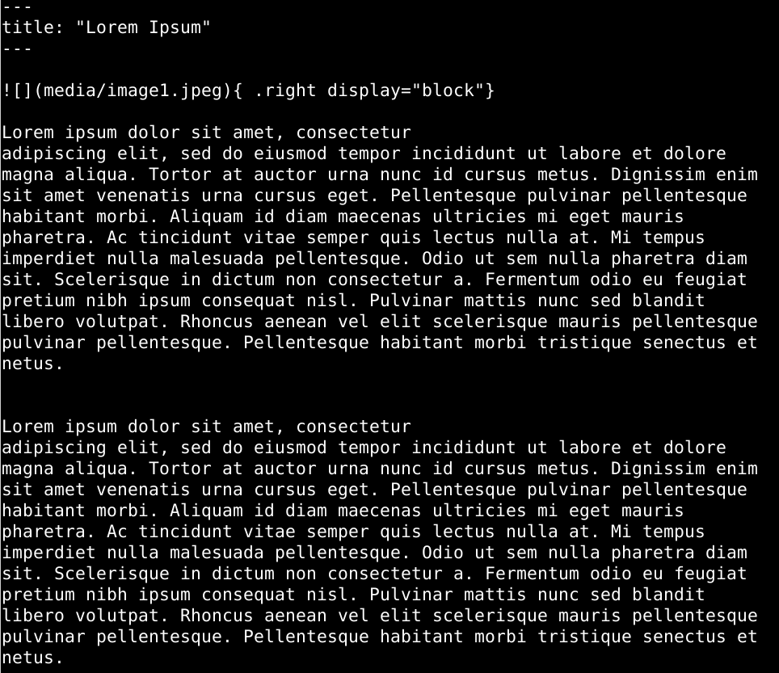
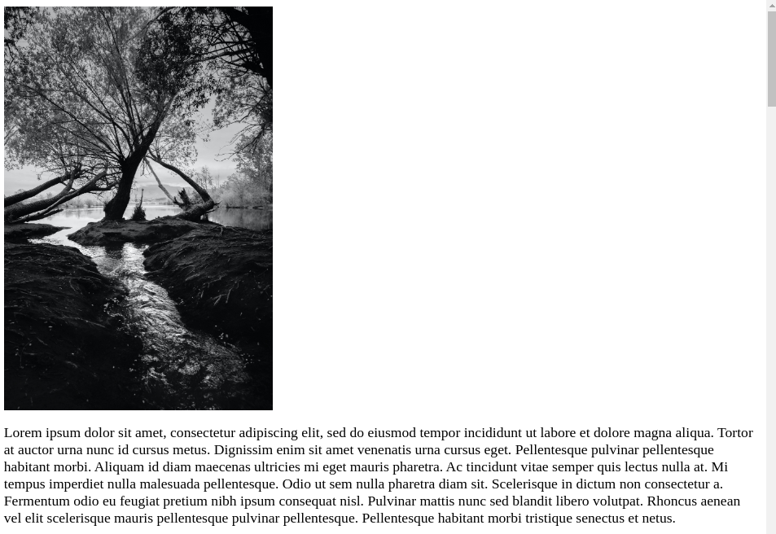
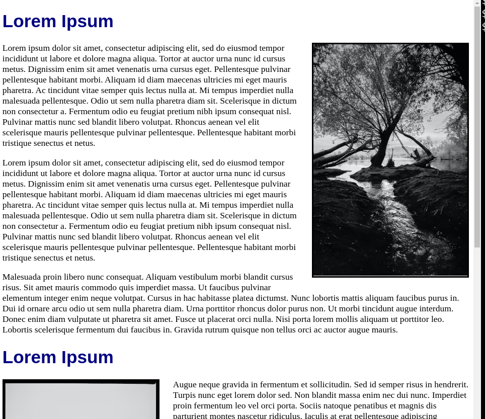

Pandoc is a command-line tool that converts between multiple
document formats. Pandoc converts between a wide array 
of document formats. This includes conversions 
between most lightweight markup languages like Markdown,
reStructuredText, HTML, EPUB, other 
word processor formats, and more. 
The full list can be viewed on the 
Pandoc website. [Pandoc.org]().

In this guide, learn how to install and use Pandoc.
In addition to basic usage,
this guide demonstrates how to use Pandoc 
to create a webpage from a Markdown file.
Pandoc works in a wide variety of use-cases that are not covered in this guide.

The [Pandoc.org]() website is the source for documentation
on Pandoc. The Pandoc website contains information on 
many other conversions and uses.

## Before You Begin

1. A basic understanding of command-line environments is required to run Pandoc.
2. A familiarity with Markdown is recommended, see [Markdown Guide]() for details.
3. A basic understanding of CSS and HTML is recommended.
4. Replace all instances of `input` with the name of your input file.
5. Replace all instances of `output` with the name of your output file.
6. Replace all instances of `custom.css` with the name of your CSS style sheet.

## Install Pandoc

Pandoc is available for most operating systems.
This includes Windows, Linux, MacOS and more.
You can also download the Pandoc installer from the [installation](Pandoc Installation page). 
Pandoc is through several package managers without the need for additional repositories

Debian/Ubuntu

    sudo apt install pandoc

macOS (Homebrew)

    sudo brew install pandoc

Windows (chocolatey)

    choco install pandoc

## Pandoc Basics 

Use the `pandoc` command to run Pandoc.
To convert a file with `pandoc`,
you also need to provide at least an input file and a target format
to convert a document to a new format.
In this example, see the structure of the `pandoc` command.
This command that converts a Markdown file, input.md, to HTML.
`-t` specifies the output format.

    pandoc -t html input.md

The final output is displayed in the terminal.
Instead of printing the results in the terminal,
use `-o` to create a new file or overwrite an existing one.

    pandoc -o output.html input.md

This command creates a new file called output.html.
If a file with that name already exists,
Pandoc will replace that file with its output. 

# Choose Input and Output Formats

If not explicitly stated, Pandoc assumes the input and output formats
based on a file's extension.
In this example, Pandoc assumes that input.md 
is a Markdown file based on the ".md" ending.

    pandoc -o output.html input.md

It also knows to create an HTML file
because output.html ends with .html.

In some cases, it is recommended to explicitly 
state include the input and output formats in the command.
The following example uses `-f markdown`
to explicitly tell Pandoc to convert *from* Markdown
and `-t html` *to* HTML.

    pandoc -f markdown -t html -o output.html input.md

This is important for formats that share the same extensions.
For example, unless specified otherwise,
Pandoc assumes all files ending in .html are in HTML5. 
To get HTML 4, you must specify the format with -f and -t. 



    To see a lit of all availabe input and output formats,
    run:

       `pandoc --list-input-formats`
       `pandoc --list-output-format`.



Similar issues arise for Markdown.
Markdown comes in several "flavors".
For example,If input.md were written in Github-flavored markdown (`-f gfm`)
instead of the default Pandoc's Markdown, 
the following command would facilitate the best conversion.

    pandoc -f gfm -t html -o output.html input.md

Use the most specific form for best results.

## Create an HTML webpage from a Markdown document

While Pandoc can convert any number of formats into a large array of 
other formats. Pandoc is frequently used to convert from Markdown to HTML.
In the last section, input.md was converted to HTML with a basic Pandoc command.

{ width="650px"}

However, Pandoc only creates an HTML fragment by default.

{ width="650px" }

Pandoc has additional options that support the creation of fully-styled webpage
with addition of two options:

- Use `-c` or `--css` to link CSS file.
- Use `-s` or `--standalone` to add the required HTML header and footer data for a standalone webpage.

The following example converts the example input.md file to output.html,
links output.html with `-c custom.css`, and adds required HTML header and footer data with `-s`.

    pandoc -f markdown -t html -o output.html -c custom.css -s input.md

The result is a fully styled webpage:

{ width="650px" }

### Apply CSS through Command-line Options

As previously demonstrated, you can apply CSS 
to HTML outputs with the `-c` (`--css`)  option.
Use this option to link one or more styles sheets to your output.

    pandoc -f markdown -t html -o output.html -c custom.css -s input.md

Pandoc is not limited to local style sheets.
Use a URL to specify a style sheet hosted elsewhere.
CSS files:

    pandoc -f markdown -t html -o output.html -c 'https://www.exammple.com/css/style.css' input.md

### Apply CSS through Metadata

You can also link CSS by specifying it in the file's metadata.
Pandoc accepts metadata variables through a Pandoc title block
or a YAML metadata block. This block be included at the beginning 
of the Markdown file or stored in a separate .yml file.

In this example, the line `css: "custom.css"` is added
to the YAML metadata block between the `---`s at the beginning of input.md: 

    ---
    title: "Lorem Ipsum"
    css: "custom.css"
    ---

A YAML metadata can also be kept as a separate file and passed
to Pandoc through the command-line tool.

    pandoc -f markdown -t html -o output.html input.md custom.yaml

Multiple input files are combined into the single output.html file.

### Add a Table of Contents to the Webpage

Pandoc can also create a table of contents based on 
heading structure:

    pandoc input.md -o output.html -s --toc

You can specify which levels to include in the structure with `--toc-depth=`

    pandoc input.md -o output.html -s --toc --toc-depth="1"

[pandoc.org]: https://pandoc/org
[Markdown Guide]: https://www.markdownguide.org/getting-started/ 
[installation]: https://pandoc.org/installing.html

## Before You Begin

1.  If you have not already done so, create a Linode account and Compute Instance. See our [Getting Started with Linode](/docs/guides/getting-started/) and [Creating a Compute Instance](/docs/guides/creating-a-compute-instance/) guides.

1.  Follow our [Setting Up and Securing a Compute Instance](/docs/guides/set-up-and-secure/) guide to update your system. You may also wish to set the timezone, configure your hostname, create a limited user account, and harden SSH access.


This guide is written for a non-root user. Commands that require elevated privileges are prefixed with `sudo`. If you’re not familiar with the `sudo` command, see the [Users and Groups](/docs/tools-reference/linux-users-and-groups/) guide.



The steps in this guide require root privileges. Be sure to run the steps below as `root` or with the `sudo` prefix. For more information on privileges, see our [Users and Groups](/docs/tools-reference/linux-users-and-groups/) guide.



Highlight warnings that could adversely affect a user's system with the Caution style.



192.0.2.0/24      # Sample IP addresses
198.51.100.0/24
203.0.113.0/24

