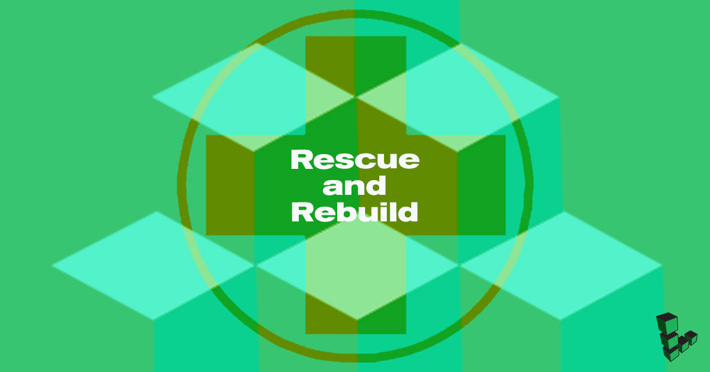

Even the best system administrators may need to deal with unplanned events in the operation of their services. The Linode Cloud Manager provides recovery tools that you can leverage if you are having trouble connecting to one of the Linodes, and this guide describes those tools:

-  You can boot your Linode into [*Rescue Mode*](#rescuing) to perform system recovery tasks and transfer data off the disks, if necessary.

- If you are unable to resolve the system issues, you can [*rebuild*](#rebuilding) the Linode from a backup or start over with a fresh Linux distribution.

## Troubleshooting Resources

While this guide outlines the recovery tools that Linode makes available to you, it does not provide a specific troubleshooting strategy. Our other guides offer a logical progression of steps you can follow when troubleshooting different symptoms:

-   If you are not able to establish basic network connections with the Linode, then Linode recommends that you review the [Troubleshooting Basic Connection Issues](/docs/guides/troubleshooting-basic-connection-issues/) guide.

-   If you can ping the Linode but can't access SSH, follow the [Troubleshooting SSH](/docs/guides/troubleshooting-ssh/) guide.

-   If you can access SSH but are experiencing an outage with a web server or other service, review [Troubleshooting Web Servers, Databases, and Other Services](/docs/guides/troubleshooting-web-servers-databases-other-services/).

-   For an overview of all these issues and answers to other questions, check out the [Troubleshooting Overview](/docs/guides/troubleshooting-overview/) guide.

## Rescuing

*Rescue Mode* is a safe environment for performing many system recovery and disk management tasks. Rescue Mode is based on the [Finnix recovery distribution](http://www.finnix.org/), a self-contained and bootable Linux distribution that you can mount the disks of Linode from. You can also use Rescue Mode for tasks other than disaster recovery, such as:

- Formatting disks to use different filesystems

- Copying data between disks

- Downloading files from a disk through SSH and SFTP

### Rescue Mode Overview

To access Rescue Mode, you need to [reboot your Linode](#booting-into-rescue-mode) from the Linode Cloud Manager and then connect through [Lish](#connecting-to-a-linode-running-in-rescue-mode) or [SSH](#starting-ssh). After you connect, you can [perform a check on your filesystem](#performing-a-file-system-check) if you suspect that it is corrupted. If you need access to a certain software package to troubleshoot the system, you can [install it](#installing-packages).

The disks are mounted by default, so [mount](#mounting-disks) them in order to access the files. After you mount the primary filesystem, you can [*change root*](#change-root) to have Rescue Mode emulate normal Linux distribution.

### Booting into Rescue Mode

To boot a Linode into Rescue Mode:

1.  Log in to the [Linode Cloud Manager](https://cloud.linode.com).

1.  Click the **Linodes** link in the sidebar:

    

1.  Click on the **more options ellipsis** next to the Linode that will be booted into rescue mode, and click on the **Rescue** option to open the Rescue form:

    

1.  In the **Rescue** form, select the disks you want to mount:

    

    
Make a note of which devices the disks are assigned to (e.g. `/dev/sda`, `/dev/sdb`, etc). For example, in the screenshot shown above, the Ubuntu disk corresponds to `/dev/sda`. These assignments are where you can mount the disks from inside Rescue Mode.


1.  If you need to assign additional disks to be accessible inside Rescue Mode, click the **Add Disk** option:

    

    
You can assign up to 7 disks in Rescue Mode. `/dev/sdh` is always assigned to the Finnix recovery distribution.

For best results, you should review the names that your Linode's disks are using in your Linode's [configuration profile](/docs/guides/linode-configuration-profiles/) (`/dev/sda`, `/dev/sdb`, etc.) and match those names to the device assignments you specify in the Rescue form before starting Rescue Mode.

Matching these names will be especially important if you need to [change root](#change-root) within Rescue Mode. The chroot will be able to read your Linode's `/etc/fstab` file, which defines where and how your Linode mounts its disks when booting up, to automatically apply the correct mount options and mount directories to your disks.

A mismatch in the names of your disks between your Linode's configuration profile and your Rescue Mode environment may cause the chroot to mount these disks in the wrong location or with the wrong mount options. As a result, it is important to ensure that these names match.


1.  Click the **Reboot into Rescue Mode** button. The Linode reboots into Rescue Mode, and the progress percentage appears. When the Linode appears as **Running** again, proceed to [Connecting to a Linode Running in Rescue Mode](#connecting-to-a-linode-running-in-rescue-mode).

    

### Connecting to a Linode Running in Rescue Mode

By default, Rescue Mode's Finnix environment does not accept SSH connections. To access the Linode when it's running in Rescue Mode, connect to it through the *Lish* console.


It is possible to enable SSH for Rescue Mode by manually starting the SSH daemon. Using SSH can provide a better experience and allows you to copy files off of the server. Review the [Starting SSH](#starting-ssh) section for instructions. You need to use Lish at least once in order to start SSH.


To connect with Lish:

1.  From the Linode's detail page, click the **Launch Console** button:

    

1.  A new window appears which displays your Lish console, a `Welcome to Finnix!` message, and a root prompt:

    

Review the [Using the Lish Console](/docs/guides/using-the-lish-console/) guide for further explanation of the Lish console and alternative methods for accessing it, including [from your computer's terminal application](/docs/guides/using-the-lish-console/#through-ssh-using-a-terminal).

### Starting SSH

The Finnix recovery distribution does not automatically start an SSH server, but you can enable one manually. This is useful if your Linode does not  boot and you need to copy files off of the disks. You can also copy entire disks over SSH. To start SSH:

1.  Open the [Lish console](#connecting-to-a-linode-running-in-rescue-mode) for your Linode.

1.  Set the `root` password for the Finnix rescue environment by entering the following command:

        passwd

    
This root password is separate from the root password of the disk that you normally boot from. Setting the root password for Finnix does not affect the root account of the distribution.


1.  Enter the new password for the `root` user.

1.  Start the SSH server:

        service ssh start

You can now connect to the server as root with the SSH client on a local computer. You can also access mounted disks with an SFTP client:

- For instructions on connecting with an SFTP client, see the [File Transfer reference manuals](/docs/tools-reference/file-transfer/).

- For instructions on copying an entire disk over SSH, see [Copy a Disk Over SSH](/docs/guides/copying-a-disk-image-over-ssh/).

### Performing a File System Check

You can use the `e2fsck` system utility (short for "ext file system check") to check the consistency of filesystems and repair any damage detected on ext file systems. If you suspect that the Linode's filesystem is corrupted, run `e2fsck` to check for and repair any damage on most disks:

1.  Enter the `df -h` command to verify that the primary disks are not currently mounted:

        root@0:~# df -h
        Filesystem      Size  Used Avail Use% Mounted on
        udev            1.9G     0  1.9G   0% /dev
        tmpfs           395M  516K  394M   1% /run
        /dev/sr0        503M  503M     0 100% /run/live/medium
        /dev/loop0      426M  426M     0 100% /run/live/rootfs/filesystem.squashfs
        tmpfs           2.0G   17M  2.0G   1% /run/live/overlay
        overlay         2.0G   17M  2.0G   1% /
        tmpfs           2.0G     0  2.0G   0% /dev/shm
        tmpfs           5.0M     0  5.0M   0% /run/lock
        tmpfs           4.0M     0  4.0M   0% /sys/fs/cgroup
        tmpfs           2.0G     0  2.0G   0% /tmp
        tmpfs           395M     0  395M   0% /run/user/0pressed_root
        unionfs         739M 1016K  738M   1% /
        devtmpfs         10M     0   10M   0% /dev

    The primary disks should not appear in the list. In the [example screenshot](cloud-manager-rescue-form-dev-sda-highlighted.png) from the [Booting into Rescue Mode](#booting-into-rescue-mode) section, the Ubuntu 18.04 disk is assigned to `/dev/sda`. Because this device does not appear in the example output from `df -h`, run a filesystem check on it.

     
Never run `e2fsck` on a mounted disk. Do not continue unless you're sure that the target disk is unmounted.


1.  Run `e2fsck` by entering the following command, replacing `/dev/sda` with the location of the disk you want to check and repair:

        e2fsck -f /dev/sda

1.  If no problems are detected, `e2fsck` displays the tests it performed:

        root@0:~# e2fsck -f /dev/sda
        e2fsck 1.45.6 (20-Mar-2020)
        Pass 1: Checking inodes, blocks, and sizes
        Pass 2: Checking directory structure
        Pass 3: Checking directory connectivity
        Pass 4: Checking reference counts
        Pass 5: Checking group summary information
        /dev/sda: 44611/2564096 files (0.1% non-contiguous), 602550/10240000 blocks

1.  If `e2fsck` determines that there is a problem with the filesystem, it prompts you to fix problems as they are found during each test:

        root@0:~# e2fsck -f /dev/sda
        e2fsck 1.45.6 (20-Mar-2020)
        ext2fs_open2: Bad magic number in super-block
        e2fsck: Superblock invalid, trying backup blocks...
        Resize inode not valid.  Recreate<y>?

    Press **enter** to automatically attempt to fix the problems.

    After the filesystem check completes, any problems detected should be fixed. Try rebooting the Linode from the Cloud Manager. If `e2fsck` fixed the issues, the Linode should boot normally.

### Installing Packages

The Finnix recovery distribution is based on Debian, so you can use the [`apt` package management system](/docs/tools-reference/linux-package-management/#debian-and-ubuntu-package-management) to install additional software packages in the temporary rescue environment. For example, you could install and run the `nmon` utility by using the following commands:

    apt update
    apt install nmon
    nmon

The software packages you install is available as long as the Linode is running in Rescue Mode.

### Mounting Disks


 Before you mount the disk check the location of the root partition in the `/etc/fstab` file and update it accordingly. In the following example `/dev/sda` is the location of the disk. For more information, see the [Update your fstab](/docs/guides/install-a-custom-distribution-on-a-linode/#update-your-fstab) guide.
 

By default, your disks are not mounted when your Linode boots into Rescue Mode. However, you can manually mount a disk under Rescue Mode to perform system recovery and maintenance tasks.

These instructions mount the `/dev/sda` disk. If you are mounting a different disk, replace `sda` with the name of your disk throughout these instructions.

1.  Create a new directory for your disk:

        mkdir -p /media/sda

1.  Mount the disk to make its contents available at the `/media/sda` directory:

        mount -o barrier=0 /dev/sda /media/sda

1.  View the contents of the disk to confirm you can access them:

        ls /media/sda

    You can now read and write to files on the mounted disk.


You can unmount your disk by running the `unmount` command. You may want to unmount your disk to  [run a file system check](#performing-a-file-system-check), for example.

The `umount` command requires you to specify the device you want to unmount. You may specify this device in one of two ways:

- Specify the device name itself:

      umount /dev/sda

- Specify the mount directory:

      umount /media/sda



If you would like to mount or unmount additional disks on your system, repeat these instructions with the appropriate substitutions.

### Change Root

*Changing root* is the process of changing your working root directory. When you change root (abbreviated as *chroot*) to your Linode root disk, you are able to run commands as though you are logged into that system.

Chroot allows you to change user passwords, remove/install packages, and do other system maintenance and recovery tasks in your Linode's normal Linux environment.

1.  Create a new directory for your disk:

        mkdir -p /media/sda

1.  Before you use chroot, mount the root disk :

        mount -o exec,barrier=0 /dev/sda /media/sda

    
If you mounted your disk without using the `exec` option prior to reviewing this section, include the `remount` option in your `mount` command:

    mount -o remount,exec,barrier=0 /dev/sda /media/sda


1.  To create the chroot, you need to mount the temporary filesystems:

        cd /media/sda
        mount -t proc proc proc/
        mount -t sysfs sys sys/
        mount -o bind /dev dev/
        mount -t devpts pts dev/pts/

1.  Chroot to your disk:

        chroot /media/sda /bin/bash

1.  Your Linode may expect its other disks to be mounted in specific directories during its regular operations. These disks and their expected directories are defined in the `/etc/fstab` file. In order for these directories to be accessible within the chroot, you need to mount them from within the chroot. For example, if your Linode defines `/dev/sdc` in its `/etc/fstab`, you can the following command to mount it:

        mount /dev/sdc

    
This `mount` command only specifies a disk name without specifying a mount point. This causes `mount` to use the `/etc/fstab` file in the chroot to determine the mount point and apply the correct mount options.

As a result, this command depends on you having made these disks available to your Rescue Mode environment under the same names that they use in your Linode's [configuration profile](/docs/guides/linode-configuration-profiles/).

If these names do not match, mounting your disks using only a device name will either fail completely, mount them at the wrong directory, and/or apply the wrong mount options to them.

The easiest way to alleviate this problem is by [starting a new Rescue Mode session from Cloud Manager](#booting-into-rescue-mode) which properly matches these disk names between your Rescue Mode environment and your Linode's configuration profile.


1.  To exit the chroot and get back to Finnix type "exit" :

        exit

## Rebuilding

If you can't rescue and resolve issues on an existing disk, you likely need to rebuild the Linode. Rebuilding the Linode is the process of starting over with a set of known-good disks that you can boot from. There are a few different ways you can do this:

-   If you are subscribed to the [Linode Backup Service](https://www.linode.com/backups), you can [restore from an existing backup](#restoring-from-a-linode-backup) and return the Linode to a previous state.

-   If you aren't subscribed to the Linode Backup Service, you can copy files off an existing disk and then [use the Rebuild feature](#use-the-rebuild-feature) of the Cloud Manager to erase everything and start over again from scratch.

-   If you have a backup system other than the Linode Backup Service in place, you can [rebuild your Linode](#use-the-rebuild-feature) and then restore the data from that backup service. The methods for restoring data varies by the kind of backup system that you use.


Did an unauthorized intruder gain access to your Linode? Since it is virtually impossible to determine the full scope of an attacker's reach into a compromised system, you should never continue using a compromised Linode.

Linode recommends that you follow the instructions in [Recovering from a System Compromise](/docs/guides/recovering-from-a-system-compromise/). You need to create a new Linode, copy your existing data from the old Linode to the new one, and then swap IP addresses.


### Restoring from a Linode Backup

If you previously enabled the [Linode Backup Service](https://www.linode.com/backups), you may be able to restore one of the backups to the Linode. Review the [Restoring from a Backup](/docs/products/storage/backups/#restore-from-a-backup) section (specifically, the [Restore to an Existing Linode](/docs/products/storage/backups/#restore-to-an-existing-linode) section) of the [The Linode Backup Service](/docs/products/storage/backups/) guide for instructions.

If you created backups with an application other than the Linode Backup Service, review the application's instructions to restore a backup to the Linode.

### Use the Rebuild Feature

The Linode Cloud Manager provides a *Rebuild* feature performs the following two actions:

1.  The current disks are removed.

1.  A new set of disks is provisioned from one of the Cloud Manager's built-in Linux images, or from one of the [saved images](/docs/products/tools/images/).

    
If you use the Rebuild feature, the data from the disks that are deleted are not retrievable. You may [back up your data manually](/docs/security/backups/backing-up-your-data) or [create a snapshot through Linode's Backup Service](/docs/platform/disk-images/linode-backup-service#take-a-manual-snapshot) to preserve data before using the Rebuild feature.

If you'd like to deploy a new Linux distribution without erasing the existing disks, follow the instructions in the [Creating a Disk](/docs/guides/disks-and-storage/#creating-a-disk) guide. This is a better option if you need to create a new distribution, but also need to save the existing data.

The Linode needs to have some amount of unallocated disk space in order to provision a new distribution. If the Linode does not have enough unallocated space, you can [shrink your existing disks](/docs/guides/disks-and-storage/#resizing-a-disk) to free up space or [resize your Linode](/docs/guides/resizing-a-linode/) to a higher resource tier.
    

    If you need to copy files from your existing disk to another location before rebuilding, you can [start SSH](#starting-ssh) under Rescue Mode and then use an SFTP client to copy files to your computer.

To use the Rebuild feature:

1.  If you need to copy files from existing disk to another location before rebuilding, you can [start SSH](#starting-ssh) under Rescue Mode and then use an [SFTP client](/docs/tools-reference/file-transfer/) to copy files to your computer, another server, or somewhere else.

1.  Log in to the [Linode Cloud Manager](https://cloud.linode.com).

1.  Click on the **Linodes** link in the sidebar:

    

1.  Click on the **more options ellipsis** next to the Linode that will be rebuilt, and click on the Rebuild option to open the Rebuild form:

    

1.  Complete the Rebuild form. Select an image or StackScript to deploy and enter a root password. Optionally, select one or more SSH keys (if you have not added any SSH Keys via the Cloud Manager, this option does not appear).

1.  Click on **Rebuild** button after completing the form:

    

1.  The Linode may take several minutes to complete the rebuild process. Select the Linode that is being rebuilt and select the `Activity Feed` tab to monitor rebuild progress and confirm that the rebuild has been completed:

    
