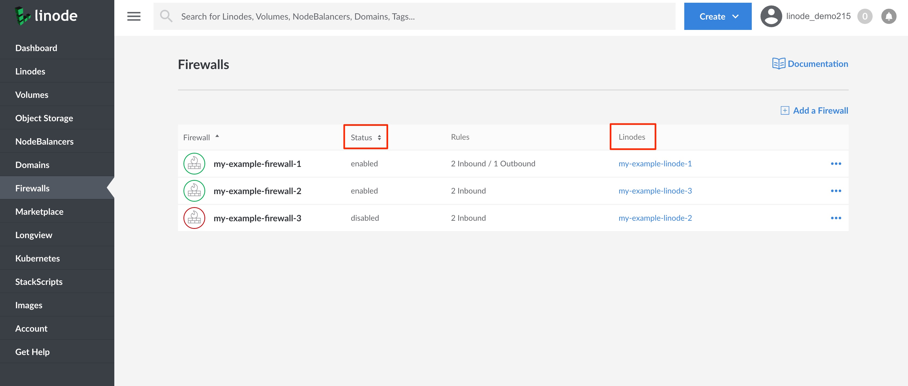

This guide presents troubleshooting strategies for Linodes that may be unresponsive due to issues caused by a firewall. This could be a [Linode Cloud Firewall](/docs/products/networking/cloud-firewall/get-started/), which is applied on the network level or a firewall, like Uncomplicated Firewall (UFW), that is applied on the Linode level.

In many cases, you might suspect a firewall issue if some of your services are inaccessible, or in situations of limited access. A firewall issue may also be suspected if you have connectivity problems not long after implementing new firewall rules.

While a firewall is often responsible for cases of limited access, these issues may also potentially be caused by a wide array of other issues such as limited network access, resource contention like throttled memory, or internal processes or services that are not configured to communicate over the internet.

## The Linode Shell (Lish)

[*Lish*](/docs/guides/using-the-lish-console/) is a shell that provides access to your Linode's serial console and is a helpful tool for diagnosing and troubleshooting connection problems. Lish does not establish a network connection to your Linode, so you can use it when your networking is down or your Linode's Secure Shell (SSH) port is inaccessible. If you find yourself locked out of SSH, you can use Lish to perform much of the troubleshooting for basic connection issues.

To learn about Lish in more detail, and for instructions on how to connect to your Linode via Lish, review the [Using the Lish Console](/docs/guides/using-the-lish-console/) guide. A fast and simple way to access Lish is by [the your web browser option](/docs/guides/using-the-lish-console/#through-the-cloud-manager-weblish).


When using Lish, you can log into your Linode with the `root` user, even if `root` user login is disabled by your Linode's SSH configuration file.


## Is my Linode Powered On?

Ensure that your Linode is powered on and running.

1. Log into the [Cloud Manager](https://cloud.linode.com/) and navigate to the Linode Listing page.

1. Verify your Linode's displayed status to determine if it's running or offline. If it your Linode is offline, use the **more options** ellipsis to power it on.

## Is there a Cloud Firewall Assigned to my Linode?

If you are using Linode Cloud Firewall, then it's important to verify which Cloud Firewall(s) your Linode is assigned to and to check its Cloud Firewall rules.

1.  Log into [Cloud Manager](https://cloud.linode.com) and select **Firewalls** from the menu.

1.  The Firewalls Listing page displays a list of all the Cloud Firewalls currently active on your account.

1.  Find the Linode you are troubleshooting under the **Linodes** column to determine which Cloud Firewall(s) is assigned to it.

1.  Next, check the **Status** column to confirm that the Cloud Firewalls is **Enabled**.

    

1.  If the Cloud Firewall is enabled, check what rules are currently active by clicking on the label of the Cloud Firewall. This takes you to your Cloud Firewall's **Rules** page.

1.  The **Rules** page displays a list of all of the Cloud Firewall rules that are filtering your Linode's network traffic. If you notice that the Cloud Firewall rules do not allow traffic for a specific service's port that you are troubleshooting, you may consider [updating your rule's](/docs/products/networking/cloud-firewall/get-started/#edit-cloud-firewall-rules) to allow connections for that port.

    
If the Cloud Firewall is assigned to more than one Linode, modifying the Cloud Firewall rules affect all Linodes assigned to the Cloud Firewall.
    

    
Cloud Firewall rules are applied on the network level and are not detectable internally on Linodes. For more information on setting up and using Cloud Firewall, see the guide [A Tutorial for Adding and Configuring Linode Cloud Firewalls](/docs/platform/cloud-firewall/getting-started-with-cloud-firewall).


## Checking Firewall Rules with UFW

*Uncomplicated Firewall (UFW)* is an [iptables](/docs/guides/control-network-traffic-with-iptables/) frontend that is designed for ease-of-use. See our [How to Configure a Firewall with UFW](/docs/guides/configure-firewall-with-ufw/) for a deeper dive into UFW.


All steps in this section are performed on your Linode. [Connect to your Linode via SSH](/docs/guides/set-up-and-secure/#connect-to-the-instance) or using [Lish](/docs/guides/using-the-lish-console/).


To see all active UFW rules, enter the following command:

    sudo ufw status

Your output will be similar to the following:


Status: active

To                         Action      From
--                         ------      ----
22                         ALLOW       Anywhere
80/tcp                     ALLOW       Anywhere
443                        ALLOW       Anywhere
22 (v6)                    ALLOW       Anywhere (v6)
80/tcp (v6)                ALLOW       Anywhere (v6)
443 (v6)                   ALLOW       Anywhere (v6)


If the status is active, the rules listed are all in place and may be blocking one of your services. To remove any individual firewall rule, use the following syntax:

    sudo ufw delete <Action> <To>

For example, to delete the Allow rule for port 80 from the example output above, enter the following command:

    sudo ufw delete allow 80

## Checking Firewall Rules with FirewallD

*firewalld* is the default firewall tool for CentOS and Fedora. While also a frontend for iptables like UFW, firewalld has some unique features, like configuration sets and zones.


All steps in this section are performed on your Linode. [Connect to your Linode via SSH](/docs/guides/set-up-and-secure/#connect-to-the-instance) or using [Lish](/docs/guides/using-the-lish-console/).


To list all configurations for all zones, enter the following command:

    sudo firewall-cmd --list-all-zones

If you find a rule that doesn't belong, you can safely remove it using the following syntax:

    sudo firewall-cmd --zone=zonename --remove-service=servicename --permanent

For more information on understanding firewalld, see our [Introduction to FirewallD on CentOS](/docs/guides/introduction-to-firewalld-on-centos/) guide.

## Checking Firewall Rules with iptables

*iptables* is the most common firewall used on Linux systems. If you're unsure of which firewall software you may be using, chances are that it's iptables in some form.


All steps in this section are performed on your Linode. [Connect to your Linode via SSH](/docs/guides/set-up-and-secure/#connect-to-the-instance) or using [Lish](/docs/guides/using-the-lish-console/).


To list all active firewall rules using iptables, enter the following commands for IPv4 and IPv6 respectfully:

    sudo iptables -L -nv

    sudo ip6tables -L -nv

Removing rules uses the same syntax to add rules, with the addition of the `-D` or `--delete` option. For example, use the following commands to delete a rule that drops connections to port 110, on the eth0 interface, towards the IPv4 address 198.51.100.0:

    iptables --delete INPUT -j DROP -p tcp --destination-port 110 -i eth0 -d 198.51.100.0

or

    iptables -D INPUT -j DROP -p tcp --destination-port 110 -i eth0 -d 198.51.100.0

For more information on reading and interpreting iptables rules see our guide on iptables, [A Tutorial for Controlling Network Traffic with iptables](/docs/guides/control-network-traffic-with-iptables/#basic-iptables-rulesets-for-ipv4-and-ipv6)
