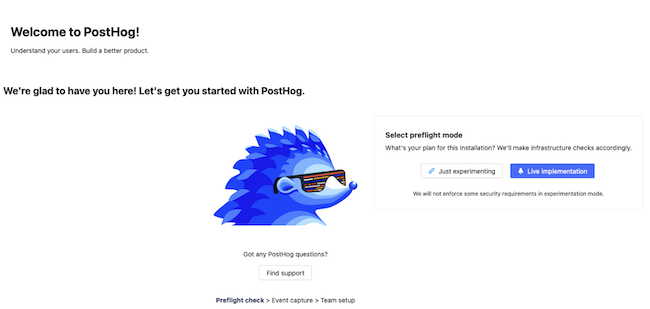

[*PostHog*](https://posthog.com/) is an open-source product analytics tool that can replace Google Analytics. PostHog can be self-hosted on the [Linode Kubernetes Engine](/docs/products/compute/kubernetes/) (LKE) and installed using `kubectl` and [*Helm 3*](https://helm.sh/), a client that acts as a package manager for Kubernetes. PostHog offers a wide variety of features including funnel analysis, product use trends, and session recordings. This guide introduces PostHog and explains how to install and configure it on the LKE.

## An Introduction to PostHog

PostHog is a product analytics tool to help software and business teams understand how their products are used. It allows for the automation of many common tasks, including event monitoring, [funnel analysis](https://en.wikipedia.org/wiki/Funnel_analysis), and user data collection.

The list below includes some of Posthog's most popular analytics features. A full list of features can be seen in the [PostHog User Guide](https://posthog.com/docs/user-guides).

- Events can be tracked automatically, including clicks, taps, page views, reactions, and form completions. Certain events can be defined retroactively, going back to when PostHog was installed.
- Users can customize their dashboard to monitor metrics including sign-ups, purchases, and conversions.
- Data can be ingested at scale from multiple sources, with modules available to parse and filter data.
- Data can be pipelined to data storage applications such as Google's BigQuery, Amazon's Redshift, and Snowflake.
- Users have unrestricted access to their data through the PostHog API. Direct SQL access is also permitted.
- PostHog emphasizes data privacy and is compliance-friendly, which reduces dependencies on third-party tools.
- Data can be grouped by customer type, traffic source, platform, and other variables.
- PostHog supports funnel analysis. Funnel analysis is a method for understanding the steps required to reach the desired outcome and the number of users who reach each step. PostHog allows users to create a bucket for users who drop out at any point in the funnel.
- PostHog supports paths and cohorts. Paths illustrate how a user navigated the site, while cohorts group users by common traits.
- It is possible to see a timeline for each user's activity and record a user session.
- Other advanced features include heat maps, revenue tracking, and retention tracking.

PostHog can be hosted in the cloud or self-hosted. After deploying a cluster using the Linode Kubernetes Engine (LKE), PostHog can be installed using the official Helm chart. The PostHog chart installs all required components, including a web server and load balancer, and implements all necessary settings. PostHog makes it easy to develop custom analytics solutions. Users can create their own plug-ins, use third-party extensions, and safely roll out features using feature flags. The free open-source version of PostHog is limited to one project, while Scale and Enterprise versions add more advanced features and customer support.

The PostHog website has an extensive [collection of tutorials](https://posthog.com/docs/tutorials) explaining how to roll out new features and visualize and analyze user behavior.

### The Advantages of Self-Hosting an Analytics Platform

Even though Google Analytics is the industry standard, there are many advantages to a self-hosted product analytics tool like PostHog. Some of these advantages include the following:

- With a self-hosted solution, users own all the data. If they use Google Analytics, they do not own the data. Google owns the data. This results in a loss of privacy for both businesses and their customers.
- A self-hosted solution can be easily customized to fit business requirements. Users can develop and deploy the solutions they want.
- Google's policies can be restrictive in certain cases. The data from Google Analytics could be missing or incomplete due to privacy laws. A self-hosted solution has more flexibility. For instance, it might be able to evade ad blockers.
- PostHog is an open-source product and is available in a free, self-hosted version. It can be scaled according to the available storage and processing power. While there is a free version of Google Analytics, it has limited features and only partially samples web traffic. The premium version, which might be necessary for large or high-volume websites, is very expensive.

## Before You Begin

1. Familiarize yourself with our [Getting Started with Linode](/docs/guides/getting-started/) guide and complete the steps for setting your Linode's hostname and timezone.

1. This guide uses `sudo` wherever possible. Complete the sections of our [How to Secure Your Server](/docs/guides/set-up-and-secure/) guide to create a standard user account, harden SSH access, and remove unnecessary network services.

1. Update your system:

        sudo apt-get update && sudo apt-get upgrade


The steps in this guide are written for non-root users. Commands that require elevated privileges are prefixed with `sudo`. If you are not familiar with the `sudo` command, see our [Linux Users and Groups](/docs/guides/linux-users-and-groups/) guide.


## Install PostHog on the Linode Kubernetes Engine

When the cluster is deployed and ready, PostHog can be installed using Helm and a Helm chart in `yaml` format. Helm greatly simplifies the installation process compared to traditional installation methods. Only a few commands are required.

### Prerequisites to Install PostHog

To install PostHog on an LKE cluster, the system must satisfy the following requirements:

- A Kubernetes cluster must have been created using LKE. To create a cluster, see the [Linode Kubernetes Engine Documentation](/docs/products/compute/kubernetes/). PostHog requires Kubernetes release 1.19 or newer.
- The cluster must have enough resources to run PostHog. A minimum of four virtual CPUs and 8GB of memory is recommended.
- The `kubectl` client must be installed. `kubectl` allows users to install applications on a cluster, view and manage Kubernetes resources, and access log files. `kubectl` can be installed using a package manager or directly downloaded using the `curl` command. More information about `kubectl` is also available in the [Linode Kubernetes Engine Documentation](/docs/products/compute/kubernetes/) or on the [Kubernetes installation page](https://kubernetes.io/docs/tasks/tools/#install-kubectl-on-linux).
- PostHog works best in conjunction with a registered domain name. This name is used to set up PostHog and access the dashboard. For instructions on how to register a domain name and configure the associated DNS records, see the [Linode guide to DNS Configuration](/docs/guides/common-dns-configurations/).
- To install PostHog, first install [Helm v3](https://helm.sh/), which can be used to download, install, and upgrade applications on a cluster. Applications are installed using a Helm chart, which describes the essential resources using a common format. See the [Linode guide to Helm](/docs/guides/how-to-install-apps-on-kubernetes-with-helm-3/) for more information about Helm.

To install Helm, follow the steps below:

1. Download the Helm installation script using `curl`.

        curl https://raw.githubusercontent.com/helm/helm/master/scripts/get-helm-3 > get_helm.sh

1. Change the permissions on the script.

        chmod 700 get_helm.sh

1. Run the installation script. To install Helm into `/usr/local/bin`, provide the `sudo` password.

        ./get_helm.sh

    
Downloading https://get.helm.sh/helm-v3.7.1-linux-amd64.tar.gz
Verifying checksum... Done.
Preparing to install helm into /usr/local/bin
helm installed into /usr/local/bin/helm
    

1. View the release information to confirm Helm is installed correctly.

        helm version

    
version.BuildInfo{Version:"v3.7.1", GitCommit:"1d11fcb5d3f3bf00dbe6fe31b8412839a96b3dc4", GitTreeState:"clean", GoVersion:"go1.16.9"}
    


Do not configure any web servers or load balancers on the Kubernetes cluster before installing PostHog. They might conflict with the new components and cause the installation to fail.


### Create the Values File and Install PostHog

Helm requires a `values.yaml` file to install an application. This file contains a list of system attributes that are relevant to the application. Helm expects the `yaml` file to present the values in a certain format.

The PostHog-specific `.yaml` file must have the following information:

- **cloud:** This is the name of the cloud provider, which is `linode`.
- **ingress/hostname:** This is the domain name of the site. The PostHog installation is accessed through the domain name. In this example, the domain name is `example.com`.
- **ingress/nginx/enabled:** Set this value to `true` to enable the webserver and load balancer.
- **cert-manager/enabled:** Set this field to `true` to enable HTTPS.
- **kafka/persistence/size:** This should be set to `20Gi`.

To install PostHog, follow these steps.

1. Create a file named `values.yaml`.

1. Add the following information to the file and save it. Replace `example.com` with the actual domain name.

    
cloud: linode
ingress:
  hostname: example.com
  nginx:
    enabled: true
cert-manager:
  enabled: true
kafka:
  persistence:
    size: 20Gi
    

1. Add the PostHog repository to Helm.

        helm repo add posthog https://posthog.github.io/charts-clickhouse/

    
"posthog" has been added to your repositories
    

1. Update the repositories.

        helm repo update

    
Hang tight while we grab the latest from your chart repositories...
...Successfully got an update from the "posthog" chart repository
Update Complete. ⎈Happy Helming!⎈
    

1. Use the `helm install` command to install and enable PostHog on the cluster.

        helm install -f values.yaml --timeout 20m --create-namespace --namespace posthog posthog posthog/posthog

    
NAME: posthog
LAST DEPLOYED: Mon Nov  1 11:10:55 2021
NAMESPACE: posthog
STATUS: deployed
REVISION: 1
TEST SUITE: None
NOTES:
** Please be patient while the chart is being deployed **

To access your PostHog site from outside the cluster follow the steps below:

1. Your application will be hosted at https://example.com

    
1. It takes Helm and Kubernetes a few minutes to configure all of the PostHog components. The application is not ready until all components are configured.

1. Verify the Kubernetes pods are all active. When all pods display a `Running` status, the installation is ready and complete.

        kubectl get pods -n posthog

    
NAME                                                READY   STATUS    RESTARTS   AGE
chi-posthog-posthog-0-0-0                           1/1     Running   0          163m
clickhouse-operator-6b54d6b5fb-2sqfp                2/2     Running   0          164m
posthog-beat-7cfb9bbb59-zn8d7                       1/1     Running   0          73s
posthog-cert-manager-69f4ff7b57-ggbqf               1/1     Running   0          164m
posthog-cert-manager-cainjector-6d95d46d98-vhtdf    1/1     Running   2          164m
posthog-cert-manager-webhook-6469c785fc-2s66n       1/1     Running   0          164m
posthog-events-85b7c599c4-gzdtx                     0/1     Running   0          55s
posthog-ingress-nginx-controller-648b4f45ff-949zs   1/1     Running   0          164m
posthog-pgbouncer-bd7c9d4dd-nmvbx                   1/1     Running   0          6m14s
posthog-plugins-7b87c94866-cw9lh                    1/1     Running   0          54s
posthog-posthog-kafka-0                             1/1     Running   1          164m
posthog-posthog-postgresql-0                        1/1     Running   0          164m
posthog-posthog-redis-master-0                      1/1     Running   0          164m
posthog-posthog-zookeeper-0                         1/1     Running   0          164m
posthog-web-5f7f69cd98-4h4dn                        0/1     Running   0          52s
posthog-worker-67b8f67b89-xfz8s                     1/1     Running   0          51s
    

1. As an additional check, use the `helm status` command to verify PostHog is `deployed`.

        helm status posthog -n posthog

    
NAME: posthog
LAST DEPLOYED: Mon Nov  1 11:10:55 2021
NAMESPACE: posthog
STATUS: deployed
REVISION: 1
TEST SUITE: None
    

### Obtain the IP Address of the Node Balancer

The IP address of the node balancer is required to set the DNS records correctly. This is the address PostHog uses to send and receive network traffic. To determine the address of the node balancer, use the command below. The address is shown in the `EXTERNAL-IP` field.

    kubectl get svc --namespace posthog posthog-ingress-nginx-controller


NAME                               TYPE           CLUSTER-IP     EXTERNAL-IP    PORT(S)                      AGE
posthog-ingress-nginx-controller   LoadBalancer   ww.xx.yy.zz    ww.xx.yy.zz    80:32387/TCP,443:31676/TCP   6m43s


### Set Up DNS

The IP address from the previous section is used to configure the domain's DNS record. Instructions on how to configure a DNS record can be found in the [Linode guide to DNS Configuration](/docs/guides/common-dns-configurations/). If a different IP address has already been configured for the domain, it can be edited as follows.

1. Find the domain using the Linode Dashboard. Select **Domains** and then select the domain name.

1. Edit the IP address of the domain record. Click the three dots to the right of the record and select **Edit**.

1. Change the IP address in the **IP Address** field to the new address.

A new DNS entry usually takes some time to propagate to the various DNS servers. While this can take up to two days, it usually only takes between three to six hours. You cannot access PostHog until the record has finished propagating.


The IP address of the load balancer cannot be used to access PostHog. The cluster is configured to restrict access to PostHog to the domain name.


## Access PostHog

To access the PostHog website, enter the domain name in the browser. PostHog redirects any requests to the URL: `https://yourdomainname.com/preflight`. This address displays the PostHog "preflight" page.

You can now add account information and configure the site. If you are new to PostHog, select the **Just experimenting** option. This mode allows the site to be configured while avoiding stringent configuration and security requirements.

For information on how to configure and use PostHog, see the [PostHog User Guide](https://posthog.com/docs/user-guides) and [PostHog Integration Overview](https://posthog.com/docs/integrate).

### Troubleshoot PostHog Access Issues

If you cannot access the PostHog "preflight" page, there are certain steps to take to debug the installation. The list below includes some areas to investigate when troubleshooting.

- Ensure there are no pre-existing web servers or load balancers configured on the cluster. If necessary, use the `kubectl delete` command to remove them.
- Verify that the information in the `values.yaml` file is correct.
- Make sure that the correct IP address is configured for the domain DNS record.
- Ensure the DNS record has fully propagated. Use the `nslookup example.com` command to verify the address for the domain. Substitute the actual domain name in place of `example.com`.
- Sometimes HTTPS is not set up correctly. In this case, the problem can potentially be fixed by disabling and re-enabling HTTPS.

To disable and re-enable HTTPS, follow the steps below:

1. Back up the `values.yaml` file to `backup_values.yaml`. Edit the `values.yaml` file and revise the configuration to allow HTTP access as illustrated below. Save the file when all changes are complete.

    
cloud: linode
ingress:
  hostname: example.com
  nginx:
    enabled: true
    redirectToTLS: false
  letsencrypt: false
web:
  secureCookies: false
kafka:
  persistence:
    size: 20Gi
    

1. Upgrade the PostHog installation using the `helm upgrade` command.

        helm upgrade -f values.yaml --timeout 20m --create-namespace --namespace posthog posthog posthog/posthog

    
Release "posthog" has been upgraded. Happy Helming!
NAME: posthog
LAST DEPLOYED: Mon Nov  1 13:54:06 2021
NAMESPACE: posthog
STATUS: deployed
REVISION: 3
TEST SUITE: None
NOTES:
** Please be patient while the chart is being deployed **

To access your PostHog site from outside the cluster follow the steps below:

1. Your application will be hosted at https://example.com.

    

1. Attempt to access PostHog again using the domain name. If the HTTPS configuration was the problem, the PostHog "preflight" page should now appear. The page displays a warning that PostHog is not correctly secured.

1. Re-enable HTTPS to restore the encryption settings. Copy the backup file back to `values.yaml`.

        cp backup_values.yaml values.yaml

1. Upgrade PostHog again to reconfigure HTTPS.

        helm upgrade -f values.yaml --timeout 20m --create-namespace --namespace posthog posthog posthog/posthog

1. Try accessing the PostHog landing page again using the domain name. The page should now appear without any warnings.

## A Summary of PostHog

PostHog is an open-source product analytics tool that allows users to self-host and control their software and their customer data. It is considered a viable alternative to Google Analytics, which has many restrictions and limitations. It is straightforward to install PostHog on a Linode LKE cluster using the Helm client.

PostHog enables powerful tools such as funnel analysis, event tracking, and session recordings. An intuitive dashboard helps users track their data and design new features. For more information on PostHog, see the [PostHog website](https://posthog.com/).