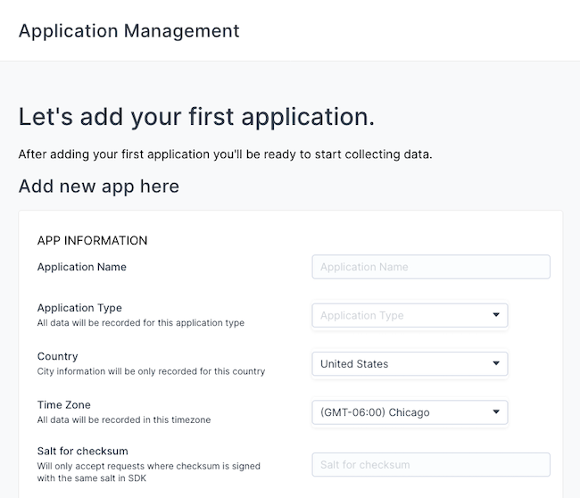

The Countly analytics platform offers an alternative to the ubiquitous Google Analytics. In contrast to Google Analytics, Countly puts more emphasis on privacy and an all-in-one feature set. Countly's data gathering offers compliance with GDPR, HIPAA, and other privacy standards. Meanwhile, it provides not just visitor analytics, but also a wider range of analytics related to marketing.

This tutorial shows you how to start using Countly for your analytics needs. Countly Community Edition is free to use, and it runs in a self-hosted server environment. Through this guide, you can learn all the steps needed to get your own Countly server up and tracking activity on your applications.

## Before You Begin

1.  Familiarize yourself with our [Getting Started with Linode](/docs/products/platform/get-started/) guide, and complete the steps for setting your Linode's hostname and timezone.

1.  This guide uses `sudo` wherever possible. Complete the sections of our [How to Secure Your Server](/docs/products/compute/compute-instances/guides/set-up-and-secure/) guide to create a standard user account, harden SSH access, and remove unnecessary network services.

1.  Update your system.

    ```command {title="Debian / Ubuntu"}
    sudo apt update && sudo apt upgrade
    ```

    ```command {title="AlmaLinux / CentOS Stream / Fedora / Rocky Linux"}
    sudo dnf upgrade
    ```


This guide is written for a non-root user. Commands that require elevated privileges are prefixed with `sudo`. If you’re not familiar with the `sudo` command, see the [Users and Groups](/docs/guides/linux-users-and-groups/) guide.


## How to Install Countly Analytics Community Edition

Countly provides several installation options, which you can review in the link provided at the end of this tutorial.

This guide covers the method using the Countly server GitHub repository, which tends to be straightforward as a result of the included installation script.

These instructions are intended for and have been tested on Ubuntu systems. However, they may work on Debian and CentOS as well. Just be sure to make the necessary substitutions where relevant.

After the steps on installing Countly, the tutorial includes instructions for two optional setup features to potentially improve your Countly experience: DNS and SSL.

### Installing Countly from the GitHub Repository

These steps show you how to download the Git repository for Countly and use the included installation script. It also includes the steps you need to configure NGINX to properly serve your Countly interface.

1.  Clone the Countly server GitHub repository. This example clones the repository to the current user's home directory. The process creates a new subdirectory there, `countly-server`:

    ```command
    git clone https://github.com/Countly/countly-server.git
    ```

1.  The included installation script requires root access for the installation, so you should first switch to a superuser shell:

    ```command
    sudo su -
    ```

1.  Navigate to the subdirectory where the script is held:

    ```command
    cd /home/example-user/countly-server/bin
    ```

1.  Run the installation script:

    ```command
    bash countly.install.sh
    ```

1.  Afterward, you can exit the superuser shell:

    ```command
    exit
    ```

1.  Replace the `default` NGINX configuration with Countly's [own NGINX configuration file](https://github.com/Countly/countly-server/blob/master/bin/config/nginx.server.conf). Typically, you can find the `default` configuration file at `/etc/nginx/sites-available/default`. However, if this is a brand-new installation, you may have to create it:

    ```command
    sudo mkdir /etc/nginx/sites-available
    sudo nano /etc/nginx/sites-available/default
    ```

    Additionally, you should extend the `server_name` property with the domain name and/or remote IP address you intend to use to access your Countly server. For instance, this example adds the domain name `example.com` and the remote IP address `192.0.2.0`:

    ```file {title="/etc/nginx/sites-available/default" lang="nginx" hl_lines="4"}
    server {
        listen   80;
        listen   [::]:80 ipv6only=on;
        server_name  localhost example.com 192.0.2.0;

        access_log  off;
    ```

1.  Open the HTTP port (`80`) on your server's firewall. Typically, the firewalls on Ubuntu and Debian systems are managed with UFW. Using it, you can open the HTTP port with:

    ```command
    sudo ufw allow http
    sudo ufw reload
    ```

1.  Access your Countly instance by navigating to one of the enabled addresses (that is, the `server_name` values from the NGINX configuration) in your web browser.

### (Optional) Assign Countly DNS

Countly does not require you to use DNS for your server. However, doing so can make your Countly instance easier to access. It gives you access to your instance via a custom domain name, rather than just the remote IP address.

To set up DNS on a Linode server, refer to our collection of guides on the [Linode DNS manager](/docs/products/networking/dns-manager/guides/). The process there is straightforward and can have your server running through a DNS quickly.

### (Optional) Assigning Countly TLS via Let’s Encrypt

Another optional step is giving your Countly instance an SSL certificate. Doing so secures and encrypts its traffic using HTTPS.

The following steps show you how to apply an SSL certificate to Countly using [Certbot](https://certbot.eff.org). Certbot allows you to easily request and download free certificates from [Let's Encrypt](https://letsencrypt.org).

1.  Open the HTTPS port on your system's firewall. Like above, you can do this using UFW with the HTTPS keyword:

    ```command
    sudo ufw allow https
    sudo ufw reload
    ```

1.  Update the [Snap](https://snapcraft.io/docs/getting-started) app store. Snap provides application bundles that work across major Linux distributions and comes by default with all Ubuntu releases since 16.04:

    ```command
    sudo snap install core && sudo snap refresh core
    ```

1.  Remove any existing Certbot installation:

    ```command
    sudo apt remove certbot
    ```

1.  Install Certbot:

    ```command
    sudo snap install --classic certbot
    ```

1.  Download a certificate using standalone verification. When prompted, accept the terms of service, enter an email address for notifications about certificate renewals, and enter your Countly server's domain name:

    ```command
    sudo certbot certonly --standalone
    ```

    Certbot outputs the location from which the new certificate can be accessed. Typically, it stores the required files in the following directory, replacing `example.com` with your domain name: `/etc/letsencrypt/live/example.com`.

1.  Access the NGINX site configuration again, and make the following modifications to the beginning of the file.

    These changes first add a server for port `80` that redirects traffic to the HTTPS URL. Then they alter the existing server definition to listen on port `443`, the HTTPS port, and to use the SSL certificate created above.

    Replace `example.com` in this example with your server's domain name:

    ```file {title="/etc/nginx/sites-available/default" lang="nginx" hl_lines="10,12,13"}
    server {
            listen      80;
            server_name localhost;
            access_log  off;
            rewrite ^ https://$host$request_uri? permanent;
    }

    server {
            listen   443 ssl;
            server_name  localhost example.com;

            ssl_certificate      /etc/letsencrypt/live/example.com/fullchain.pem;
            ssl_certificate_key  /etc/letsencrypt/live/example.com/privkey.pem;

            access_log  off;
    ```

Now, when navigating to your Countly instance in a web browser, you should be redirected to the HTTPS URL.

You can optionally also add your server's remote IP address to the NGINX configuration above and use that as well to access Countly. However, you may receive a certificate warning in your browser. This is because the certificate was issued for your server's domain name, not its IP address.

## How to Navigate the Countly Server Interface

With your Countly instance up and running, you are ready to start setting it up for use. This next series of sections first covers the initial setup within the Countly interface.

Further on, you can set up a Countly client SDK within your application and see it begin gathering your analytics.

### Creating an Administrator Account and Logging In

When you first access Countly, you're presented with a form to register an administrator user for your instance. Keep track of the login information you create here, as this user has administrative control within the Countly instance.

[](countly-registration.png)

Accessing the address for your Countly instance after this initial setup directs you to the login page.

[](countly-login.png)

### Adding an Application to the Countly Dashboard

Submitting the form to create your administrator account automatically directs you to a page to create a new application for your Countly instance. Here, you are entering the name and some descriptive information about the application.

[](countly-create-app.png)

You can also reach this form later from the Countly dashboard by selecting the **Add new app** button in the upper right.

Later, you can use the application key created by this process to associate a Countly client with your Countly server instance. Doing so then directs analytics from that client to Countly's dashboard for the application.

### Accessing the Countly Dashboard

From there you are directed to your Countly dashboard, the same page you land on for subsequent logins.

[](countly-dashboard.png)

Here, you can survey the analytics generated by your Countly instance and manage all aspects of your Countly operations. You can navigate between and create application entries, and within each, view analytics for visits, events, and more.

## How to Set Up the Countly Client for Analytics

To have Countly start collecting analytics, you need to embed one of its client SDKs within your application.

Countly has numerous client SDKs available to fit your needs, from web and mobile apps, to the desktop, server, and beyond. You can see Countly's [full list of client SDKs](https://support.count.ly/hc/en-us/articles/360037236571-Downloading-and-Installing-SDKs) for more information on how to download and operate each.

To get you started and to demonstrate, the rest of this section walks you through an example using Countly's web application SDK. It covers how you can make the client available for your web application and even includes example code to embed it. If you don't have a web application ready, follow our guide [Deploy a Static Site using Hugo and Object Storage](/docs/guides/host-static-site-object-storage/).

1.  Ensure your web application's client-side code includes or has access to the Countly web SDK file. This can be done multiple ways:

    -   The SDK is automatically hosted alongside your Countly instance. Assuming your server's domain is `example.com`, you can find the SDK at: `example.com/sdk/web/countly.min.js`.

    -   Additionally, the file itself can be found among the Countly server files. Starting from the base Countly server directory, the SDK file is located at `frontend/express/public/sdk/web/countly.min.js`. You can then copy that file to an appropriate directory with your web application's client-side code.

    -   The Countly SDK can also be accessed from Countly's own CDN, which you can learn about in their [web SDK documentation](https://github.com/Countly/countly-sdk-web#3-use-a-cdn-content-delivery-network).

    For these steps, it is assumed that you made a copy of the `countly.min.js` file from Countly's server files. The steps also assume that you have added that file to a `lib` subdirectory within your client-side code.

1.  Add the following code to the `head` section of one of your application's web pages.

    Replace `EXAMPLE_COUNTLY_APP_KEY` with the **App Key** found in your Countly instance. Likewise, replace `https://example.com` with your Countly server's URL or IP address (preceded by `http://`, or '`https://` if you set up SSL).

    ```file {title="index.html" lang="html" hl_lines="9,12"}
    <!-- [...] -->
    <script type='text/javascript'>

    // Initialize variables to be used by the Countly client.
    var Countly = Countly || {};
    Countly.q = Countly.q || [];

    // Provide the application key from the Countly dashboard.
    Countly.app_key = 'EXAMPLE_COUNTLY_APP_KEY';

    // Provide the URL for your Countly server instance.
    Countly.url = 'https://example.com';

    // These next two start pushing function calls to queue. Both
    // are recommended configurations.

    // Track sessions automatically.
    Countly.q.push(['track_sessions']);
    // Track web page views automatically.
    Countly.q.push(['track_pageview']);

    // Load the Countly script asynchronously.
    (function() {
        var cly = document.createElement('script'); cly.type = 'text/javascript';
        cly.async = true;

        // Replace the URL here with the location of your Countly client SDK file.
        cly.src = 'lib/countly.min.js';
        cly.onload = function(){Countly.init()};
        var s = document.getElementsByTagName('script')[0]; s.parentNode.insertBefore(cly, s);
    })();
    </script>
    <!-- [...] -->
    ```

    
Alternatively, you can have Countly automatically generate this code specifically for your applications. Click **Management** (the wrench icon) in the left-hand toolstrip, then **Applications**. Choose your application and scroll all the way down to the blue box titled "Need some help with SDK integration?". Click the **Web** button and you should be redirected to an address that starts with `code.count.ly/integration-web.html`. From here, choose where you want to retrieve the `countly.min.js` file and what features you want to use. When done, click **Generate code** for code that's custom-tailored for your application.


1.  Begin incorporating Countly event calls into your application. Here is an example of one such call, used for a button on the pages:

    ```file {title="index.html" lang="html" hl_lines="3-14,17-19"}
    <html>
    <head>
    <!-- [...] -->
    <script type='text/javascript'>
    function exampleButtonClicked(ob){
      Countly.q.push(['add_event',{
        key:"asyncButtonClick",
        segmentation: {
          "id": ob.id
        }
      }]);
    }
    </script>
    <!-- [...] -->
    </head>
    <body>
    <!-- [...] -->
    <input type="button" id="exampleButton" onclick="exampleButtonClicked(this)" value="Click This Button">
    <!-- [...] -->
    </body>
    </html>
    ```

Navigating to your web application should now generate page views in Countly. Activating an event, like clicking the button in the above example, similarly now shows in Countly.

[](countly-visitors.png)

[](countly-events.png)

## Conclusion

You are now ready to run your application's analytics with Countly. With your own Countly server set up and the client embedded, you can begin diving deeper into your Countly configuration. Take a look through the [Countly documentation](https://support.count.ly/hc/en-us) to learn all the possibilities and see more of what Countly is capable of.