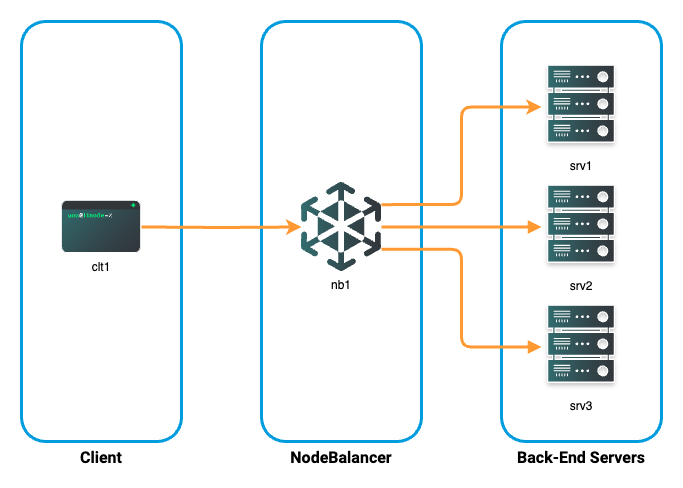
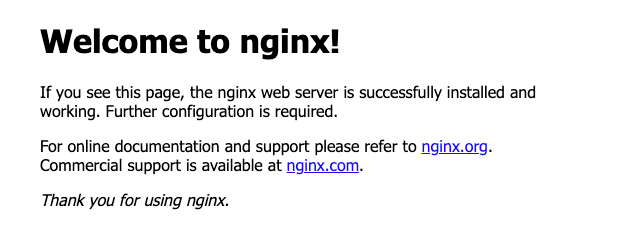
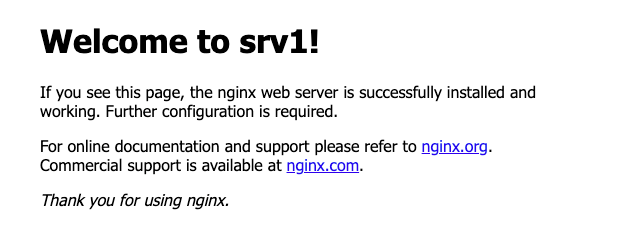
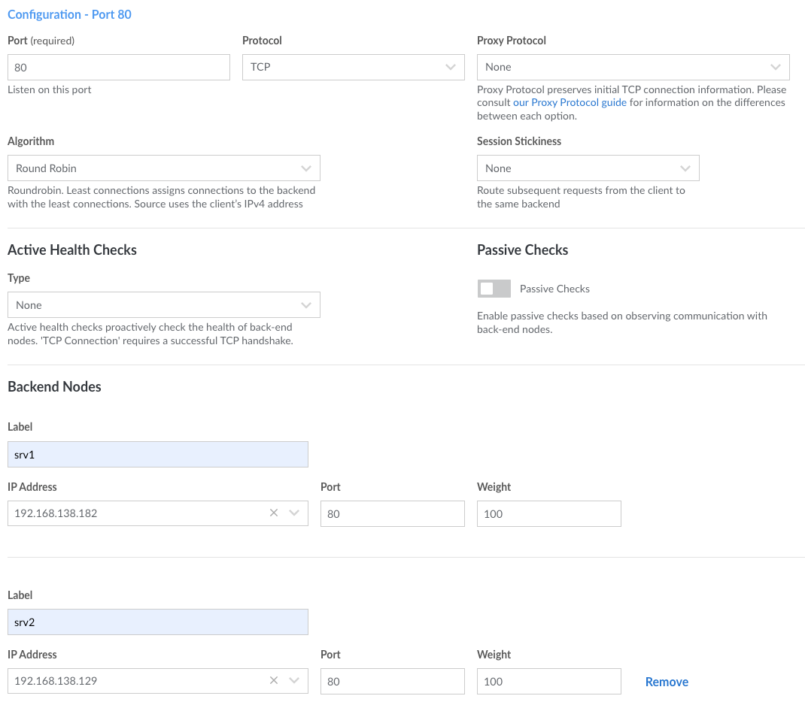
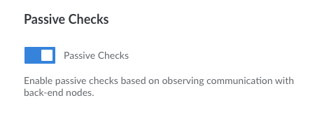

What if your cloud-based network could anticipate problems and automatically take corrective action? That’s the promise of *server health checks*, an integral feature of Akamai NodeBalancers. By continuously monitoring back-end servers, NodeBalancer health checks can take problematic nodes out of rotation. This boosts cloud network availability by ensuring client requests always reach live servers.

In this guide, discover the various types of passive and active health checks. Also learn how to configure each type of health check, along with how to test and verify for correct operation.

## Types of Health Checks

NodeBalancers support passive and active health checks. When a back-end server doesn’t respond to a health check, the NodeBalancer won’t forward requests to it until it starts responding again.

Passive checks simply monitor traffic between the NodeBalancer and back-end servers. With active health checking, you configure the NodeBalancer to send probes involving small amounts of traffic to check back-end server status. NodeBalancers offer three types of active health checks:

-   **TCP Connection**: Requires completion of a valid TCP three-way handshake to establish a connection.
-   **HTTP Status**: Requires a valid HTTP `2xx` or `3xx` response from a back-end server.
-   **HTTP Body**: Requires a match against a regular expression in the body of an HTTP response.

Akamai’s [Health Check guide](/docs/products/networking/nodebalancers/guides/configure/#health-checks) offers details on additional options.

## Before You Begin

1.  If you have not already done so, create a Linode account and Compute Instance. See our [Getting Started on the Linode Platform](/docs/products/platform/get-started/) and [Create a Compute Instance](/docs/products/compute/compute-instances/guides/create/) guides.

1.  Follow our [Setting Up and Securing a Compute Instance](/docs/products/compute/compute-instances/guides/set-up-and-secure/) guide to update your system. You may also wish to set the timezone, configure your hostname, create a limited user account, and harden SSH access.


The steps in this guide require root privileges. Be sure to run the steps below as `root` or with the `sudo` prefix. For more information on privileges, see our [Linux Users and Groups](/docs/guides/linux-users-and-groups/) guide.


## Deploy the Testbed

To set up a testbed and get started with NodeBalancer health checks, provision four Compute Instances and one NodeBalancer:

-   Three back-end server instances (`srv1`, `srv2`, and `srv3`) running the Nginx web server.
-   One client instance (`clt1`) to send requests via the NodeBalancer using [hey](https://github.com/rakyll/hey), an open source web traffic generator.
-   One NodeBalancer (`nb1`) to distribute requests among the back-end servers.

The figure below illustrates the testbed topology:



### Deploy Back-End Servers

Use the following settings to provision each of the three back-end server instances:

-   **Choose a Distribution**: This guide was written for **Ubuntu 24.04 LTS**, but is applicable to most other Debian-based Linux distributions.
-   **Region**: All servers must be in the same region.
-   **Linode Plan**: A **Shared CPU**, **Nanode 1 GB** Compute Instance is adequate for these tests.
-   **Details** : Enter `srv1`, `srv2`, and `srv3`, respectively, under **Linode Label** to name your server instances.
-   **Add-ons**: It’s mandatory to check the **Private IP** box as NodeBalancers only distribute client requests to back-end servers over private networks.

1.  Once your servers are up and running, log in to each using [SSH](/docs/guides/connect-to-server-over-ssh/) or [Lish](/docs/products/compute/compute-instances/guides/lish/) and install the Nginx web server:

    ```command {title="srv1, srv2, and srv3"}
    sudo apt install nginx
    ```

1.  Use any web browser to verify server reachability. The default Nginx web pages should be accessible at `http://`:

    

1.  Altering this message to be server-specific is useful later when you use HTTP Body checks. Login to each server instance and alter the welcome message to be server-specific:

    ```command {title="srv1"}
    cd /var/www/html
    sudo perl -pi -e 's/Welcome to nginx/Welcome to srv1/' index.nginx-debian.html
    ```

    ```command {title="srv2"}
    cd /var/www/html
    sudo perl -pi -e 's/Welcome to nginx/Welcome to srv2/' index.nginx-debian.html
    ```

    ```command {title="srv3"}
    cd /var/www/html
    sudo perl -pi -e 's/Welcome to nginx/Welcome to srv3/' index.nginx-debian.html
    ```

1.  Return to your web browser and refresh the welcome pages. You should see your changes:

    

Do not proceed until you can reach all three servers and see the updated homepage on each.

### Deploy Client

Create a fourth Compute Instance to serve as a client. This can be in the same region as the servers, but it’s not required. In this example, the client is called `clt1`.

After the client setup completes, install [hey](https://github.com/rakyll/hey), an open-source web traffic generator:

```command
sudo apt install hey
```

### Deploy NodeBalancer

With back-end servers and a client in place, it’s time to provision the final and most important part of the testbed: the NodeBalancer.

It’s best to configure load-balancing first, and then add health checks once that’s working. In this case, the NodeBalancer performs TCP load balancing on port `80` using a round-robin algorithm. Because HTTP runs on top of TCP, you can use either TCP or HTTP/S protocols to load-balance web traffic.

1.  To create the NodeBalancer, go to the Cloud Manager main menu and click on **NodeBalancers** in the left pane, then select **Create NodeBalancer** in the subsequent screen.

1.  You can leave most settings at their defaults on the Configuration page, but change at least these settings:

    -   **NodeBalancer Label**: In this example, name the NodeBalancer `nb1`.
    -   **Region**: Choose the same region as your back-end serve instances.
    -   **Protocol**: Use **TCP** for now, even though you’ll be generating HTTP traffic.
    -   **Session Stickiness**: Set to **None**. The default setting (**Table**) would send all subsequent requests from the same client to the same back-end server.
    -   **Passive Checks**: Disable these. You’ll enable, configure, and test passive checks in the next step.
    -   **Back-end Nodes**: Add all three of your back-end server instances. The **Label** setting should match the server labels, in this case `srv1`, `srv2`, and `srv3`.

    This figure shows a NodeBalancer setup screen after basic configuration:

    

1.  When done, click the **Create NodeBalancer** button to initialize the instance. Akamai’s [Create a NodeBalancer guide](https://www.linode.com/docs/products/networking/nodebalancers/guides/create/) has more details on load balancer setup.

#### Verify Load-Balancing

This section shows how to verify if load balancing works.

1.  Before running `hey` on your client, check the Nginx log file `/var/log/nginx/access.log` to determine the number of times back-end servers have returned the default homepage located at `/var/www/html/index.nginx-debian.html`. The `grep` command finds all instances of that filename, and piping the output to the `wc -l` command counts the number of instances.

    ```command {title="srv1, srv2, and srv3"}
    cd /var/log/nginx
    sudo grep index.nginx-debian.html access.log | wc -l
    ```

    ```output
    0
    ```

    ```output
    0
    ```

    ```output
    0
    ```

    These are your baseline counts. They may be zero on brand-new instances, but expect these values to increase as the server stays online. Your outputs may not necessarily match those shown in this guide.

1.  On the client machine, run `hey` to generate web traffic. This command sends 9,999 HTTP requests over 99 concurrent connections. Make sure to use the hostname or IP address of the NodeBalancer, and not that of any individual back-end server:

    ```command {title="clt1"}
    hey -c 99 -n 9999 http:///index.nginx-debian.html
    ```

    A successful command run returns a message like this:

    ```output
    Status code distribution:
      [200]	9999 responses
    ```

1.  Now rerun the `wc` command on each back-end server:

    ```command {title="srv1, srv2, and srv3"}
    cd /var/log/nginx
    sudo grep index.nginx-debian.html access.log | wc -l
    ```

    ```output
    3333
    ```

    ```output
    3333
    ```

    ```output
    3333
    ```

    Note the differences in line counts between this run and the previous one. The NodeBalancer distributed roughly the same number of requests to `srv1`, `srv2`, and `srv3`, with each server respectively logging `3,333`, `3,333`, and `3,333` requests. Now that you’ve verified that load balancing is working as intended, it's time to enable health checks.

## Passive Health Checks

A passive health check doesn’t generate any traffic, but instead monitors traffic between the NodeBalancer and back-end servers. This is the simplest method of monitoring server health.

1.  To use passive checks, return to the NodeBalancers section of the Akamai Cloud Manager.

1.  Select the `nb1` NodeBalancer, switch to the **Configurations** tab, and open the **Port 80** configuration.

1.  Enable the **Passive Check** switch:

    

1.  Click **Save** to commit this change.

### Verify Health Checks

1.  Test passive health checking by stopping the Nginx service on one of the back-end servers (e.g. `srv1`):

    ```command {title="srv1"}
    sudo systemctl stop nginx
    ```

1.  Return to the client and run the `hey` generator again:

    ```command {title="clt1"}
    hey -c 99 -n 9999 http:///index.nginx-debian.html
    ```

1.  Once it completes, compare the `access.log` file lengths on the two remaining web servers:

    ```command {title="srv1, srv2, and srv3"}
    cd /var/log/nginx
    sudo grep index.nginx-debian.html access.log | wc -l
    ```

    ```output
    3333
    ```

    ```output
    8282
    ```

    ```output
    8383
    ```

    Taking one of back-end servers offline should result in the NodeBalancer sending roughly 5,000 HTTP requests to each of the two remaining servers. Without passive checks enabled, the NodeBalancer would have continued to forward requests to all three back-end servers, with about 3,333 of them failing.

1.  Before proceeding, restart Nginx on the failed server (e.g. `srv1`):

    ```command {title="srv1"}
    sudo systemctl start nginx
    ```

1.  **Optional**: Repeat steps two and three to verify that the NodeBalancer again sends traffic to all three back-end servers.

## TCP Connection Active Health Checks

With TCP Connection active health checking enabled, the NodeBalancer sends probes to each back-end server. These add slightly more traffic, but also provide more fine-grained control over health-checking attributes.

There are many different TCP implementations, and it’s not uncommon to tune parameters for improved scalability and/or data-transfer rates. With this type of health checking, a NodeBalancer responds to the exact TCP behavior in your cloud network.

Enable **TCP Connection** active health checks. The NodeBalancer offers three configuration options for **TCP Connection** active health checks:

-   **Interval**: The number of seconds between probes.
-   **Timeout**: The number of seconds to wait before marking a probe as unsuccessful.
-   **Attempts**: The number of failed probes required before the NodeBalancer takes a back-end server out of rotation.

For testing purposes, use the default setting for all three options. Be sure to disable **Passive Checks** and to **Save** the NodeBalancer configuration.

To test TCP Connection active health checks, use the procedure outlined in the [Verify Health Checks](#verify-health-checks) section above. Once again, the remaining two active back-end servers should each have increased by nearly 5,000 requests each:

```output
3333
```

```output
13332
```

```output
13332
```

## HTTP Status Active Health Checks

HTTP Status active health checks also send probes, and require [a valid HTTP 2xx or 3xx response](https://en.wikipedia.org/wiki/List_of_HTTP_status_codes) from each back-end server. This is a good choice when the top priority is ensuring successful delivery of web pages. This type of active health check requires configuration of the NodeBalancer’s **Protocol** option to **HTTP** or **HTTPS**. Use **HTTP** for this example.

The NodeBalancer offers four configuration options for **HTTP Status** active health checks:

-   **Interval**: The number of seconds between probes.
-   **Timeout**: The number of seconds to wait before marking a probe as unsuccessful.
-   **Attempts**: The number of failed probes required before the NodeBalancer takes a back-end server out of rotation.
-   **Check HTTP Path**: The part of the URL after the hostname or IP address. For testing, set this to `/index.nginx-debian.html`, which is the Nginx default homepage.

Use the default settings for the first three options and set the **Check HTTP Path**. Change the **Protocol** from **TCP** to **HTTP**, and be sure to **Save** the NodeBalancer's configuration changes.

To test HTTP Status active health checks, use the procedure outlined in the [Verify Health Checks](#verify-health-checks) section above. The two active back-end server's request counts should increase by approximately 5,000 requests each:

```output
3333
```

```output
18281
```

```output
18382
```

## HTTP Body Active Health Checks

HTTP Body is the most sophisticated type of health check. It peers into the content of web pages and uses regular expression (regex) pattern matching to verify if back-end servers correctly deliver content.

This type of health check is a good choice for multi-tier applications, such as those backed by database servers. The advantage of an HTTP Body check is that it actually parses text to validate delivery of the intended content. Whereas an HTTP Status check only shows that back-end servers successfully return a web page, even an empty or erroneous one.

The NodeBalancer offers five configuration options for HTTP Body active health checks:

-   **Interval**: The number of seconds between probes.
-   **Timeout**: The number of seconds to wait before marking a probe as unsuccessful.
-   **Attempts**: The number of failed probes required before the NodeBalancer takes a back-end server out of rotation.
-   **Check HTTP Path**: The part of the URL after the hostname or IP address. For testing, set this to `/index.nginx-debian.html`, which is the default Nginx homepage.
-   **Expected HTTP Body**: A [Perl-compatible regular expression (PCRE)](https://www.regular-expressions.info/tutorial.html) embedded within the body of the requested object, in this case, text within the body of a web page. Because you previously inserted unique text on each server’s homepage, you can use the following string to cover all three back-end servers:

    ```command
    Welcome to srv[1-3]!
    ```

    This regex pattern matches any of `srv1`, `srv2`, or `srv3`.

Use the default settings for the first three options. Set the **Check HTTP Path** location and the **Expected HTTP Body** string as described above, and make sure the **Protocol** is set to **HTTP**. Remember to **Save** the NodeBalancer configuration before moving on.

You can use two tests to verify if HTTP Body active health checks are working:

-   First, run a test that matches against content on *all three* servers using the regex above. To test for body content and the ability to take a server offline, use the procedure outlined in the [Verify Health Checks](#verify-health-checks) section above. You should see roughly equal loading across all back-end servers that the NodeBalancers considers to be active:

    ```output
    3333
    ```

    ```output
    23331
    ```

    ```output
    23331
    ```

-   Second, run a test that matches against the content of *just one* server:

    1.  Since each back-end server has a unique string in its homepage, you can change the NodeBalancer’s **Expected HTTP Body** setting to something like this:

        ```command
        Welcome to srv1!
        ```

    1.  Click **Save** to enable this change in the NodeBalancer configuration.

    1.  With all three back-end servers active, use the `hey` command as described above to generate web traffic to the NodeBalancer.

    1.  Since only `srv1` matches the new pattern, the NodeBalancer marks the other two back-end servers offline. Verify this by comparing the length of each server’s `access.log` file before and after offering web traffic from the client:

        ```output
        13332
        ```

        ```output
        23331
        ```

        ```output
        23331
        ```

    In this simple example, the NodeBalancer forwards traffic to only one back-end server. You can use this same capability with server groups as well as individual servers. This can be useful when upgrading a web application that displays a version number on a particular page. You can use HTTP body active health checks to take some servers offline before upgrading them. Afterwards, change the string to match the upgraded version number, then take the remaining servers offline to complete the upgrade. This method ensures clients never encounter unreachable servers.

## Conclusion

Health checks are a key part of ensuring maximum availability for your cloud-based applications. The Akamai NodeBalancer offers flexible choices in both passive and active health checks. It can automatically take unreachable servers offline while using TCP and HTTP/S parameters to guarantee clients always get the content they request.