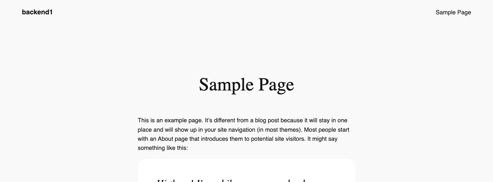
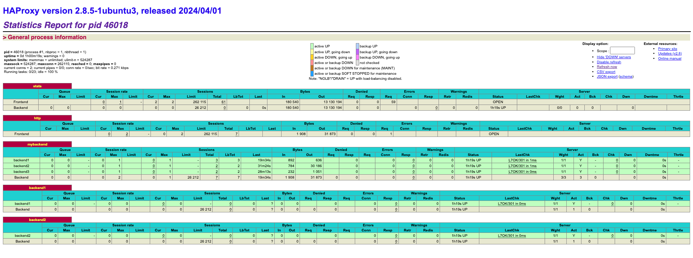

[HAProxy](http://www.haproxy.org) is an intermediary gateway application that manages traffic between frontend clients and backend server resources. This guide is the second part in a series on HAProxy. [Getting Started with HAProxy TCP Load Balancing and Health Checks](/docs/guides/getting-started-with-haproxy-tcp-load-balancing-and-health-checks/) provided steps to build a minimally configured network of Nanodes. The HAProxy node was set up as a TCP load balancer, with health checks configured on its backend, consisting of three Linode Marketplace WordPress servers. This guide shows how to configure the frontend, backend, and HTTP health checks to ensure requests are routed only to specific, healthy servers.

## Before You Begin

1.  Follow the instructions in [Getting Started with HAProxy TCP Load Balancing and Health Checks](/docs/guides/getting-started-with-haproxy-tcp-load-balancing-and-health-checks/), specifically the [Before You Begin](/docs/guides/getting-started-with-haproxy-tcp-load-balancing-and-health-checks/#before-you-begin) and [Install HAProxy](/docs/guides/getting-started-with-haproxy-tcp-load-balancing-and-health-checks/#install-haproxy) sections.


The steps in this guide require root privileges. Be sure to run the steps below as `root` or with the `sudo` prefix. For more information on privileges, see our [Users and Groups](/docs/guides/linux-users-and-groups/) guide.


## HTTP Load Balancing

In this article, HAProxy directs URL requests to backend servers based on the incoming HTTP string. The frontend ACL (Access Control List) function is used to match a specific URL to a specific backend server. The syntax for frontend ACL URL processing is:

```file {title="/etc/haproxy/haproxy.conf"}
frontend #Describes a condition for incoming header statements
ACL   
```

Here, [URL processing](http://docs.haproxy.org/2.4/configuration.html#7.3.6-url) determines which backend resource is chosen based on the inbound HTTP header in a GET or POST request addressed to the frontend.

The ACL function evaluates incoming HTTP requests based on specified URL paths and routes them to the corresponding backend server. [Other methods of evaluation](http://docs.haproxy.org/2.4/configuration.html) are also available to direct frontend requests to the appropriate backend resources.

### Frontend Configuration

The three WordPress instances from [Getting Started with HAProxy TCP Load Balancing and Health Checks](/docs/guides/getting-started-with-haproxy-tcp-load-balancing-and-health-checks/) respond with their default homepages when accessed through the HAProxy gateway's IP address in a web browser. They are re-used here to demonstrate a path-based routing configuration. This allows web browsers to access specific content from designated backend servers. In this example, two ACLs are defined. The first ensures that only `backend1` serves visits to the default WordPress sample page. The second ensures that only `backend2` serves visits to the default WordPress `admin` author archive.

```file {title="/etc/haproxy/haproxy.cfg"}
frontend http
  bind *:80
  mode http
  acl sample-page path_beg /index.php/sample-page/
  acl author-archive path_beg /index.php/author/admin/
  use_backend backend1 if sample-page
  use_backend backend2 if author-archive
  default_backend mybackend
```

Here's a breakdown of what each line does:

-   `frontend http`: Defines a frontend named `http` that handles incoming HTTP connections.
-   `bind *:80`: Binds the frontend to all available IP addresses on port `80`, listening for incoming traffic.
-   `mode http`: Sets the mode to HTTP, allowing traffic to be processed at the application layer.
-   `acl sample-page path_beg /index.php/sample-page/`: Defines an Access Control List (ACL) named `sample-page` to match requests starting with `/index.php/sample-page/`.
-   `acl author-archive path_beg /index.php/author/admin/`: Defines an ACL named `author-archive` to match requests starting with `/index.php/author/admin/`.
-   `use_backend backend1 if sample-page`: Routes requests to `backend1` if the `sample-page` ACL is matched.
-   `use_backend backend2 if author-archive`: Routes requests to `backend2` if the `author-archive` ACL is matched.
-   `default_backend mybackend`: Routes all other requests to the default backend, `mybackend`, if no ACL matches.

### Backend Configuration

To make the ACLs work, the HAProxy configuration must also to include two additional `backend` sections. These direct incoming frontend requests to the correct backend server.

```file {title="/etc/haproxy/haproxy.cfg"}
backend mybackend
  mode http
  balance roundrobin
  server backend1 :80
  server backend2 :80
  server backend3 :80

backend backend1
  mode http
  server backend1 :80

backend backend2
  mode http
  server backend2 :80
```

Here's a breakdown of what each line does:

-   `backend mybackend`: Defines a backend pool called `mybackend` that handles client requests directed to it.
-   `mode http`: Sets the backend mode to HTTP, processing traffic at the application layer.
-   `balance roundrobin`: Distributes incoming requests evenly across the servers in the `mybackend` pool.
-   `server backend1/backend2/backend3`: Lists three servers (`backend1`, `backend2`, `backend3`) in the `mybackend` pool, each assigned their respective VLAN IP addresses and listening on port `80`.
-   `backend backend1`: Defines an individual backend for `backend1`, allowing specific configuration.
-   `server backend1`: Adds `backend1` with its VLAN IP address and port `80` to this backend.
-   `backend backend2`: Defines an individual backend for `backend2`, similar to the setup for `backend1`.
-   `server backend2`: Adds `backend2` with its VLAN IP address and port `80`.

## HTTP Health Checks

In [Getting Started with HAProxy TCP Load Balancing and Health Checks](/docs/guides/getting-started-with-haproxy-tcp-load-balancing-and-health-checks/), the HAProxy gateway was configured to test TCP and Layer 4 connectivity, marking servers as down when errors accumulate over time. HTTP health checks work similarly, but use standard HTTP response codes to mark servers as "down" based on their performance over a specified interval.

Like TCP health checks, HTTP health checks continue to test a server marked as "down" to see if it begins to respond. If it starts responding correctly, the server is added back to the pool of active servers.

You can also configure HTTP health checks to look for specific values rather than standard HTTP response codes. This can be done using regular expressions (REGEX) or simple text matches within the first 16 KB of the backend server's response. For example, a string could match phrases like "Alive" or "Logged In" within a session.

### Basic HTTP Health Checks

Like with TCP health checks, adding the `check` directive to the `server` lines within the `backend` section of your HAProxy configuration file monitors the health of backend servers. However, this is only a TCP health check. In order to activate an HTTP health check, you also need to add the `option httpchk` to the `backend` section.

```file {title="/etc/haproxy/haproxy.cfg"}
backend mybackend
    option httpchk
    server backend1 :80 check
    server backend2 :80 check
    server backend3 :80 check
```

-   `check`: Appending this keyword to each `server` entry activates the health check on that server.
-   `option httpchk`: Adding this option allows HAProxy to perform HTTP health checks. By default, standard responses from the server in the `200`-`399` range indicate that the server is healthy. Meanwhile, responses in the `500` range mark the server as down and remove it from the active pool until it recovers.

    
    By default, the `option httpchk` directive sends a `GET` request to the `/` endpoint to determine server health. However, this can be customized for a specific endpoint, such as `/health`:

    ```file {title="/etc/haproxy/haproxy.cfg"}
    backend mybackend
        option httpchk GET /health
    ```
    

### String-based HTTP Health Checks

HTTP health checks can also query and match specific strings in the backend server's responses. However, only the first 64 KB of the response is examined. If headers are lengthy or include large elements like inline graphics, the desired string might be missed if it’s not within this limit.

```file {title="/etc/haproxy/haproxy.cfg"}
backend mybackend
  option httpchk
  http-check expect string OK
  server backend1 :80 check
  server backend2 :80 check
  server backend3 :80 check
```

-   `http-check`: This directive checks a server response three times before marking the server as "down". The code above configures HAProxy to check that a response was returned `OK`. However, you can adjust this string to match any other server response that indicates a healthy state.

### The HAProxy Stats Page

HTTP health checks offer a more approachable way to monitor the health of your servers than TCP health checks. While HTTP health checks can still be viewed from log files, they can also be viewed from HAProxy's web-based graphical stats page. Enable the stats page by adding a `listen` section to the HAProxy configuration file, like so:

```file {title="/etc/haproxy/haproxy.cfg"}
listen stats
  bind *:8404
  mode http
  stats enable
  stats uri /stats
  stats refresh 10s
  stats auth admin:password  # Set a username and password for access
```

-   `listen` creates a new listen section named `stats`.
-   `bind` tells HAProxy to listen on all available network interfaces (`8`) on port `8404`.
-   `mode` is set to HTTP.
-   `stats enable` enables the stats function.
-   `stat uri/stats` defines the URL where the stats page can be accessed (http://:8404/stats)
-   `stats refresh 10s` sets the auto-refresh interval at 10 seconds.
-   `stats auth admin:password` configures basic credentials for the stats page. Replace `admin` and `password` with the username and password of your choice.

## Configure HTTP Load Balancing with Health Checks

Follow the steps below to put all of the examples from this article together and test HAProxy's HTTP load balancing and health check functionality.

1.  To update the HAProxy configuration, edit the `/etc/haproxy/haproxy.cfg` file using a text editor such as `nano`:

    ```command
    nano /etc/haproxy/haproxy.cfg
    ```

    Update the HAProxy configuration file to match the code below:

    ```file {title="/etc/haproxy/haproxy.cfg"}
    listen stats
      bind *:8404
      mode http
      stats enable
      stats uri /stats
      stats refresh 10s
      stats auth admin:password  # Set a username and password for access

    frontend http
      bind *:80
      mode http
      acl sample-page path_beg /index.php/sample-page/
      acl author-archive path_beg /index.php/author/admin/
      use_backend backend1 if sample-page
      use_backend backend2 if author-archive
      default_backend mybackend

    backend mybackend
      mode http
      balance roundrobin
      option httpchk
      server backend1 :80 check
      server backend2 :80 check
      server backend3 :80 check

    backend backend1
      mode http
      option httpchk
      server backend1 :80 check

    backend backend2
      mode http
      option httpchk
      server backend2 :80 check
    ```

    When done, press <kbd>CTRL</kbd>+<kbd>X</kbd>, followed by <kbd>Y</kbd> then <kbd>Enter</kbd> to save the file and exit `nano`.

1.  Reload HAProxy for the changes to take effect:

    ```command
    sudo systemctl reload haproxy
    ```

    
    If you encounter any errors after reloading HAProxy, run the following command to check for syntax errors in your `haproxy.cfg` file:

    ```command
    haproxy -c -f /etc/haproxy/haproxy.cfg
    ```

    An error message is returned if the configuration file has logical or syntax errors. When the check is complete, each error is listed one per line. This command only verifies the syntax and basic logic of the configuration, it does not guarantee that the configuration works as intended when running.
    

### Test HTTP Load Balancing

1.  Open a web browser and access the HAProxy server’s IP address:

    ```command
    http://
    ```

    
    If your browser warns of no HTTPS/TLS certificate, ignore the warning or use the advanced settings to reach the site.
    

    This page continues to be served by the `mybackend` pool that consists of all three WordPress instances:

    

1.  Now open the default WordPress Sample Page:

    ```command
    http:///index.php/sample-page/
    ```

    This URL should only be served by `backend1`:

    

1.  Now navigate to the default WordPress author archive for `admin`:

    ```command
    http:///index.php/author/admin/
    ```

    This URL should only be served by `backend2`:

    

### Verify HTTP Health Checks

HTTP health checks allow use of the HAProxy stats page to view health status.

1.  Open a web browser and navigate the HAProxy server's public IP address with `:8404/stats` appended to the URL:

    ```command
    http://:8404/stats
    ```

1.  When prompted, enter your username and password from the `listen` section of the HAProxy configuration file.

1.  You should now see the HAProxy stats page showing `mybackend`, `backend1`, and `backend2`:

    

This page holds a wealth of information regarding the health of your servers, including status, sessions, bytes in/out, errors, warnings, and more.