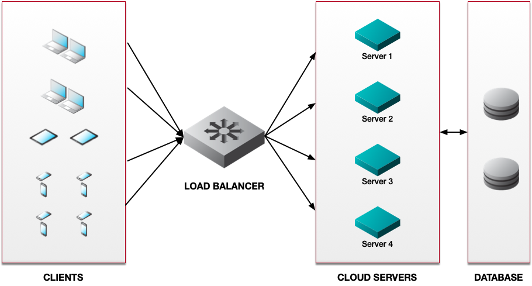

When dealing with an overloaded server, you have a few choices: go bigger or share the load. Going bigger, meaning increasing the server's resources, allows you to boost performance --- but only up to a certain point. After all, any one server’s resources are always finite. On the other hand, distributing workloads across multiple servers scale resources almost infinitely, while also increasing availability.

The basic premise of load balancing is "sharing the work". This guide explores what load balancing is and how it can benefit your workloads. It also covers the approaches and algorithms available to best suit your needs.

## What Is Load Balancing?

Load balancing is the process of distributing client requests among multiple servers. Originally, load balancers were dedicated hardware appliances that sat in front of physical servers in data centers. Today, software products such as [Akamai NodeBalancers](/docs/products/networking/nodebalancers/guides/configure/) perform the same role with cloud-based servers.

Whether hardware or software, the concept is the same. Load balancers act as a reverse proxy for client requests, parceling out requests across servers to avoid resource exhaustion.

Load balancers vary in sophistication. The simplest ones just relay client requests in numerical order. More advanced products monitor server conditions to identify which can best respond at any given instant. Some load balancers even work across multiple data centers, distributing loads globally to optimize response times.

## Benefits and Use Cases of Load Balancing

Load balancing can help boost performance and availability, while also providing fine-grained traffic and system management capabilities. Below are a few key benefits and use cases for each.

### Scalability

Load balancing ensures that server capacity keeps up with client demand, especially in a cloud setting. Occasional flash-mob events may require temporary additions in server capacity. Meanwhile, longer-term traffic growth requires steady additions to your pool of cloud servers. Either way, load balancers distribute client requests so that capacity always meets demand.

### High Availability

Planned or not, server and network outages are a fact of life. Load balancing helps by rerouting traffic around offline resources. For example, you could take specific backend servers offline for software upgrades, while a load balancer continues to send requests to remaining online backend servers. In a global load balancing scenario, you could route traffic away from specific data centers in case of network outages.

Looking beyond the backend machines powering the application, it's also important that the load balancer is not a single point of failure. For this reason, it’s common to deploy a load balancer with high availability (HA) support. This means that your load balancer has built-in redundancy and is replicated on at least two machines. In case the primary machine goes down, traffic is automatically routed to another machine with the same load balancer configuration. In mission-critical cases, a global server load balancer might send requests to a standby data center when active data centers are unreachable.

### Traffic Management

Because load balancers are the first system to see client traffic, they also inspect and make decisions about that traffic. For example, instead of uniformly distributing client requests across all servers, you might choose to send requests for video content to a dedicated server group, while directing all other requests to other servers. This is also a security benefit, as a load balancer can drop traffic you deem unwanted, thus reducing the load on your servers.

### System Monitoring

Many load balancers, including Akamai’s NodeBalancer, perform health checks to determine which servers are functioning properly and how many concurrent connections are on each server. In addition, you may want to implement a robust system performance monitoring solution that integrates with your load balancer. A system experiencing performance issues may degrade the experience of your end-user and indicate underlying server problems. Being able to take that server out of rotation before it stops successfully processing client requests can improve your application's overall performance and allow you to more quickly address the issue.

## Routing Traffic to Back-End Servers

Load balancers are so-called "middleboxes", acting as reverse proxies between clients and servers. For example, you might configure DNS so that `www.example.com` points to the load balancer’s client-facing IP address/es.

Clients requesting this site’s web page would send HTTP/HTTPS GET requests to the load balancer. Acting as a reverse proxy, the load balancer then distributes requests across back-end servers or server groups. The diagram below shows a simple example where a load balancer distributes client requests across web servers. The diagram also shows another tier of database servers behind the web servers. This is a common design choice whenever it’s important to maintain consistent content across multiple servers.

When a client request arrives at the load balancer, it has to decide how best to distribute requests across servers. Although there are many choices in load balancing algorithms, they all fall into two categories: *static* or *dynamic*.

Static algorithms always make the same decisions based on the same inputs. Dynamic algorithms may make different decisions depending on current server and network conditions. Some load balancers employ multiple algorithms at the same time. Continue reading to discover the pros and cons of each algorithm.

### Static Load Balancing Algorithms

#### Round Robin

A round robin algorithm rotates among all available servers when parceling out client requests. For example, Request 1 goes to Server 1, Request 2 goes to Server 2, and so on up to Server N. At that point, the algorithm sends the next request to Server 1.

- **Pros**: Easiest algorithm to [implement and manage](/docs/guides/setting-up-round-robin-dns/). A good choice when client requests and responses are highly self-similar. Each request resembles every other in terms of size and response time. Also good when processing capacity is equal across all servers.

- **Cons**: May worsen existing congestion by sending requests to an already overloaded server. Performance may degrade over time because clients invariably request objects of different sizes, leading to uneven server loading. Also ill-suited when servers differ in terms of processing capability.

#### Weighted Round Robin

Similar to round robin, but this algorithm assigns a score to each server or server group depending on processing power or other parameters.

- **Pros**: Suitable in data centers where some servers have more resources than others, such as CPU speed, memory, I/O speed, or network interface speed.

- **Cons**: Only takes into account static differences between servers. Does not factor for dynamic changes such as server health or traffic conditions.

#### Random Load Balancing

The load balancer randomizes the order in which it parcels out client requests.

- **Pros**: Allows for uniform distribution of requests across all servers over time.

- **Cons**: Not well-suited when server configurations differ. In this situation, randomization of client requests could overload some servers. Does not factor for dynamic changes such as server health or traffic conditions.

#### TCP Load Balancing

TCP load balancing algorithms use a client request’s destination TCP port number to make forwarding decisions.

Optionally, a load balancer may compute a hash of TCP source and destination port numbers to ensure session persistence. This ensures that the same client always reaches the same server. This is useful for applications or services that employ unique tokens for each session.

- **Pros**: Relatively simple to implement and operate. Useful for applications that run over TCP but not HTTP/HTTPS.

- **Cons**: Unaware of changes in server or network loads. Could send requests to already overloaded servers or server groups.

#### HTTP/HTTPS Load Balancing

HTTP/HTTPS load balancing algorithms examine the content of HTTP headers to make forwarding decisions.

HTTP/HTTPS load balancers may compute a hash of a URL and then cache the hashed value. This means that future requests for the same URL get forwarded to the same server. This is useful when applications or services offer unique content per server session. For example, URL hashing can ensure that requests involving running code go to one server, but payments go to another.

- **Pros**: Logical choice given the predominance of Web traffic on the Internet. Allows parsing of HTTP headers to send different requests to different sets of servers.

- **Cons**: Not appropriate for email, most types of instant messaging, and other applications or services that do not run over HTTP. May require decryption and re-encryption of traffic secured with Transport Layer Security (TLS, which now represents the vast majority of web requests) before it can read HTTP requests. TLS decryption/encryption requires additional processing capability.


For more information on TCP and HTTP/HTTPS load balancers, see our [Application (HTTP) vs Network (TCP) Load Balancers](/docs/guides/application-http-vs-network-tcp-load-balancers/) guide.


### Dynamic Load Balancing Algorithms

Dynamic algorithms have different outcomes depending on current server and network conditions. These require continual server monitoring, often called "health checks", to ensure optimal response time.

#### Least Connections

The load balancer monitors connection counts on each server. It then directs requests to the server/s with the lowest current number of open TCP connections or outstanding HTTP/HTTPS requests.

- **Pros**: Simple to implement and monitor. Very efficient when requested object sizes vary widely, leading to shorter- and longer-lived connections.

- **Cons**: Does not take into account other server attributes such as memory or CPU cycles available.

#### Weighted Least Connections

Weighted least connections algorithms monitor current connection counts and assign different weights to servers or server groups.

- **Pros**: Can help smooth out differences in server configurations.

- **Cons**: Connection count is only one type of performance metric. Applications or services that tax other aspects of server configuration, such as memory usage or disk I/O, may not be well-served by least connections algorithms, even when weighted.

#### Least Response Time

Least response time algorithms continually monitor how long it takes servers to return objects. The algorithm dynamically assigns new client requests to the server/s that move objects the fastest at any given moment. Least response time algorithms also consider the current number of connections on each server.

- **Pros**: Should deliver the highest performance for clients, both instantaneously and over time.

- **Cons**: Requires more resources on the load balancer to monitor response times and open connections. May not be suitable for applications or services where session persistence is a requirement.

#### Global Server Load Balancing

Akamai and other cloud providers have the ability to [virtualize the load balancer function across multiple data centers](https://www.akamai.com/products/global-traffic-management), even those on different continents. Using anycast or other DNS mechanisms, global server load balancing (GSLB) forwards requests to the nearest available data center. It then distributes loads within that data center. In effect, GSLB works as a "load balancer of load balancers".

- **Pros**: Puts content closest to clients, regardless of their location. Maximizes uptime by rerouting traffic around any server, network, or data center outage.

- **Cons**: More complex and costly to implement than load balancing at a single data center. May be overkill for simple applications without high-availability requirements or a global user base.

## Conclusion

Load balancing provides virtually unlimited scalability, no matter how much traffic grows over time. The technology also maximizes availability, either within a single data center or globally across data centers. The key to performance optimization is understanding which type of load balancing and what algorithm/s make the most sense for your applications and services. When properly implemented, load balancing can nearly eliminate server bottlenecks and downtime, while also speeding traffic to your clients.