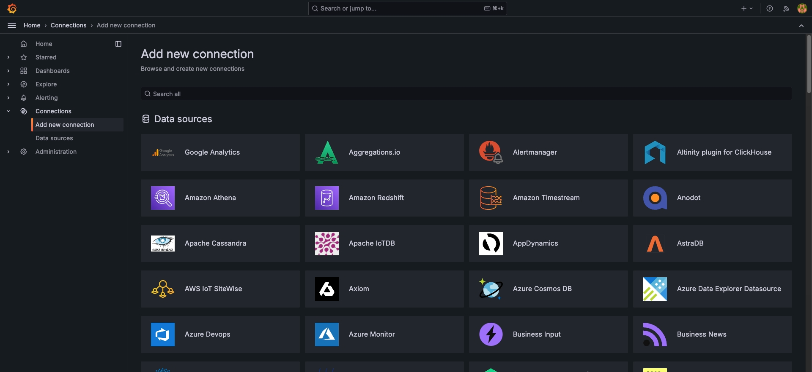
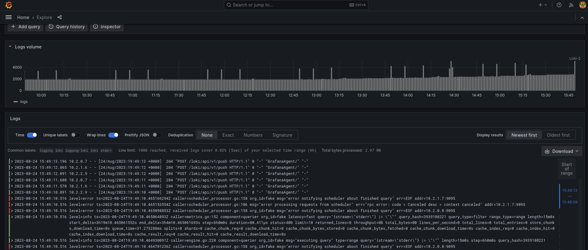

Fluentd and Loki are part of a flexible chain of service-logging apps. When combined with Prometheus and Grafana, they create a full stack for log presentation and querying. The Fluentd/Loki/Prometheus/Grafana stack provides decision support using time series-based log data and streams from various log formats. This stack can scale when an instance or pod deployment configuration changes.

This log aggregation and console framework is built from established system log sources, or adapted as needed. This approach helps avoid vendor lock-in due to the popularity and independence of separate product developer communities. The stack's seamless integration make it a widely adopted tool set. Its modular architecture is well-suited for the log monitoring and trend analysis visualization needs of system administrators.

It also works with Akamai Kubernetes components for cloud-native stack control through the Akamai Cloud Marketplace's Prometheus & Grafana app. It can also be integrated with other Grafana consoles assembled by different methods. For example, a simpler but less flexible stack is available using Loki, Prometheus-Promtail, and Grafana. However, the Fluentd/Loki stack's key utility stems from its extensive number of plugins, rapid query capabilities, and Grafana’s visualization tools.

This toolkit captures a wide variety of service logs from diverse instances in single- or multi-tenant environments. Adding labels and timestamps to logs allows for rapid correlation across tenants and their instances, which can help with troubleshooting and forensic examination. Grafana visually couples or decouples sources and tenants. Using appended labels, timestamps, and time series-based sorting, logs from different components are correlated to each other in the Grafana console. This correlation presents events as a time series-based graph visualization of underlying log streams.

This guide explains how to use Fluentd and Loki to aggregate logs and feeds them to a Prometheus store. Grafana then correlates and visualizes this log data.

## Stack Component Relationships

The Fluentd/Loki/Prometheus/Grafana stack provides administrators with a way to visually track error messages. Data sources within a time series can optionally be correlated to other event log message streams for rapid fault determination and forensic study via Grafana.

Fluentd is chosen in this stack for its large number of community-supported source and destination data-handling plugins. These plugins allow for simple customization of source or destination data-handling to or from multiple scalable data streams.

Loki is chosen for its aggregation and timestamping of log sources. Loki receives data from Fluentd, marks it, and pipes its output to Prometheus.

Grafana is used for queries, correlating key values, and identifying trends through statistical or graphical data visualization. Prometheus and Loki share interchangeable characteristics in log storage, with Prometheus providing a data store that is queried through an open language.

The lightweight stack recommended in this guide provides options for auto-start with new Kubernetes instances and pod construction. This allows new deployments and instances to begin reporting log data to the Grafana console immediately. By adding other data sources, the time series-based Prometheus data store enables Grafana to correlate events across a wide instance map. This setup facilitates rapid visual trend analysis.

Administrative uses of Grafana include trend analysis and forensic examination. This leads to better visibility for communications, general troubleshooting, load balancing, error details, and other trend-related needs.

## What Is Fluentd?

Fluentd aggregates logs from diverse instance sources. Administrative actions and enabled output plugins send data to Loki. Loki then forwards the data to a Prometheus store, which is then visualized through queries made in Grafana.

The [Cloud Native Computing Foundation](https://www.cncf.io)'s (CNCF) Fluentd is an open source log-aggregation framework with two deployment options: Fluentd and Fluent-bit. Both versions use input plugins to collect logs and output plugins to send the results. The Fluentd binary, written in Ruby, offers more input and output plugin options for differing sources and destinations. The Fluent-bit app, written in C, is a lightweight agent designed for use in virtual machines, containers, pods, and elemental compute sources.

From input plugins, Fluentd and Fluent-bit can optionally filter data fetches. After processing the input stream, they aggregate multiple streams and send them to a target destination. In this guide, the target destination of the multiple log sources is an instance of Loki, via a Ruby gem plugin.

## What Are Loki and Prometheus?

Loki is a multi-tenant log aggregation system that serves as the source for data visualization by Grafana. It feeds time-series log data to Prometheus, where the aggregated and timestamped data is stored.

In this example stack, Loki takes logs as input from log streams aggregated by Fluentd. It can also natively handle Kubernetes logs directly. However, in this example, a wider variety of data sources enhances the options available for correlating and visualizing logs in Grafana.

Logs collected by Fluentd can be categorized based on their single- or multi-tenancy status. Data from output plugin streams or logs from Fluentd are relabeled and timestamped. Loki then stores this data and serves as the source repository for query and correlation by Grafana, the data presentation layer.

## Loki Deployment Modes

There are three deployment modes for Loki:

-   The example in this guide uses *Monolithic mode*. It is the simplest because it utilizes just a single instance and database stack. Multiple instances of monolithic mode can share a common database instance, permitting horizontal scaling, as queries to any instance accesses the same shared database.

-   The *Scalable Deployment mode* is more complex. It separates reads and writes as data flow targets to prevent input host contention, jamming, and possible log loss. In this mode, Loki reads and writes from data sources and query tools take separate paths. This deployment requires the installation of a load balancer for Loki write nodes, while all other traffic is sent to read nodes. Designed for terabytes of traffic per day, Loki's scalable development mode is for large traffic volumes within a busy framework.

-   Loki's third and final mode is *Microservices mode*, tailored for microservices with container fleets, especially those using Kubernetes control planes for pod scaling.

## Stack Installation Considerations

Accurate timestamps within log data sources and consistency in changes made through log aggregation processes are critical for ensuring visualization accuracy later in the stack. All instances, whether log sources or log processors, must be synchronized to the same time source. Use a common NTP server for all instances in the stack to ensure synchronization with this time source and maintain system integrity.

Fluentd plays a crucial role in the logging stack by accumulating logs from various sources using plugins. In this example, log sources include the `/var/log` directories on separate Linux instances and a Kubernetes pod. The source of Fluentd logs is limited to the available source plugins provided by Fluentd or created by users. There are numerous input plugins available for various data sources.

The gathered Fluentd logs are organized into JSON-formatted entries by Loki. Prometheus stores these Loki logs, which are otherwise ephemeral. The Prometheus store acts as the data source for Grafana's visualization console. Grafana and Prometheus are typically deployed together. This example uses the Prometheus & Grafana installation from the Akamai Cloud Marketplace.

Other configurations use Promtail, Loki, Prometheus, and Grafana either separately or in combination. For instance, Loki, Promtail, and Grafana work well in strictly Kubernetes-sourced log consoles, but have limited plugins for other data sources.

## Before You Begin

The example stack in this article uses three groups of instances:

-   **Group #1** consists of instances to monitor: discrete Linux instances in an Akamai Kubernetes pod.

-   **Group #2** is the instance where Fluentd gathers the logs and sends them to a Loki instance within the same host.

-   **Group #3** consists of an instance running Grafana and Prometheus, deployed to a Nanode instance by the Akamai Cloud Marketplace app.

1.  If you do not already have a virtual machine to use, create a Compute Instance with at least 4 GB of memory. See our [Getting Started with Linode](/docs/products/platform/get-started/) and [Creating a Compute Instance](/docs/products/compute/compute-instances/guides/create/) guides.

1.  Follow our [Setting Up and Securing a Compute Instance](/docs/products/compute/compute-instances/guides/set-up-and-secure/) guide to update your system. You may also wish to set the timezone, configure your hostname, create a limited user account, and harden SSH access.


This guide is written for a non-root user. Commands that require elevated privileges are prefixed with `sudo`. If you’re not familiar with the `sudo` command, see the [Users and Groups](/docs/guides/linux-users-and-groups/) guide.


## Prometheus-Grafana Installation

The Akamai Cloud Marketplace Prometheus & Grafana app renders a standalone server instance. Follow the steps below to deploy it:

1.  Choose the **Marketplace** option from the left menu in the Akamai Cloud dashboard.

1.  Select **Prometheus & Grafana** from the Akamai Marketplace app menu. The Akamai Cloud [Get Started Guide](/docs/products/tools/marketplace/guides/grafana/) contains full deployment instructions for this app, but here are some options to choose:

    -   Under **Select an Image**, there's an option for Ubuntu 22.04 LTS or Ubuntu 20.04 LTS. This example uses an Ubuntu 22.04 LTS instance.

    -   Under **Linode Plan**, click the **Shared CPU** tab. A minimal **Nanode 1 GB** is suitable for this example stack.

1.  Once fully deployed, login via SSH:

    ```command
    ssh @
    ```

    Once connected you should see a block of pertinent information, take note of it:

    ```output
    *********************************************************
    Akamai Connected Cloud Prometheus & Grafana Marketplace App
    Grafana URL: https://.ip.linodeusercontent.com
    Prometheus URL: https://.ip.linodeusercontent.com/prometheus
    Credentials File: /home//.credentials
    Documentation: https://www.linode.com/docs/products/tools/marketplace/guides/prometheus-grafana/
    *********************************************************
    ```

1.  Access the login credentials for the web service on the instance:

    ```command
    cd /home/
    cat .credentials
    ```

    ```output
    Sudo Username: 
    Sudo Password: JI5HPTkCcMv0ktna8XMm1o6Ha
    Prometheus Username: prometheus
    Prometheus Password: m32mCYUCrpbNHdMuY1JcTKLOm8oG0tuhCZ2daLJvlcHe3
    Grafana Username: admin
    Grafana Password: e8xgPVGrWDE7UT02zaDHe45g5syGjVLmGZ9wt63U9lrCZ
    ```

1.  Once the instance installs, it deploys a Let’s Encrypt TLS certificate, which allows you to access the instance via `HTTPS` in a web browser. When fully installed, the Grafana settings menu provides fields to connect to the Loki/Fluentd combination:

    

## Fluentd Installation

Fluentd gathers log instances via Fluentd and plugins. This example uses a Ruby gem version of Fluentd onto a Nanode. The commands below install the build tools, Ruby and its development libraries, and Fluentd:

1.  Update and upgrade the Ubuntu system, then restart the Nanode:

    ```command
    sudo apt update && sudo apt upgrade -y && sudo reboot
    ```

    The instance receives updates and upgrades, then reboots to ensure future revision sync with subsequent items. This is required.

1.  Install the `build-essential` package for Fluentd and its dependencies:

    ```command
    sudo apt install build-essential
    ```

1.  Install Ruby and its development libraries:

    ```command
    sudo apt install ruby-dev
    ```

1.  Install Fluentd using the Ruby gem without the documentation (to save space on the Nanode):

    ```command
    sudo gem install fluentd --no-doc
    ```

1.  Set up Fluentd by creating a configuration file and directory:

    ```command
    fluentd --setup ./fluent
    ```

    The configuration file can now be modified to suit input and output plugins.

    ```output
    Installed ./fluent/fluent.conf.
    ```

1.  Start Fluentd with the configuration file in verbose mode and run it in the background:

    ```command
    fluentd -c ./fluent/fluent.conf -vv &
    ```

## Loki Installation

The example log monitoring stack uses the same Nanode instance that hosts Fluentd. The plugin that links Loki as the accumulator of Fluentd logs is installed and attached after Fluentd and Loki.

1.  First, download the Debian package from the Grafana Loki Releases page:

    ```command
    wget https://github.com/grafana/loki/releases/download/v3.0.0/logcli_3.0.0_amd64.deb
    ```

1.  Install Loki on the Ubuntu 22.04 LTS log aggregation instance using `dpkg`, the Debian package installer:

    ```command
    sudo apt install ./logcli_3.0.0_amd64.deb
    ```

1.  Install the Ruby gem that links the Fluentd-Loki-Grafana chain together:

    ```command
    sudo fluent-gem install fluent-plugin-grafana-loki
    ```

## Getting Logs

Fluentd employs a log-scraping agent on each monitored host, and Fluent-bit can also serve as an agent on hosts that require log monitoring. This guide uses the Rsyslog protocol, specified during Fluentd’s configuration, to push logs to Fluentd. Both methods support TLS encryption to secure the network data transmissions against data scraping.

The Fluentd plugin integrates with Loki and directs the log stream to Prometheus, which serves as the data source for queries made by Grafana.

To prevent network data scraping, TLS credentials can also be used to secure network data transmissions between the Fluentd/Loki and the Prometheus/Grafana instances.

Grafana retrieves logs from Loki and queries Prometheus, Fluentd, a private data store, or other sources concurrently by configuring it's Data Source configuration.

Authentication options for Grafana's Data Source range from none to TLS Certificates, access secrets, and other forms of Public Key Infrastructure (PKI) techniques. This is necessary to protect other identifiable information in the communication chain from packet sniffing.

Grafana also offers a context-sensitive log query builder. This tool allows you to link common and disparate data sources into a time-series format. You can then use this data for various graphical visualizations, such as histograms, to correlate the query results.

## Generating Visualizations

The web browser interface allows you to select specific time frames and fields to generate histograms of log data occurrences. For example, the screenshot below shows traffic sorted by critical messages within a 24-hour time-series across hosts:



These messages are correlated from log sources originating from `/var/log/` information across the monitored sample instances and Kubernetes pod.

## Conclusion

The Fluentd/Loki combination excels in handling diverse log source streams and efficiently archiving log data. The Prometheus/Grafana combination serves as the log store archive and central hub for visualizing time-series events across various log sources, whether discrete instances or Kubernetes pods.

Prometheus catches both persistent and ephemeral log data as instances (or pods) are instantiated or terminated. Ephemeral log data comes from pods that start and terminate. This data would otherwise not leave a trace in a log-polling environment, as pods go in and out of existence through production service cycles.

You can adapt this example and deploy similar configurations across different systems domains to provide comprehensive tracking and correlation of data streams through a centralized console.