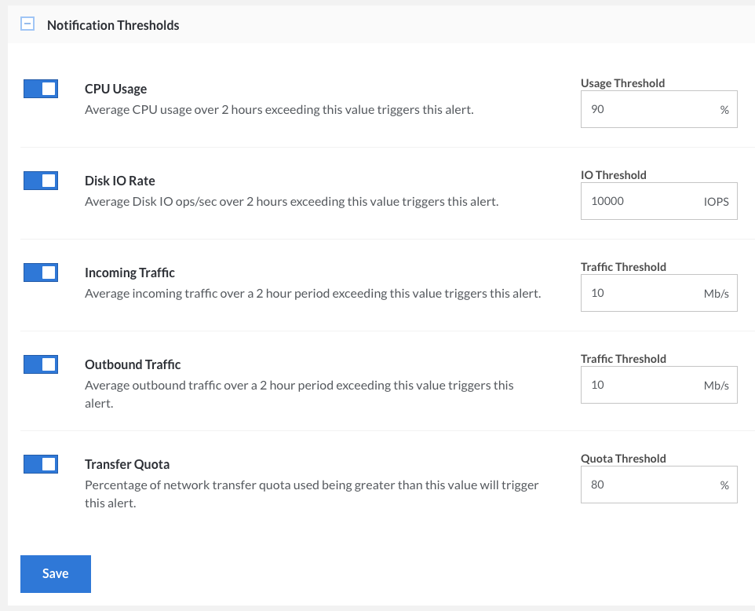

The Linode Cloud Manager allows you to configure *email alerts* that automatically notify you via email if certain performance thresholds are reached. For example, if you set the threshold for CPU Usage to 90% percent, you'll be notified if your Linode's average CPU usage is greater than 90% for over 2 hours.

To turn on and customize the alerts:

1.  Log in to the [Linode Cloud Manager](https://cloud.linode.com).
1.  Click the **Linodes** link in the sidebar.
1.  Select your Linode. The Linode's details page appears.
1.  Click the **Settings** tab. The *Notification Thresholds* panel appears, as shown below.

    

1.  To enable an email alert, toggle the appropriate switch.
1.  To configure the threshold for an alert, set a value in the text field.
1.  Click **Save** to save the email alert thresholds.

You have successfully configured email alerts in the Linode Cloud Manager.


If you receive an email threshold alert from the Linode Cloud Manager, don't panic. There's not necessarily anything wrong with your Linode. For example, your server may be operating above the threshold if you're compiling software or if a major website just linked to your blog.

