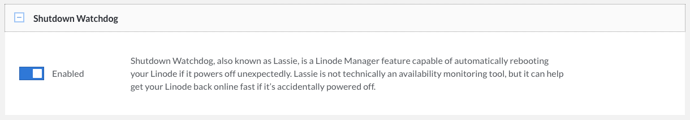

Shutdown Watchdog, also known as *Lassie*, is a Linode Cloud Manager feature capable of automatically rebooting your Linode if it powers off unexpectedly. Lassie is not technically an availability monitoring tool, but it can help get your Linode back online fast if it's accidentally powered off.

To turn Lassie on and off:

1.  Log in to the [Linode Cloud Manager](https://cloud.linode.com).
1.  Click the **Linodes** link in the sidebar.
1.  Select your Linode. The Linode's details page appears.
1.  Click the **Settings** tab. The Shutdown Watchdog settings appear, as shown below.

    

1.  Toggle the box to turn Shutdown Watchdog on.

Once Lassie is enabled, your Linode will automatically reboot if it is unexpectedly powered off in the future.
