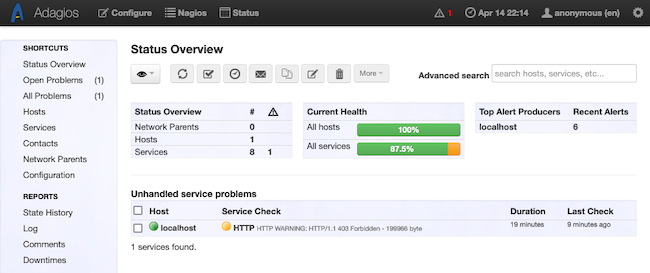
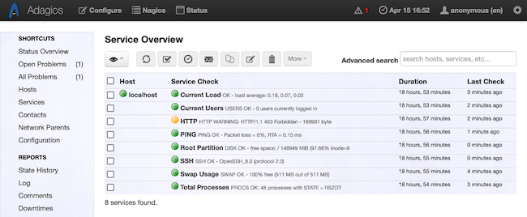
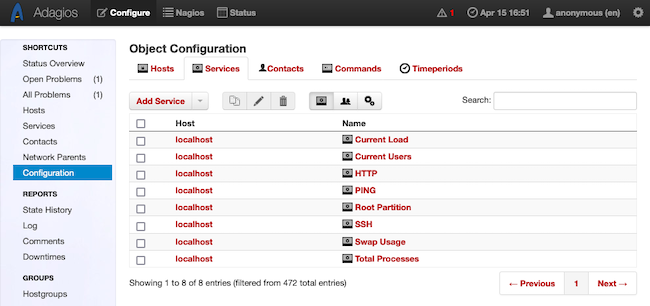
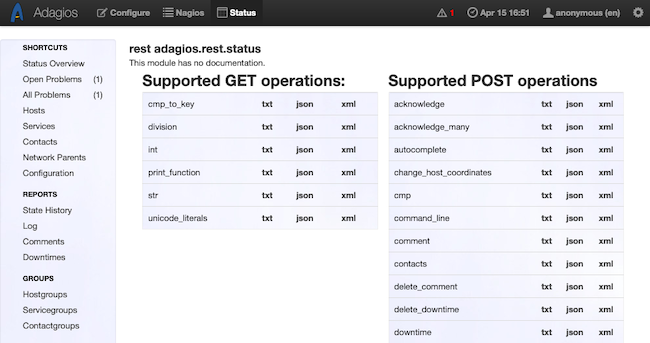

Adagios offers a more intuitive interface for observing and configuring the Nagios server-monitoring system. Adagios has the key features from Nagios readily available, while keeping the messier details out of the way.

In this tutorial, learn how to get started with Adagios on a CentOS Stream 8 or similar system. Follow along to install Adagios and start using it to monitor your servers.

## Before You Begin

1.  If you have not already done so, create a Linode account and Compute Instance. See our [Getting Started with Linode](/docs/guides/getting-started/) and [Creating a Compute Instance](/docs/guides/creating-a-compute-instance/) guides.

1.  Follow our [Setting Up and Securing a Compute Instance](/docs/guides/set-up-and-secure/) guide to update your system. You may also wish to set the timezone, configure your hostname, create a limited user account, and harden SSH access.

1.  Your Linode Compute Instance needs to be running CentOS 8 or a comparable distribution. The instructions in this tutorial have been specifically tested on CentOS 8, but should be compatible with systems like AlmaLinux 8 and Rocky Linux 8 as well.

1.  Your Compute Instance needs to be on the Linode 8 GB Shared CPU plan, at minimum, as these instructions require a large amount of disk space.


This guide is written for a non-root user. Commands that require elevated privileges are prefixed with `sudo`. If you’re not familiar with the `sudo` command, see the [Users and Groups](/docs/guides/linux-users-and-groups/) guide.


## Getting Started with Nagios

Before diving into Adagios, you should have a base familiarity with Nagios, the tool that Adagios provides an interface for. If you are not familiar with Nagios, continue reading and follow the links below to learn more.

### What Is Nagios?

[Nagios](https://www.nagios.com/products/nagios-core/) is a widely used server-monitoring tool. Nagios provides robust server monitoring with highly configurable notification and alert options along with a host of official and community plugins.

### How to Install Nagios

Before getting started with Adagios, Nagios must be installed and configured on your system. To install Nagios, follow our [How to Install Nagios on CentOS 8](/docs/guides/install-nagios-on-centos-8/) guide.

Alternatively, refer to the official [installation documentation](https://support.nagios.com/kb/article/nagios-core-installing-nagios-core-from-source-96.html) for Nagios Core for details on installing Nagios on other operating systems.

Keep in mind that Adagios is built primarily with CentOS and other RHEL-based systems in mind. For that reason, this tutorial focuses on CentOS Stream 8. The instructions should work similarly for distributions like AlmaLinux 8 and Rocky Linux 8.

## How to Start Using Adagios with Nagios

Adagios runs on top of Nagios to provide a cleaner and simpler interface for managing a Nagios server-monitoring instance. Follow along with this section of the tutorial to learn more about Adagios and get a full walkthrough for setting it up.

### Why Use Adagios?

[Adagios](http://adagios.org/) is a web interface for managing Nagios configurations. While Nagios comes with its own web interface, Adagios offers a more approachable dashboard for monitoring performance and managing a Nagios configuration. Adagios hides more of the low-level details, making it easier to get a quick view of a system and control the monitoring configuration.

Additionally, Adagios provides a RESTful API for accessing and managing a Nagios instance. This makes Adagios a broadly useful enhancement to the default interfaces offered by Nagios.

### Installing Adagios

On most systems, the best way to install Adagios is from source. This approach makes the Adagios configuration easier to manipulate, which is necessary depending on where Nagios is installed.

#### Setting Up the Prerequisites

1.  First, install dependencies for Adagios from the package manager:

    ```command
    sudo dnf install epel-release
    ```

    ```command
    sudo dnf config-manager --set-enabled powertools
    sudo dnf install git acl mod_ssl python36 python36-devel python3-pip python3-setuptools make gcc-c++
    ```

    ```command
    sudo pip3 install --upgrade pip
    ```

1.  Install the Livestatus add-on for Nagios. The add-on provides features to enhance how status information about hosts and services are retrieved. Opin Kerfi, the maintainers of Adagios, also maintain a package to conveniently pull the Livestatus installation files:

    ```command
    cd /tmp
    wget https://droppa.ok.is/dl/data/8b15d652f132667abbf0b80dd9d956d4cc368d1c/mk-livestatus-1.2.6.tar.gz
    tar -xvzf mk-livestatus-1.2.6.tar.gz
    cd mk-livestatus-1.2.6
    sudo ./configure --with-nagios4
    sudo make
    sudo make install
    ```

1.  Complete the Livestatus installation by creating a directory for Nagios to store the Livestatus socket and placing that information in the Nagios configuration file:

    ```command
    sudo mkdir -p /usr/lib/nagios/mk-livestatus
    sudo chown nagios:apache /usr/lib/nagios/mk-livestatus
    echo 'broker_module=/usr/local/lib/mk-livestatus/livestatus.o /usr/lib/nagios/mk-livestatus/livestatus' | sudo tee -a /usr/local/nagios/etc/nagios.cfg
    ```

1.  Create a user group and user for Adagios, then assign the Nagios user group to that user.

    ```command
    sudo groupadd --system adagios
    sudo adduser --system -g adagios adagios
    sudo usermod -aG nagios adagios
    ```

#### Installing and Configuring Adagios

1.  Download the Adagios repository and give its ownership to the Adagios user:

    ```command
    sudo git clone -b master --depth 1 https://github.com/opinkerfi/adagios.git /opt/adagios
    sudo chown --recursive adagios:adagios /opt/adagios/
    ```

1.  Prepare directories for Adagios, and move its configuration files onto your system:

    ```command
    sudo mkdir -p /etc/adagios/conf.d /var/lib/adagios /usr/local/nagios/etc/adagios
    sudo cp /opt/adagios/adagios/etc/adagios/adagios.conf /etc/adagios/adagios.conf
    ```

1.  Adjust the Adagios configuration files to reflect the actual location of your Nagios installation.

    The changes here assume your `nagios.cfg` file is stored within the `/usr/local/nagios/etc/` directory. That should be the case when following the Nagios installation guide linked earlier in this tutorial. However, replace `/usr/local/nagios/` below with the actual directory containing your installed Nagios files if that directory differs.

    These changes also disable PNP4Nagios, which adds performance graphing features. However PNP4Nagios is now deprecated, so it is not covered here. To install it anyway, follow [Nagios's instructions](https://support.nagios.com/kb/article/nagios-core-performance-graphs-using-pnp4nagios-801.html#CentOS) and do not execute the `enable_pnp4nagios` command below.

    ```command
    sudo sed -i 's|/etc/nagios|/usr/local/nagios/etc|g' /etc/adagios/adagios.conf
    sudo sed -i 's|/usr/sbin/nagios|/usr/local/nagios/bin/nagios|g' /etc/adagios/adagios.conf
    sudo sed -i 's|enable_pnp4nagios = True|enable_pnp4nagios = False|g' /etc/adagios/adagios.conf
    sudo sed -i 's|# ALLOWED_HOSTS|ALLOWED_HOSTS|g' /etc/adagios/adagios.conf
    sudo sed -i 's|livestatus_path = None|livestatus_path = "/usr/lib/nagios/mk-livestatus/livestatus"|g' /etc/adagios/adagios.conf
    ```

1.  Copy the remaining Adagios configuration files to the appropriate places on your system, and ensure the Adagios user has the ownership it needs:

    ```command
    sudo cp /opt/adagios/adagios/etc/adagios/conf.d/force_script_name.conf /etc/adagios/conf.d/
    sudo cp /opt/adagios/adagios/etc/adagios/conf.d/okconfig.conf /etc/adagios/conf.d/
    sudo cp /opt/adagios/adagios/etc/sudoers.d/adagios /etc/sudoers.d/
    sudo chown --recursive adagios:adagios /etc/adagios /var/lib/adagios
    ```

1.  Set up the Adagios service files, then start and enable the Adagios service:

    ```command
    sudo cp /opt/adagios/contrib/gunicorn.py /opt/adagios/gunicorn.py
    sudo cp /opt/adagios/contrib/*.service /etc/systemd/system/
    sudo systemctl daemon-reload
    sudo systemctl start adagios
    sudo systemctl enable adagios
    ```

1.  Adagios includes a configuration file for your Apache Web Server instance. Copy that configuration file to the directory for Apache configurations:

    ```command
    sudo cp /opt/adagios/contrib/apache_gunicorn_adagios.conf /etc/httpd/conf.d/
    ```

1.  Adagios uses a Python virtual environment for orchestrating some of its required features. Execute the included script to set up the necessary virtual environment, then load the environment and run some commands to provide initial configurations.

    Again, you need to replace `/usr/local/nagios/` below with the actual location of your installed Nagios files if they differ.

    ```command
    sudo /opt/adagios/upgrade.sh
    sudo chown --recursive adagios:adagios /opt/adagios/
    su -
    ```

    ```command
    source /opt/adagios/venv/bin/activate
    pynag config --append cfg_dir=/usr/local/nagios/etc/adagios
    pynag config --append "broker_module=/usr/local/lib/mk-livestatus/livestatus.o /usr/lib/nagios/mk-livestatus/livestatus'"
    exit
    ```

1.  Restart the Nagios, Adagios, and Apache services for the configuration changes to take effect:

    ```command
    sudo systemctl restart nagios adagios httpd
    ```

#### Installing and Configuring OKConfig

Adagios leverages the [OKConfig](https://github.com/opinkerfi/okconfig) tool for managing Nagios configurations. Although not necessary, you should install and configure OKConfig to get the most out of Adagios.

1.  Download the OKConfig repository and deploy its initial configurations:

    ```command
    sudo git clone -b master --depth 1 https://github.com/opinkerfi/okconfig.git /opt/okconfig
    echo 'export PYTHONPATH=$PYTHONPATH:/opt/okconfig' | sudo tee /etc/profile.d/okconfig.sh
    sudo cp /opt/okconfig/etc/okconfig.conf /etc/okconfig.conf
    source /etc/profile
    sudo ln -s /opt/okconfig/usr/share/okconfig /usr/share/
    sudo ln -s /opt/okconfig/usr/bin/okconfig /usr/local/bin/
    ```

1.  Make some changes to the default OKConfig configuration. As with the Adagios configuration changes above, these primarily concern pointing OKConfig to the actual location of the `nagios.cfg` file.

    Adjust the directories in these commands to match the location of your Nagios installation if its files are stored elsewhere.

    ```command
    sudo sed -i 's|/etc/nagios/nagios.cfg|/usr/local/nagios/etc/nagios.cfg|g' /etc/okconfig.conf
    sudo sed -i 's|/etc/nagios/okconfig|/usr/local/nagios/etc/okconfig|g' /etc/okconfig.conf
    echo 'cfg_dir=/usr/share/okconfig/templates' | sudo tee -a /usr/local/nagios/etc/nagios.cfg
    su -
    ```

1.  Start up OKConfig by entering the Adagios virtual environment and running the OKConfig commands:

    ```command
    source /opt/adagios/venv/bin/activate
    okconfig init
    okconfig verify
    exit
    ```

1.  Restart the Nagios, Adagios, and Apache services for the changes to take effect:

    ```command
    sudo systemctl restart nagios adagios httpd
    ```

### Navigating Adagios

With Adagios installed and running, you now have access to the Adagios interface for your Nagios instance. Open a web browser and navigate to the `/adagios/` path on your system's public address.

For instance, if your public IP address is `192.0.2.0`, navigate to `http://192.0.2.0/adagios/`. If your system has the domain name `example.com`, navigate to `http://example.com/adagios/`.

You should be greeted with the Adagios dashboard:

[](adagios-dashboard.png)

From here, use Adagios to navigate the myriad information about your monitored hosts and services. More details are available through the options on the left menu, such as navigating to the **Services** page to see a list of monitored services:

[](adagios-services.png)

Individual items can be selected for even more details.

Use the **Configuration** option from the top of the page to see options for configuring hosts, services, commands, and more within Nagios:

[](adagios-configure.png)

The top menu also has an option for **Nagios**, providing an inset window with the traditional Nagios interface should you need specific features it provides.

Finally, navigating to the `/adagios/rest` path opens the menu for documentation of your Adagios instance's RESTful APIs. There are several options of APIs exposed by the Adagios instance. For example, here is how the **status** API may look:

[](adagios-rest-api.png)

## Conclusion

Now you have Adagios providing a clean and easy interface for your Nagios system. Be sure to look into all of the menu options the Adagios interface offers. This should give you a thorough idea of the features Adagios offers and how to make the most of them.

To take your Adagios setup even further, follow along with the Adagios user documentation linked below. The documentation on using the REST API features is especially helpful should you want to leverage them.