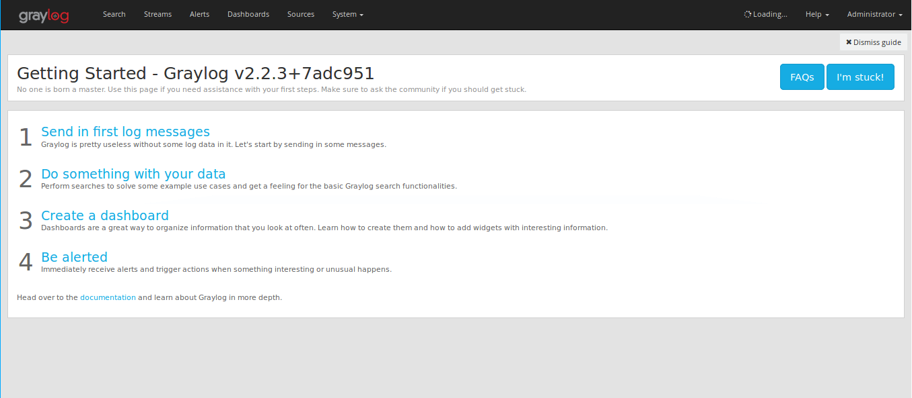
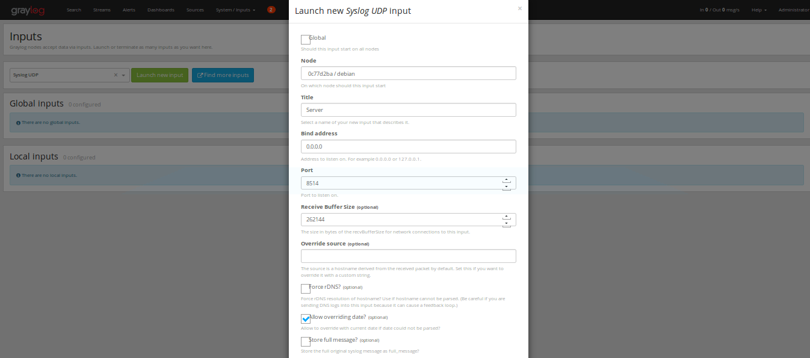
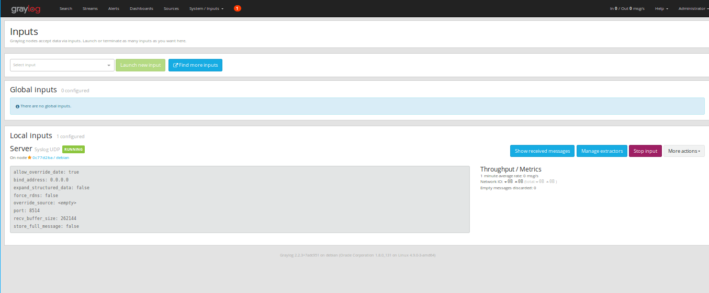
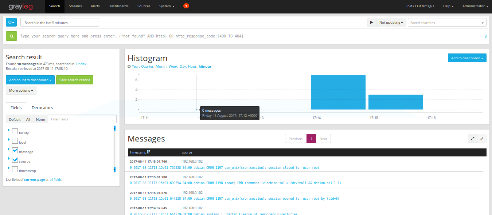

## What is Graylog?

Graylog is a powerful, free, open-source log management and analysis tool that can be used for monitoring SSH logins and unusual activity to debugging applications. It is based on Java, Elasticsearch, and MongoDB and provides a beautiful web interface for centralized log management and log analysis.

Graylog uses Elasticsearch for searching and storing the log messages, and MongoDB to store the meta information and configuration. Graylog collects, indexes and analyzes the logs from various inputs and displays them through a web interface. Compared to other log monitoring tools, Graylog is a more finished and enterprise-ready tool out of the box.

This guide shows you how to install and configure Graylog2 with Elasticsearch and MongoDB on a Debian 9 server.


The steps in this guide require root privileges. Be sure to run the steps below as `root` or with the `sudo` prefix. For more information on privileges, see our [Users and Groups](/docs/tools-reference/linux-users-and-groups) guide.


## Before You Begin

1.  Familiarize yourself with our [Getting Started](/docs/getting-started) guide and complete the steps for setting your Linode's hostname and timezone.

2.  Not all required dependencies are available in the standard repository, so you will need to add Debian Backports to the list of package sources:

        echo "deb http://ftp.debian.org/debian jessie-backports main" > /etc/apt/sour0es.list.d/backports.list

3.  Update your system:

        apt update && apt upgrade

## Prerequisites
*   Linode running Debian 9.
*   Minimum 4 GB RAM installed on your Linode.

## Install Java
Both Graylog and Elasticsearch are Java-based, so you will need to install the latest version of Java on your system.

1.  Install the latest version of Java:

        apt-get install openjdk-8-jre-headless -y

2.  Once Java is installed, check the Java version:

        java -version

    You should see the following output on your screen:

        java version "1.8.0_131"
        Java(TM) SE Runtime Environment (build 1.8.0_131-b11)
        Java HotSpot(TM) 64-Bit Server VM (build 25.131-b11, mixed mode)

3.  Install additional packages to your system:

        apt-get install apt-transport-https uuid-runtime pwgen -y

## Install and Configure Elasticsearch
Graylog uses Elasticsearch for storing the log messages and also offers a searching facility. By default, Elasticsearch is not available in Debian 9 repository. So, you will need to add Elasticsearch repository to your system.

1.  Download and install the GPG key:

        wget -qO - https://packages.elastic.co/GPG-KEY-elasticsearch | apt-key add -

2.  Add the Elasticsearch repository to apt:

        echo "deb https://packages.elastic.co/elasticsearch/2.x/debian stable main" | tee -a /etc/apt/sources.list.d/elasticsearch-2.x.list

3.  Update the repository:

        apt-get update -y

4.  After the system finishes updating, install Elasticsearch:

        apt-get install elasticsearch -y

5.  Start The Elasticsearch service, and enable the service to start on boot:

        systemctl start elasticsearch
        systemctl enable elasticsearch

6.  Next, you will need to edit `elasticsearch.yml`. It's located in the `/etc/elasticsearch/` directory:

    
cluster.name: graylog
network.host: 127.0.0.1
discovery.zen.ping.timeout: 10s
discovery.zen.ping.multicast.enabled: false
discovery.zen.ping.unicast.hosts: ["127.0.0.1:9300"]
script.inline: false
script.indexed: false
script.file: false



    
This guide uses Elasticsearch on a single server. If you are using Elasticsearch on a different server, replace the IP address 127.0.0.1 with your server IP address. Refer to the Elasticsearch documentation for security best practices.


    Save and close the file, then restart the Elasticsearch service:

        systemctl restart elasticsearch

    Make sure the restart doesn't return errors. Elasticsearch should be running properly at this point.

7.  Once Elasticsearch restarts, it should be listening on HTTP port `9200`, The cluster nodes communicate on `9300`. You can check the response by running the following command:

        curl -X GET http://localhost:9200

8.  You can also test the health of the Elasticsearch:

        curl -XGET 'http://localhost:9200/_cluster/health?pretty=true'

    
For a complete list of the REST API endpoints, refer to the [Elasticsearch documentation](https://www.elastic.co/guide/en/elasticsearch/reference/current/docs-get.html)


## Install MongoDB
Graylog uses MongoDB as a database to store meta-information and configurations. MongoDB is available in the Debian 9 repository, by default. Install MongoDB:

    apt-get install mongodb-server -y

After completing the install, proceed to installing the Graylog server.

## Install and Configure Graylog Server

In order to install the Graylog server, you need to download and install the Graylog repository to your system.

1. Download and install the Graylog repository:

        wget https://packages.graylog2.org/repo/packages/graylog-2.2-repository_latest.deb
        dpkg -i graylog-2.2-repository_latest.deb

2.  Update the Graylog repository, then install the Graylog server:

        apt-get update -y
        apt-get install graylog-server -y

3.  You will need to set a password-secret and hash password for the root user. First, set a password-secret using the `pwgen` command:

        pwgen -N 1 -s 96

    Running this will output a series random letters and numbers:

        nNPjRmvyyyPc0YKySXhkebfwUYvW2dQz7kD1GxBq7qhJre1eIAySsUbmlYNKiYZnHquHPu8pTswvc3MFSVDrwn5AmdwOSMri

    Set a hash password for the root user. Use the following command, making sure to replace `hashedpassword` with your desired password.

        echo -n hashedpassword | sha256sum

    You should see the following output:

        4c941dd2a116bf235e943771ad16c4e8877d75c597936accf168e08c5f93ce24

    
You will need this password to log in to the Graylog web interface.


4.  Open the Graylog servers main configuration file: `server.conf`, located in the `/etc/graylog/server/` directory. Replace `root_password_sha2` and `password_sercret` with the console output from above:

    
is_master = true
node_id_file = /etc/graylog/server/node-id
password_secret = nNPjRmvyyyPc0YKySXhkebfwUYvW2dQz7kD1GxBq7qhJre1eIAySsUbmlYNKiYZnHquHPu8pTswvc3MFSVDrwn5AmdwOSMri
root_username = admin
root_password_sha2 = 4c941dd2a116bf235e943771ad16c4e8877d75c597936accf168e08c5f93ce24
root_timezone = UTC
plugin_dir = /usr/share/graylog-server/plugin
rest_listen_uri = http://0.0.0.0:9000/api/
rest_enable_cors = true
web_listen_uri = http://0.0.0.0:9000/
rotation_strategy = count
elasticsearch_max_docs_per_index = 20000000
elasticsearch_max_number_of_indices = 7
retention_strategy = delete
elasticsearch_shards = 4
elasticsearch_replicas = 1
elasticsearch_index_prefix = graylog
allow_leading_wildcard_searches = true
allow_highlighting = false
elasticsearch_cluster_name = graylog
elasticsearch_discovery_zen_ping_unicast_hosts = 127.0.0.1:9300
elasticsearch_http_enabled = false
elasticsearch_network_host = 0.0.0.0
elasticsearch_discovery_initial_state_timeout = 3s
elasticsearch_analyzer = standard
output_batch_size = 500
output_flush_interval = 1
output_fault_count_threshold = 5
output_fault_penalty_seconds = 30
ring_size = 65536
inputbuffer_ring_size = 65536
inputbuffer_processors = 2
inputbuffer_wait_strategy = blocking
processbuffer_processors = 5
outputbuffer_processors = 3
processor_wait_strategy = blocking
message_journal_enabled = true
message_journal_dir = /var/lib/graylog-server/journal
async_eventbus_processors = 2
lb_recognition_period_seconds = 3
alert_check_interval = 60
mongodb_uri = mongodb://localhost/graylog
mongodb_max_connections = 1000
mongodb_threads_allowed_to_block_multiplier = 5
transport_email_enabled = true
content_packs_dir = /usr/share/graylog-server/contentpacks
content_packs_auto_load = grok-patterns.json
proxied_requests_thread_pool_size = 32



    Save the file when you are finished.
    Finally, start the Graylog server and enable it to start at boot:

        systemctl start graylog-server
        systemctl enable graylog-server

5.  Check the Graylog if the server log is working:

        tail -f /var/log/graylog-server/server.log

## Access Graylog
Graylog is now up and running, It's time to access the Graylog web interface.

1.  Open your web browser and navigate to the URL: `http://192.168.0.102:9000` where `192.168.0.102` is the public IP address of your linode. You will be redirected to the Graylog login page as shown below:

    

    
Consider limiting Graylog access to a private network, if you are deploying Graylog in a production environment. In the context of this guide, instances of `192.168.0.102` can be replaced with the Linode's public IP address to access on the browser.


2.  Provide the username `admin` and password as the `hashedpassword` generated earlier, then click on the **Sign In** button. You should see the Graylog default dashboard:

    

3.  Configure Graylog Input to receive the logs from external source. Click on *System > Inputs*. Then select **Syslog UDP** from the drop down, click on the **Launch new input** button. You should see the following image:

    

4.  Fill in all of the details shown below. When you finish click on the **Save** button, you should see the local input in the following image:

    

5.  Your Graylog input is configured and listening on port `8514`. Now, you will need to configure rsyslog to send system logs to the newly created input. To do this, edit the `rsyslog.conf` file:

    
$template GRAYLOGRFC5424,"%protocol-version% %timestamp:::date-rfc3339% %HOSTNAME% %app-name% %procid% %msg%\n"
*.* @192.168.0.102:8514;GRAYLOGRFC5424



    Save and close the file when you are finished, then restart your server with the Linode Manager to apply these changes.

6.  After restarting, log in to your Graylog server web interface and click on *System > Inputs*. Then, click on the **Show received messages** button. You should see the syslog messages in the following image:

    

### Next steps
You now have a fully configured a Graylog server. Graylog can be used to monitor logs of any size. So whether your use case is security, IT, development & devops, or anything else. Graylog will house your log data in one central location.

