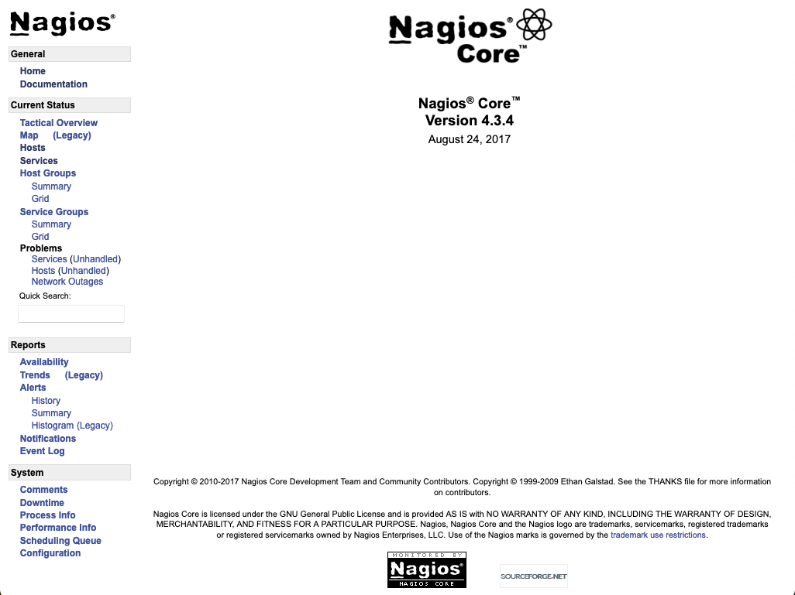
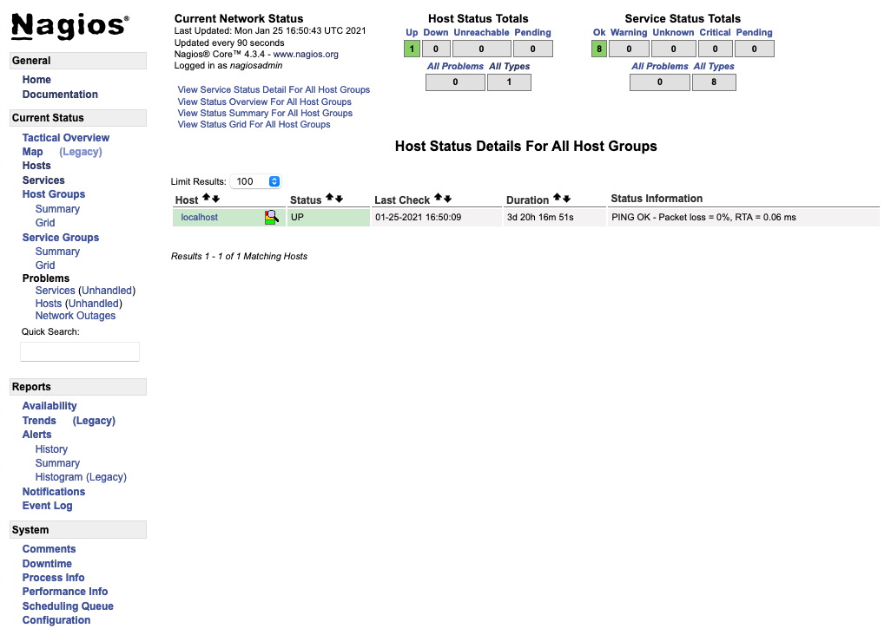
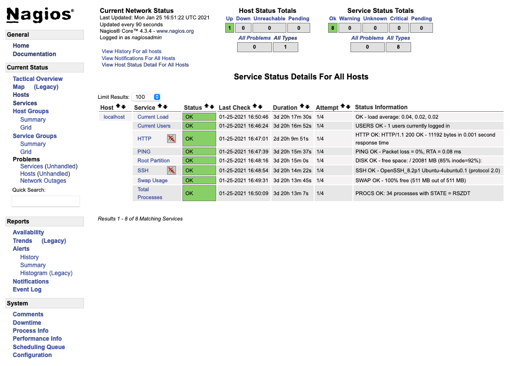

Monitoring tools play an important part in effectively operating production servers. They can help you keep tabs on a server's status and quickly catch any issues that might arise. [Nagios](https://www.nagios.com/products/nagios-core/) is a popular solution, providing monitoring and alerts for your server and the applications and services running on it. The wide array of plugins available for Nagios make it adaptable to your needs.


Nagios's official installation guide shows how to compile Nagios from source code rather than from the package manager. Installing Nagios using packages is more straightforward, but you can follow Nagios's official [installation guide](https://support.nagios.com/kb/article/nagios-core-installing-nagios-core-from-source-96.html#Ubuntu) if you would prefer to install Nagios from source code.


## Before You Begin

1.  If you have not already done so, create a Linode account and Compute Instance. See our [Getting Started with Linode](/docs/guides/getting-started/) and [Creating a Compute Instance](/docs/guides/creating-a-compute-instance/) guides.

1.  Follow our [Setting Up and Securing a Compute Instance](/docs/guides/set-up-and-secure/) guide to update your system. You may also wish to set the timezone, configure your hostname, create a limited user account, and harden SSH access.

1. Install and configure a LAMP (Linux, Apache, MySQL, and PHP) stack. Follow the [Install a LAMP Stack on Debian 10](/docs/guides/how-to-install-a-lamp-stack-on-debian-10/) or the [How to Install a LAMP Stack on Ubuntu 18.04](/docs/guides/how-to-install-a-lamp-stack-on-ubuntu-18-04/) guide for instructions.


This guide is written for a non-root user. Commands that require elevated privileges are prefixed with `sudo`. If you’re not familiar with the `sudo` command, see the [Users and Groups](/docs/guides/linux-users-and-groups/) guide.


## Create a Nagios User and User Group

1. Create a Nagios user and a `nagcmd` user group:

        sudo useradd nagios
        sudo groupadd nagcmd

1. Add both the Nagios user and the Apache2 user to the `nagcmd` user group:

        sudo usermod -aG nagcmd nagios && sudo usermod -aG nagcmd www-data

## Install Nagios

1. Install Nagios, answering any prompts you receive during the installation process:

        sudo apt install nagios4

1. You can run the following command to install additional plugins for Nagios:

        sudo apt install nagios-plugins-contrib

## Configure Apache and Nagios

1. Create the Nagios administrator user:

        sudo htdigest -c /etc/nagios4/htdigest.users "Nagios4" nagiosadmin

1. Open the Nagios configuration file for Apache in your preferred text editor, and make the changes listed below. The file should be located at `/etc/nagios4/apache2.conf`.

    - Comment out the `Require ip` line by adding a `#` to the beginning of the line. Beneath that line, add the lines shown below.
    - Under the `Files` tag, comment out the `Require all granted` line, and un-comment the `Require valid-user` line.

    
 <DirectoryMatch (/usr/share/nagios4/htdocs|/usr/lib/cgi-bin/nagios4|/etc/nagios4/stylesheets)>

# [...]

    #Require ip ::1/128 fc00::/7 fe80::/10 10.0.0.0/8 127.0.0.0/8 169.254.0.0/16 172.16.0.0/12 192.168.0.0/16
    <Files "cmd.cgi">
        AuthDigestDomain            "Nagios4"
        AuthDigestProvider          file
        AuthUserFile                "/etc/nagios4/htdigest.users"
        AuthGroupFile               "/etc/group"
        AuthName                    "Nagios4"
        AuthType                    Digest
        Require                     valid-user
        Allow from                  127.0.0.1 198.51.100.0
        #Require all                granted
        Require                     valid-user
    </Files>
  </DirectoryMatch>


    - Replace `198.51.100.0` with one or more IP addresses from which you would like to access the Nagios interface, each separated by **spaces**. You can find the IP address you are making an SSH connection from by running the `who` command.

    - This configuration limits Nagios access to users coming from a pre-approved IP address and providing valid login credentials. The changes to the `Files` section ensure that only a user with the appropriate permissions can send commands to your machine via the Nagios interface. By default, only the `nagiosadmin` user that is configured above has these permissions.

1. Open the Nagios CGI configuration file, located at `/etc/nagios4/cgi.cfg`, and set `use_authentication` to `1`.

1. Enable the `mod_rewrite`, `mod_cgi`, `mod_auth_digest`, and `mod_authz_groupfile` Apache modules:

        sudo a2enmod rewrite
        sudo a2enmod cgi
        sudo a2enmod auth_digest
        sudo a2enmod authz_groupfile

1. Restart the Apache service:

        sudo systemctl restart apache2

## Access Nagios

Use a web browser to navigate to your machine's domain name or public IP address followed by `/nagios4`. If you are accessing Nagios from the machine on which it is installed, navigate to: `localhost/nagios4`. When prompted, log in using the credentials you set up for the administrator user above (`nagiosadmin`).

- You should be greeted by the Nagios landing page.

- You can view monitoring status information by selecting **Hosts** from the menu on the left.

- You can get details on the services running and their statuses by selecting **Services** from the menu on the left.

## Next Steps

Nagios contains many features beyond the scope of this guide. Explore the Nagios administrative interface, as well as the official [Nagios 4 documentation](https://assets.nagios.com/downloads/nagioscore/docs/nagioscore/4/en/index.html), to learn more about setting up and configuring your Nagios installation.
