Most administrators want to have a comprehensive overview of how their servers are performing. Having visibility of server CPU, memory, and I/O statistics helps them discover and isolate issues before they can cause problems. [Prometheus](https://prometheus.io/) offers a robust node monitoring solution for collecting useful statistics from client nodes. In conjunction with the [Grafana](https://grafana.com/) visualization solution, Prometheus allows users to visually monitor core server statistics.

## What is Prometheus?

Prometheus is an open-source system monitoring application that collects server metrics at regular intervals. It can monitor its host server as well as external clients. Prometheus enables external performance monitoring for all clients, allowing for early detection of possible errors or unexpected behavior. Each client must run a metrics collation tool known as an *exporter* to collect and expose its internal statistics. For security reasons, Prometheus cannot monitor an external node that is not collecting data in this manner.

The Prometheus server uses the HTTP protocol to poll the client servers for the required data. It maintains a time-series database of the results, polling each client at a predefined interval. Prometheus stores the discrete snapshots along with the timestamps indicating when the statistics were retrieved. Prometheus retains the metrics it collects, allowing it to build an overview of the long-term performance of the client.

Although various statistic collectors can be used on the client nodes, Prometheus recommends its own Node Exporter tool. Prometheus Node Exporter collects a large number of hardware and kernel metrics, including CPU and memory use. A full list of the available metrics collected can be found on the [Node Exporter GitHub page](https://github.com/prometheus/node_exporter). Node Exporter is closely integrated with Prometheus and shares the same data format. No conversion or pre-processing work is required to use Node Exporter and Prometheus together. Node Exporter should be installed on every client to monitor. Node Exporter uses port `9100`, while Prometheus uses port `9090`. For more information on Prometheus, see the [Prometheus Documentation](https://prometheus.io/docs/introduction/overview/).

Some additional features of Prometheus are as follows.

- It is open source and independent of any company
- Each Prometheus server is autonomous and does not require distributed storage or a central server
- It is highly reliable and easy to install
- Different clients can be polled at different intervals
- It uses a flexible multi-dimensional data model with support for time-series data and key-value pairs
- It supports the PromQL query language for retrieving and analyzing data
- It includes the AlertManger component. AlertManager receives alerts from clients and pushes them out to different subscribers
- Prometheus can feed its metrics into visualization tools such as Grafana
- The optional Prometheus PushGateway supports the push-based metric collection
- It is customizable and supports third-party libraries
- It supports Docker containerization and Kubernetes
- Prometheus has a large and active developer and user community

## What is Grafana?

Grafana is a visualization application available in both open-source and enterprise editions. Grafana does not collect any metrics from the clients and it does not store any data. Instead, the Grafana user interface displays the metrics collected by Prometheus or another *data source* in an intuitive and visually-appealing format. Grafana presents the data using a dashboard. A dashboard is a template to define the values to display and how to display them. Most dashboards provide additional options, allowing users to exercise more control over the presentation.

Grafana supports a wide range of dashboards, including the Prometheus Node Exporter dashboard. Grafana features the approved dashboards in the [Grafana Dashboard Library](https://grafana.com/grafana/dashboards/). It also allows users to create their own panels and run their own queries on a data source. Grafana can also connect to SQL or NoSQL databases, and incident ticket applications such as Jira, and GitLab. Multiple data sources can be integrated within the same dashboard.

Grafana supports alerts, annotations, dashboard variables, plugins, and authentication. It also provides a range of analytics tools to further deconstruct the data. The Grafana web interface can be accessed using port `3000` of the host server. For best results, run Prometheus and Grafana on the same server. For more background information, see the [Introduction to Grafana](https://grafana.com/docs/grafana/latest/introduction/).

## Marketplace App
Installing a complete Prometheus and Grafana-based system is a multi-step process. To streamline deployments, you can use the [Prometheus and Grafana Marketplace App](/docs/guides/how-to-install-prometheus-and-grafana-on-ubuntu/). For a more traditional and hands-on deployment, follow the instructions below.

## Before You Begin

1.  If you have not already done so, create a Linode account and Compute Instance. See our [Getting Started with Linode](/docs/guides/getting-started/) and [Creating a Compute Instance](/docs/guides/creating-a-compute-instance/) guides.

1.  Follow our [Setting Up and Securing a Compute Instance](/docs/guides/set-up-and-secure/) guide to update your system. You may also wish to set the timezone, configure your hostname, create a limited user account, and harden SSH access.

1.  Prometheus requires 4GB of memory and 20GB of disk space and works best with at least two CPU cores.

1.  In most cases, Prometheus and Grafana are used to monitor external servers. To duplicate the configuration in this guide, create and set up a second Linode Compute Instance to use as a client.


The steps in this guide are written for non-root users. Commands that require elevated privileges are prefixed with `sudo`. If you are not familiar with the `sudo` command, see the [Linux Users and Groups](/docs/tools-reference/linux-users-and-groups/) guide.


## How to Install and Configure Prometheus, Grafana, and Node Exporter

In these instructions, the system hosting the Prometheus server is referred to as the "monitoring server". The system being monitored is a "client". It is possible to develop very complicated custom exporters and dashboards using Prometheus and Grafana. However, this guide describes a more straightforward solution for monitoring the most critical client details, including CPU, memory, and I/O usage. It does not require any knowledge of PromQL or any low-level details for either Prometheus or Grafana.

To configure the end-to-end solution, the following steps are required.

1.  Download and install Prometheus on the monitoring system.
1.  Configure Prometheus to run as a service.
1.  Install Node Exporter on all clients.
1.  Configure Prometheus to monitor the clients.
1.  Install and deploy the Grafana server.
1.  Integrate Grafana and Prometheus.
1.  Import a Dashboard for the Node Exporter Statistics.

This guide is designed for Ubuntu 22.04 LTS users but is generally applicable to the most recent Ubuntu releases.


Clients can run different releases of Ubuntu than the monitoring system and do not have to use the Ubuntu distribution. However, Node Exporter is only available for Linux.


### How to Download and Install Prometheus

Prometheus can be downloaded as a precompiled binary from the GitHub repository. The [Prometheus Downloads repository](https://prometheus.io/download/) lists the most recent release of Prometheus. The [Prometheus GitHub page](https://github.com/prometheus/prometheus) also provides instructions on how to build Prometheus from the source code or run it as a Docker container. To download Prometheus, follow these steps.

1.  Visit the [Prometheus downloads](https://prometheus.io/download/) and make a note of the most recent release. The most recent LTS release is clearly indicated on the site.

1.  Use `wget` to download Prometheus to the monitoring server. The target link has the format `https://github.com/prometheus/prometheus/releases/download/v[release]/prometheus-[release].linux-amd64.tar.gz`. Replace the string `[release]` with the actual release to download. For example, the following command downloads release `2.37.6`.

    ```command
    wget https://github.com/prometheus/prometheus/releases/download/v2.37.6/prometheus-2.37.6.linux-amd64.tar.gz
    ```

1.  Extract the archived Prometheus files.

    ```command
    tar xvfz prometheus-*.tar.gz
    ```

1.  (**Optional**) After the files have been extracted, delete the archive or move it to a different location for storage.

    ```command
    rm prometheus-*.tar.gz
    ```

1.  Create two new directories for Prometheus to use. The `/etc/prometheus` directory stores the Prometheus configuration files. The `/var/lib/prometheus` directory holds application data.

    ```command
    sudo mkdir /etc/prometheus /var/lib/prometheus
    ```

1.  Move into the main directory of the extracted `prometheus` folder. Substitute the name of the actual directory in place of `prometheus-2.37.6.linux-amd64`.

    ```command
    cd prometheus-2.37.6.linux-amd64
    ```

1.  Move the `prometheus` and `promtool` directories to the `/usr/local/bin/` directory. This makes Prometheus accessible to all users.

    ```command
    sudo mv prometheus promtool /usr/local/bin/
    ```

1.  Move the `prometheus.yml` YAML configuration file to the `/etc/prometheus` directory.

    ```command
    sudo mv prometheus.yml /etc/prometheus/prometheus.yml
    ```

1.  The `consoles` and `console_libraries` directories contain the resources necessary to create customized consoles. This feature is more advanced and is not covered in this guide. However, these files should also be moved to the `etc/prometheus` directory in case they are ever required.

    
    After these directories are moved over, only the `LICENSE` and `NOTICE` files remain in the original directory. Back up these documents to another location and delete the `prometheus-releasenum.linux-amd64` directory.
    

    ```command
    sudo mv consoles/ console_libraries/ /etc/prometheus/
    ```

1. Verify that Prometheus is successfully installed using the below command:

    ```command
    prometheus --version
    ```

    ```output
    prometheus, version 2.37.6 (branch: HEAD, revision: 8ade24a23af6be0f35414d6e8ce09598446c29a2)
    build user:       root@5f96027a7c3e
    build date:       20230220-09:36:40
    go version:       go1.19.6
    platform:         linux/amd64
    ```

### How to Configure Prometheus as a Service

Although Prometheus can be started and stopped from the command line, it is more convenient to run it as a service using the `systemctl` utility. This allows it to run in the background.

Before Prometheus can monitor any external systems, additional configuration details must be added to the `prometheus.yml` file. However, Prometheus is already configured to monitor itself, allowing for a quick sanity test. To configure Prometheus, follow the steps below.

1.  Create a `prometheus` user. The following command creates a *system user*.

    ```command
    sudo useradd -rs /bin/false prometheus
    ```

1.  Assign ownership of the two directories created in the previous section to the new `prometheus` user.

    ```command
    sudo chown -R prometheus: /etc/prometheus /var/lib/prometheus
    ```

1.  To allow Prometheus to run as a service, create a `prometheus.service` file using the following command:

    ```command
    sudo vi /etc/systemd/system/prometheus.service
    ```

    Enter the following content into the file:

    ```file {title="/etc/systemd/system/prometheus.service"}
    [Unit]
    Description=Prometheus
    Wants=network-online.target
    After=network-online.target

    [Service]
    User=prometheus
    Group=prometheus
    Type=simple
    Restart=on-failure
    RestartSec=5s
    ExecStart=/usr/local/bin/prometheus \
        --config.file /etc/prometheus/prometheus.yml \
        --storage.tsdb.path /var/lib/prometheus/ \
        --web.console.templates=/etc/prometheus/consoles \
        --web.console.libraries=/etc/prometheus/console_libraries \
        --web.listen-address=0.0.0.0:9090 \
        --web.enable-lifecycle \
        --log.level=info

    [Install]
    WantedBy=multi-user.target
    ```

    - The `Wants` and `After` options must be set to `network-online.target`.
    - The `User` and `Group` fields must both be set to `prometheus`.
    - The `ExecStart` parameter explains where to find the `prometheus` executable and defines the default options.
    - The `config.file` option defines the location of the Prometheus configuration file as `/etc/prometheus/prometheus.yml`.
    - `storage.tsdb.path` tells Prometheus to store application data in the `/var/lib/prometheus/` directory.
    - `web.listen-address` is set to `0.0.0.0:9090`, allowing Prometheus to listen for connections on all network interfaces.
    - The `web.enable-lifecycle` option allows users to reload the configuration file without restarting Prometheus.


1.  Reload the `systemctl` daemon.

    ```command
    sudo systemctl daemon-reload
    ```

1.  (**Optional**) Use `systemctl enable` to configure the `prometheus` service to automatically start when the system boots. If this command is not added, Prometheus must be launched manually.

    ```command
    sudo systemctl enable prometheus
    ```

1.  Start the `prometheus` service and review the `status` command to ensure it is `active`.

    
    If the `prometheus` service fails to start properly, run the command `journalctl -u prometheus -f --no-pager` and review the output for errors.
    

    ```command
    sudo systemctl start prometheus
    sudo systemctl status prometheus
    ```

    ```output
    prometheus.service - Prometheus
    Loaded: loaded (/etc/systemd/system/prometheus.service; enabled; vendor preset: enabled)
    Active: active (running) since Mon 2023-04-10 13:06:50 UTC; 7s ago
    ```

1.  Access the Prometheus web interface and dashboard at `http://local_ip_addr:9090`. Replace `local_ip_addr` with the address of the monitoring server. Because Prometheus is using the default configuration file, it does not display much information yet.

    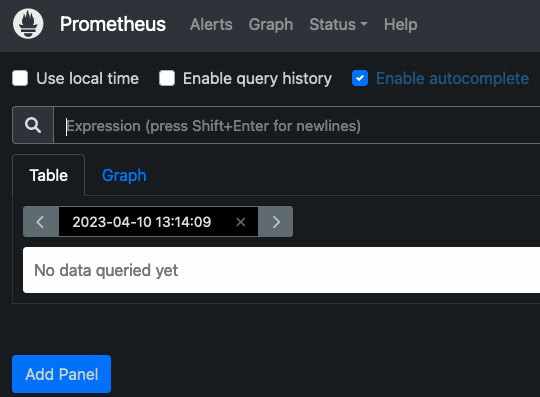

1.  The default `prometheus.yml` file contains a directive to scrape the local host. Click **Status** and **Targets** to list all the targets. Prometheus should display the local Prometheus service as the only target.

    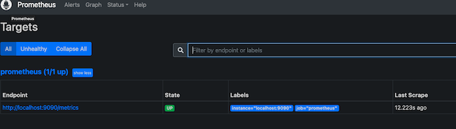

### How to Install and Configure Node Exporter on the Client

Before a remote system can be monitored, it must have some type of client to collect the statistics. Several third-party clients are available. However, for ease of use, Prometheus recommends the Node Exporter client. After Node Exporter is installed on a client, the client can be added to the list of servers to scrape in `prometheus.yml`.

To install Node Exporter, follow these steps. Repeat these instructions for every client.


When Node Exporter is running, its collection of statistics is available on port `9100`. This port is accessible on the internet and anyone running Prometheus elsewhere can potentially collect them. If you are using a firewall, you must open port `9100` using the command `sudo ufw allow 9100`.


1.  Consult the [Node Exporter section of the Prometheus downloads page](https://prometheus.io/download/#node_exporter) and determine the latest release.

1.  Use `wget` to download this release. The format for the file is `https://github.com/prometheus/node_exporter/releases/download/v[release_num]/node_exporter-[release_num].linux-amd64.tar.gz`. Replace `[release_num]` with the number corresponding to the actual release. For example, the following example demonstrates how to download Node Exporter release `1.5.0`.

    ```command
    wget https://github.com/prometheus/node_exporter/releases/download/v1.5.0/node_exporter-1.5.0.linux-amd64.tar.gz
    ```

1.  Extract the application.

    ```command
    tar xvfz node_exporter-*.tar.gz
    ```

1.  Move the executable to `usr/local/bin` so it is accessible throughout the system.

    ```command
    sudo mv node_exporter-1.5.0.linux-amd64/node_exporter /usr/local/bin
    ```

1.  (**Optional**) Remove any remaining files.

    ```command
    rm -r node_exporter-1.5.0.linux-amd64*
    ```

1.  There are two ways of running Node Exporter. It can be launched from the terminal using the command `node_exporter`. Or, it can be activated as a system service. Running it from the terminal is less convenient. But this might not be a problem if the tool is only intended for occasional use. To run Node Exporter manually, use the following command. The terminal outputs details regarding the statistics collection process.

    ```command
    node_exporter
    ```

1.  It is more convenient to run Node Exporter as a service. To run Node Exporter this way, first, create a `node_exporter` user.

    ```command
    sudo useradd -rs /bin/false node_exporter
    ```

1.  Create a service file for `systemctl` to use. The file must be named `node_exporter.service` and should have the following format. Most of the fields are similar to those found in `prometheus.service`, as described in the previous section.

    ```command
    sudo vi /etc/systemd/system/node_exporter.service
    ```

    ```file {title="/etc/systemd/system/node_exporter.service"}
    [Unit]
    Description=Node Exporter
    Wants=network-online.target
    After=network-online.target

    [Service]
    User=node_exporter
    Group=node_exporter
    Type=simple
    Restart=on-failure
    RestartSec=5s
    ExecStart=/usr/local/bin/node_exporter

    [Install]
    WantedBy=multi-user.target
    ```

1.  (**Optional**) If you intend to monitor the client on an ongoing basis, use the `systemctl enable` command to automatically launch Node Exporter at boot time. This continually exposes the system metrics on port `9100`. If Node Exporter is only intended for occasional use, do not use the command below.

    ```command
    sudo systemctl enable node_exporter
    ```

1. Reload the `systemctl` daemon, start Node Exporter, and verify its status. The service should be `active`.

    ```command
    sudo systemctl daemon-reload
    sudo systemctl start node_exporter
    sudo systemctl status node_exporter
    ```

    ```output
    node_exporter.service - Node Exporter
    Loaded: loaded (/etc/systemd/system/node_exporter.service; enabled; vendor preset: enabled)
    Active: active (running) since Tue 2023-04-11 13:48:06 UTC; 4s ago
    ```

1. Use a web browser to visit port `9100` on the client node, for example, `http://local_ip_addr:9100`. A page entitled `Node Exporter` is displayed along with a link reading `Metrics`. Click the `Metrics` link and confirm the statistics are being collected. For a detailed explanation of the various statistics, see the [Node Exporter Documentation](https://prometheus.io/docs/guides/node-exporter/).

    

### How to Configure Prometheus to Monitor Client Nodes

The client nodes are now ready for monitoring. To add clients to `prometheus.yml`, follow the steps below:

1.  On the monitoring server running Prometheus, open `prometheus.yml` for editing.

    ```command
    sudo vi /etc/prometheus/prometheus.yml
    ```

1.  Locate the section entitled `scrape_configs`, which contains a list of jobs. It currently lists a single job named `prometheus`. This job monitors the local Prometheus task on port `9090`. Beneath the `prometheus` job, add a second job having the `job_name` of `remote_collector`. Include the following information.

    - A `scrape_interval` of `10s`.
    - Inside `static_configs` in the `targets` attribute, add a bracketed list of the IP addresses to monitor. Separate each entry using a comma.
    - Append the port number `:9100` to each IP address.
    - To enable monitoring of the local server, add an entry for `localhost:9100` to the list.

    The entry should resemble the following example. Replace `remote_addr` with the actual IP address of the client.

    ```file {title="/etc/prometheus/prometheus.yml"}
    ...
    - job_name: "remote_collector"
      scrape_interval: 10s
      static_configs:
        - targets: ["remote_addr:9100"]
    ```

1.  To immediately refresh Prometheus, restart the `prometheus` service.

    ```command
    sudo systemctl restart prometheus
    ```

1.  Using a web browser, revisit the Prometheus web portal at port `9090` on the monitoring server. Select **Status** and then **Targets**. A second link for the `remote_collector` job is displayed, leading to port `9100` on the client. Click the link to review the statistics.

    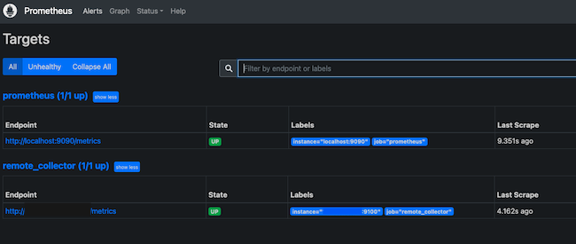

### How to Install and Deploy the Grafana Server

Prometheus is now collecting statistics from the clients listed in the `scrape_configs` section of its configuration file. However, the information can only be viewed as a raw data dump. The statistics are difficult to read and not too useful.

Grafana provides an interface for viewing the statistics collected by Prometheus. Install Grafana on the same server running Prometheus and add Prometheus as a data source. Then install one or more panels for interpreting the data. To install and configure Grafana, follow these steps.

1.  Install some required utilities using `apt`.

    ```command
    sudo apt-get install -y apt-transport-https software-properties-common
    ```

1.  Import the Grafana GPG key.

    ```command
    sudo wget -q -O /usr/share/keyrings/grafana.key https://apt.grafana.com/gpg.key
    ```

1.  Add the Grafana "stable releases" repository.

    ```command
    echo "deb [signed-by=/usr/share/keyrings/grafana.key] https://apt.grafana.com stable main" | sudo tee -a /etc/apt/sources.list.d/grafana.list
    ```

1.  Update the packages in the repository, including the new Grafana package.

    ```command
    sudo apt-get update
    ```

1.  Install the open-source version of Grafana.

    
    To install the Enterprise edition of Grafana, use the command `sudo apt-get install grafana-enterprise` instead.
    

    ```command
    sudo apt-get install grafana
    ```

1.  Reload the `systemctl` daemon.

    ```command
    sudo systemctl daemon-reload
    ```

1.  Enable and start the Grafana server. Using `systemctl enable` configures the server to launch Grafana when the system boots.

    ```command
    sudo systemctl enable grafana-server.service
    sudo systemctl start grafana-server
    ```

1.  Verify the status of the Grafana server and ensure it is in the `active` state.

    ```command
    sudo systemctl status grafana-server
    ```

    ```output
    grafana-server.service - Grafana instance
    Loaded: loaded (/lib/systemd/system/grafana-server.service; enabled; vendor preset: enabled)
    Active: active (running) since Tue 2023-04-11 17:31:53 UTC; 9s ago
    ```

### How to Integrate Grafana and Prometheus

All system components are now installed, but Grafana and Prometheus are not set up to interact. The remaining configuration tasks, including adding Prometheus as the data source and importing a dashboard panel, can be accomplished using the Grafana web interface.

To integrate Grafana and Prometheus, follow the steps below:

1.  Using a web browser, visit port `3000` of the monitoring server. For example, enter `http://local_ip_addr:3000`, replacing `local_ip_addr` with the actual IP address. Grafana displays the login page. Use the user name `admin` and the default password `password`. Change the password to a more secure value when prompted to do so.

    

1.  After a successful password change, Grafana displays the Grafana Dashboard.

    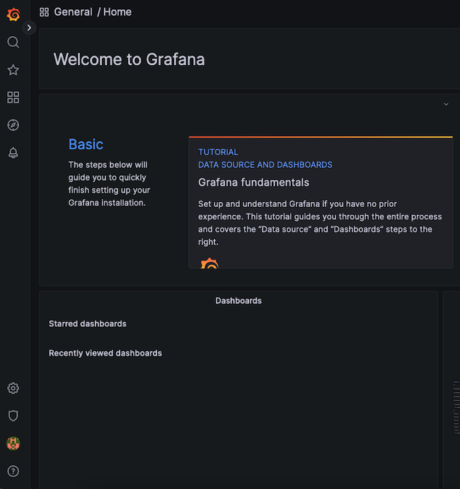

1.  To add Prometheus as a data source, click the gear symbol, standing for **Configuration**, then select **Data Sources**.

    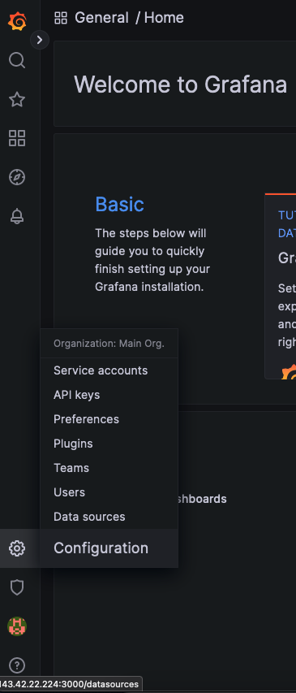

1.  At the next display, click the **Add data source** button.

    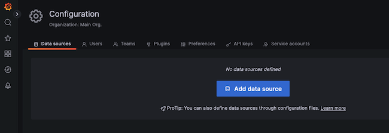

1.  Choose **Prometheus** as the data source.

    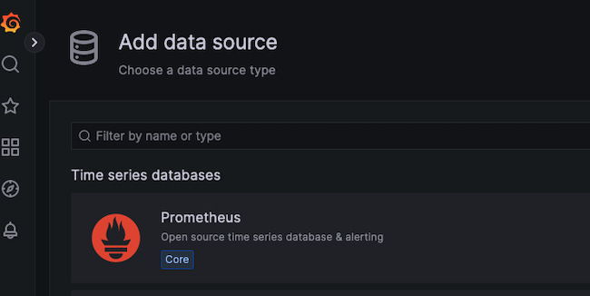

1.  For a local Prometheus source, as described in this guide, set the URL to `http://localhost:9090`. Most of the other settings can remain at the default values. However, a non-default `Timeout` value can be added here.

    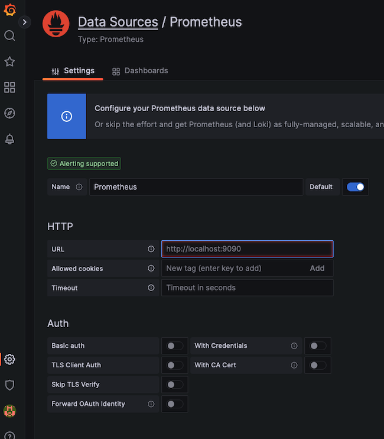

1.  When satisfied with the settings, select the **Save & test** button at the bottom of the screen.

    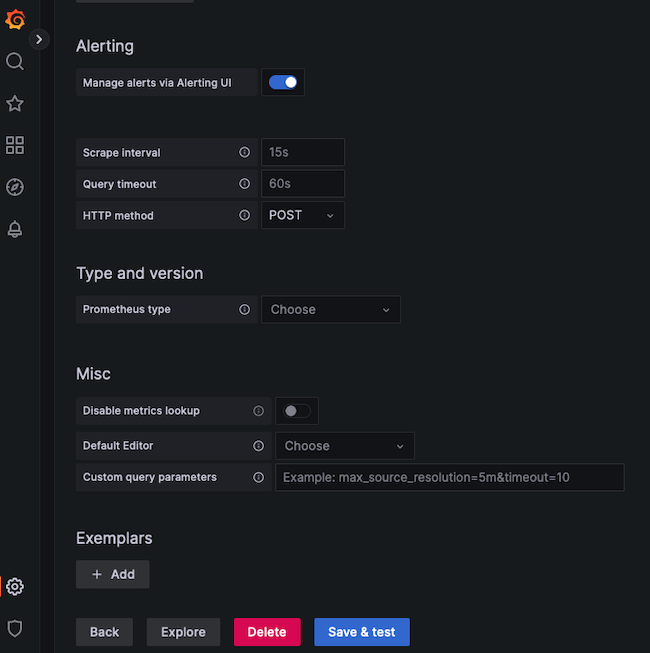

1.  If all settings are correct, Grafana confirms the `Data source is working`.

    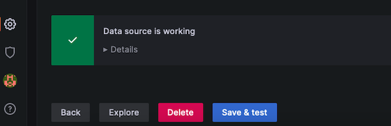

### How to Import a Grafana Dashboard

A dashboard displays statistics for the client node using a more effective and standardized layout. It is certainly possible to create a custom dashboard. However, Prometheus has already created a dashboard to support the Node Exporter statistics. The `Node Exporter Full` dashboard neatly graphs most of the values collected from the client nodes. It is much less work to import this premade dashboard than to create a custom one.

To import the Node Exporter dashboard, follow the steps below:


To create a custom dashboard, click on the **Dashboard** button, which resembles four squares. Then select **+ New Dashboard**. Consult the Grafana guide to [Building a Dashboard](https://grafana.com/docs/grafana/latest/getting-started/build-first-dashboard/) for additional information.


1.  Visit the [Grafana Dashboard Library](https://grafana.com/grafana/dashboards/). Enter `Node exporter` as the search term.

    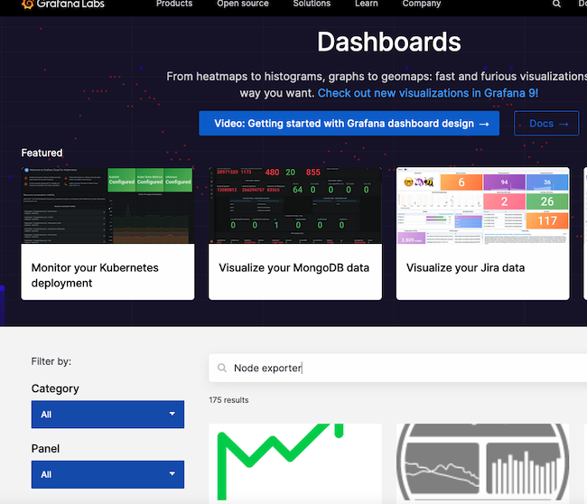

1.  Select the entry for `Node Exporter Full`.

    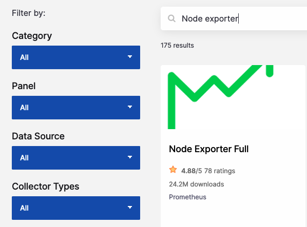

1.  Make a note of the ID number or use the button to copy the ID to the clipboard. The ID of this board is currently `1860`.

    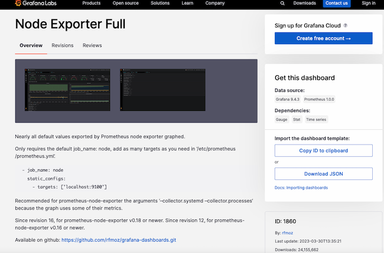

1.  Return to the Grafana dashboard. Select the **Dashboard** icon, consisting of four squares, and choose **+ Import**.

    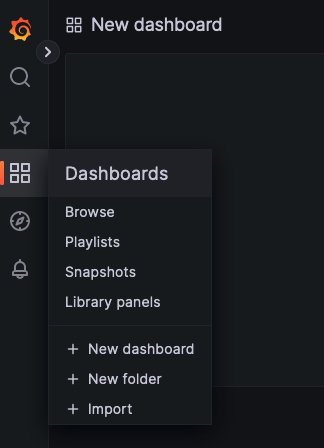

1.  In the **Import via grafana.com** box, enter the ID `1860` from the previous step. Then select the **Load** button.

    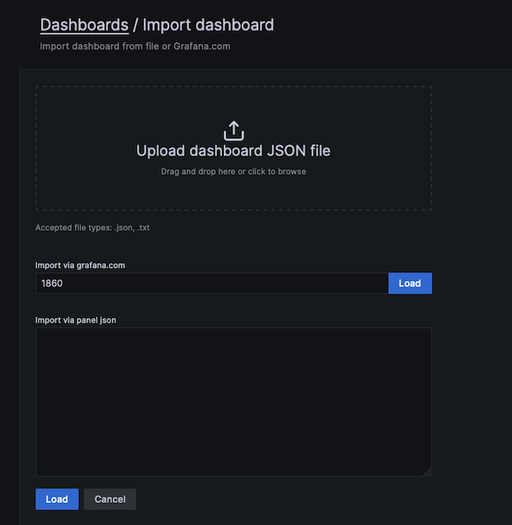

1.  At the next screen, confirm the import details. Choose `Prometheus` as the data source and click the **Import** button.

    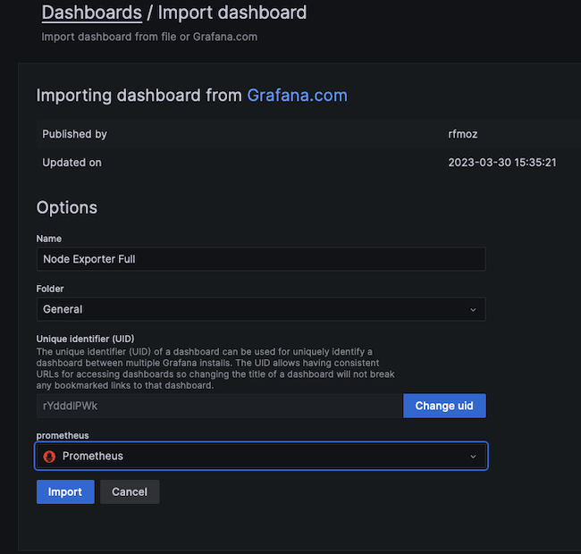

1.  The `Node Exporter Full` dashboard takes effect immediately. It displays the performance metrics and state of the client node, including the Memory, RAM, and CPU details. Several drop-down menus at the top of the screen allow users to select the host to observe and the time period to highlight.

    The following example demonstrates how a client reacts when stressed by a demanding Python program. The `CPU Busy` widget indicates how the CPU is pinned near the maximum. If this occurs during normal operating conditions, it potentially indicates more CPU power is required.

    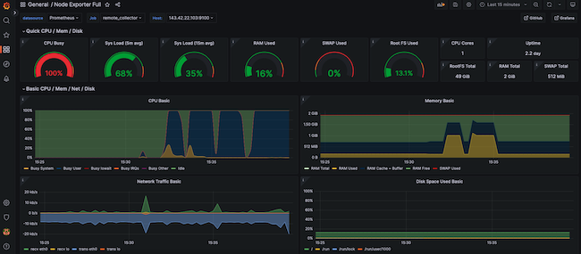

## Conclusion

Prometheus is a system monitoring application that polls client systems for key metrics. Each client node must use an exporter to collect and expose the requested data. Prometheus is most effective when used together with the Grafana visualization tool. Grafana imports the metrics from Prometheus and presents them using an intuitive dashboard structure.

To integrate the components, download and install Prometheus on a central server and configure Prometheus as a service. Install the Prometheus Node Exporter on each client to collect the data and configure Prometheus to poll the clients. Install Grafana on the same server as Prometheus and configure Prometheus as a data source. Finally, import a dashboard to display the metrics from the client. For more information on Prometheus, see the [Prometheus Overview and Documentation](https://prometheus.io/docs/introduction/overview/). Grafana can be best understood by reading the [Introduction to Grafana](https://grafana.com/docs/grafana/latest/introduction/).