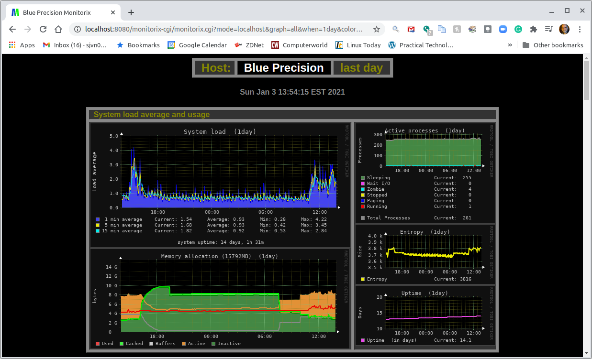
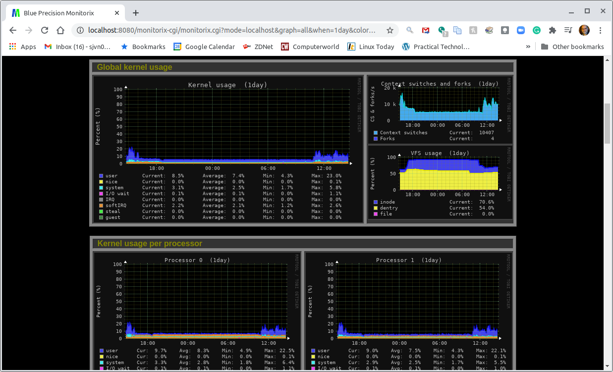
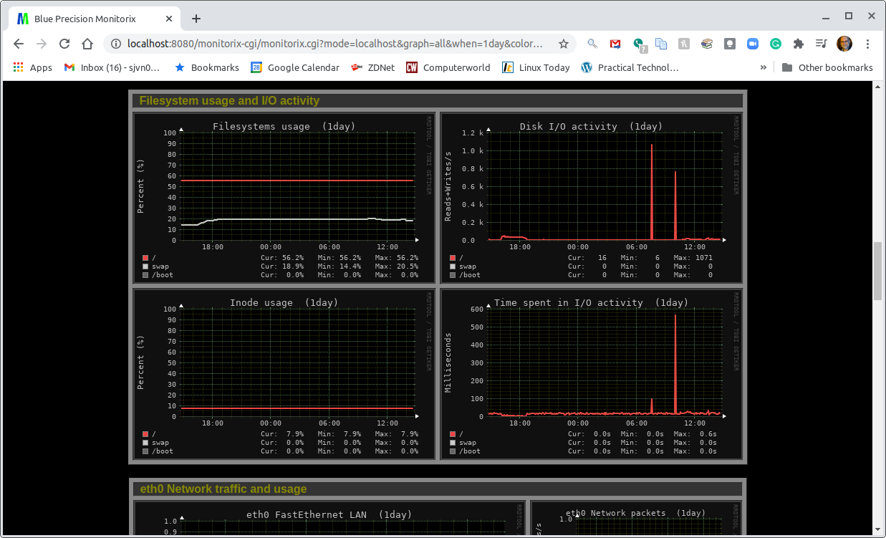
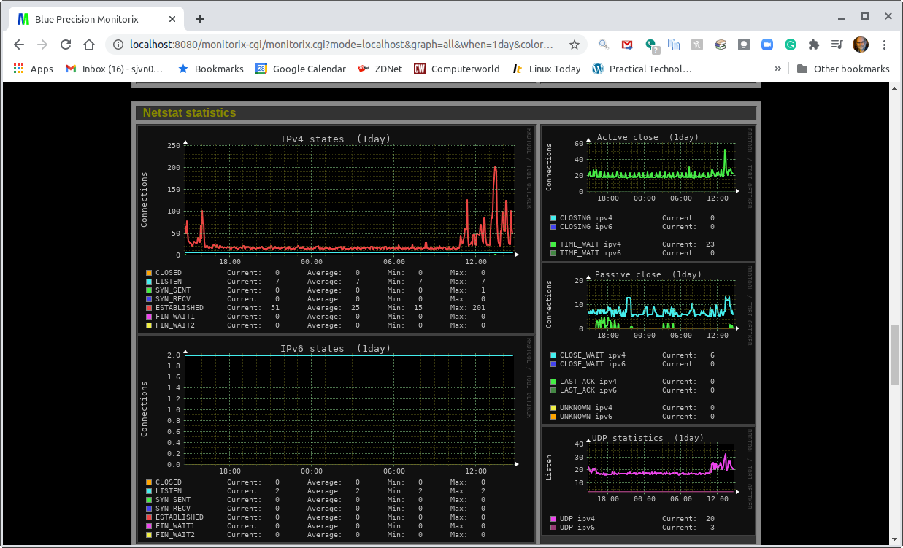
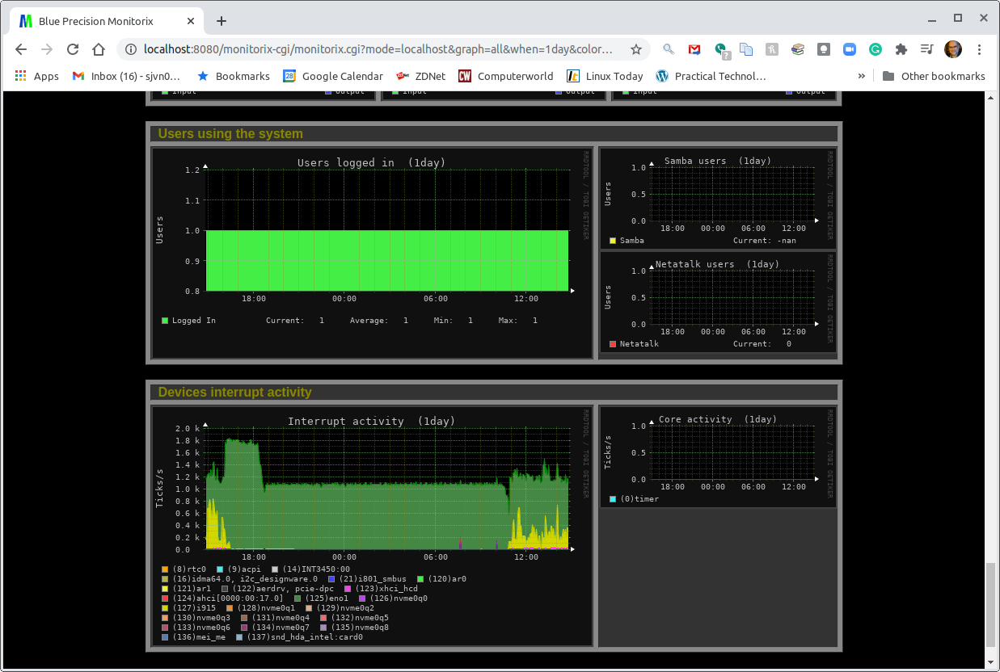

[Monitorix](https://www.monitorix.org/) is a free, open-source system monitoring tool that keeps track of several Linux services and system resources. This Linux system monitoring tool is composed of two programs. The first, monitorix, is a system data logging daemon written in [Perl](/docs/guides/development/perl/). The second, its web interface, uses the CGI script, `monitorix.cgi`.

Besides tracking Linux server elements such as overall system load, file system activity, and global kernel usage, Monitorix also tracks hardware data such as sub-system temperatures, battery status, and UPS statistics. It also monitors popular third-party Linux programs such as mail servers; [libvirt](https://libvirt.org/)-based virtual machines; and [MySQL](https://www.mysql.com/), [Nginx](/docs/guides/web-servers/nginx/), and [MongoDB](/docs/guides/databases/mongodb/) databases.

Monitorix was originally designed for the [Red Hat Enterprise Linux](https://www.redhat.com/en/technologies/linux-platforms/enterprise-linux) operating system family. Now, licensed under [GPLv2](https://www.gnu.org/licenses/old-licenses/gpl-2.0.en.html), it works on all major Linux server distributions. Beginning with version 3.0, Monitorix comes with its own web server, which is useful for remote Linux server monitoring. With its simple graphical interface, it's also good for interactive server monitoring.

## Before You Begin

If you are using a Linode, make sure you run the steps in this section to configure your Linode, secure your server, and update your system's packages.

1.  If you have not already done so, create a Linode account and Compute Instance. See our [Getting Started with Linode](/docs/products/platform/get-started/) and [Creating a Compute Instance](/docs/products/compute/compute-instances/guides/create/) guides.

1.  Follow our [Setting Up and Securing a Compute Instance](/docs/products/compute/compute-instances/guides/set-up-and-secure/) guide to update your system. You may also wish to set the timezone, configure your hostname, create a limited user account, and harden SSH access.

## Installing Monitorix

Monitorix is not installed on Linux servers by default. This section shows you how to install Monitorix on the Debian/Ubuntu Linux distributions.

1. Install Monitorix:

        sudo apt-get install monitorix

1. Monitorix ships with a default configuration file, `/etc/monitorix/monitorix.conf`. The monitorix daemon automatically reads `/etc/monitorix/monitorix.conf` and uses its settings at launch. Most of the time, the default configuration is appropriate. There are over two dozen setting groups. Most of these are for specific hardware configurations, such as NVIDIA card temperatures, file systems (e.g, [ZFS pools](https://www.ixsystems.com/blog/zfs-pools-in-freenas/)), or programs such as [sendmail](https://www.proofpoint.com/us/products/email-protection/open-source-email-solution), [Postfix](http://www.postfix.org/), and [Exim](https://www.exim.org/) mail servers. To fine-tune your installation, refer to [Monitrox's manual pages](https://www.monitorix.org/documentation.html) and edit the `/etc/monitorix/monitorix.conf` file using your preferred text editor.

    
# Monitorix - configuration file
#
# See monitorix.conf(5) manpage for a detailed description of each option.
#

title = Place a title here
hostname =
theme_color = black
refresh_rate = 150
iface_mode = graph
enable_zoom = y
netstats_in_bps = n
disable_javascript_void = n
temperature_scale = c
show_gaps = n
global_zoom = 1
max_historic_years = 1
accept_selfsigned_certs = y
image_format = PNG
enable_parallelizing = y
include_dir = /etc/monitorix/conf.d
...



Debian and Ubuntu Linux systems contain an additional configuration file, `/etc/monitorix/conf.d/00-debian.conf`. This file includes Debian/Ubuntu-specific options and is read after the main Monitorix configuration file. This means any changes you make to the `/etc/monitorix/conf.d/00-debian.conf` supersede `monitorix.conf` options.


1. Once you're done configuring Monitorix, restart the Monitorix service to enable your updates.

        sudo service monitorix restart


By default, Monitorix uses its built-in web server. However, it can be set to work with the [Apache](/docs/guides/web-servers/apache/), [Lighttpd](/docs/guides/web-servers/lighttpd/), or Nginx web servers.


## Getting started with Monitorix

Monitorix is meant to be used as an interactive program. It's not suitable for use in shell programs. In this section, you access the Monitorix graphical user interface (GUI) to view some of the monitoring information provided by Monitorix.

1. To access the Monitorix interface running on your Linode, [find your Linode's IP address](/docs/guides/find-your-linodes-ip-address/). Open a browser window and navigate to the following URL, `http://192.0.2.0:8080/monitorix`. Replace `192.0.2.0` with your own IP address.

    
If you are running Monitorix on your computer, instead, navigate to `http://localhost:8080/monitorix`.


1. Once you have accessed the Monitorix interface, select **All graphs** from the dropdown menu and click **Ok**.

    The default top graph shows system load, memory allocation, active processes, [entropy](https://hackaday.com/2017/11/02/what-is-entropy-and-how-do-i-get-more-of-it/), and uptime. This is useful for seeing the current condition of your primary CPU and memory performance.

    

    Continuing down the display are graphs showing global kernel use; kernel context switches and forks; Linux Virtual File System (VFS) usage; and kernel usage per processor/core.

    

    This is followed by a display of file system usage and I/O activity.

    

    Next, comes network activity measurements.

    

    Finally, Monitorix displays logged-in user measurements and device interrupt activity.

    

    You can change your settings in the `/etc/monitorix/monitorix.conf` file to rearrange Monitorix's Linux server monitoring charts or to add more charts.

## Beyond the Basics

- The Monitorix daemon stores its log files by default to `/var/log/monitorix`. The data within these logs are typically displayed by the built-in web server. Monitorix's default web address is `http://localhost:8080/monitorix`.

- For authentication, Monitorix uses [HTTP basic access authentication](/docs/guides/apache-access-control/#the-caveats-of-http-authentication). User passwords are set using the [htpasswd.pl script](https://docs.nginx.com/nginx/admin-guide/security-controls/configuring-http-basic-authentication/).

- The Monitorix web interface can also [monitor multiple Linux servers](https://www.monitorix.org/documentation.html#58).

- You can automate some of the data the Linux monitoring tool collects. System administrators can automatically [send selected graphs in a report to an email address](https://www.monitorix.org/documentation.html#59), for example. The default Monitorix installation also includes an example of a monitoring alert, `monitorix-alert.sh`. Use this script to [set up e-mail alerts](https://www.monitorix.org/documentation.html#8) for higher-than-expected CPU usage.

Monitorix is a useful and very flexible Linux system monitoring program. With its power to monitor the operating system, some programs, and hardware, you may find it an ideal addition to your system administrator tool kit.