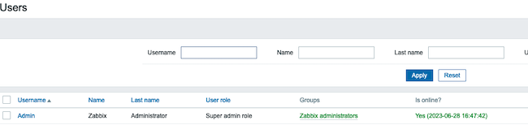

[Zabbix](https://www.zabbix.com/) is a versatile open-source monitoring tool for tracking the performance and availability of various network components. It includes an intuitive user interface and supports a powerful notification system. This guide briefly provides some background on Zabbix and explains how to configure and use it.

## What is Zabbix?

Zabbix is a distributed performance monitoring solution. It allows administrators to monitor Linux servers alongside other network devices such as servers and routers. Zabbix includes a sophisticated dashboard that provides a high-level overview of the entire network of corporate infrastructure. It prominently highlights ongoing problems and can be filtered for ease of use.

The Zabbix user interface displays a wide selection of client data. Standard profiles collect and organize common metrics including CPU and memory usage, I/O statistics, network throughput, port accessibility, and process status. Linux clients run a Zabbix agent to monitor local resources and applications. The clients transmit these reports to the Zabbix server using a standard format.

Zabbix can also collect information from non-Linux clients through a variety of protocols and methods. For example, it can use *Simple Network Management Protocol* (SNMP) messages to retrieve router information. The Zabbix server uses polling and trap notifications to collect other network statistics.

Zabbix allows users to define *triggers* based on the value of a monitored data item. A trigger activates when a predetermined threshold is exceeded or a certain condition is met, leading to a notification on the Zabbix dashboard. Triggers can also initiate actions. One possible action sends a real-time notification to administrators, so they receive an immediate alert when a problem occurs. Users can also monitor devices using the Zabbix web interface. Zabbix stores the data collection in a local database. The data can be used to better understand intermittent outages and long-term performance.

Some of the main highlights and advantages of Zabbix are as follows. See the [list of Zabbix features](https://www.zabbix.com/documentation/6.0/en/manual/introduction/features) for a more comprehensive list.

- It is available as a free open-source application.
- A flexible notification mechanism allows administrators to receive alerts via email, SMS, Slack, and other channels. Threshold definitions for alarms are fully configurable.
- It includes a customizable and intuitive GUI for data visualization. Zabbix supports real-time graphs.
- Configuration can be performed using templates and point-and-click techniques. Programming skills are not required.
- Users can store system metrics for later analysis.
- It features proxy support.
- Encryption is supported across the client-server connection.
- Zabbix is highly-scalable and can collect information from thousands of servers and devices.
- It includes a standardized API for integration with third-party applications and reporting tools.
- It is widely-used in industry and has a strong community.

## Before You Begin

1.  If you have not already done so, create a Linode account and Compute Instance. See our [Getting Started with Linode](/docs/products/platform/get-started/) and [Creating a Compute Instance](/docs/products/compute/compute-instances/guides/create/) guides.

1.  Follow our [Setting Up and Securing a Compute Instance](/docs/products/compute/compute-instances/guides/set-up-and-secure/) guide to update your system. You may also wish to set the timezone, configure your hostname, create a limited user account, and harden SSH access.

1.  The Zabbix server software must already be installed on a Linode. Consult the documentation on [Deploying Zabbix Using the Linode Marketplace](/docs/products/tools/marketplace/guides/zabbix/) for more information.


This guide is written for a non-root user. Commands that require elevated privileges are prefixed with `sudo`. If you are not familiar with the `sudo` command, see the [Users and Groups](/docs/guides/linux-users-and-groups/) guide.


## How to Configure Zabbix

To use Zabbix to monitor a Linux host, the host must be running the official Zabbix client. Configuration information can be added using the Zabbix web frontend and GUI.

### How to Install the Zabbix Server

Although Zabbix can be installed from the source code or packages, it is quicker and easier to use the Linode Marketplace. For information on how to install Zabbix using this method, see the [Zabbix Marketplace documentation](/docs/products/tools/marketplace/guides/zabbix/). Currently, the Marketplace only supports Zabbix installations on CentOS. For package installation guidelines for other Linux distributions, see the [Zabbix installation instructions](https://www.zabbix.com/documentation/6.0/en/manual/installation/install_from_packages).

### How to Install the Zabbix Client

To monitor an external host, install the Zabbix client software on the system. This allows the Zabbix server to add the device to its list of hosts. These instructions apply to Ubuntu 22.04 LTS but are generally applicable to other Linux distributions. To configure a system as a Zabbix client, follow these steps. These instructions must be executed on the system you want to monitor, not on the Zabbix server.


The Zabbix client should not use a more recent release of the client agent than the Zabbix server. The server and client should ideally run the same major release. Otherwise, performance can degrade and some features might not be available. For instance, if the server runs Zabbix 6.x, the client can use release 6.y, where y is less than or equal to x.


1.  Ensure the client system is up to date. Reboot the system if necessary.

    ```command
    sudo apt-get update -y && sudo apt-get upgrade -y
    ```

1.  Download and install the Zabbix repository. The following instructions install release 6.0 of the client agent. This aligns with the release of the Zabbix server software available in the Linode Marketplace.

    ```command
    wget https://repo.zabbix.com/zabbix/6.0/ubuntu/pool/main/z/zabbix-release/zabbix-release_6.0-4+ubuntu22.04_all.deb
    sudo dpkg -i zabbix-release_6.0-4+ubuntu22.04_all.deb
    ```

1.  Update the repository.

    ```command
    sudo apt-get update -y
    ```

1.  Use `apt` to install the `zabbix-agent` package.

    ```command
    sudo apt install zabbix-agent
    ```

1.  Restart and enable the `zabbix-agent` service.

    ```command
    sudo systemctl restart zabbix-agent
    sudo systemctl enable zabbix-agent
    ```

1.  Verify the status of the agent and ensure it is `active` to confirm that it is running correctly. If the status is not active, review the installation and configuration steps for any errors.

    ```output
    zabbix-agent.service - Zabbix Agent
    Loaded: loaded (/lib/systemd/system/zabbix-agent.service; enabled; vendor >
    Active: active (running) since Tue 2023-06-27 11:25:30 UTC; 17s ago
    ```

### How to Configure the Zabbix Client Agent

After installation, add configuration to the `zabbix_agentd.conf` file. This allows the server to recognize the client and transmit data using shared key encryption.

1.  (**Optional**) Secure the agent-server connection using a *pre-shared key* (PSK). Use the `openssl` utility to generate a PSK and save it to a file.

    
    Signed certificates from a certificate authority are even more secure but require a fully-qualified domain name for both the server and agent. For more information on this method, see the [Zabbix Certificate Encryption instructions](https://www.zabbix.com/documentation/current/en/manual/encryption/using_certificates).
    

    ```command
    sudo sh -c "openssl rand -hex 32 > /etc/zabbix/zabbix.psk"
    ```

1.  (**Optional**) Display the PSK key and ensure you save it in a secure location. This key is required to establish a secure connection with the server.

    ```command
    cat /etc/zabbix/zabbix.psk
    ```

    ```output
    268d5fa6e8ba1a0fa154d95f6b8472087d04aa45c42bef6f971d9fd107bebc0e
    ```

1.  Edit the agent configuration file at `/etc/zabbix/zabbix_agentd.conf`.

    ```command
    sudo vi /etc/zabbix/zabbix_agentd.conf
    ```

1.  Make the following changes.

    -   Change the value of `Server` and `ServerActive` to the IP address of the Zabbix server.
    -   Change the `Hostname` to the hostname of the Zabbix **server** (**not** the client's hostname). This is the server name specified at creation time in the Linode Marketplace. In this example, the hostname is `zabbixserver`.
    -   (**Optional**) To enable PSK encryption, add the following values:
    -   Set `TLSConnect` and `TLSAccept` to `psk`.
    -   Set the key name to a unique Key ID. For this example, set `TLSPSKIdentity` to `PSK 001`.
    -   Uncomment the `TLSPSKFile` line and set it to `/etc/zabbix/zabbix.psk`, which is the location of the PSK file.

1.  The `zabbix_agentd.conf` should resemble the following example. Change `server_IP` to the actual IP address of the Zabbix server. Leave the remainder of the lines unchanged.

    ```file {title="/etc/zabbix/zabbix_agentd.conf"}
    Server=server_IP
    ServerActive=server_IP
    ...
    Hostname=zabbixserver
    ...
    TLSConnect=psk
    TLSAccept=psk
    ...
    TLSPSKFile=/etc/zabbix/zabbix.psk
    TLSPSKIdentity=PSK 001
    ```

1.  Apply the changes by restarting the Zabbix agent.

    ```command
    sudo systemctl restart zabbix-agent
    ```

## How to Add a New Host to the Zabbix Server

The client is fully configured and is ready to connect to the server. To add the new host, perform the following instructions using the web interface on the Zabbix server.

1.  Click on **Configuration** to expand the configuration menu. Then click **Hosts**.

    

1.  Click the **Create host** button on the top left of the screen.

    

1.  Zabbix displays the `host` configuration page. Under the **Host** tab, add the following information. Do not save the information yet.

    -   Enter the `Hostname`. This is the hostname of the server running the agent, in this case, `zabbixtarget`.
    -   In the `Template` field, use `Linux by Zabbix agent`. Start typing this phase to narrow down the choices using auto-search.
    -   Add the server to a `group`. Choose an existing group using the **Select** button to the right of the text box. Click the name of the group and then click **Select**. In this example, the target node is added to the `Linux servers` group.
    -   Enter the IP address of the target node. Click the **Add** link under the `Interfaces` text box and select `Agent`. In the submenu, enter the IP address. Ensure `IP` is selected for the `Connect To` field.

    

1.  Select the **Encryption** tab from the top line of the configuration widget. Enter the following information.

    -   For `Connections to host`, choose `PSK`.
    -   For `Connections from host`, enter `PSK`. Deselect `No Encryption`.
    -   In the `PSK identity` field, type `PSK 001`. This is the name of the key on the target node.
    -   Enter the PSK key for the target in the `PSK` key field. This key should match the one stored in `/etc/zabbix/zabbix.psk` on the target node.

    

1.  Click the **Add** button in the lower right corner of the configuration widget to complete the configuration task. Zabbix reloads the `Hosts` page, and the new `zabbixtarget` host is displayed. The `Availability` button displays the `Connection` status. A green button indicates an active connection. It takes a minute or two to establish the connection.

    
    Due to the default polling interval, it might be necessary to refresh the page to update the information. If the button turns `Red`, click on it to review the root cause of the problem. Make any necessary changes based on the error message.
    

    

    

## How to Use Zabbix

Configure the application using the web frontend. The Zabbix Dashboard highlights the state of the network. For a more comprehensive introduction, see the [Zabbix Quickstart](https://www.zabbix.com/documentation/6.0/en/manual/quickstart) documentation.

### How to View Host Data Using Zabbix

The Zabbix frontend interface allows users to immediately view information about the new host and its monitored data. Follow the steps below to access and analyze monitoring data in Zabbix:

1.  Click **Monitoring** on the side panel, then select **Latest Data**. This view provides an overview of all available monitoring data.

    

1.  The Zabbix interface displays information from both the server and the host client. To filter the information so Zabbix only displays data for the client, click `zabbixtarget` under `Hosts`.

    

1.  Although a broad overview is sometimes useful, it is often more practical to monitor a single item. Choose an item from the list, for example, `Used space`, and click the **Graph** link to the right side of the list item. Zabbix displays a graph of the metric's history over time. Filters can be used to adjust the time frame of the display.

    

1.  Zabbix currently collects information from the host according to the `Linux by Zabbix agent` profile. This template supports a reasonably large selection of the most common system statistics. However, it is possible to monitor additional items, allowing for more targeted oversight. To add a new item to the list of attributes, click **Configuration** and then **Hosts**.

    

1.  In the row corresponding to the remote host, click on the **Items** link.

    

1.  Click on the **Create Item** button in the upper right corner of the user interface.

    

1.  In this example, the new item monitors TCP port `80` on the remote host. Provide a name for the service, such as `HTTP Connectivity`.

    -   For `Type`, choose `Zabbix Agent`.
    -   For the `Key`, specify `net.tcp.service[http,<ip>,80]`. Replace `ip` with the IP address of the agent. The HTTP service runs on TCP port `80`.
    -   If the port is accepting connections, the status is `1`. If this query returns `0`, the port is not accepting connections, so the site cannot be accessed.
    -   The default `Update Interval` is `1m`, but this can be changed.

    After adding all the details, click **Add**.

    

1.  To confirm that the new item has been added, click on **Configuration**, **Hosts**, and **Links**. The new `HTTP Connectivity` item appears in the list. The item should be `Enabled`.

    

1.  To access the data collected by the new item, select **Monitoring**, then select **Latest Data** from the left menu. The new item appears in the list.

    

1.  Click the **Graph** link to the right of the new item to see the results. The graph shows a constant historical value of `1`. This indicates that the port has continually been up and accepting connections.

    

### How to Configure Triggers

A Zabbix trigger alerts administrators to problems with a target. A trigger can generate a warning whenever a particular monitored value exceeds a threshold or matches a certain value. To create a trigger in Zabbix, follow the steps below:

1.  Click **Configuration**, and then select **Hosts**. Then, select **Triggers** in the row corresponding to `zabbixtarget`.

    

1.  This displays a list of current triggers. Click **Create trigger** in the upper right corner to create a new trigger.

    

1.  Zabbix displays a template to use to create a trigger. Provide the name `HTTP Down` for the trigger. Set the `Severity` level to `High`.

    

1.  Construct the expression using the **Add** button to the right of the `Expression` text box.

    -   For the `Item`, select the `zabbixtarget: HTTP connectivity` option.
    -   Choose the `Function` named `last()`. Set the value of `Result` to `0`. `0` indicates the port is not accepting connections and the web server is not accessible.
    -   Click **Insert** to complete the conditional expression.
    -   Select **Add** at the bottom of the window to add the new trigger.

    

1.  To ensure the trigger is functioning correctly, generate the conditions required to activate it. In this case, shut down the webserver to disable port `80`. Click **Monitoring**, then select **Problems** and wait for the alert to appear in the list of `Problems`. It can take up to a minute to raise the alert due to the configured `Update Interval`.

    
    After connectivity is restored, the status of the problem changes to `Resolved`. The `Problems` page contains filters to adjust the display criteria. `Recent Problems` displays all problems matching the timeline, including resolved issues. The `Problems` filter only lists the active issues.
    

    

1.  The problem can also be seen on the main Zabbix dashboard.

    

### How to Configure Zabbix Notifications and Alerts

Zabbix can directly notify administrators in the event of a major failure. It supports several notification methods, including email, SMS, Slack, and Jira. To configure an alert, first configure contact information for the intended user. Then add an action to send a notification to the user when the trigger fires. To set up a Zabbix alert, follow the steps below:

1.  Configure the system email settings. Click on **Administration**, then click **Media Types**.

    

1.  From the list of media types, click on **Email**.

    

1.  Enter the settings for the email relay server. The following settings illustrate the settings for the free [SMTP2Go](https://www.smtp2go.com/) SMTP relay service. Select **Update** after adding the information. Then click the **Test** link on the right side of the `Email` entry to send a test mail and confirm its reception.

    
    Settings like `SMTP Server` and `SMTP server port` are server dependent. Consult the documentation for your SMTP server to determine the correct values. Most SMTP relay servers require a username and password for authentication. This information can be added to the `Authentication` section of the form.
    

    

1.  Create a new user to send the alerts to. First, click on **Administration**, then click **Users**.

    

1.  To set up an email for the `Admin` user, click on the link labeled `Admin`.

    
    To use a different account as the email recipient, select the `Create user` button at the top right. Enter the user details before adding the email address. You must add the new user to an existing group, such as `Zabbix administrators`, before proceeding. Edit the user permissions to grant access to the appropriate Zabbix services. See the [Zabbix Quickstart User Configuration section](https://www.zabbix.com/documentation/6.0/en/manual/quickstart/login) for more details.
    

    

1.  Click the **Media** tab, then click **Add**.

    

1.  Select `Email` for the **Type** field. Enter the email address under **Send to**. Optionally, restrict the times during which notifications should be sent using the **When active** settings. Define the severity levels for which the user should receive alerts under the **Use if severity** field.

    

1.  The main `Media` page displays the new email settings. It is possible to add additional notification channels at this point. Click the **Update** button to apply these changes.

    

1.  A Zabbix action initiates the notification. To create an action, click on **Configuration** and **Actions**. Choose **Trigger Actions** from the submenu. Click **Create action** from the submenu to add a new action.

    

1.  Configure the details of the action under the **Action** tab. Provide a meaningful name for the action in the **Name** field. If the **Conditions** field is left blank, Zabbix sends notifications for all alerts. If necessary, add one or more conditions to narrow down the scope of the alert.

    

1.  Click the **Operations** link at the top of the form to specify the alert mechanism. Click **Add** in the `Operations` block. This displays the `Operations Details` form. Set the **Operation** type to `Send message`. Click **Add** inside **Send To users** to add the recipient.

    

1.  In the **Users** dialogue box, choose the correct user. In this example, select `Admin`. Click the **Select** button to add the user.

    

1.  Click **Add** to add the operation. Then click **Add** to finalize and add the entire action.

    

1.  Confirm the alert is working. Shut down the web server on the target to recreate the trigger. Zabbix raises a warning inside the `Problems` dashboard and sends an email to the administrator.

## Conclusion

Zabbix is a rich and flexible monitoring tool for servers and other network components. It allows users to receive notifications about problems using configurable thresholds and alarms. To use Zabbix, first install the Zabbix server from the Linode Marketplace. Then download and configure the Zabbix client on the target system. Hosts, items, and triggers are configured using the flexible Zabbix web interface. For more information on Zabbix, see the [Zabbix documentation](https://www.zabbix.com/documentation/6.0/en/manual).