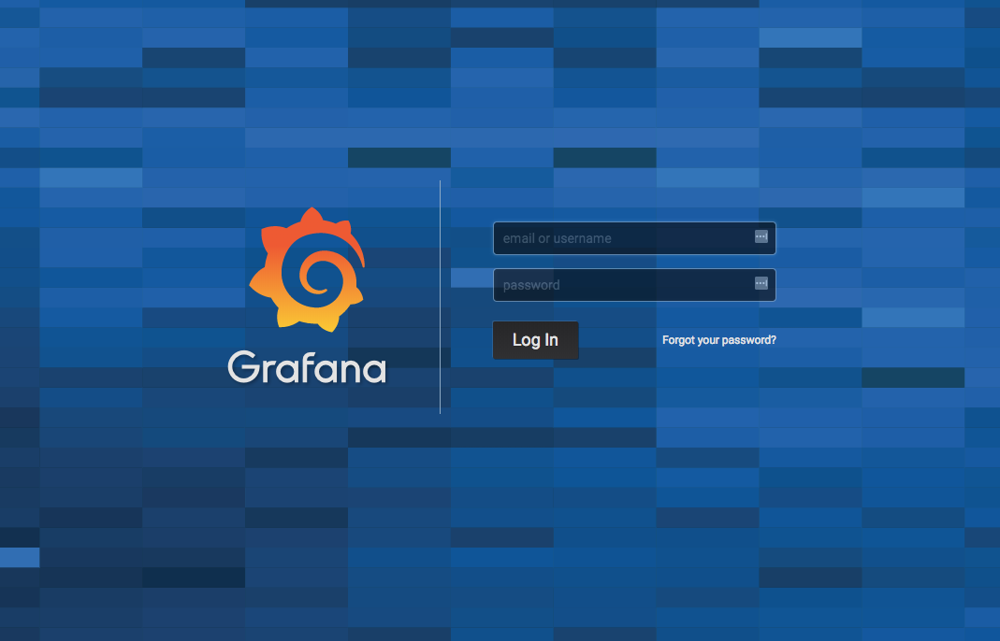
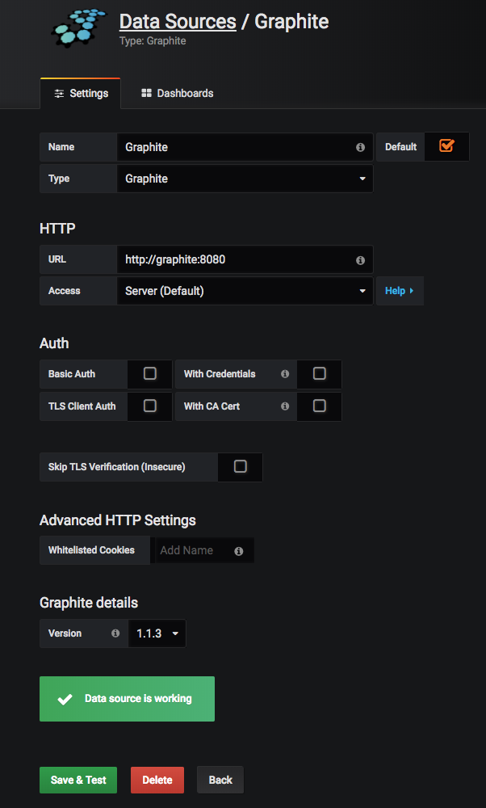
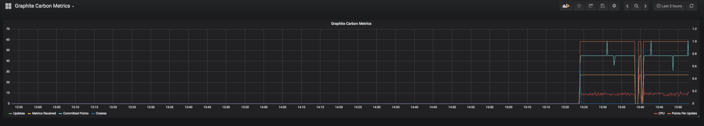
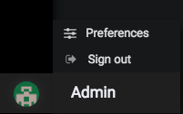

## What are Graphite and Grafana?

[Graphite](https://graphiteapp.org/) is an open-source monitoring tool for storing and viewing time series data. It does not collect data, but has a simple interface and integrates easily with [third-party tools](http://graphite.readthedocs.io/en/latest/tools.html). [Grafana](https://grafana.com/) allows you to connect to a Graphite installation (or [other data source](http://docs.grafana.org/features/datasources/#supported-data-sources)) and build dashboards to view and analyze the data.

This guide uses Docker Compose to run the official Grafana and Graphite containers and connect them to a user-defined network. This makes it easy to securely connect a Grafana dashboard to the Graphite database.

### Why use Grafana over Graphite's visualization?

Graphite has a built-in Composer for the user to [view metrics visually](https://graphiteapp.org/quick-start-guides/graphing-metrics.html) and also offers a rich [render API](https://graphite.readthedocs.io/en/latest/render_api.html). That being said, Graphite's built-in visualization is rudimentary, and the developers suggest Grafana for a "more modern UI," that is "another great way to interact with Graphite data and it offers many more visualization types than the native Composer" (see the bottom of the page at <https://graphiteapp.org/quick-start-guides/graphing-metrics.html>).

## Installing Graphite and Grafana

Both Docker and Docker Compose are necessary to complete this guide.

### Install Docker



### Install Docker Compose



## Docker Compose Configuration for Graphite and Grafana

1.  Create a directory:

        mkdir ~/grafana && cd ~/grafana

2.  In a text editor, create `docker-compose.yml` and add the following content:

    
version: "3"
services:
  grafana:
    image: grafana/grafana
    container_name: grafana
    restart: always
    ports:
      - 3000:3000
    networks:
      - grafana-net
    volumes:
      - grafana-volume

  graphite:
    image: graphiteapp/graphite-statsd
    container_name: graphite
    restart: always
    networks:
      - grafana-net

networks:
  grafana-net:

volumes:
  grafana-volume:
    external: true


    This Compose file uses the official Docker images for both Graphite and Grafana. It also specifies a network to connect the containers.

3.  Since the data volume is external, create it manually:

        docker volume create --name=grafana-volume

4.  Bring up the configuration:

        docker-compose up -d

5.  Check that both containers started successfully:

        docker ps

    
CONTAINER ID        IMAGE                         COMMAND             CREATED             STATUS              PORTS                                                                     NAMES
494e45f7ab56        grafana/grafana               "/run.sh"           19 seconds ago      Up 7 seconds        0.0.0.0:3000->3000/tcp                                                    grafana
49881363d811        graphiteapp/graphite-statsd   "/sbin/my_init"     19 seconds ago      Up 7 seconds        80/tcp, 2003-2004/tcp, 2023-2024/tcp, 8080/tcp, 8125-8126/tcp, 8125/udp   graphite


## Add a Data Source for Graphite and Create a Grafana Dashboard

1.  In a browser, navigate to port `3000` on the Linode's FQDN or public IP address (`192.0.2.0:3000`). The Grafana login page loads:

    

2.  Log in using the default admin account (username and password are both `admin`).

3.  Click **Create data source** in the main dashboard and fill in the form as follows:

    

    * **Name:** `Graphite`
    * **Type:** `Graphite`
    * **URL:** `http://graphite:8080`
    * **Access:** `Server (Default)`
    * **Version:** Select the newest available. `1.1.3` in this example.

    Click **Save & Test**.

4.  Click **New dashboard** to create and customize a new panel:

    

    * To import a sample Dashboard, try the [Internal Grafana Stats](https://grafana.com/dashboards/55).

        1.  Click **New dashboard** at the top, then **Import dashboard**.
        2.  Type `55` into the **Grafana.com Dashboard** box, and click **Load**.
        3.  Select **Graphite** in the data source dropdown, and click **Import**.

5.  Click the floppy disk icon or press **CTRL+S** to save.

6.  Click **Add users** to access the user management configuration tab.

7.  Hover over the user icon in the lower-left corner of the sidebar and click **Preferences** to open a menu where you can replace the default admin username and password with something more secure:

    

## Next Steps

Graphite does not collect data by itself. See the [Graphite documentation](http://graphite.readthedocs.io/en/latest/tools.html) for a list of third-party tools to add data for visualization. A larger, distributed deployment of Graphite may not be suitable for the containerized approach taken in this guide. If this is your use case, see their documentation on [installing Graphite from scratch](https://graphite.readthedocs.io/en/latest/).
