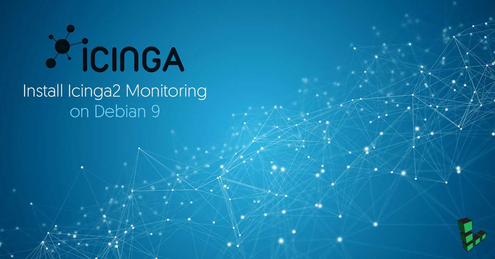
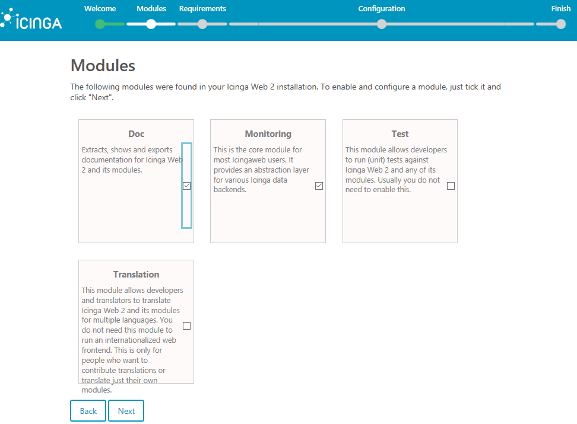
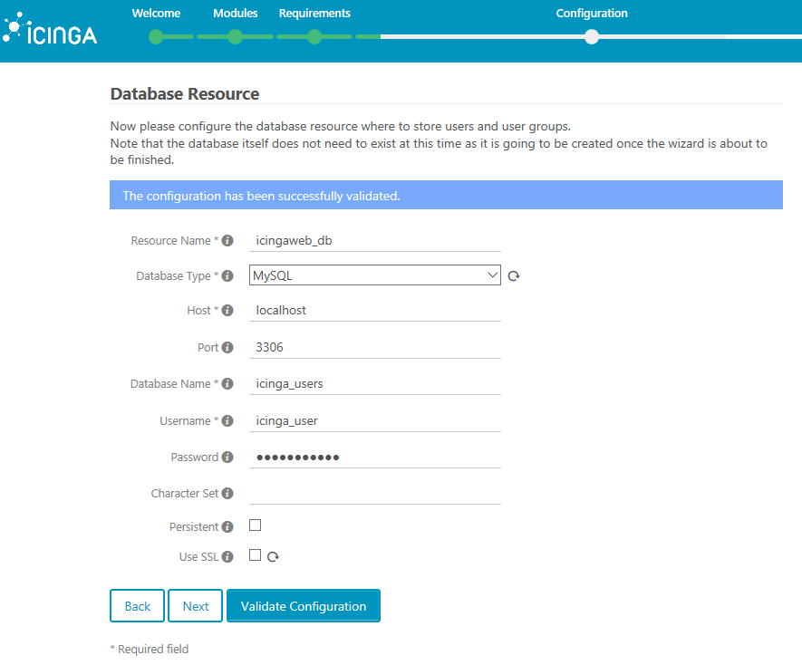
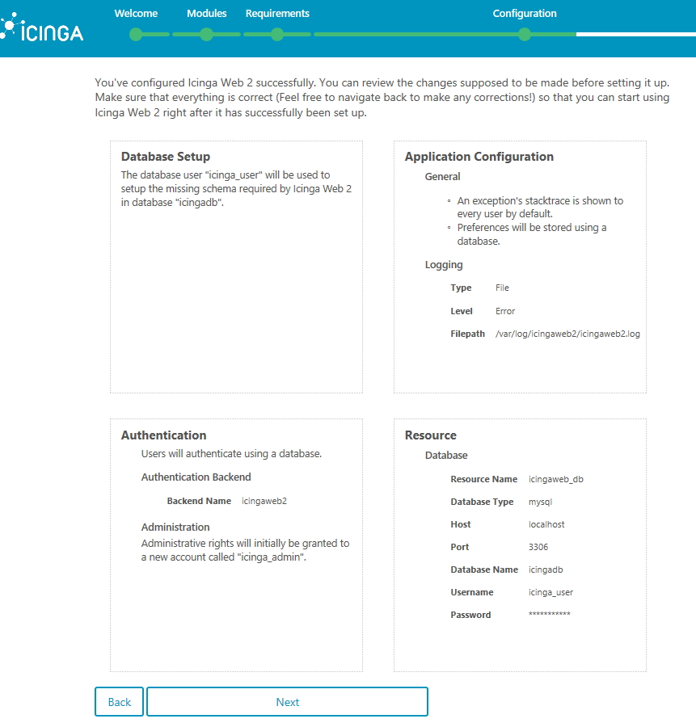
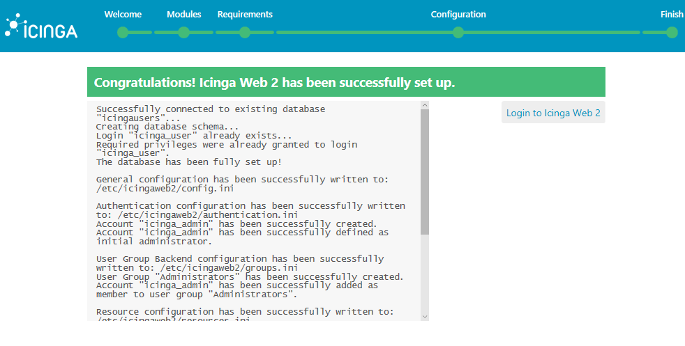
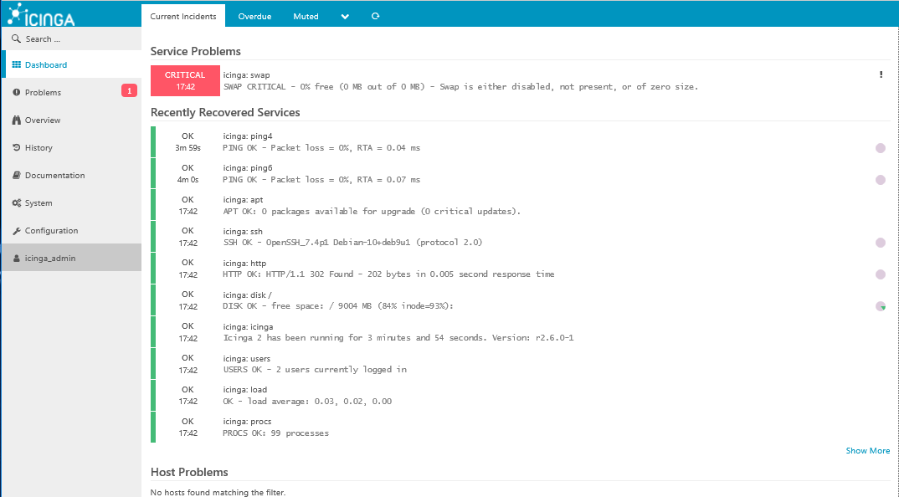

## What is Icinga 2?

Icinga, previously a fork of the popular Nagios monitoring system, is an open source network monitoring application that can be used to monitor critical services and systems on your Linode. Icinga 2 can monitor hosts on a network or it can verify network external protocols, such as the state of an HTTP server, mail server, file-sharing service, or others.

Icinga 2 can be configured to monitor internal systems' state and check the load, memory, disk free space, or other internal parameters via Icinga agents deployed on each node that needs to be monitored. Icinga can also be configured to send notifications and alerts via email or SMS to the system administrators defined in contacts.

This guide shows how to install and configure the latest version of Icinga 2 web monitoring tool on Debian 9 to monitor network infrastructure.



## Before You Begin

1.  Familiarize yourself with our [Getting Started](/docs/getting-started) guide and complete the steps for creating a Linode with Debian 9, and setting your Linode's hostname and timezone.

2.  Many of the commands in this guide require root privileges. Complete the sections of our [Securing Your Server](/docs/security/securing-your-server) to create a standard user account, harden SSH access and remove unnecessary network services. Use `sudo` wherever necessary.

3.  Configure a [LAMP Stack](/docs/guides/lamp-on-debian-8-jessie/).

4.  [Configure a mail server](/docs/email/) in order to have Icinga send email alerts.

5.  Update your system:

        sudo apt-get update && sudo apt-get upgrade

## Use OPCache to Increase Load Speed

To increase the load speed of your application via OPCache plugin available in PHP7, append the following OPCache settings at the bottom of the PHP configuration:


opcache.enable=1
opcache.enable_cli=1
opcache.interned_strings_buffer=8
opcache.max_accelerated_files=10000
opcache.memory_consumption=128
opcache.save_comments=1
opcache.revalidate_freq=1


Restart the Apache daemon to apply the new changes:

    systemctl restart apache2

## Configure Icinga 2 Databases

1.  Install the backend database needed by Icinga 2 monitoring web application and Icinga Web 2 frontend to store users, contacts and other collected data. Execute the following command to install MariaDB database and PHP module needed to access MySQL database in Debian 9:

        apt install php7.0-mysql mariadb-server mariadb-client

2.  Log in to the MySQL console and secure the MariaDB root account:

        mysql -h localhost
        use mysql;
        update user set plugin='' where user='root';
        flush privileges;
        exit

3.  Further secure the MariaDB database with the `mysql_secure_installation` script. This script will ask a series of questions designed to secure the MariaDB database: change MySQL root password, remove anonymous users, disable remote root logins, and delete the test database:

        sudo mysql_secure_installation

4.  Log back in to the database console and create the database for Icinga 2:

        mysql –u root -p

5.  Create a user with a strong password to manage Icinga 2 application database, by issuing the following commands. You should replace `icingadb`, `icinga-user`, and `strongpassword` in this example with your own database name and credentials:

        create database icingadb;
        grant all privileges on icingadb.* to 'icinga_user'@'localhost' identified by 'strongpassword';
        flush privileges

6.  Create the second MySQL database used by Icinga 2 web to store its interface users and groups. As in the previous step, replace the database name and credentials accordingly and choose a strong password for database user. You can use the same MySQL user account to manage both databases simultaneously (`icinga_user'@'localhost`):

        create database icinga_users;
        grant all privileges on icinga_users.* to 'icinga_user'@'localhost' identified by 'strongpassword';
        exit

## Install Icinga 2

Install Icinga 2 and the Icinga 2 MySQL module for accessing MariaDB database backend:

    apt install icinga2 icinga2-ido-mysql

During the installation, when asked:

*  If Icinga 2 should use the MySQL module,

    *  Choose **Yes** from the prompt.

*  To configure a database for `icinga2-ido-mysql` with `dbconfig-common` option,

    *  Choose **No** from the prompt.

After Icinga 2 has been installed, start the Icinga 2 service and check the daemon status:

    systemctl start icinga2.service
    systemctl status icinga2.service

## Install the Icinga 2 Web Interface

In order to manage Icinga 2 via the web interface, install the Icinga 2 web interface and Command Line Interface (CLI) packages:

    apt install icingaweb2 icingacli

Restart the Icinga 2 daemon and verify the Icinga 2 daemon status:

    systemctl restart icinga2.service
    systemctl status icinga2.service

Install the MySQL schema required Icinga 2 database:

    mysql -u root icingadb -p < /usr/share/icinga2-ido-mysql/schema/mysql.sql

Edit the Icinga 2 MySQL IDO configuration file and add Icinga 2 engine database credentials, as shown in the following example. Use the credentials of the first database created in the [earlier database creation step](#configure-icinga2-databases):


library "db_ido_mysql"

object IdoMysqlConnection "ido-mysql" {
  user = "icinga_user",
  password = "strongpassword",
  host = "localhost",
  database = "icingadb"
}


Save the file and restart the Icinga 2 daemon:

    systemctl restart icinga2.service

Create an Icinga Web 2 log directory and add the proper file system permissions to grant the Icinga 2 group write permissions:

    mkdir -p /var/log/icingaweb2/
    chgrp -R icingaweb2 /var/log/icingaweb2/
    chmod -R 775 /var/log/icingaweb2/

## Configure Icinga 2 via Web Interface

1.  Generate an installation token. Save it somewhere easily accessible. You will need to use it to access the Icinga 2 setup:

        icingacli setup token create

    The output of this command should be something like:

        The newly generated setup token is: 4358c2c0d345673c

    * To show the generated token in case you’ve forgotten or you haven’t noted yet:

        icingacli setup token show

2.  Open a browser on your local machine and navigate to `http://exampleIP/icingaweb2/setup`. Replace `exampleIP` with your Linode's IP address.

3.  In the first installation stage, add the token generated earlier:

    

4.  On the next screen, select and enable the **Doc** and **Monitoring** modules and press **Next** to continue:

    

5.  Icinga 2 will check your system requirements and PHP modules to see if all requirements are met before continuing with the installation and configuration process. Scroll down to the end of the page and press **Next** to continue.

6.  Choose **Authentication Type = Database**:

    

7.  Use the information from the second database created earlier to add the credentials needed to access the Icinga 2 database for storing web interface users and groups. Use `icingaweb_db` as a name for this resource and leave the **Host**, **Port** and **Character** set variables as default. Do not enable **Persistent** and **SSL** option. Press **Validate Configuration** button to validate the database. After the database has been validated successfully, press **Next** to continue to the next phase of Icinga 2’s configuration process:

    

8.  Define a name for the database authentication backend (you can use the default value) and press **Next**.

9.  Add a username with a strong password in order to log in to the Icinga 2 web interface and further manage the Icinga 2 engine and press **Next**.

10. Adjust the Icinga 2 application and logging configurations using these settings, then press **Next**:

    *  Check **Show Stacktraces**

    *  Storage Type = **Database**

    *  Logging Type = **File**

    *  Logging Level = **Error**

    *  File path = `/var/log/icingaweb2/icingaweb2.log`

11. Review the information report and press **Next** to continue:

    

12. Press **Next** to continue setting up Icinga 2 engine monitoring module.

13. Add a name for the Icinga 2 Backend, select **IDO** as Backend Type and press **Next**.

14. Add the Icinga 2 engine database credentials in order to setup the IDO resource environment. After adding the Icinga 2 database credentials, press **Validate Configuration** to validate the Icinga 2 Monitoring IDO Resource. After the **Successfully validated** message appears, press **Next**.

15. Configure the Icinga 2 Command Transport module with the following settings and press **Next**:

    *  **Transport Name** = icinga2

    *  **Transport Type** = Local Command File

    *  **Command File** = `/var/run/icinga2/cmd/icinga2.cmd`

16. Use the default values or configure the monitoring security environment variables to sensitive information and press **Next**.

17. The next screen shows a detailed report of the current configuration. A message will also show you that Icinga 2 Monitoring module has been successfully configured. Review the configuration and press **Finish** to complete the setup process.

    After the installation and setup process completes, a message informs you that Icinga Web 2 has been successfully set up.

18. Log in to Icinga Web 2 to exit the setup process and log in to Icinga Web 2 login webpage:

    

    You will be directed to the Icinga Web 2 Dashboard, where you should see the default services and Linode resources that are currently monitored by the Icinga 2 engine:

    

## Secure the Icinga Web 2 Interface Via TLS

To access Icinga 2 monitoring application via HTTPS protocol, enable the Apache SSL module, SSL site configuration file, and Apache rewrite module:

    a2enmod ssl rewrite
    a2ensite default-ssl.conf

Edit the Apache sites-enabled default configuration file and add the following lines after the `DocumentRoot` to enable URL rewrite rules:


<Directory /var/www/html>
  Options +FollowSymlinks
  AllowOverride All
  Require all granted
</Directory>


Restart the Apache daemon to apply the new configuration file:

    systemctl restart apache2

In a local browser, visit your domain name or Linode's IP address. Because you’re using the self-signed certificate generated by Apache, the browser will show an error warning. Accept the warning to access the Icinga Web 2 dashboard.

### Force Traffic through HTTPS

To force visitors to browse the Icinga Web 2 interface via HTTPS, create a new `.htaccess` file in your web root with the following:


<IfModule mod_rewrite.c>
RewriteEngine On
RewriteCond %{HTTPS} off
RewriteRule (.*) https://%{SERVER_NAME}/$1 [R,L]
</IfModule>


## Create Firewall Rules to Enable HTTPS Traffic

Add a new rule to allow HTTPS traffic to pass through the firewall.

**UFW**

    ufw allow 443/tcp

**IPtables**

    iptables -I INPUT -p tcp --destination-port 443 -j ACCEPT
    systemctl iptables-persistent save
    systemctl iptables-persistent reload

## That’s All!

You have successfully installed, set up, and secured the Icinga 2 engine monitoring application and Icinga Web 2 Interface on Debian 9.
