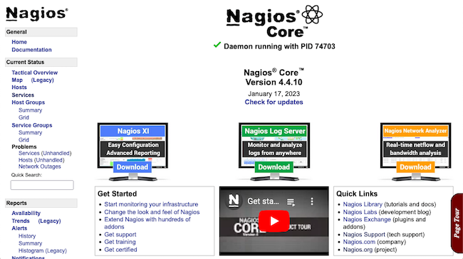
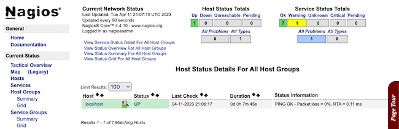
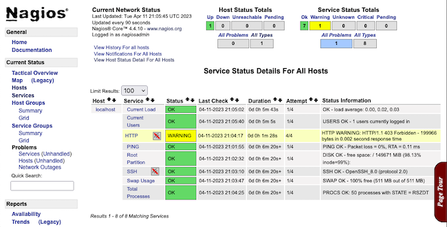

[Nagios](https://www.nagios.com/products/nagios-core/) offers a popular and powerful tool for server monitoring. With a built-in dashboard, alert and notification capabilities, and a range of plugins, Nagios can meet most needs.

Learn everything you need to get started with Nagios on CentOS, AlmaLinux, and Rocky Linux in this tutorial. Follow along to install your own Nagios instance and see how to start navigating what it has to offer.

## Before You Begin

1. If you have not already done so, create a Linode account and Compute Instance. See our [Getting Started with Linode](/docs/guides/getting-started/) and [Creating a Compute Instance](/docs/guides/creating-a-compute-instance/) guides.

1. Follow our [Setting Up and Securing a Compute Instance](/docs/guides/set-up-and-secure/) guide to update your system. You may also wish to set the timezone, configure your hostname, create a limited user account, and harden SSH access.


This guide is written for a non-root user. Commands that require elevated privileges are prefixed with `sudo`. If you’re not familiar with the `sudo` command, see the [Users and Groups](/docs/guides/linux-users-and-groups/) guide.


## How to Install Nagios

Nagios is generally available from your system's package manager, but the recommended installation path is from source. Installations from the package manager tend as a result to have hidden configuration needs, and they lack the documentation and support of installations from source.

But fret not. This tutorial breaks down the installation process to make it as clear and straightforward as it can be. Follow along here, and you should have Nagios up and running on your system soon.

Keep in mind that while the steps in this tutorial focus on CentOS 8, they should also work on AlmaLinux and Rocky Linux.

### Preparing the System

In addition to the steps in the [Before You Begin](/docs/guides/install-nagios-on-centos-8/#before-you-begin) section above, Nagios has a few more prerequisites before you start the installation.

1. Set SELinux into permissive mode. This limits SELinux to warnings rather than enforcement.

    ```command
    sudo sed -i 's/SELINUX=.*/SELINUX=permissive/g' /etc/selinux/config
    sudo setenforce 0
    ```

    You can learn more about SELinux and its role in our guide [Getting Started with SELinux on CentOS 8](/docs/guides/a-beginners-guide-to-selinux-on-centos-8/). And learn more about adjusting SELinux modes in our guide [Changing SELinux Modes](/docs/guides/how-to-change-selinux-modes/).

1. Open the HTTP and HTTPS ports on your server. Typically CentOS and similar RHEL-based systems use Firewalld for managing firewall rules. With this, you can use the commands here to open the necessary ports.

    ```command
    sudo firewall-cmd --zone=public --add-service=http --permanent
    sudo firewall-cmd --zone=public --add-service=https --permanent
    sudo firewall-cmd --reload
    ```

    See more on using Firewalld in our guide [Configure a Firewall with Firewalld](/docs/guides/introduction-to-firewalld-on-centos/).

1. Install prerequisite packages for putting together the Nagios installation.

    ```command
    sudo dnf install gcc glibc glibc-common make gettext automake autoconf gd gd-devel perl net-snmp net-snmp-utils openssl-devel epel-release wget tar
    sudo dnf --enablerepo=powertools,epel install perl-Net-SNMP
    ```

### Setting Up the LAMP Stack

Nagios leverages a LAMP stack for its base application and serving its monitoring interface. You can learn more about LAMP stacks, as well as how to set them up, in our guide [Installing a LAMP Stack on CentOS 8](/docs/guides/how-to-install-a-lamp-stack-on-centos-8/).

However, Nagios only need two parts of the LAMP stack — the Apache Web Server and PHP. Follow along here if you just want to set up these necessary parts.

1. Install and enable the Apache Web Server.

    ```command
    sudo dnf install httpd
    sudo systemctl start httpd
    sudo systemctl enable httpd
    ```

1. Install PHP.

    ```command
    sudo dnf install php php-cli
    ```

### Downloading and Installing Nagios

1. Download and extract the Nagios Core and Nagios plugins packages. You could go to the [Nagios Core releases page](https://github.com/NagiosEnterprises/nagioscore/releases/latest) and the [Nagios Plugins releases page](https://github.com/nagios-plugins/nagios-plugins/releases/latest) to manually copy the link to the latest packages for each. However, the cURL commands below expedite this, automatically pulling the latest release of each.

```command
cd /tmp
curl -s https://api.github.com/repos/NagiosEnterprises/nagioscore/releases/latest \
| grep "browser_download_url.*nagios.*.tar.gz\"" \
| tail -n 1 \
| cut -d : -f 2,3 \
| tr -d \" \
| wget -O nagios-core.tar.gz -qi -
curl -s https://api.github.com/repos/nagios-plugins/nagios-plugins/releases/latest \
| grep "browser_download_url.*nagios-plugins.*.tar.gz\"" \
| tail -n 1 \
| cut -d : -f 2,3 \
| tr -d \" \
| wget -O nagios-plugins.tar.gz -qi -
tar xzvf nagios-core.tar.gz
tar xzvf nagios-plugins.tar.gz
```

1. Change into the Nagios Core directory. You may have to adjust this command depending on the directory the Nagios Core package extracted in the step above.

    ```command
    cd nagios-4.*/
    ```

1. Compile the Nagios source files.

    ```command
    sudo ./configure
    sudo make all
    ```

1. Run the script to create the Nagios user and user group. Afterward, add the `apache` group to the `nagios` user.

    ```command
    sudo make install-groups-users
    sudo usermod -aG nagios apache
    ```

1. Install Nagios from the compiled files.

    ```command
    sudo make install
    ```

1. Install the Nagios service, command mode, and default configurations. The last command below restarts the Apache service for its configuration changes to take effect.

    ```command
    sudo make install-daemoninit
    sudo make install-commandmode
    sudo make install-config
    sudo make install-webconf
    sudo systemctl restart httpd
    ```

1. Add the `nagiosadmin` user account via `htpasswd`. Running this command prompts you to create a password for the new user account, and this is what you use later to log into the Nagios interface.

    ```command
    sudo htpasswd -c /usr/local/nagios/etc/htpasswd.users nagiosadmin
    ```

1. Start up and enable the Nagios service.

    ```command
    sudo systemctl start nagios
    sudo systemctl enable nagios
    ```

1. Change into the directory for the Nagios plugins.

    ```command
    cd /tmp/nagios-plugins-*/
    ```

1. Compile and install the Nagios plugins.

    ```command
    sudo ./configure
    sudo make
    sudo make install
    ```

## How to Start Using Nagios

With your Nagios instance installed and started up, you can access the Nagios interface from your web browser. Navigate to the path `/nagios` on your system's public IP address or configured domain.

For instance, if your public IP is `192.0.2.0`, then you would navigate to `http://192.0.2.0/nagios`. Or if your domain name for it is `example.com`, you would navigate to `example.com/nagios`.


Learn more about setting up a domain name for your system through the Linode DNS Manager with our guide [DNS Manager - Get Started](/docs/products/networking/dns-manager/get-started/). You can use other DNS managers to set up a domain name, but Linode's provides a lot of convenience. Regardless, this guide can serve as a general introduction to the process.


Your browser should prompt you to login. Use the `nagiosadmin` username and the password you set up above with the `htpasswd` command. Once logged in, you should arrive at the Nagios dashboard.

[](nagios-dashboard.png)

The interface gives you access to a wide range of monitoring tasks. You might start off looking to the **Hosts** page to get an overview of hosts monitored by your Nagios instance.

[](nagios-hosts.png)

At present, this only has one host, `localhost`. More hosts can be added, either by setting up Nagios to [monitor publicly-available services](https://assets.nagios.com/downloads/nagioscore/docs/nagioscore/4/en/monitoring-publicservices.html) or setting up [NRPE](https://assets.nagios.com/downloads/nagioscore/docs/nagioscore/4/en/monitoring-linux.html).

Another useful page to start out with is **Services**, which overviews the services running for all hosts Nagios is monitoring.

[](nagios-services.png)

## Conclusion

Now you have your own Nagios instance running. Exploring the dashboard's myriad options can give you some good ideas of Nagios's capabilities. And you can take a look at the Nagios Core documentation linked below to continue exploring and making the most out of your instance.
