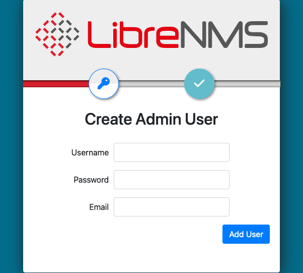
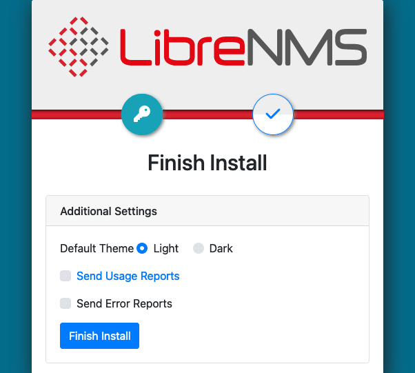
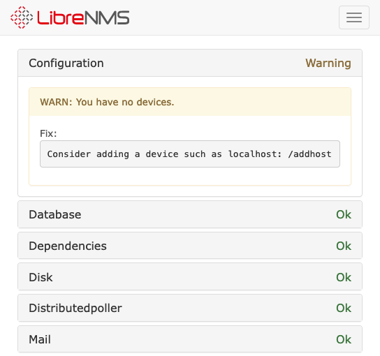
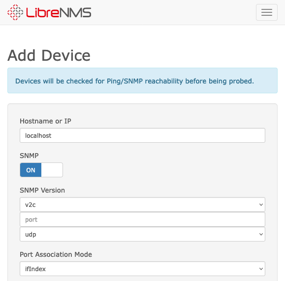
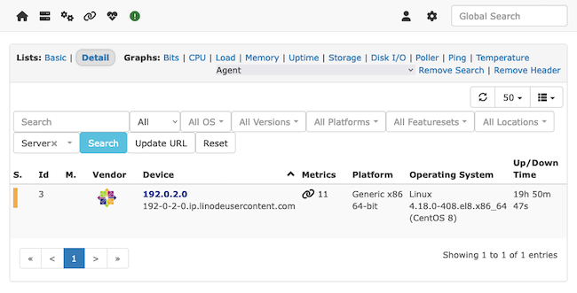
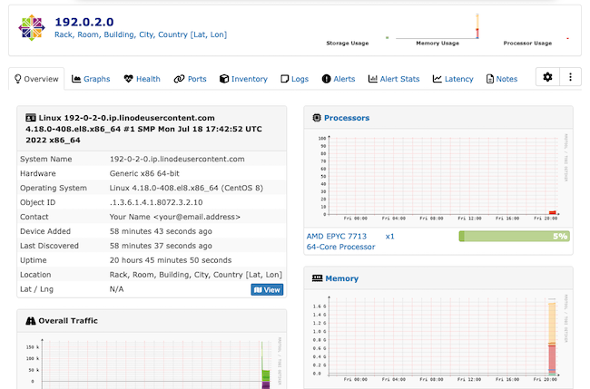
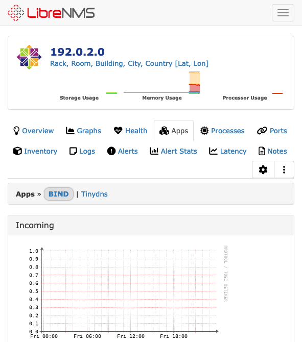

[LibreNMS](https://www.librenms.org/) is an open-source network monitoring tool with a wide range of features including auto-discovery and alerting. Moreover, LibreNMS can run on a wide range of systems and can leverage numerous networking protocols.

Learn through this guide how to set up a LibreNMS instance with Docker, how to deploy agents for monitoring, and how to navigate the interface.

## Before You Begin

1. If you have not already done so, create a Linode account and Compute Instance. See our [Getting Started with Linode](/docs/guides/getting-started/) and [Creating a Compute Instance](/docs/guides/creating-a-compute-instance/) guides.

1. Follow our [Setting Up and Securing a Compute Instance](/docs/guides/set-up-and-secure/) guide to update your system. You may also wish to set the timezone, configure your hostname, create a limited user account, and harden SSH access.


The steps in this guide are written for non-root users. Commands that require elevated privileges are prefixed with `sudo`. If you’re not familiar with the `sudo` command, see the [Lunix Users and Groups](/docs/guides/linux-users-and-groups/) guide.


## How to Install LibreNMS

LibreNMS provides two main installation methods. The first involves manually installing and configuring LibreNMS and all of its dependencies, including a MySQL/MariaDB instance and an Nginx reverse proxy.

This first method is covered thoroughly and clearly in the LibreNMS [installation documentation](https://docs.librenms.org/Installation/Install-LibreNMS/).

The second method is to use Docker Compose to deploy LibreNMS and its dependencies together in a set of networked Docker containers. This method provides a clean and approachable way to get started with LibreNMS.

This guide covers the second method, using Docker Compose. The following sections walk you through all of the necessary steps for getting LibreNMS running with Docker Compose on your system.

### Install Docker and Docker Compose

You first need to install Docker and Docker Compose to be able to run LibreNMS as covered in this guide.

These next sets of steps show you how to install Docker with the Docker Compose plugin on Debian and Ubuntu and CentOS and Fedora systems. For other operating systems and distributions, refer to the [official instructions](https://docs.docker.com/engine/install/#server) for installing Docker Engine along with the Docker Compose plugin.

#### On Debian and Ubuntu

1. Remove any existing Docker installations.

    ```command
    sudo apt remove docker docker-engine docker.io containerd runc
    ```

1. Install the prerequisite packages for adding the Docker repository to the APT package manager.

    ```command
    sudo apt install ca-certificates curl gnupg lsb-release
    ```

1. Add the GPG key for the Docker repository to the APT package manager. Replace `debian` in the URL in this command with `ubuntu` if you are on an Ubuntu distribution.

    ```command
    sudo mkdir -m 0755 -p /etc/apt/keyrings
    curl -fsSL https://download.docker.com/linux/debian/gpg | sudo gpg --dearmor -o /etc/apt/keyrings/docker.gpg
    ```

1. Add the Docker repository to the APT package manager. Again, replace `debian` in the command's URL with `ubuntu` if you are on an Ubuntu distribution.

    ```command
    echo "deb [arch=$(dpkg --print-architecture) signed-by=/etc/apt/keyrings/docker.gpg] https://download.docker.com/linux/debian $(lsb_release -cs) stable" | sudo tee /etc/apt/sources.list.d/docker.list > /dev/null
    ```

1. Update the APT indices, and install the Docker Engine along with the Docker Compose plugin.

    ```command
    sudo apt update
    sudo apt install docker-ce docker-ce-cli containerd.io docker-buildx-plugin docker-compose-plugin
    ```

#### CentOS and Fedora

1. Remove any existing Docker installations.

    ```command
    sudo dnf remove docker docker-client docker-client-latest docker-common docker-latest docker-latest-logrotate docker-logrotate docker-selinux docker-engine-selinux docker-engine
    ```

1. Install the core plugins for the DNF package manager. These give you access to tools for managing DNF repositories.

    ```command
    sudo dnf -y install dnf-plugins-core
    ```

1. Add the Docker repository to the DNF package manager. Replace `centos` in the URL in this command with `fedora` if you are on a Fedora distribution.

    ```command
    sudo dnf config-manager --add-repo https://download.docker.com/linux/centos/docker-ce.repo
    ```

1. Install the Docker Engine along with the Docker Compose plugin.

    ```command
    sudo dnf install docker-ce docker-ce-cli containerd.io docker-buildx-plugin docker-compose-plugin
    ```

    You may be prompted to verify the GPG key, and you should see the following key listed.

    ```output
    060A 61C5 1B55 8A7F 742B 77AA C52F EB6B 621E 9F35
    ```

#### Complete the Installation

Following either installation path, you can ensure that the Docker daemon is running using the command below:

```command
sudo systemctl status docker
```

```output
● docker.service - Docker Application Container Engine
   Loaded: loaded (/usr/lib/systemd/system/docker.service; enabled; vendor preset: disabled)
   Active: active (running) since Thu 2023-02-16 20:38:07 UTC; 1s ago
     Docs: https://docs.docker.com
```

If it is not running (`active`), enable and start the Docker daemon with the following commands:

```command
sudo systemctl enable docker
sudo systemctl start docker
```

### Install LibreNMS via Docker Compose

With the Docker requirements installed, you can gather the LibreNMS setup and start running the LibreNMS containers on your system.

1. Create a directory for the LibreNMS Docker setup, and change into that directory. This guide creates a `librenms-docker` directory within the current user's home directory.

    ```command
    mkdir ~/librenms-docker/
    cd ~/librenms-docker/
    ```

1. Download the LibreNMS Docker repository as a zip archive, and unzip that archive.

    You may first need to install the `wget` and `unzip` tools. Both are typically available from the package manager on most Linux distributions.

    ```command
    wget https://github.com/librenms/docker/archive/refs/heads/master.zip
    unzip master.zip
    ```

1. (Optional) This guide uses the default Docker Compose setup for LibreNMS. Generally, the default setup covers many use cases and is especially useful for starting out with LibreNMS.

    However, this is where you can customize the Docker Compose deployment before starting up your LibreNMS instance. You would do so by modifying the `librenms.env` and `docker-compose.yml` files within the `docker-master/examples/compose/` directory.

    Refer to the [librenms/docker](https://github.com/librenms/docker) documentation for thorough coverage of supported environment variables and configuration options.

1. Change into the directory containing the Docker Compose configuration — `docker-master/examples/compose` — and run the `docker compose up` command to start running LibreNMS.

    ```command
    cd docker-master/examples/compose
    sudo docker compose up -d
    ```

1. To allow external access to the LibreNMS interface, you should open port `8000` on your system's firewall. Refer to our [Setting Up and Securing a Compute Instance](/docs/products/compute/compute-instances/guides/set-up-and-secure/#configure-a-firewall) guide for information on managing firewalls.

    Follow that guide to verify which firewall tool your system is using and to ensure that the tool is active. Then, use the commands below to open port `8000`.

    - **Debian** and **Ubuntu** typically include the UFW tool. Using it, you can open the port with the following command:

        ```command
        sudo ufw allow 8000/tcp
        ```

    - **CentOS**, **Fedora**, and similar distributions typically include the firewalld tool. Using it, you can open the port with the  following commands:

        ```command
        sudo firewall-cmd --zone=public --add-port=8000/tcp --permanent
        sudo firewall-cmd --reload
        ```

## How to Use LibreNMS

Your LibreNMS instance is now running on your system's port `8000`. Open the interface in your web browser by navigating to that port on your system's public IP address.

For instance, if your system's public IP address is `192.0.2.0`, you would navigate to `192.0.2.0:8000` in your web browser.

The interface directs you to conduct the initial setup the first time you access it. Follow along with the next section to walk through that setup, and then read further on for details on using and navigating LibreNMS for monitoring.

### Complete the Setup

Upon first accessing the interface, LibreNMS presents you with a form to create an administrator user for the instance. Do this by providing a username, password, and email address for the administrator user on the instance.



From there, select the checkmark button at the top of the page to navigate to the last setup step. Indicate the features you would like, and select the **Finish Install** button to complete the initial setup.



The interface takes you to the login page, where you can log in using the administrator user you created. This takes you to the validation page, with an overview of system features LibreNMS has been able to verify.



### Deploy a LibreNMS Agent

To start monitoring, you first need a LibreNMS-compatible agent on the system you want to monitor.

This section of the guide shows you how to set up an agent. Specifically, this section walks you through installing SNMP on your system and deploying LibreNMS's `distro` agent to get information about the distribution.

The easiest system to start with this is the one running LibreNMS, which is what this guide assumes. However, you can also take these steps on another system as well to prepare it for LibreNMS monitoring.

Afterward, follow along with the next section to connect to the device from within LibreNMS.

1. Install SNMP to your system. This protocol allows LibreNMS to get information about the system.

    - On **Debian** and **Ubuntu**, install the SNMP tools with the following command:

        ```command
        sudo apt install snmp snmpd
        ```

    - On **CentOS**, **Fedora**, and similar distributions, install SNMP tools with the following command:

        ```command
        sudo dnf install net-snmp net-snmp-utils
        ```

1. Customize the SNMP configuration, located at `/etc/snmp/snmpd.conf`. For this guide, you should replace the default configuration with the example configuration you can find within the LibreNMS repository.

    ```command
    sudo mv /etc/snmp/snmpd.conf /etc/snmp/snmpd.conf.old
    sudo curl -o /etc/snmp/snmpd.conf https://raw.githubusercontent.com/librenms/librenms/master/snmpd.conf.example
    ```

1. Open that configuration file, and replace `RANDOMSTRINGGOESHERE` with a community name for the SNMP instance. The default for the Docker installation is `librenmsdocker`, which is what this guide assumes. But you can use whatever community name you would like.

1. Replace the information in the `syslocation` and `syscontact` lines with the information you would like to associate with the system. The example configuration includes descriptive placeholder values to guide you, but you can alter these fields how you wish.

1. Download the `distro` binary, which provides distribution information via SNMP, and make the binary executable.

    ```command
    sudo curl -o /usr/bin/distro https://raw.githubusercontent.com/librenms/librenms-agent/master/snmp/distro
    sudo chmod +x /usr/bin/distro
    ```

1. Download the `librenms-agent` repository. You may first need to install Git through your system's package manager.

    ```command
    git clone https://github.com/librenms/librenms-agent.git
    ```

1. Copy the `check_mk` agent from the repository into your system's path, and give it executable privileges.

    ```command
    sudo cp librenms-agent/check_mk_agent /usr/bin/check_mk_agent
    sudo chmod +x /usr/bin/check_mk_agent
    ```

1. Copy the `check_mk` service into a systemd service location.

    ```command
    sudo cp librenms-agent/check_mk@.service check_mk.socket /etc/systemd/system
    ```

1. Create a directory for the `check_mk` agent's script files and plugins.

    ```command
    sudo mkdir -p /usr/lib/check_mk_agent/local /usr/lib/check_mk_agent/plugins
    ```

1. The LibreNMS agent includes a number of monitoring scripts that can be used by the `check_mk` agent. These scripts are located in the `agent-local/` directory of the agent repository.

    Move those of the scripts you want to use into the `/usr/lib/check_mk_agent/local/` directory and give them executable privileges. This example copies all of the agent script files.

    ```command
    sudo cp librenms-agent/agent-local/* /usr/lib/check_mk_agent/local/
    sudo rm /usr/lib/check_mk_agent/local/README
    sudo chmod +x /usr/lib/check_mk_agent/local/*
    ```

1. Enable and start the `snmpd` service and the `check_mk` LibreNMS agent.

    ```command
    sudo systemctl enable snmpd
    sudo systemctl enable check_mk.socket
    sudo systemctl start snmpd
    sudo systemctl start check_mk.socket
    ```

### Add a Device to LibreNMS

Once you have SNMP and an agent deployed on the system you want to monitor, you can add that system within the LibreNMS interface.

1. Access the LibreNMS interface as covered further above.

1. Navigate to **Devices > Add Device** from the menu at the top of the page. This takes you to a form for adding a new device to LibreNMS.

    

1. Complete the form for adding a new device with the information as follows.

    - Enter the public IP address for the system in the **Hostname or IP** field.

    - Enter `librenmsdocker` for the **Community** field, or whatever community value you provided within the SNMP configuration.

    - Leave all other settings at their default values.

1. Select the **Add Device** button to add the system to your LibreNMS instance.

### Monitor Devices

Now you should be able to review information about the device within the LibreNMS interface.

Access the **Devices > All Devices** option from the menu at the top of the page. You may first have to refresh the page or navigate to another page.

The resulting page lists all of the devices you have connected to the LibreNMS instance.

[](librenms-device-list.png)

Selecting the device takes you to a page with extensive information about the system and its performance.

[](librenms-device-overview.png)

The tabs provide you with a range of areas to review the device on. Having set up the LibreNMS `check_mk` agent, you should be able to find a range of automatically discovered applications within the **Apps** tab.



You can use the cog icon from the upper right of the device page to manage the device within LibreNMS. From here, you can start extending your monitoring into LibreNMS's many other features.

For instance, use the **Alert Rules** tab to add alert conditions for the device. LibreNMS provides an option for setting up a default set of alert rules, but you can also create completely custom rules.

## Conclusion

This guide covers everything you need to start running and making the most of LibreNMS on your system. There is plenty more to build on from here though. Be sure to peruse the official documentation links below to begin customizing your LibreNMS instance to fit your needs. And from there you can learn more about LibreNMS's wide set of features and how to incorporate them.
