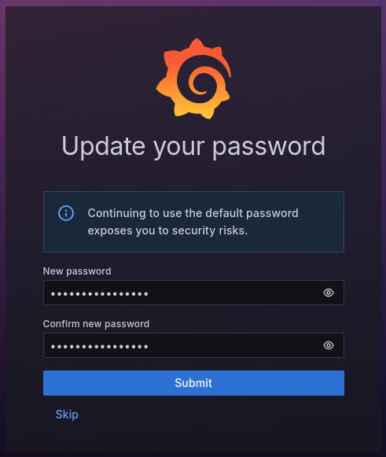
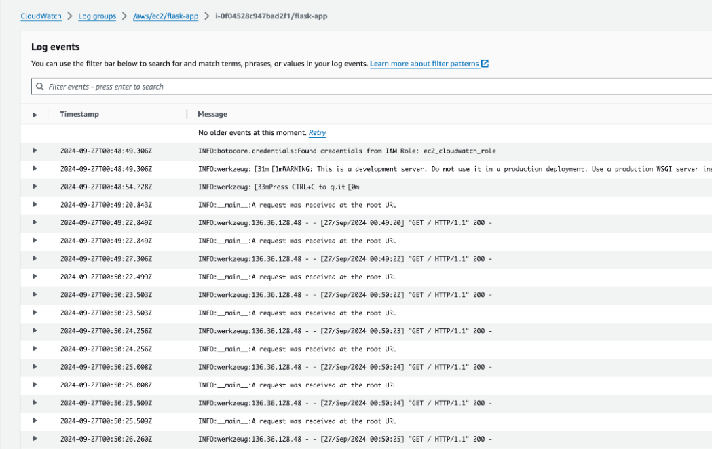
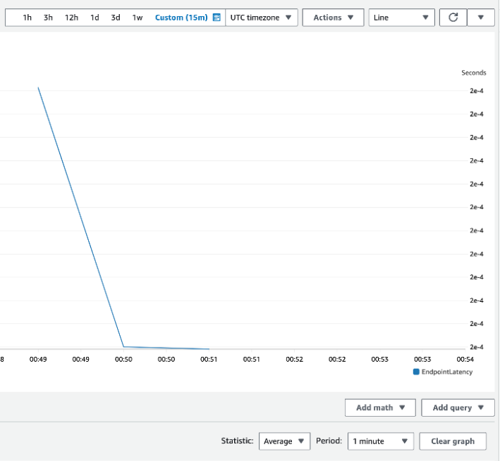
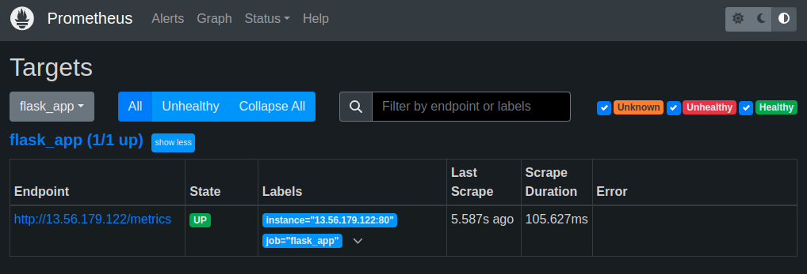
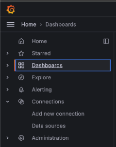
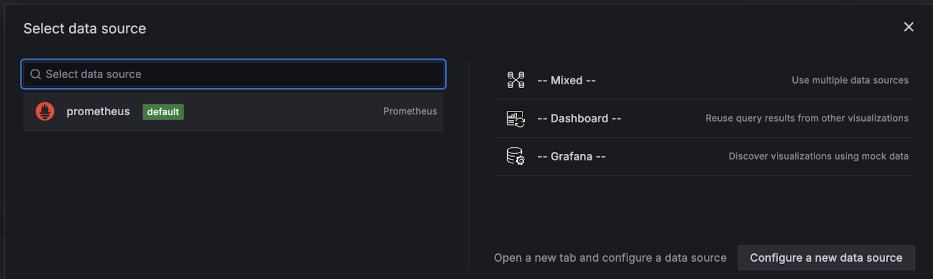
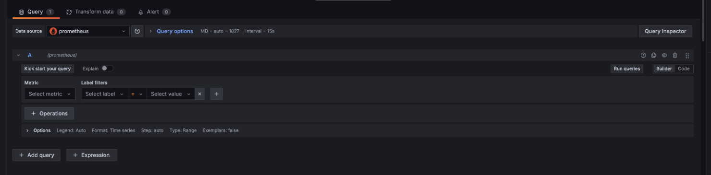
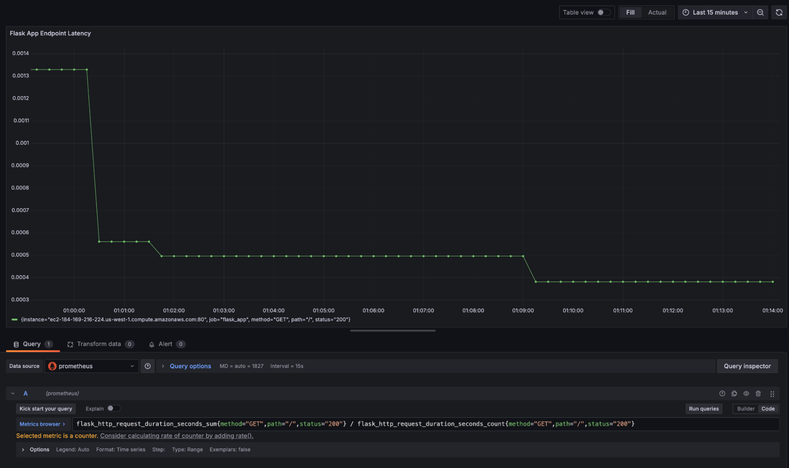

AWS CloudWatch is a monitoring and observability service designed to collect and analyze metrics, logs, and events from AWS resources and applications. It provides insights into the performance and health of infrastructure, enabling users to generate real-time alerts and dashboards for proactive monitoring.

While CloudWatch is a useful for AWS environments, organizations may seek alternative solutions for reduced costs and/or greater flexibility across multiple cloud platforms. Prometheus and Grafana offer an open source, platform-agnostic alternative for achieving these goals. This guide walks through how to migrate standard AWS CloudWatch service logs and metrics to Prometheus and Grafana running on a Linode instance.

## Introduction to Prometheus and Grafana

Prometheus is a [time-series database](https://prometheus.io/docs/concepts/data_model/#data-model) that collects and stores metrics from applications and services. It provides a foundation for monitoring system performance using the PromQL query language to extract and analyze granular data. Prometheus autonomously scrapes (*pulls*) metrics from targets at specified intervals, efficiently storing data through compression while retaining the most critical details. It also supports alerting based on metric thresholds, making it suitable for dynamic, cloud-native environments.

Grafana is a visualization and analytics platform that integrates with Prometheus. It enables users to create real-time, interactive dashboards, visualize metrics, and set up alerts to gain deeper insights into system performance. Grafana can unify data from a wide array of data sources, including Prometheus, to provide a centralized view of system metrics.

Prometheus and Grafana are often used together to monitor service health, detect anomalies, and issue alerts. Being both open source and platfrom-agnostic allows them to be deployed across a diverse range of cloud providers and on-premise infrastructures. Organizations often adopt these tools to reduce operational costs while gaining greater control over how data is collected, stored, and visualized.


While the Linode Marketplace offers an easily deployable [Prometheus and Grafana Marketplace app](https://www.linode.com/marketplace/apps/linode/prometheus-grafana/), this tutorial walks through a manual installation.


## Before You Begin

1.  If you do not already have a virtual machine to use, create a Compute Instance. See our [Getting Started with Linode](/docs/products/platform/get-started/) and [Creating a Compute Instance](/docs/products/compute/compute-instances/guides/create/) guides. The examples in this guide use the Linode 8 GB Shared CPU plan with Ubuntu 24.04 LTS.

    
    The [Linode CLI](https://techdocs.akamai.com/cloud-computing/docs/getting-started-with-the-linode-cli) provides an alternative way to provision resources. For example, the following command creates a **Linode 8 GB** compute instance (`g6-standard-4`) running Ubuntu 24.04 LTS (`linode/ubuntu24.04`) in the Miami datacenter (`us-mia`):

    ```command
    linode-cli linodes create \
        --image linode/ubuntu24.04 \
        --region us-mia \
        --type g6-standard-4 \
        --root_pass  \
        --authorized_keys "$(cat ~/.ssh/id_rsa.pub)" \
        --label monitoring-server
    ```

    Note the following key points:

    -   Replace  with a secure alternative.
    -   This command assumes that an SSH public/private key pair exists, with the public key stored as `id\_rsa.pub` in the user’s `$HOME/.ssh/` folder.
    -   The `--label` argument specifies the name of the new server (`monitoring-server`).
    

1.  Follow our [Setting Up and Securing a Compute Instance](/docs/products/compute/compute-instances/guides/set-up-and-secure/) guide to update your system. You may also wish to set the timezone, configure your hostname, create a limited user account, and harden SSH access.


This guide is written for a non-root user. Commands that require elevated privileges are prefixed with `sudo`. If you’re not familiar with the `sudo` command, see the [Users and Groups](/docs/guides/linux-users-and-groups/) guide.


## Install Prometheus as a Service

In order to install Prometheus, you must first SSH into the newly provisioned Linode.

1.  Create a dedicated user for Prometheus, disable its login, and create the necessary directories for Prometheus:

    ```command
    sudo useradd --no-create-home --shell /bin/false prometheus
    sudo mkdir /etc/prometheus
    sudo mkdir /var/lib/prometheus
    ```

1.  Download the latest version of Prometheus from its GitHub repository:

    ```command
    wget https://github.com/prometheus/prometheus/releases/download/v2.55.1/prometheus-2.55.1.linux-amd64.tar.gz
    ```

    This guide uses version `2.55.1`. Check the project’s [releases page](https://github.com/prometheus/prometheus/releases) for the latest version that aligns with your instance’s operating system.

1.  Extract the compressed file and navigate to the extracted folder:

    ```command
    tar xzvf prometheus-2.55.1.linux-amd64.tar.gz
    cd prometheus-2.55.1.linux-amd64
    ```

1.  Move both the `prometheus` and `promtool` binaries to `/usr/local/bin`:

    ```command
    sudo cp prometheus /usr/local/bin
    sudo cp promtool /usr/local/bin
    ```

    The `prometheus` binary is the main monitoring application, while `promtool` is a utility application that queries and configures a running Prometheus service.

1.  Move the configuration files and directories to the `/etc/prometheus` folder you created previously:

    ```command
    sudo cp -r consoles /etc/prometheus
    sudo cp -r console_libraries /etc/prometheus
    sudo cp prometheus.yml /etc/prometheus/prometheus.yml
    ```

1.  Set the correct ownership permissions for Prometheus files and directories:

    ```command
    sudo chown -R prometheus:prometheus /etc/prometheus
    sudo chown -R prometheus:prometheus /var/lib/prometheus
    sudo chown prometheus:prometheus /usr/local/bin/prometheus
    sudo chown prometheus:prometheus /usr/local/bin/promtool
    ```

### Create a `systemd` Service File

A `systemd` service configuration file must be created to run Prometheus as a service.

1.  Create the service file using a command line text editor such as `nano`.

    ```command
    sudo nano /etc/systemd/system/prometheus.service
    ```

    Add the following content to the file:

    ```file {title="/etc/systemd/system/prometheus.Service"}
    [Unit]
    Description=Prometheus Service
    Wants=network-online.target
    After=network-online.target

    [Service]
    User=prometheus
    Group=prometheus
    Type=simple
    ExecStart=/usr/local/bin/prometheus \
        --config.file=/etc/prometheus/prometheus.yml \
        --storage.tsdb.path=/var/lib/prometheus \
        --web.console.templates=/etc/prometheus/consoles \
        --web.console.libraries=/etc/prometheus/console_libraries

    [Install]
    WantedBy=multi-user.target
    ```

    When done, press <kbd>CTRL</kbd>+<kbd>X</kbd>, followed by <kbd>Y</kbd> then <kbd>Enter</kbd> to save the file and exit `nano`.

1.  Reload the `systemd` configuration files to apply the new service file:

    ```command
    sudo systemctl daemon-reload
    ```

1.  Run the following `systemctl` commands to start the `flash-app` service and enable it to automatically start after a system reboot:

    ```command
    sudo systemctl start prometheus
    sudo systemctl enable prometheus
    ```

1.  Enter the following command to verify that Prometheus is running:

    ```command
    systemctl status prometheus
    ```

    The output should display `active (running)`, confirming a successful setup:

    ```output
    ● prometheus.service - Prometheus Service
         Loaded: loaded (/etc/systemd/system/prometheus.service; enabled; preset: enabled)
         Active: active (running) since Thu 2024-12-05 16:11:57 EST; 5s ago
       Main PID: 1165 (prometheus)
          Tasks: 9 (limit: 9444)
         Memory: 16.2M (peak: 16.6M)
            CPU: 77ms
         CGroup: /system.slice/prometheus.service
    ```

    When done, press <kbd>Q</kbd> key to exit the status output and return to the terminal prompt.

1.  Open a web browser and visit port `9090` ( Prometheus's default port) of your instance's IP address:

    ```command
    http://:9090
    ```

    The Prometheus UI should appear:

    

    
    Prometheus settings are configured in the `/etc/prometheus/prometheus.yml` file. This guide uses the default values. For production systems, consider enabling authentication and other security measures to protect your metrics.
    

## Install the Grafana Service

Grafana provides an `apt` repository, reducing the number of steps needed to install and update it on Ubuntu.

1.  Install the necessary package to add new repositories:

    ```command
    sudo apt install software-properties-common -y
    ```

1.  Import and add the public key for the Grafana repository:

    ```command
    wget -q -O - https://packages.grafana.com/gpg.key | sudo apt-key add -
    sudo add-apt-repository "deb https://packages.grafana.com/oss/deb stable main"
    ```

1.  Update package index and install Grafana:

    ```command
    sudo apt update
    sudo apt install grafana -y
    ```

1.  The installation process already sets up the `systemd` configuration for Grafana. Start and enable the Grafana service:

    ```command
    sudo systemctl start grafana-server
    sudo systemctl enable grafana-server
    ```

1.  Run the following command to verify that Grafana is `active (running)`:

    ```command
    systemctl status grafana-server
    ```

    ```output
    ● grafana-server.service - Grafana instance
         Loaded: loaded (/usr/lib/systemd/system/grafana-server.service; enabled; preset: enabled)
         Active: active (running) since Thu 2024-12-05 13:57:10 EST; 8s ago
           Docs: http://docs.grafana.org
       Main PID: 3434 (grafana)
          Tasks: 14 (limit: 9444)
         Memory: 71.4M (peak: 80.4M)
            CPU: 2.971s
         CGroup: /system.slice/grafana-server.service
    ```

### Connect Grafana to Prometheus

1.  Open a web browser and visit port `3000` (Grafana's default port) of your instance's IP address to access the Grafana web UI:

    ```command
    http://:3000
    ```

1.  Login using the default credentials of `admin` for both the username and password:

    

1.  After logging in, you are prompted to enter a secure replacement for the default password:

    

    Now it's time to add Prometheus as a data source. Expand the **Home** menu, navigate to the **Connections** entry, then click **Add new connection**:

    

1.  Search for and select **Prometheus**.

1.  Click **Add new data source**.

    

1.  In the **URL** field, enter `http://localhost:9090`.

1.  Click **Save & Test** to confirm the connection.

    

    If the test succeeds, your Grafana installation should now be connected to the Prometheus installation running on the same Linode.

## Migrate from AWS CloudWatch to Prometheus and Grafana

Migrating from AWS CloudWatch to Prometheus and Grafana requires careful planning. This is important to ensure continuity of monitoring capabilities while leveraging the added control over data handling and advanced features of these open source alternatives.

This guide demonstrates the migration process using an [example Flask server](https://github.com/nathan-gilbert/simple-ec2-cloudwatch) that collects metrics and logs via AWS CloudWatch.

### Configure Example Flask Server

1.  Change into your user's home directory and use `git` to clone the example Flask server's GitHub repository to your compute instance:

    ```command
    cd ~
    git clone https://github.com/nathan-gilbert/simple-ec2-cloudwatch.git
    ```

1.  Change into the `example-flask-prometheus` folder in the new `simple-ec2-cloudwatch` directory:

    ```command
    cd simple-ec2-cloudwatch/example-flask-prometheus
    ```

1.  A virtual environment is required to run `pip` commands in Ubuntu 24.04 LTS. Use the following command to install `python3.12-venv`:

    ```command
    sudo apt install python3.12-venv
    ```

1.  Create a virtual environment named `venv` within the `example-flask-prometheus` directory:

    ```command
    python3 -m venv venv
    ```

1.  Activate the `venv` virtual environment:

    ```command
    source venv/bin/activate
    ```

1.  Use `pip` to install the example Flask servers's dependencies:

    ```command
    pip install -r requirements.txt
    ```

1.  Exit the virtual environment:

    ```command
    deactivate
    ```

1.  Create a `systemd` service file for the example Flask app:

    ```command
    sudo nano /etc/systemd/system/flask-app.service
    ```

    Provide the file with the following content, replacing  with your username:

    ```file {title="/etc/systemd/system/flask-app.service"}
    [Unit]
    Description=Flask Application Service
    After=network.target

    [Service]
    User=
    WorkingDirectory=/home//simple-ec2-cloudwatch/example-flask-prometheus
    ExecStart=/home//simple-ec2-cloudwatch/example-flask-prometheus/venv/bin/python /home//simple-ec2-cloudwatch/example-flask-prometheus/app.py
    Restart=always

    [Install]
    WantedBy=multi-user.target
    ```

1.  Reload the `systemd` configuration files to apply the new service file:

    ```command
    sudo systemctl daemon-reload
    ```

### Assess Current Monitoring Requirements

Before migrating to Prometheus and Grafana, it's important to understand what metrics and logs are currently being collected by CloudWatch and how they are used.

The example Flask application collects and sends endpoint latency metrics to CloudWatch using the [`put_metric_data`](https://boto3.amazonaws.com/v1/documentation/api/latest/reference/services/cloudwatch/client/put_metric_data.html) API from [Boto3](https://github.com/boto/boto3), a Python library for interfacing with AWS resources. Application logs are written to a local file and ingested into CloudWatch Logs for centralization.

Metrics such as endpoint latency are collected for every HTTP request, along with HTTP method details. Application logs record incoming requests, exceptions, and warnings. For example, when the Flask application receives and handles requests, it emits logs like the following:



CloudWatch also visualizes metrics in graphs. For instance, by querying the endpoint latency metrics sent by the Flask application, a graph might look like this:



### Export Existing CloudWatch Logs and Metrics

AWS provides tools for exporting CloudWatch data for analysis or migration. CloudWatch logs can be exported to an S3 bucket, making them accessible outside AWS and enabling them to be re-ingested into other tools.

To export CloudWatch Logs to S3, use the [`create-export-task`](https://awscli.amazonaws.com/v2/documentation/api/latest/reference/logs/create-export-task.html) command:

```command
aws logs create-export-task \
  --log-group-name  \
  --from  \
  --to  \
  --destination  \
  --destination-prefix cloudwatch-logs/
```

Replace the following placeholders with your specific values:

-   : The name of the log group to export.
-    and : The time range in milliseconds.
-   : The name of your S3 bucket.

### Expose Application Metrics to Prometheus

Prometheus works differently from CloudWatch: instead of *pushing* data like CloudWatch, Prometheus *pulls* metrics from the monitored application. After assessing or exporting metrics as needed, modify the application to enable Prometheus metric scraping so that it collects the same metrics previously sent to CloudWatch.

The [`prometheus_flask_exporter` library](https://github.com/rycus86/prometheus_flask_exporter) is a standard library for instrumenting Flask applications to expose Prometheus metrics.

1.  Open the `app.py` file:

    ```command
    nano app.py
    ```

    Ensure the following lines are present, adding or adjusting them if needed:

    ```file {title="~/simple-ec2-cloudwatch/example-flask-prometheus/app.py" lang="python" hl_lines="5,6,8,11,12,14,34"}
    import logging
    import random
    import time

    from flask import Flask
    from prometheus_flask_exporter import PrometheusMetrics

    logging.basicConfig(filename="/home//simple-ec2-cloudwatch/example-flask-prometheus/flask-app.log", level=logging.INFO)
    logger = logging.getLogger(__name__)

    app = Flask(__name__)
    metrics = PrometheusMetrics(app)

    metrics.info("FlaskApp", "Application info", version="1.0.0")


    @app.route("/")
    def hello_world():
        logger.info("A request was received at the root URL")
        return {"message": "Hello, World!"}, 200


    @app.route("/long-request")
    def long_request():
        n = random.randint(1, 5)
        logger.info(
            f"A request was received at the long-request URL. Slept for {n} seconds"
        )
        time.sleep(n)
        return {"message": f"Long running request with {n=}"}, 200


    if __name__ == "__main__":
        app.run(host="0.0.0.0", port=8080)
    ```

    These lines use the `prometheus_flask_exporter` library to:

    -   Instrument the Flask app for Prometheus metrics.
    -   Expose default and application-specific metrics at the `/metrics` endpoint.
    -   Provide metadata such as version information via `metrics.info`.

1.  Save and close the file, then start and enable the `flask-app` service:

    ```command
    sudo systemctl start flask-app
    sudo systemctl enable flask-app
    ```

1.  Verify that the `flask-app` service is `active (running)`:

    ```command
    systemctl status flask-app
    ```

    ```output
    ● flask-app.service - Flask Application Service
         Loaded: loaded (/etc/systemd/system/flask-app.service; enabled; preset: enabled)
         Active: active (running) since Thu 2024-12-05 17:26:18 EST; 1min 31s ago
       Main PID: 4413 (python)
          Tasks: 1 (limit: 9444)
         Memory: 20.3M (peak: 20.3M)
            CPU: 196ms
         CGroup: /system.slice/flask-app.service
    ```

1.  Make sure the Flask app is accessible by issuing the following cURL command:

    ```command
    curl http://:8080
    ```

    You should receive the following response:

    ```output
    {"message": "Hello, World!"}
    ```

1.  To view the metrics, open a web browser and visit the following URL:

    ```command
    http://:8080/metrics
    ```

    The metrics shown include `http_request_duration_seconds` (request latency) and `http_requests_total` (total number of requests).

### Configure Prometheus to Ingest Application Metrics

1.  Modify the Prometheus configuration at `/etc/prometheus/prometheus.yml` to include the Flask application as a scrape target:

    ```command
    sudo nano /etc/prometheus/prometheus.yml
    ```

    Append the following content to the `scrap_configs` section of the file, replacing  with the actual IP address of your `monitoring-server` instance:

    ```file {title="/etc/prometheus/prometheus.yml"}
      - job_name: 'flask_app'
        static_configs:
          - targets: [':8080']
    ```

    This configuration tell Prometheus to scrape metrics from the Flask application running on port `8080`.

1.  Save the file and restart Prometheus to apply the changes:

    ```command
    sudo systemctl restart prometheus
    ```

1.  To verify that Prometheus is successfully scraping the Flask app, open a web browser and navigate to the Prometheus UI:

    ```command
    http://:9090
    ```

1.  In the Prometheus UI click the **Status** tab and select **Targets**. You should see the Flask application service listed as a target with a status of `up`, indicating that Prometheus is successfully scraping metrics from the application.

    

### Create a Grafana Dashboard with Application Metrics

Grafana serves as the visualization layer, providing an interface for creating dashboards from Prometheus metrics.

1.  Open a web browser and visit the following URL to access the Grafana UI:

    ```command
    http://:3000
    ```

1.  Navigate to the **Dashboards** page:

    

1.  Create a new dashboard in Grafana by clicking **Create dashboard**:

    

1.  Next, click **Add visualization**:

    

1.  In the resulting dialog, select the **prometheus** data source:

    

1.  To duplicate the CloudWatch metrics for the Flask application, first click on the **Code** tab in the right-hand side of the panel editor:

    

1.  Input the following PromQL query to calculate the average latency for an endpoint:

    ```command
    flask_http_request_duration_seconds_sum{method="GET",path="/",status="200"} /
    flask_http_request_duration_seconds_count{method="GET",path="/",status="200"}
    ```

1.  After entering the formula, click **Run queries** to execute the PromQL query. The chart should update with data pulled from Prometheus:

    

    This visualization replicates CloudWatch's endpoint latency graph, detailing the average latency over time for a particular endpoint. Prometheus further enhances this by providing default labels, such as method, path, and status codes, for greater granularity in analysis.

## Additional Considerations and Concerns

When migrating from AWS CloudWatch to Prometheus and Grafana, it's important to address several key considerations to ensure a smooth and effective transition.

### Cost Management

CloudWatch incurs costs based on the number of API requests, log volume, and data retention. As monitoring scales, these costs increase. In contrast, Prometheus is an open source tool with no direct charges for usage. Therefore, migrating to Prometheus and Grafana offers a potential for cost savings.

However, infrastructure costs for running Prometheus and Grafana are still a consideration. Running Prometheus and Grafana requires provisioning compute and storage resources, with expenses for maintenance and handling network traffic. Additionally, because Prometheus is designed for short-term data storage, setting up long-term storage solution may also increase costs.

**Recommendation**:

-   Estimate infrastructure costs for Prometheus and Grafana by assessing current CloudWatch data volume and access usage.
-   Utilize object storage or other efficient long-term storage mechanisms to minimize costs.

### Data Consistency and Accuracy

CloudWatch aggregates metrics over set intervals, whereas Prometheus collects high-resolution raw metrics. Therefore, migrating from CloudWatch to Prometheus raises potential concerns about data consistency and accuracy during and after the transition.

**Recommendation**:

-   Tune Prometheus scrape intervals to capture the necessary level of detail without overwhelming storage or compute capacities.
-   Validate that CloudWatch metrics correctly map to Prometheus metrics, with the appropriate time resolutions.

### CloudWatch Aggregated Data Versus Prometheus Raw Data

Aggregated data from CloudWatch offers a high-level view of system health and application performance, which is helpful for monitoring broader trends. However, the raw data from Prometheus enables detailed analyses and granular troubleshooting. Both approaches have their use cases, and it's important to understand which is most appropriate for you.

While Prometheus can collect raw data, consider whether CloudWatch's aggregation is more useful, and how to replicate that with Grafana dashboards or Prometheus queries.

**Recommendation**:

-   Create Grafana dashboards that aggregate Prometheus data for overall system-level insights.
-   Leverage Prometheus's detailed, raw metrics for fine-grained data analysis.

### Alert System Migration

CloudWatch’s integrated alerting system is tightly coupled with AWS services and allows for alerts based on metric thresholds, log events, and more. Prometheus offers its own alerting system, [**Alertmanager**](https://prometheus.io/docs/alerting/latest/alertmanager/), which can handle alerts based on Prometheus query results.

Migrating an alerting setup requires translating existing CloudWatch alarms into Prometheus alert rules. Consider how the thresholds and conditions set in CloudWatch translate to query-based alerts in Prometheus.

**Recommendation**:

-   Audit all CloudWatch alerts and replicate them using Prometheus Alertmanager.
-   Refine alert thresholds based on the type of data collected by Prometheus.
-   Integrate Alertmanager with any existing notification systems (e.g. email, Slack, etc.) to maintain consistency in how teams are alerted to critical events.

### Security and Access Controls

CloudWatch integrates with AWS Identity and Access Management (IAM) for role-based access control (RBAC). This can help simplify the management of who can view, edit, or delete logs and metrics. Meanwhile, Prometheus and Grafana require manual configuration of security and access controls.

Securing Prometheus and Grafana involves setting up user authentication (e.g. OAuth, LDAP, etc.) and ensuring metrics and dashboards are only accessible to authorized personnel. To maintain security, data in transit should be encrypted using TLS.

**Recommendation**:

-   Implement secure access controls from the start.
-   Configure Grafana with a well-defined RBAC policy and integrate it with an authentication system, such as OAuth or LDAP.
-   Enable TLS for Prometheus to secure data in transit, and restrict access to sensitive metrics.

### Separate Log and Metric Responsibilities

Because Prometheus is primarily a metrics-based monitoring solution, it does not have built-in capabilities for handling logs in the way CloudWatch does. Therefore, it's important to decouple log management needs from metric collection when migrating.

**Recommendation**:

-   Introduce a specialized log aggregation solution alongside Prometheus and Grafana for collecting, aggregating, and querying logs:
    -   [**Grafana Loki**](https://grafana.com/oss/loki/) is designed to integrate with Grafana. It provides log querying capabilities within Grafana's existing interface, giving a unified view of metrics and logs in a single dashboard.
    -   [**Fluentd**](https://www.fluentd.org/) is a log aggregator that can forward logs to multiple destinations, including object storage for long-term retention. It works with both Loki and ELK.