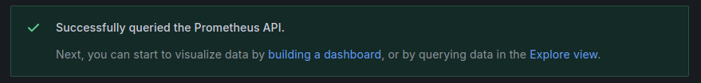
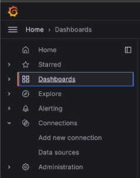

Azure Monitor is Microsoft's built-in observability platform. It is designed to monitor and analyze the performance and reliability of applications and infrastructure within the Azure ecosystem. It collects metrics, logs, and telemetry data from Azure resources, on-premises environments, and other cloud services. It also offer tools to optimize and maintain system health.

This guide explains how to migrate Azure Monitor service logs and metrics to Prometheus and Grafana running on a Linode instance.

This guide walks through how to migrate standard Azure Monitor service logs, metrics, and monitoring to a Prometheus and Grafana software stack on a Linode instance. To illustrate the migration process, an example Flask-based Python application running on a separate instance is configured to send logs and metrics to Azure Monitor, and then modified to integrate with Prometheus and Grafana. While this guide uses a Flask application as an example, the principles can be applied to any workload currently monitored via Azure Monitor.

## Introduction to Prometheus and Grafana

[Prometheus](https://prometheus.io/docs/introduction/overview/) is a [time-series database](https://prometheus.io/docs/concepts/data_model/#data-model) that collects and stores metrics from applications and services. It provides a foundation for monitoring system performance using the PromQL query language to extract and analyze granular data. Prometheus autonomously scrapes (*pulls*) metrics from targets at specified intervals, efficiently storing data through compression while retaining the most critical details. It also supports alerting based on metric thresholds, making it suitable for dynamic, cloud-native environments.

[Grafana](https://grafana.com/docs/) is a visualization and analytics platform that integrates with Prometheus. It enables users to create real-time, interactive dashboards, visualize metrics, and set up alerts to gain deeper insights into system performance. Grafana can unify data from a wide array of data sources, including Prometheus, to provide a centralized view of system metrics.

Prometheus and Grafana are considered industry standard, and are commonly used together to monitor service health, detect anomalies, and issue alerts. Being both open source and platfrom-agnostic allows them to be deployed across a diverse range of cloud providers and on-premise infrastructures. Organizations often adopt these tools to reduce operational costs while gaining greater control over how data is collected, stored, and visualized.


If you prefer an automatic deployment rather than the manual installation steps in this guide, Prometheus and Grafana can be deployed through our [Prometheus and Grafana Marketplace app](https://www.linode.com/marketplace/apps/linode/prometheus-grafana/).


## Before You Begin

1.  If you do not already have a virtual machine to use, create a Compute Instance using the steps in our [Get Started](https://techdocs.akamai.com/cloud-computing/docs/getting-started) and [Create a Compute Instance](https://techdocs.akamai.com/cloud-computing/docs/create-a-compute-instance) guides. The examples in this guide use a Linode 8 GB Shared CPU plan with the Ubuntu 24.04 LTS distribution for Prometheus and Grafana. A Nanode 1 GB Shared CPU plan with Ubuntu 24.04 LTS is sufficient for the example Flask server.

    
    Use these steps if you prefer to use the [Linode CLI](https://techdocs.akamai.com/cloud-computing/docs/getting-started-with-the-linode-cli) to provision resources.

    The following command creates a **Linode 8 GB** compute instance (`g6-standard-4`) running Ubuntu 24.04 LTS (`linode/ubuntu24.04`) in the Miami datacenter (`us-mia`):

    ```command
    linode-cli linodes create \
        --image linode/ubuntu24.04 \
        --region us-mia \
        --type g6-standard-4 \
        --root_pass  \
        --authorized_keys "$(cat ~/.ssh/id_rsa.pub)" \
        --label monitoring-server
    ```

    The following command creates a **Nanode 1 GB** compute instance (`g6-nanode-1`) running Ubuntu 24.04 LTS (`linode/ubuntu24.04`) in the Miami datacenter (`us-mia`):

    ```command
    linode-cli linodes create \
        --image linode/ubuntu24.04 \
        --region us-mia \
        --type g6-nanode-1 \
        --root_pass  \
        --authorized_keys "$(cat ~/.ssh/id_rsa.pub)" \
        --label flask-server
    ```

    Note the following key points:

    -   Replace the `region` as desired.
    -   Replace  with a secure alternative for your root password.
    -   This command assumes that an SSH public/private key pair exists, with the public key stored as `id\_rsa.pub` in the user’s `$HOME/.ssh/` folder.
    -   The `--label` argument specifies the name of the new server (`monitoring-server`).
    

1.  Follow our [Set Up and Secure a Compute Instance](https://techdocs.akamai.com/cloud-computing/docs/set-up-and-secure-a-compute-instance) guide to update your system. You may also wish to set the timezone, configure your hostname, create a limited user account, and harden SSH access.


This guide is written for a non-root user. Commands that require elevated privileges are prefixed with `sudo`. If you’re not familiar with the `sudo` command, see the [Users and Groups](/docs/guides/linux-users-and-groups/) guide.


## Install Prometheus as a Service

1.  To install Prometheus, login via SSH to your Linode instance as your limited sudo user:

    ```command
    ssh @
    ```

1.  Create a dedicated user for Prometheus, disable its login, and create the necessary directories for Prometheus:

    ```command
    sudo useradd --no-create-home --shell /bin/false prometheus
    sudo mkdir /etc/prometheus
    sudo mkdir /var/lib/prometheus
    ```

1.  Download the latest version of Prometheus from its GitHub repository:

    ```command
    wget https://github.com/prometheus/prometheus/releases/download/v2.55.1/prometheus-2.55.1.linux-amd64.tar.gz
    ```

    This guide uses version `2.55.1`. Check the project’s [releases page](https://github.com/prometheus/prometheus/releases) for the latest version that aligns with your instance’s operating system.

1.  Extract the compressed file and navigate to the extracted folder:

    ```command
    tar xzvf prometheus-2.55.1.linux-amd64.tar.gz
    cd prometheus-2.55.1.linux-amd64
    ```

1.  Move both the `prometheus` and `promtool` binaries to `/usr/local/bin`:

    ```command
    sudo cp prometheus /usr/local/bin
    sudo cp promtool /usr/local/bin
    ```

    The `prometheus` binary is the main monitoring application, while `promtool` is a utility application that queries and configures a running Prometheus service.

1.  Move the configuration files and directories to the `/etc/prometheus` folder you created previously:

    ```command
    sudo cp -r consoles /etc/prometheus
    sudo cp -r console_libraries /etc/prometheus
    sudo cp prometheus.yml /etc/prometheus/prometheus.yml
    ```

1.  Set the correct ownership permissions for Prometheus files and directories:

    ```command
    sudo chown -R prometheus:prometheus /etc/prometheus
    sudo chown -R prometheus:prometheus /var/lib/prometheus
    sudo chown prometheus:prometheus /usr/local/bin/prometheus
    sudo chown prometheus:prometheus /usr/local/bin/promtool
    ```

### Create a `systemd` Service File

A `systemd` service configuration file must be created to run Prometheus as a service.

1.  Create the service file using the text editor of your choice. This guide uses `nano`.

    ```command
    sudo nano /etc/systemd/system/prometheus.service
    ```

    Add the following content to the file, and save your changes:

    ```file {title="/etc/systemd/system/prometheus.Service"}
    [Unit]
    Description=Prometheus Service
    Wants=network-online.target
    After=network-online.target

    [Service]
    User=prometheus
    Group=prometheus
    Type=simple
    ExecStart=/usr/local/bin/prometheus \
        --config.file=/etc/prometheus/prometheus.yml \
        --storage.tsdb.path=/var/lib/prometheus \
        --web.console.templates=/etc/prometheus/consoles \
        --web.console.libraries=/etc/prometheus/console_libraries

    [Install]
    WantedBy=multi-user.target
    ```

1.  Reload the `systemd` configuration files to apply the new service file:

    ```command
    sudo systemctl daemon-reload
    ```

1.  Using `systemctl`, start the `flash-app` service and enable it to automatically start after a system reboot:

    ```command
    sudo systemctl start prometheus
    sudo systemctl enable prometheus
    ```

1.  Verify that Prometheus is running:

    ```command
    systemctl status prometheus
    ```

    The output should display `active (running)`, confirming a successful setup:

    ```output
    ● prometheus.service - Prometheus Service
         Loaded: loaded (/etc/systemd/system/prometheus.service; enabled; preset: enabled)
         Active: active (running) since Thu 2024-12-05 16:11:57 EST; 5s ago
       Main PID: 1165 (prometheus)
          Tasks: 9 (limit: 9444)
         Memory: 16.2M (peak: 16.6M)
            CPU: 77ms
         CGroup: /system.slice/prometheus.service
    ```

    When done, press the <kbd>Q</kbd> key to exit the status output and return to the terminal prompt.

1.  Open a web browser and visit your instance's IP address on port `9090` (Prometheus's default port):

    ```command
    http://:9090
    ```

    The Prometheus UI should appear:

    

    
    Prometheus settings are configured in the `/etc/prometheus/prometheus.yml` file. This guide uses the default values. For production systems, consider enabling authentication and other security measures to protect your metrics.
    

## Install the Grafana Service

Grafana provides an `apt` repository, reducing the number of steps needed to install and update it on Ubuntu.

1.  Install the necessary package to add new repositories:

    ```command
    sudo apt install software-properties-common -y
    ```

1.  Import and add the public key for the Grafana repository:

    ```command
    wget -q -O - https://packages.grafana.com/gpg.key | sudo apt-key add -
    sudo add-apt-repository "deb https://packages.grafana.com/oss/deb stable main"
    ```

1.  Update the package index and install Grafana:

    ```command
    sudo apt update
    sudo apt install grafana -y
    ```

1.  The installation process already sets up the `systemd` configuration for Grafana. Start and enable the Grafana service:

    ```command
    sudo systemctl start grafana-server
    sudo systemctl enable grafana-server
    ```

1.  Run the following command to verify that Grafana is `active (running)`:

    ```command
    systemctl status grafana-server
    ```

    ```output
    ● grafana-server.service - Grafana instance
         Loaded: loaded (/usr/lib/systemd/system/grafana-server.service; enabled; preset: enabled)
         Active: active (running) since Thu 2024-12-05 13:57:10 EST; 8s ago
           Docs: http://docs.grafana.org
       Main PID: 3434 (grafana)
          Tasks: 14 (limit: 9444)
         Memory: 71.4M (peak: 80.4M)
            CPU: 2.971s
         CGroup: /system.slice/grafana-server.service
    ```

### Connect Grafana to Prometheus

1.  Open a web browser and visit your instance's IP address on port `3000` (Grafana's default port) to access the Grafana web UI:

    ```command
    http://:3000
    ```

1.  Login using the default credentials of `admin` for both the username and password:

    

1.  After logging in, you are prompted to enter a secure replacement for the default password:

    

1.  Add Prometheus as a data source by expanding the **Home** menu, navigating to the **Connections** entry, and clicking **Add new connection**:

    

1.  Search for and select **Prometheus**.

1.  Click **Add new data source**.

    

1.  In the **URL** field, enter `http://localhost:9090`.

1.  Click **Save & Test** to confirm the connection.

    

    If successful, your Grafana installation is now connected to the Prometheus installation running on the same Linode.

## Configure Example Flask Server

This guide demonstrates the migration process using an example Flask server that collects metrics and logs via Azure Monitor.

1.  Log in to the example Flask application server as a user with `sudo` privileges.

1.  Create a directory for the project named `exmaple-flask-app` and change into it:

    ```command
    mkdir example-flask-app
    cd example-flask-app
    ```

1.  Create a file called `app.py`:

    ```command
    nano app.py
    ```

    Give it the following contents, replacing  with your actual `sudo` user:

    ```file {title="app.py", lang="python" hl_lines="8"}
    import json
    import logging
    import time

    from flask import Flask, request
    from applicationinsights import TelemetryClient # Note: pip install applicationinsights

    logging.basicConfig(filename='/home//example-flask-app/flask-app.log', level=logging.INFO)
    logger = logging.getLogger(__name__)

    app = Flask(__name__)

    # Azure Monitoring setup
    tc = TelemetryClient('YOUR_INSTRUMENTATION_KEY')

    @app.before_request
    def start_timer():
        request.start_time = time.time()

    @app.after_request
    def send_latency_metric(response):
        latency = time.time() - request.start_time

        # Send latency metric to Azure Monitoring
        tc.track_metric("EndpointLatency", latency, properties={
            "Endpoint": request.path,
            "Method": request.method
        })
        tc.flush()

        return response

    @app.route('/')
    def hello_world():
        logger.info("A request was received at the root URL")
        return {'message': 'Hello, World!'}, 200

    if __name__ == '__main__':
        app.run(host='0.0.0.0', port=80)
    ```

    When done, press <kbd>CTRL</kbd>+<kbd>X</kbd>, followed by <kbd>Y</kbd> then <kbd>Enter</kbd> to save the file and exit `nano`.

1.  Now create a text file called `requirements.txt`:

    ```command
    nano requirements.txt
    ```

    Provide it with the following basic dependencies for the Flask application to function:

    ```file {title="requirements.txt"}
    Flask==3.0.3
    itsdangerous==2.2.0
    Jinja2==3.1.4
    MarkupSafe==2.1.5
    Werkzeug==3.0.4
    ```

    When done, press <kbd>CTRL</kbd>+<kbd>X</kbd>, followed by <kbd>Y</kbd> then <kbd>Enter</kbd> to save the file and exit `nano`.

1.  A virtual environment is required to run `pip` commands in Ubuntu 24.04 LTS. Use the following command to install `python3.12-venv`:

    ```command
    sudo apt install python3.12-venv
    ```

1.  Using the `venv` utility, create a virtual environment named `venv` within the `example-flask-app` directory:

    ```command
    python3 -m venv venv
    ```

1.  Activate the `venv` virtual environment:

    ```command
    source venv/bin/activate
    ```

1.  Use `pip` to install the example Flask application's dependencies from the `requirements.txt` file:

    ```command
    pip install -r requirements.txt
    ```

1.  Additionally, use `pip` to install `applicationinsights`, which is required for interfacing with Azure Monitor:

    ```command
    pip install applicationinsights
    ```

1.  Exit the virtual environment:

    ```command
    deactivate
    ```

### Create a `systemd` Service File

1.  Create a `systemd` service file for the example Flask app:

    ```command
    sudo nano /etc/systemd/system/flask-app.service
    ```

    Provide the file with the following content, replacing  with your actual `sudo` user:

    ```file {title="/etc/systemd/system/flask-app.service"}
    [Unit]
    Description=Flask Application Service
    After=network.target

    [Service]
    User=
    WorkingDirectory=/home//example-flask-app
    ExecStart=/home//example-flask-app/venv/bin/python /home//example-flask-app/app.py
    Restart=always

    [Install]
    WantedBy=multi-user.target
    ```

    When done, press <kbd>CTRL</kbd>+<kbd>X</kbd>, followed by <kbd>Y</kbd> then <kbd>Enter</kbd> to save the file and exit `nano`.

1.  Reload the `systemd` configuration files to apply the new service file, then start and enable the service:

    ```command
    sudo systemctl daemon-reload
    sudo systemctl start flask-app
    sudo systemctl enable flask-app
    ```

1.  Verify that the `flask-app` service is `active (running)`:

    ```command
    systemctl status flask-app
    ```

    ```output
    ● flask-app.service - Flask Application Service
         Loaded: loaded (/etc/systemd/system/flask-app.service; enabled; preset: enabled)
         Active: active (running) since Thu 2024-12-05 17:26:18 EST; 1min 31s ago
       Main PID: 4413 (python)
          Tasks: 1 (limit: 9444)
         Memory: 20.3M (peak: 20.3M)
            CPU: 196ms
         CGroup: /system.slice/flask-app.service
    ```

    Once the Flask application is running, Azure Monitor can monitor its data.

1.  Generate data by issuing an HTTP request using the following cURL command. Replace  with the IP address of the instance where the Flask app is running:

    ```command
    curl http://:8080
    ```

    You should receive the following response:

    ```output
    {"message": "Hello, World!"}
    ```

## Migrate from Azure Monitor to Prometheus and Grafana

Migrating from Azure Monitor to Prometheus and Grafana can offer several advantages, including increased control data storage and handling, potential reduction in cost, and enhanced monitoring capabilities across multi-cloud or hybrid environments. However, the transition requires careful planning and a clear understanding of the differences between them:

| Feature | Azure Monitor | Prometheus |
| :---- | :---- | :---- |
| Integration and Configuration | Out-of-the-box integrations to simplify monitoring Azure resources. | Cloud-agnostic and highly configurable, enabling integration across diverse environments. |
| Data Collection | Passively collects data from Azure resources. | Actively scrapes data at defined intervals from configured targets. |
| Data Storage | Fully manages data storage, including long-term retention. | Defaults to local short-term storage but supports integration with external long-term storage solutions. |

While Azure Monitor includes native tools for creating dashboards, Grafana enhances visualization capabilities by supporting multiple data sources. This allows users to combine real-time and historical data from Azure Monitor, Prometheus, and other platforms in a single unified view.

Applications monitored by Azure Monitor may use the following tools:

-   [Azure OpenTelemetry Exporter](https://learn.microsoft.com/en-us/python/api/overview/azure/monitor-opentelemetry-exporter-readme?view=azure-python-preview): For intentional collection of application metrics using the OpenTelemetry Standard.
-   [Application Insights](https://learn.microsoft.com/en-us/azure/azure-monitor/app/app-insights-overview): For automatic collection of metrics and telemetry data from applications.

### Assess Current Monitoring Requirements

Begin the migration process by auditing your current Azure Monitor configuration, including:

-   **Metrics**: Catalog the metrics being monitored, their collection intervals, and how they are utilized in day-to-day operations.
-   **Logs**: Review logs collected from Azure resources and applications, noting any patterns or specific data points needed for troubleshooting or analysis.
-   **Alerts**: Note also what specific alerts are configured.

This assessment can help determine the equivalent monitoring setup needed for Prometheus and Grafana.

The screenshots below are examples of Azure Monitor metrics captured for an example Python Flask application running on an Azure Virtual Machine. These metrics, such as server request counts and response latency, would need to be migrated to Prometheus for continued monitoring.


Azure Monitor also collects logs from Azure resources. The following example shows a log entry from the Python Flask application:


### Export Existing Azure Monitor Logs and Metrics

There are two common approaches for exporting logs and metrics from Azure Monitor to a Prometheus and Grafana monitoring workflow:

#### Option 1: Azure Monitor Metrics Explorer

The [Azure Monitor Metrics Exporter](https://github.com/webdevops/azure-metrics-exporter) is an open source tool designed to scrape Azure metrics and expose them in a Prometheus-compatible format. It supports collecting metrics from various Azure resources such as Virtual Machines, App Services, and SQL Databases.

Typically deployed as a container or agent, the exporter is configured with Azure service principal credentials to access resources. Metrics are exposed at an HTTP endpoint, which Prometheus can scrape at regular intervals.

While this method enables real-time metric collection, it may require tuning to stay within Azure API limits in high-volume environments. Additionally, some Azure Monitor metrics or custom metrics may not be fully compatible with the exporter, necessitating alternative configurations.

#### Option 2: Diagnostic Settings in Azure Monitor

Azure Monitor’s [diagnostic settings](https://learn.microsoft.com/en-us/azure/azure-monitor/essentials/diagnostic-settings) provide another way to export logs and metrics. This approach uses [Azure Event Hub](https://azure.microsoft.com/en-us/products/event-hubs), a managed data streaming service, to transfer data from Azure Monitor.

**Metrics Workflow:**

1.  Configure diagnostic settings for the Azure resources from which you want to export metrics.

1.  Specify Azure Event Hub as the destination.

1.  Use a streaming service, such as Kafka or a custom consumer, to route data from Event Hub to Prometheus-compatible storage (e.g. a time-series database). Grafana can ingest metrics directly if the format is supported.

**Logs Workflow:**

1.  Set diagnostic settings to route logs from Azure Monitor to Azure Event Hub.

1.  Stream logs from Event Hub to a log platform such as [Loki](https://github.com/grafana/loki), which is commonly paired with Grafana for visualization.

1.  If needed, employ an ETL (Extract, Transform, Load) pipeline or serverless job to reformat logs for compatibility with Loki or another log storage system.

### Expose Application Metrics to Prometheus

Prometheus works differently from Azure Monitor: instead of *pushing* data like Azure Monitor, Prometheus *pulls* metrics from the monitored application. After assessing or exporting metrics as needed, modify the application to enable Prometheus metric scraping so that it collects the same metrics previously sent to Azure Monitor. This process varies from application to application.

For the example Flask application in this guide, the [`prometheus_flask_exporter` library](https://github.com/rycus86/prometheus_flask_exporter) is a standard library that can be used for instrumenting Flask applications to expose Prometheus metrics.

1.  Reactivate the `venv` virtual environment:

    ```command
    source venv/bin/activate
    ```

1.  Use `pip` to install the `prometheus_client` and `prometheus_flask_exporter` libraries:

    ```command
    pip install prometheus_client prometheus_flask_exporter
    ```

1.  Exit the virtual environment:

    ```command
    deactivate
    ```

1.  Using a text editor of your choice, open the `app.py` file for the Flask application:

    ```command
    nano app.py
    ```

    Replace the file's current Azure Monitor-specific contents with the Prometheus-specific code below, making sure to replace  with your actual username:

    ```file {title="app.py" lang="python" hl_lines="8"}
    import logging
    import random
    import time

    from flask import Flask
    from prometheus_flask_exporter import PrometheusMetrics

    logging.basicConfig(filename="/home//example-flask-app/flask-app.log", level=logging.INFO)
    logger = logging.getLogger(__name__)

    app = Flask(__name__)
    metrics = PrometheusMetrics(app)

    metrics.info("FlaskApp", "Application info", version="1.0.0")


    @app.route("/")
    def hello_world():
        logger.info("A request was received at the root URL")
        return {"message": "Hello, World!"}, 200


    @app.route("/long-request")
    def long_request():
        n = random.randint(1, 5)
        logger.info(
            f"A request was received at the long-request URL. Slept for {n} seconds"
        )
        time.sleep(n)
        return {"message": f"Long running request with {n=}"}, 200


    if __name__ == "__main__":
        app.run(host="0.0.0.0", port=8080)
    ```

    These lines use the `prometheus_flask_exporter` library to:

    -   Instrument the Flask app for Prometheus metrics.
    -   Expose default and application-specific metrics at the `/metrics` endpoint.
    -   Provide metadata such as version information via `metrics.info`.

1.  Save and close the file, then restart the `flask-app` service:

    ```command
    sudo systemctl restart flask-app
    ```

1.  Verify that the `flask-app` service is `active (running)`:

    ```command
    systemctl status flask-app
    ```

    ```output
    ● flask-app.service - Flask Application Service
         Loaded: loaded (/etc/systemd/system/flask-app.service; enabled; preset: enabled)
         Active: active (running) since Thu 2024-12-05 17:26:18 EST; 1min 31s ago
       Main PID: 4413 (python)
          Tasks: 1 (limit: 9444)
         Memory: 20.3M (peak: 20.3M)
            CPU: 196ms
         CGroup: /system.slice/flask-app.service
    ```

1.  Test to see if the Flask app is accessible by issuing the following cURL command. Replace  with the IP address of the instance where the Flask app is running:

    ```command
    curl http://:8080
    ```

    You should receive the following response:

    ```output
    {"message": "Hello, World!"}
    ```

1.  To view the metrics, open a web browser and visit the following URL:

    ```command
    http://:8080/metrics
    ```

    The metrics shown include `http_request_duration_seconds` (request latency) and `http_requests_total` (total number of requests).

### Configure Prometheus to Ingest Application Metrics

1.  Log back in to the Prometheus & Grafana instance.

1.  Using a text editor, open and modify the Prometheus configuration at `/etc/prometheus/prometheus.yml` to include the Flask application as a scrape target:

    ```command
    sudo nano /etc/prometheus/prometheus.yml
    ```

    Append the following content to the `scrape_configs` section of the file, replacing  with the IP address of your `monitoring-server` instance:

    ```file {title="/etc/prometheus/prometheus.yml"}
      - job_name: 'flask_app'
        static_configs:
          - targets: [':8080']
    ```

    This configuration tell Prometheus to scrape metrics from the Flask application running on port `8080`.

1.  Save the file, and restart Prometheus to apply the changes:

    ```command
    sudo systemctl restart prometheus
    ```

1.  To verify that Prometheus is successfully scraping the Flask app, open a web browser and navigate to the Prometheus user interface on port 9090. This is the default port used for Prometheus. Replace  with the IP of your instance:

    ```command
    http://:9090
    ```

1.  In the Prometheus UI click the **Status** tab and select **Targets**. You should see the Flask application service listed as a target with a status of `UP`, indicating that Prometheus is successfully scraping metrics from the application.

    

### Create a Grafana Dashboard with Application Metrics

Grafana serves as the visualization layer, providing an interface for creating dashboards from Prometheus metrics.

1.  Open a web browser and visit the following URL to access the Grafana UI on port 3000 (the default port for Grafana). Replace  with the IP of your instance:

    ```command
    http://:3000
    ```

1.  Navigate to the **Dashboards** page:

    

1.  Create a new dashboard in Grafana by clicking **Create dashboard**:

    

1.  Click **Add visualization**:

    

1.  In the resulting dialog, select the **prometheus** data source:

    

1.  To duplicate the Azure Monitor metrics for the Flask application, first click on the **Code** tab in the right-hand side of the panel editor:

    

1.  Input the following PromQL query to calculate the average latency for an endpoint:

    ```command
    flask_http_request_duration_seconds_sum{method="GET",path="/",status="200"} /
    flask_http_request_duration_seconds_count{method="GET",path="/",status="200"}
    ```

1.  After entering the formula, click **Run queries** to execute the PromQL query. The chart should update with data pulled from Prometheus:

    

    This visualization replicates Azure Monitor's latency metrics, detailing the average latency over time for a specific endpoint. Prometheus also provides default labels such as method, path, and status codes, for additional granularity in analysis.

## Additional Considerations and Concerns

### Cost Management

Migrating to Prometheus and Grafana eliminates the recurring licensing costs associated with Azure Monitor. However, infrastructure costs for running Prometheus and Grafana are still a consideration. Running Prometheus and Grafana requires provisioning compute and storage resources, with expenses for maintenance and handling network traffic. Additionally, since Prometheus is primarily designed for short-term data storage, setting up a long-term storage solution may also increase costs.

**Recommendation**:

-   Assess the current costs of Azure Monitor, including licensing fees, and compare them to the infrastructure costs for hosting Prometheus and Grafana.
-   Use Prometheus’s default short-term storage for real-time monitoring, reserving long-term storage for critical metrics only.
-   Configure Grafana alerts and dashboards to minimize high-frequency scrapes and unnecessary data retention.
-   Regularly review and refine retention policies and scraping intervals to balance cost with visibility needs.

### Data Consistency and Accuracy

Azure Monitor automatically standardizes metrics and logs within its centralized system. In contrast, Prometheus and Grafana require custom configurations, which can raise concerns about consistency in data formatting, collection intervals, and overall accuracy during migration.

**Recommendation**:

-   Document and map existing Azure Monitor metrics, logs, and alerts to align collection intervals and query formats.
-   Standardize scrape intervals and retention policies across all Prometheus exporters to ensure consistent and comparable data.
-   Early in the migration process, regularly audit and validate data accuracy between Azure Monitor and Prometheus to detect any discrepancies.
-   Utilize Grafana dashboards to compare data from both systems during the migration to ensure equivalence and reliability.

### Azure Monitor Aggregated Data Versus Prometheus Raw Data

Azure Monitor aggregates data to offer summary metrics that can reduce data volume while providing a high-level view of system health. Alternatively, Prometheus collects raw, fine-grained metrics. While this enables detailed analyses and granular troubleshooting, it can also increase storage requirements and complexity when interpreting data.

**Recommendation**:

-   Leverage [recording rules](https://prometheus.io/docs/prometheus/latest/configuration/recording_rules/) in Prometheus to create aggregated views of commonly queried metrics, thereby reducing storage while retaining essential insights.
-   For historical trends or aggregated overviews, use a data pipeline to export and store high-level summaries in Grafana.
-   Consider integrating an archival database for long-term storage of aggregated data, reducing reliance on raw metrics for historical monitoring.

### Alert System Migration

Azure Monitor supports custom alerts based on queries or thresholds. These can be replicated in Prometheus using PromQL, with [AlertManager](https://prometheus.io/docs/alerting/latest/alertmanager/) handling alert routing and notifications. To ensure a seamless migration, it is critical to ensure that the both conditions and *intent* for each alert are accurately translated.

**Recommendation**:

-   Audit all Azure Monitor alerts to understand their conditions and thresholds.
-   Replicate these alerts in Prometheus using PromQL, ensuring they match the original intent and refining where necessary.
-   Integrate Alertmanager with any existing notification systems (e.g. email, Slack, etc.) to maintain consistency in how teams are alerted to critical events.

### Security and Access Controls

Azure Monitor integrates with Azure Active Directory to provide built-in, role-based access control (RBAC). Securing Prometheus and Grafana requires configuring user authentication (e.g. OAuth, LDAP, etc.) manually to ensure metrics and dashboards are only accessible to authorized personnel. To maintain security, data in transit should be encrypted using TLS.

**Recommendation**:

-  Establish a strong security baseline by implementing secure access controls from the start.
-  Configure Grafana with a well-defined RBAC policy.
-  Integrate Grafana and Prometheus with an authentication system to centralize access management.
-  Enable TLS for Prometheus to encrypt data in transit.
-  Ensure that any sensitive metrics are restricted from unauthorized users.
-  Regularly audit access logs and permissions to identify and mitigate vulnerabilities.

### Separate Log and Metric Responsibilities

Azure Monitor provides a unified interface for managing both metrics and logs. Because Prometheus is primarily a metrics-based monitoring solution, it does not have built-in capabilities for handling logs in the way Azure Monitor does. Therefore, it’s important to decouple log management needs from metric collection when migrating.

**Recommendation**:

-   Introduce a specialized log aggregation solution alongside Prometheus and Grafana for collecting, aggregating, and querying logs:
    -   [**Grafana Loki**](https://grafana.com/grafana/loki/) is designed to integrate with Grafana. It provides log querying capabilities within Grafana's existing interface, giving a unified view of metrics and logs in a single dashboard.
    -   [**Fluentd**](https://www.fluentd.org/) is a log aggregator that can forward logs to multiple destinations, including object storage for long-term retention. It works with both Loki and ELK.