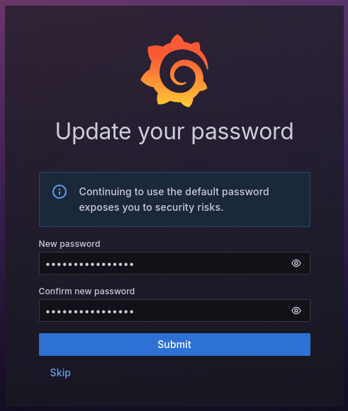
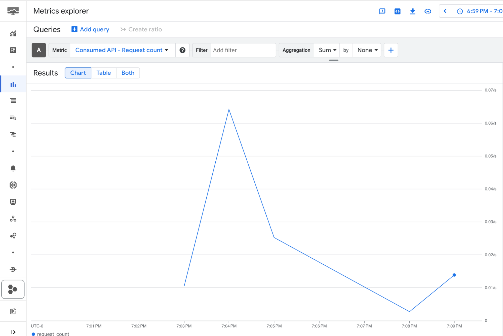
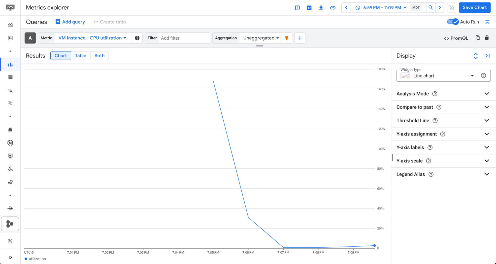
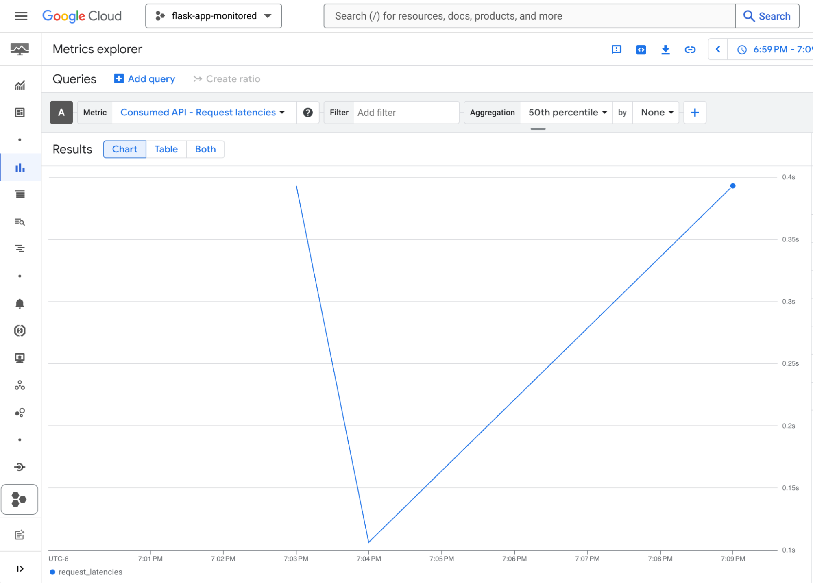
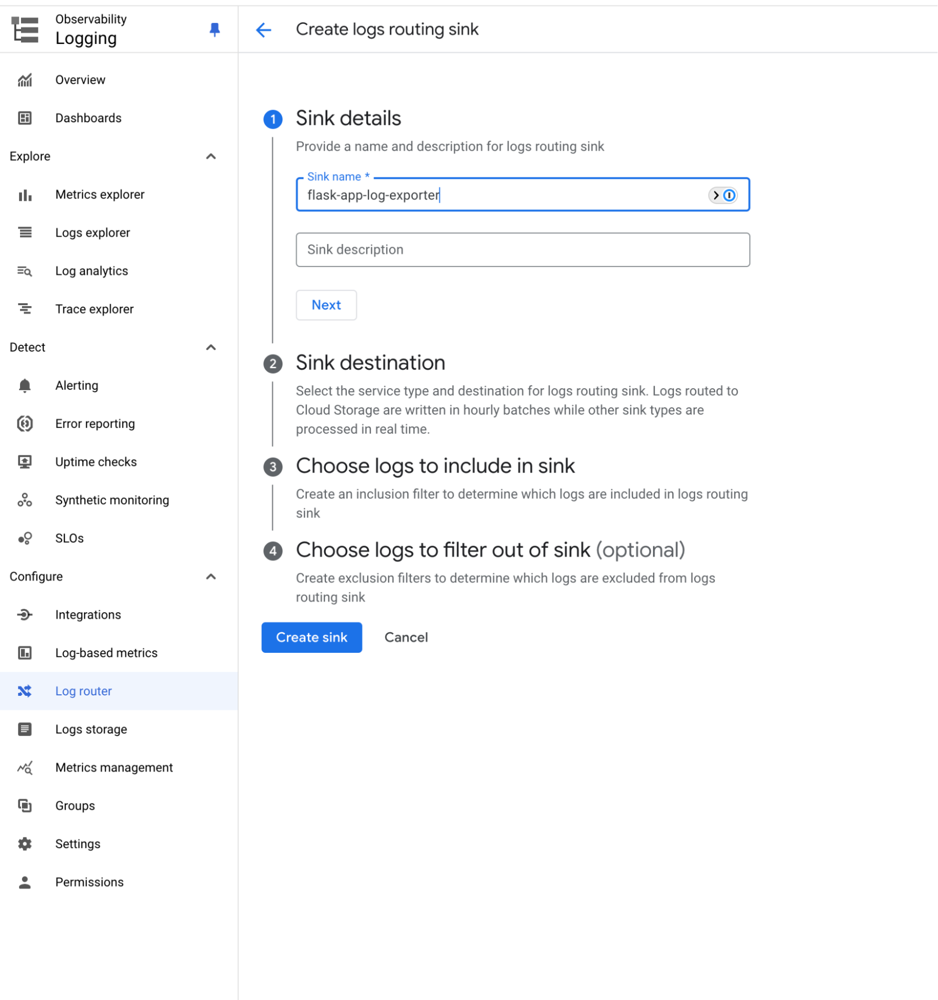
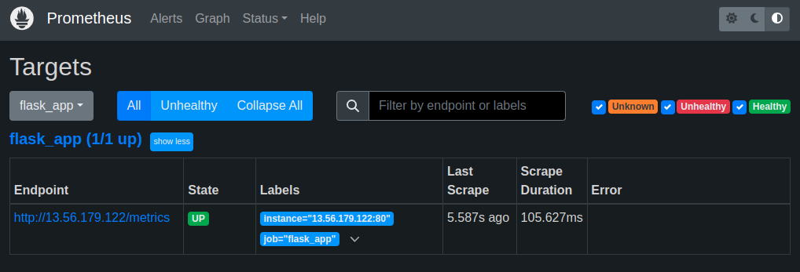
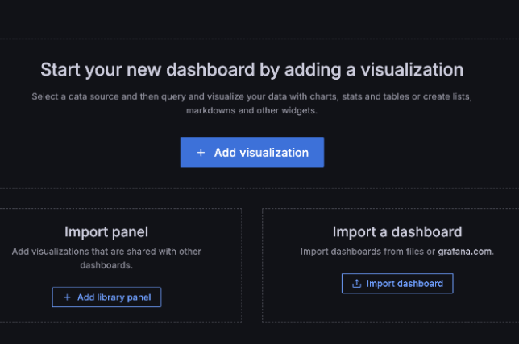

Cloud Monitoring is an observability solution from Google Cloud Platform (GCP). It allows users to monitor their applications, infrastructure, and services within the GCP ecosystem as well as in external and hybrid environments. Cloud Monitoring provides real-time insights into system health, performance, and availability by collecting metrics, logs, and traces.

This guide explains how to migrate standard GCP Cloud Monitoring service logs and metrics to Grafana and Prometheus running on a Linode instance.

## Introduction to Prometheus and Grafana

Prometheus is a [time-series database](https://prometheus.io/docs/concepts/data_model/#data-model) that collects and stores metrics from applications and services. It provides a foundation for monitoring system performance using the PromQL query language to extract and analyze granular data. Prometheus autonomously scrapes (*pulls*) metrics from targets at specified intervals, efficiently storing data through compression while retaining the most critical details. It also supports alerting based on metric thresholds, making it suitable for dynamic, cloud-native environments.

Grafana is a visualization and analytics platform that integrates with Prometheus. It enables users to create real-time, interactive dashboards, visualize metrics, and set up alerts to gain deeper insights into system performance. Grafana can unify data from a wide array of data sources, including Prometheus, to provide a centralized view of system metrics.

Prometheus and Grafana are often used together to monitor service health, detect anomalies, and issue alerts. Being both open source and platfrom-agnostic allows them to be deployed across a diverse range of cloud providers and on-premise infrastructures. Organizations often adopt these tools to reduce operational costs while gaining greater control over how data is collected, stored, and visualized.


While the Linode Marketplace offers an easily deployable [Prometheus and Grafana Marketplace app](https://www.linode.com/marketplace/apps/linode/prometheus-grafana/), this tutorial walks through a manual installation.


## Before You Begin

1.  If you do not already have a virtual machine to use, create a Compute Instance. See our [Getting Started with Linode](/docs/products/platform/get-started/) and [Creating a Compute Instance](/docs/products/compute/compute-instances/guides/create/) guides. The examples in this guide use the Linode 8 GB Shared CPU plan with Ubuntu 24.04 LTS.

    
    The [Linode CLI](https://techdocs.akamai.com/cloud-computing/docs/getting-started-with-the-linode-cli) provides an alternative way to provision resources. For example, the following command creates a **Linode 8 GB** compute instance (`g6-standard-4`) running Ubuntu 24.04 LTS (`linode/ubuntu24.04`) in the Miami datacenter (`us-mia`):

    ```command
    linode-cli linodes create \
        --image linode/ubuntu24.04 \
        --region us-mia \
        --type g6-standard-4 \
        --root_pass  \
        --authorized_keys "$(cat ~/.ssh/id_rsa.pub)" \
        --label monitoring-server
    ```

    Note the following key points:

    -   Replace  with a secure alternative.
    -   This command assumes that an SSH public/private key pair exists, with the public key stored as `id\_rsa.pub` in the user’s `$HOME/.ssh/` folder.
    -   The `--label` argument specifies the name of the new server (`monitoring-server`).
    

1.  Follow our [Setting Up and Securing a Compute Instance](/docs/products/compute/compute-instances/guides/set-up-and-secure/) guide to update your system. You may also wish to set the timezone, configure your hostname, create a limited user account, and harden SSH access.


This guide is written for a non-root user. Commands that require elevated privileges are prefixed with `sudo`. If you’re not familiar with the `sudo` command, see the [Users and Groups](/docs/guides/linux-users-and-groups/) guide.


## Install Prometheus as a Service

In order to install Prometheus, you must first SSH into the newly provisioned Linode.

1.  Create a dedicated user for Prometheus, disable its login, and create the necessary directories for Prometheus:

    ```command
    sudo useradd --no-create-home --shell /bin/false prometheus
    sudo mkdir /etc/prometheus
    sudo mkdir /var/lib/prometheus
    ```

1.  Download the latest version of Prometheus from its GitHub repository:

    ```command
    wget https://github.com/prometheus/prometheus/releases/download/v2.55.1/prometheus-2.55.1.linux-amd64.tar.gz
    ```

    This guide uses version `2.55.1`. Check the project’s [releases page](https://github.com/prometheus/prometheus/releases) for the latest version that aligns with your instance’s operating system.

1.  Extract the compressed file and navigate to the extracted folder:

    ```command
    tar xzvf prometheus-2.55.1.linux-amd64.tar.gz
    cd prometheus-2.55.1.linux-amd64
    ```

1.  Move both the `prometheus` and `promtool` binaries to `/usr/local/bin`:

    ```command
    sudo cp prometheus /usr/local/bin
    sudo cp promtool /usr/local/bin
    ```

    The `prometheus` binary is the main monitoring application, while `promtool` is a utility application that queries and configures a running Prometheus service.

1.  Move the configuration files and directories to the `/etc/prometheus` folder you created previously:

    ```command
    sudo cp -r consoles /etc/prometheus
    sudo cp -r console_libraries /etc/prometheus
    sudo cp prometheus.yml /etc/prometheus/prometheus.yml
    ```

1.  Set the correct ownership permissions for Prometheus files and directories:

    ```command
    sudo chown -R prometheus:prometheus /etc/prometheus
    sudo chown -R prometheus:prometheus /var/lib/prometheus
    sudo chown prometheus:prometheus /usr/local/bin/prometheus
    sudo chown prometheus:prometheus /usr/local/bin/promtool
    ```

### Create a `systemd` Service File

A `systemd` service configuration file must be created to run Prometheus as a service.

1.  Create the service file using a command line text editor such as `nano`.

    ```command
    sudo nano /etc/systemd/system/prometheus.service
    ```

    Add the following content to the file:

    ```file {title="/etc/systemd/system/prometheus.Service"}
    [Unit]
    Description=Prometheus Service
    Wants=network-online.target
    After=network-online.target

    [Service]
    User=prometheus
    Group=prometheus
    Type=simple
    ExecStart=/usr/local/bin/prometheus \
        --config.file=/etc/prometheus/prometheus.yml \
        --storage.tsdb.path=/var/lib/prometheus \
        --web.console.templates=/etc/prometheus/consoles \
        --web.console.libraries=/etc/prometheus/console_libraries

    [Install]
    WantedBy=multi-user.target
    ```

    When done, press <kbd>CTRL</kbd>+<kbd>X</kbd>, followed by <kbd>Y</kbd> then <kbd>Enter</kbd> to save the file and exit `nano`.

1.  Reload the `systemd` configuration files to apply the new service file:

    ```command
    sudo systemctl daemon-reload
    ```

1.  Run the following `systemctl` commands to start the `flash-app` service and enable it to automatically start after a system reboot:

    ```command
    sudo systemctl start prometheus
    sudo systemctl enable prometheus
    ```

1.  Enter the following command to verify that Prometheus is running:

    ```command
    systemctl status prometheus
    ```

    The output should display `active (running)`, confirming a successful setup:

    ```output
    ● prometheus.service - Prometheus Service
         Loaded: loaded (/etc/systemd/system/prometheus.service; enabled; preset: enabled)
         Active: active (running) since Thu 2024-12-05 16:11:57 EST; 5s ago
       Main PID: 1165 (prometheus)
          Tasks: 9 (limit: 9444)
         Memory: 16.2M (peak: 16.6M)
            CPU: 77ms
         CGroup: /system.slice/prometheus.service
    ```

    When done, press <kbd>Q</kbd> key to exit the status output and return to the terminal prompt.

1.  Open a web browser and visit port `9090` ( Prometheus's default port) of your instance's IP address:

    ```command
    http://:9090
    ```

    The Prometheus UI should appear:

    

    
    Prometheus settings are configured in the `/etc/prometheus/prometheus.yml` file. This guide uses the default values. For production systems, consider enabling authentication and other security measures to protect your metrics.
    

## Install the Grafana Service

Grafana provides an `apt` repository, reducing the number of steps needed to install and update it on Ubuntu.

1.  Install the necessary package to add new repositories:

    ```command
    sudo apt install software-properties-common -y
    ```

1.  Import and add the public key for the Grafana repository:

    ```command
    wget -q -O - https://packages.grafana.com/gpg.key | sudo apt-key add -
    sudo add-apt-repository "deb https://packages.grafana.com/oss/deb stable main"
    ```

1.  Update package index and install Grafana:

    ```command
    sudo apt update
    sudo apt install grafana -y
    ```

1.  The installation process already sets up the `systemd` configuration for Grafana. Start and enable the Grafana service:

    ```command
    sudo systemctl start grafana-server
    sudo systemctl enable grafana-server
    ```

1.  Run the following command to verify that Grafana is `active (running)`:

    ```command
    systemctl status grafana-server
    ```

    ```output
    ● grafana-server.service - Grafana instance
         Loaded: loaded (/usr/lib/systemd/system/grafana-server.service; enabled; preset: enabled)
         Active: active (running) since Thu 2024-12-05 13:57:10 EST; 8s ago
           Docs: http://docs.grafana.org
       Main PID: 3434 (grafana)
          Tasks: 14 (limit: 9444)
         Memory: 71.4M (peak: 80.4M)
            CPU: 2.971s
         CGroup: /system.slice/grafana-server.service
    ```

### Connect Grafana to Prometheus

1.  Open a web browser and visit port `3000` (Grafana's default port) of your instance's IP address to access the Grafana web UI:

    ```command
    http://:3000
    ```

1.  Login using the default credentials of `admin` for both the username and password:

    

1.  After logging in, you are prompted to enter a secure replacement for the default password:

    

    Now it's time to add Prometheus as a data source. Expand the **Home** menu, navigate to the **Connections** entry, then click **Add new connection**:

    

1.  Search for and select **Prometheus**.

1.  Click **Add new data source**.

    

1.  In the **URL** field, enter `http://localhost:9090`.

1.  Click **Save & Test** to confirm the connection.

    

    If the test succeeds, your Grafana installation should now be connected to the Prometheus installation running on the same Linode.

## Migrate from GCP Cloud Monitoring to Prometheus and Grafana

Migrating from GCP Cloud Monitoring to Prometheus and Grafana requires planning to ensure the continuity of monitoring capabilities. This transition provides greater control over data storage and handling while unlocking the advanced customization and visualization features offered by these open source alternatives.

### Configure Example Flask Server

1.  Change into your user's home directory and use `git` to clone the example Flask server's GitHub repository to your compute instance:

    ```command
    cd ~
    git clone https://github.com/nathan-gilbert/simple-ec2-cloudwatch.git
    ```

1.  Change into the `example-flask-prometheus` folder in the new `simple-ec2-cloudwatch` directory:

    ```command
    cd simple-ec2-cloudwatch/example-flask-prometheus
    ```

1.  A virtual environment is required to run `pip` commands in Ubuntu 24.04 LTS. Use the following command to install `python3.12-venv`:

    ```command
    sudo apt install python3.12-venv
    ```

1.  Create a virtual environment named `venv` within the `example-flask-prometheus` directory:

    ```command
    python3 -m venv venv
    ```

1.  Activate the `venv` virtual environment:

    ```command
    source venv/bin/activate
    ```

1.  Use `pip` to install the example Flask servers's dependencies:

    ```command
    pip install -r requirements.txt
    ```

1.  Exit the virtual environment:

    ```command
    deactivate
    ```

1.  Create a `systemd` service file for the example Flask app:

    ```command
    sudo nano /etc/systemd/system/flask-app.service
    ```

    Provide the file with the following content, replacing  with your username:

    ```file {title="/etc/systemd/system/flask-app.service"}
    [Unit]
    Description=Flask Application Service
    After=network.target

    [Service]
    User=
    WorkingDirectory=/home//simple-ec2-cloudwatch/example-flask-prometheus
    ExecStart=/home//simple-ec2-cloudwatch/example-flask-prometheus/venv/bin/python /home//simple-ec2-cloudwatch/example-flask-prometheus/app.py
    Restart=always

    [Install]
    WantedBy=multi-user.target
    ```

1.  Reload the `systemd` configuration files to apply the new service file:

    ```command
    sudo systemctl daemon-reload
    ```

### Assess current monitoring requirements

Begin by cataloging all metrics currently monitored in GCP Cloud Monitoring. Identify common metrics for web applications, such as latency, request rates, CPU usage, and memory consumption, in order to recreate similar tracking in Prometheus. Also document existing alert configurations, as alerting strategies must be ported to [Prometheus Alertmanager](https://prometheus.io/docs/alerting/latest/alertmanager/).

In the example Python Flask application, Cloud Monitoring collects key metrics such as API requests, latency, and application logs. Below are examples of metrics visualized in GCP Cloud Monitoring dashboards:

-   **API Requests Over Time**: This dashboard tracks the total number of API requests served by the application:

    

-   **CPU Utilization**: This metric monitors the CPU usage of the underlying infrastructure without requiring additional configuration.

    

-   **API Request Latency**: This dashboard visualizes the amount of time it takes to serve API requests:

    

The metrics shown above are typically tracked in a web application. Cloud Monitoring provides these metrics by default when deployed in a GCP Compute Engine, without the need to modify the application code. Documenting these existing metrics and alerts can help you configure equivalent monitoring in Prometheus and Grafana.

### Export Existing Cloud Monitoring Logs and Metrics

Determine the current usage of Cloud Monitoring and identify any existing logs or data that need to be exported. [GCP Cloud Logging](https://cloud.google.com/logging?hl=en) integrates with Cloud Monitoring and allows you to [create sinks that export logs to different destinations](https://cloud.google.com/logging/docs/export/configure_export_v2). Sinks can be configured to filter logs for a specific application, exporting only relevant entries. Below is an example sink that facilitates the export of logs out of GCP:



The [Cloud Monitoring API](https://cloud.google.com/monitoring/api/v3) allows you to programmatically retrieve metric data. Once this data is retrieved, it can be stored locally or sent to another monitoring system. The [Google Cloud Managed Service for Prometheus](https://cloud.google.com/stackdriver/docs/managed-prometheus) includes an adapter to fetch GCP metrics directly. This avoids the need for manual exporting or scripts, providing real-time observability as if these metrics were local to Prometheus.

GCP Cloud Monitoring has default data retention policies that may limit the availability of historical data. Ensure the exported data frequency meets system requirements, especially when using the API. Data may need to be reformatted to match the destination’s schema. For example, some destinations may require data formatted as JSON, while others might need CSV.

GCP may charge for API calls and data exports, especially when querying metrics at high frequency. Review GCP’s billing policies to avoid unexpected costs. Keep these considerations in mind to facilitate a smooth transition to Prometheus and Grafana.

### Expose Application Metrics to Prometheus

Prometheus works differently from GCP Cloud Monitoring: instead of *pushing* data like GCP Cloud Monitoring, Prometheus *pulls* metrics from the monitored application. After assessing or exporting metrics as needed, modify the application to enable Prometheus metric scraping so that it collects the same metrics previously sent to GCP Cloud Monitoring.

The [`prometheus_flask_exporter` library](https://github.com/rycus86/prometheus_flask_exporter) is a standard library for instrumenting Flask applications to expose Prometheus metrics.

1.  Open the `app.py` file:

    ```command
    nano app.py
    ```

    Ensure the following lines are present, adding or adjusting them if needed:

    ```file {title="~/simple-ec2-cloudwatch/example-flask-prometheus/app.py" lang="python" hl_lines="5,6,8,11,12,14,34"}
    import logging
    import random
    import time

    from flask import Flask
    from prometheus_flask_exporter import PrometheusMetrics

    logging.basicConfig(filename="/home//simple-ec2-cloudwatch/example-flask-prometheus/flask-app.log", level=logging.INFO)
    logger = logging.getLogger(__name__)

    app = Flask(__name__)
    metrics = PrometheusMetrics(app)

    metrics.info("FlaskApp", "Application info", version="1.0.0")


    @app.route("/")
    def hello_world():
        logger.info("A request was received at the root URL")
        return {"message": "Hello, World!"}, 200


    @app.route("/long-request")
    def long_request():
        n = random.randint(1, 5)
        logger.info(
            f"A request was received at the long-request URL. Slept for {n} seconds"
        )
        time.sleep(n)
        return {"message": f"Long running request with {n=}"}, 200


    if __name__ == "__main__":
        app.run(host="0.0.0.0", port=8080)
    ```

    These lines use the `prometheus_flask_exporter` library to:

    -   Instrument the Flask app for Prometheus metrics.
    -   Expose default and application-specific metrics at the `/metrics` endpoint.
    -   Provide metadata such as version information via `metrics.info`.

1.  Save and close the file, then start and enable the `flask-app` service:

    ```command
    sudo systemctl start flask-app
    sudo systemctl enable flask-app
    ```

1.  Verify that the `flask-app` service is `active (running)`:

    ```command
    systemctl status flask-app
    ```

    ```output
    ● flask-app.service - Flask Application Service
         Loaded: loaded (/etc/systemd/system/flask-app.service; enabled; preset: enabled)
         Active: active (running) since Thu 2024-12-05 17:26:18 EST; 1min 31s ago
       Main PID: 4413 (python)
          Tasks: 1 (limit: 9444)
         Memory: 20.3M (peak: 20.3M)
            CPU: 196ms
         CGroup: /system.slice/flask-app.service
    ```

1.  Make sure the Flask app is accessible by issuing the following cURL command:

    ```command
    curl http://:8080
    ```

    You should receive the following response:

    ```output
    {"message": "Hello, World!"}
    ```

1.  To view the metrics, open a web browser and visit the following URL:

    ```command
    http://:8080/metrics
    ```

    The metrics shown include `http_request_duration_seconds` (request latency) and `http_requests_total` (total number of requests).

### Configure Prometheus to Ingest Application Metrics

1.  Modify the Prometheus configuration at `/etc/prometheus/prometheus.yml` to include the Flask application as a scrape target:

    ```command
    sudo nano /etc/prometheus/prometheus.yml
    ```

    Append the following content to the `scrap_configs` section of the file, replacing  with the actual IP address of your `monitoring-server` instance, or in this case, `localhost`:

    ```file {title="/etc/prometheus/prometheus.yml"}
      - job_name: 'flask_app'
        static_configs:
          - targets: [':8080']
    ```

    This configuration tell Prometheus to scrape metrics from the Flask application running on port `8080`.

1.  Save the file and restart Prometheus to apply the changes:

    ```command
    sudo systemctl restart prometheus
    ```

1.  To verify that Prometheus is successfully scraping the Flask app, open a web browser and navigate to the Prometheus UI:

    ```command
    http://:9090
    ```

1.  In the Prometheus UI click the **Status** tab and select **Targets**. You should see the Flask application service listed as a target with a status of `up`, indicating that Prometheus is successfully scraping metrics from the application.

    

### Create a Grafana Dashboard with Application Metrics

Grafana serves as the visualization layer, providing an interface for creating dashboards from Prometheus metrics.

1.  Open a web browser and visit the following URL to access the Grafana UI:

    ```command
    http://:3000
    ```

1.  Navigate to the **Dashboards** page:

    

1.  Create a new dashboard in Grafana by clicking **Create dashboard**:

    

1.  Next, click **Add visualization**:

    

1.  In the resulting dialog, select the **prometheus** data source:

    

1.  To duplicate the GCP Cloud Monitoring metrics for the Flask application, first click on the **Code** tab in the right-hand side of the panel editor:

    

1.  Input the following PromQL query to calculate the average latency for an endpoint:

    ```command
    flask_http_request_duration_seconds_sum{method="GET",path="/",status="200"} /
    flask_http_request_duration_seconds_count{method="GET",path="/",status="200"}
    ```

1.  After entering the formula, click **Run queries** to execute the PromQL query. The chart should update with data pulled from Prometheus:

    

    This visualization replicates GCP Cloud Monitoring's latency metrics, detailing the average latency over time for a specific endpoint. Prometheus further enhances this by providing default labels, such as method, path, and status codes, for greater granularity in analysis.

## Additional Considerations and Concerns

When migrating from GCP Cloud Monitoring to Prometheus and Grafana, it's important to address several key considerations to ensure a smooth and effective transition.

### Cost Management

GCP Cloud Monitoring incurs [costs](https://cloud.google.com/stackdriver/pricing) for log storage and retention, data ingestion, API calls, and alerting policies. Migrating to Prometheus and Grafana eliminates these charges but introduces infrastructure costs for compute, storage, maintenance, and network traffic. Additionally, because Prometheus is designed for short-term data storage, setting up a long-term storage solution may also increase costs.

**Recommendation**:

-   Estimate infrastructure costs for Prometheus and Grafana by assessing current GCP Cloud Monitoring data volume and access usage.
-   Access the [Google Cloud Billing](https://console.cloud.google.com/billing) report to determine a baseline for costs related to GCP Cloud Monitoring and Cloud Logging.
-   Use Prometheus’s default short-term storage for real-time data and configure a long-term storage solution for essential data to optimize costs.
-   Employ Grafana’s alerting and dashboards strategically to reduce high-frequency scrapes and unnecessary data retention.
-   Regularly review and refine retention policies and scraping intervals to balance cost against visibility needs.

### Data Consistency and Accuracy

GCP Cloud Monitoring automates metric collection with built-in aggregation, while Prometheus relies on manual configuration through exporters and application instrumentation. Prometheus stores raw data with high granularity, but does not provide the same level of aggregated historical data as GCP Cloud Monitoring. This may lead to gaps in insights if retention isn’t properly managed.

**Recommendation**:

-   Set up Prometheus exporters such as the [Node Exporter](https://prometheus.io/docs/guides/node-exporter/) (for host metrics) or [custom exporters](https://prometheus.io/docs/instrumenting/writing_exporters/) (for application metrics).
-   Configure scrape intervals to capture data at regular intervals.
-   Verify that custom instrumentation is accurate for critical metrics such as latency, requests, and resource usage.
-   Use the [remote-write capability](https://prometheus.io/docs/specs/remote_write_spec/) from Prometheus to write data to a remote storage backend like [Thanos](https://thanos.io/) or [Cortex](https://cortexmetrics.io/) for historical data retention. This ensures that older data remains accessible and aggregated at a lower resolution, which is similar to GCP's approach to historical data.

### GCP Cloud Monitoring Aggregated Data Versus Prometheus Raw Data

GCP Cloud Monitoring aggregates data automatically to provide a straightforward approach to historical trend analysis. In contrast, Prometheus captures high-resolution, raw data, which can require custom queries to derive similar insights.

**Recommendation**:

-   Leverage Grafana’s dashboards to create aggregated views of Prometheus metrics.
-   Apply queries to aggregate data over larger time windows to create an summarized view similar to GCP Cloud Monitoring.
-   Use Prometheus [query functions](https://prometheus.io/docs/prometheus/latest/querying/functions/) such as [`rate`](https://prometheus.io/docs/prometheus/latest/querying/functions/#rate), [`avg_over_time`](https://prometheus.io/docs/prometheus/latest/querying/functions/#aggregation_over_time), and [`sum_over_time`](https://prometheus.io/docs/prometheus/latest/querying/functions/#aggregation_over_time) to replicate GCP Cloud Monitoring's aggregated trends.

### Alert System Migration

GCP Cloud Monitoring alerts are configured with thresholds and conditions that must be translated into query-based alert rules in Prometheus.

**Recommendation**:

-   Audit existing GCP Cloud Monitoring alerts and replicate them using Prometheus's Alertmanager.
-   Refine alert thresholds based on the type and granularity of data collected by Prometheus.
-   Integrate Alertmanager with any existing notification systems (e.g. email, Slack, etc.) to maintain consistency in how teams are alerted to critical events.

### Security and Access Controls

GCP Cloud Monitoring integrates with GCP’s Identity and Access Management (IAM) system for Role-Based Access Control (RBAC). This can simplify the management of who can view, edit, or delete logs and metrics. However, Prometheus and Grafana require manual configuration of security and access controls.

Securing Prometheus and Grafana involves setting up user authentication (e.g. OAuth, LDAP, etc.) and ensuring metrics and dashboards are only accessible to authorized personnel. Additionally, data in transit should be encrypted using TLS to maintain security.

**Recommendation**:

-   Configure Grafana with an RBAC policy and integrate it with an authentication system like OAuth or LDAP.
-   Enable TLS for Prometheus to secure data in transit.

### Separate Log and Metric Responsibilities

Prometheus is designed for metrics collection and lacks built-in capabilities for managing logs. GCP Cloud Monitoring natively combines logs and metrics, so migration requires decoupling those functions.

**Recommendation**:

-   Use a specialized log aggregation solution alongside Prometheus and Grafana for collecting, aggregating, and querying logs:
    -   [**Grafana Loki**](https://grafana.com/grafana/loki/) is designed to integrate with Grafana. It provides log querying capabilities within Grafana's existing interface, giving a unified view of metrics and logs in a single dashboard.
    -   [**Fluentd**](https://www.fluentd.org/) is a log aggregator that can forward logs to multiple destinations, including object storage for long-term retention, and can work with both Loki and ELK.