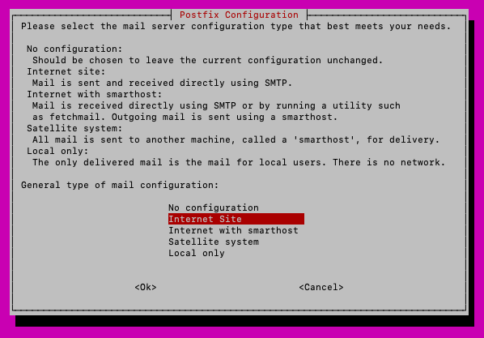
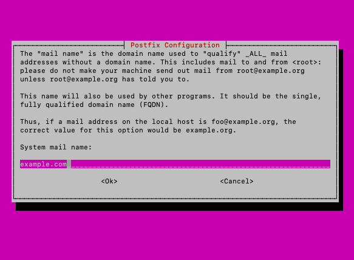
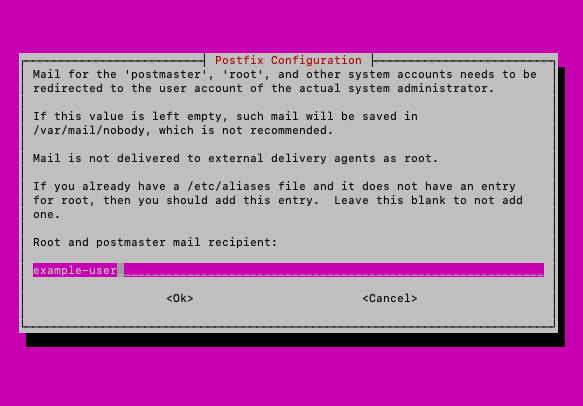

[Nagios](https://www.nagios.com/products/nagios-core/), a popular tool for monitoring servers, comes with a robust web interface to help you effectively manage your server. Its dashboard makes it relatively easy to check in on the hosts and services running on your machine and quickly learn of any issues.

However, you can get even more out of Nagios by setting it up to deliver alerts and notifications when you need them. This guide provides instructions for setting up email alerts from Nagios and configuring regular status updates via *Internet Relay Chat* (IRC).

## Before You Begin

1.  If you have not already done so, create a Linode account and Compute Instance. See our [Getting Started with Linode](/docs/guides/getting-started/) and [Creating a Compute Instance](/docs/guides/creating-a-compute-instance/) guides.

1.  Follow our [Setting Up and Securing a Compute Instance](/docs/guides/set-up-and-secure/) guide to update your system. You may also wish to set the timezone, configure your hostname, create a limited user account, and harden SSH access.

1. Install and configure Nagios. Follow the steps in the [Install Nagios on Debian 10 and Ubuntu 20.04](/docs/guides/install-nagios-on-debian-10-and-ubuntu-2004/) guide. Alternatively, the official [Nagios Installation Guide](https://support.nagios.com/kb/article/nagios-core-installing-nagios-core-from-source-96.html) provides steps for installing Nagios from source code on a wide range of Linux distributions.

1. Replace `example.com` throughout this guide with your machine's domain name, and replace `fqdn.example.com` with your machine's fully qualified domain name (FQDN).


This guide is written for non-root users. Commands that require elevated privileges are prefixed with `sudo`. If you’re not familiar with the `sudo` command, see the [Linux Users and Groups](/docs/guides/linux-users-and-groups/) guide.


## Set Up Nagios Email Alerts




This guide also provides instructions for configuring local emails, which are not subject to the above restriction. Under this configuration, emails are only delivered to users on the same machine as Nagios.


### Install Email Services

1. Install packages for handling emails.

        sudo apt install mailutils postfix

    - You should be prompted for information about your mail server configuration. If you are not or if you need to re-enter the information, you can run the following command after the installation has finished:

          sudo dpkg-reconfigure postfix

    - Select **Internet Site** from the options that appear.

    

    - Enter the domain name to be used for your email addresses. This may be either your machine's fully qualified domain name (FQDN) or base domain name. It can be `localhost` if you are configuring Postfix for local emails only.

    

    - Provide the username of your primary user on the machine.

    

    - When prompted for destinations for which to accept mail, you can leave the field blank to only accept emails directed to the system mail name. If you have a domain name configured and want to ensure that emails are accepted for a wider range of domains, you can enter the following: `localhost, example.com, fqdn.example.com, mail.example.com, localhost.example.com`.

    

    - Use the default values for the remaining steps:
        - Choose **No** to synchronous updates
        - Enter `127.0.0.0/8 [::ffff:127.0.0.0]/104 [::1]/128` for local network
        - `0` for the mailbox limit
        - `+` for the local inbox extension character
        - Select **all** for the Internet protocols

    - Alternatively, you can follow the [Configure Postfix to Send Email Using External SMTP Servers](/docs/guides/postfix-smtp-debian7/) or the [Configure Postfix to Send Mail Using Gmail and Google Apps on Debian or Ubuntu](/docs/guides/configure-postfix-to-send-mail-using-gmail-and-google-workspace-on-debian-or-ubuntu/) guide. Doing so sets up Postfix to send emails via an external SMTP provider or a Gmail account, respectively.

1. Test the email configuration with the following command below; replace `example-user` with the username of a local user that you can log in as.

        echo "Body of the test email." | mail -s "Test Email" example-user@localhost

    - Log in as `example-user`, and run the `mail` command. Verify that the user received the test email.

    - You can use a similar command to the one above to test outbound emails. Replace `example-user@localhost` with an external email address to which you have access.

### Configure Nagios

1. Using your preferred text editor, open the Nagios commands configuration file, located at `/etc/nagios4/objects/commands.cfg`. Identify the command definitions for `notify-host-by-email` and `notify-service-by-email`. For each, verify that the location of the `mail` binary is `/usr/bin/mail`, as in the following example:

    

# 'notify-host-by-email' command definition

define command{
        command_name    notify-host-by-email
        command_line    /usr/bin/printf "%b" "***** Nagios *****\n\nNotification Type: $NOTIFICATIONTYPE$\nHost: $HOSTNAME$\nState: $HOSTSTATE$\nAddress: $HOSTADDRESS$\nInfo: $HOSTOUTPUT$\n\nDate/Time: $LONGDATETIME$\n" | /usr/bin/mail -s "** $NOTIFICATIONTYPE$ Host Alert: $HOSTNAME$ is $HOSTSTATE$ **" $CONTACTEMAIL$
        }

# 'notify-service-by-email' command definition

define command{
        command_name    notify-service-by-email
        command_line    /usr/bin/printf "%b" "***** Nagios *****\n\nNotification Type: $NOTIFICATIONTYPE$\n\nService: $SERVICEDESC$\nHost: $HOSTALIAS$\nAddress: $HOSTADDRESS$\nState: $SERVICESTATE$\n\nDate/Time: $LONGDATETIME$\n\nAdditional Info:\n\n$SERVICEOUTPUT$\n" | /usr/bin/mail -s "** $NOTIFICATIONTYPE$ Service Alert: $HOSTALIAS$/$SERVICEDESC$ is $SERVICESTATE$ **" $CONTACTEMAIL$
        }
    

1. Open the Nagios `contacts.cfg` configuration file, located at `/etc/nagios4/objects/contacts.cfg`. Identify the `nagiosadmin` contact definition. In the email field, enter the email address where you would like to receive Nagios notifications.

    You can configure Nagios to send notifications to a local mailbox using `example-user@localhost`, where `example-user` is the local user you want to receive Nagios alerts.

1. Open the Nagios `templates.cfg` configuration file, located at `/etc/nagios/objects/templates.cfg`. Find the `generic-host` definition, and ensure that it has the following line:

    
contact_groups      admins
    

    Similarly, find the `generic-service` definition, and ensure that the same line is present.

1. Restart the Nagios service.

        sudo systemctl restart nagios4

### Test Nagios Email Alerts

You can use the following steps to verify that Nagios is delivering alerts by email.

1. In a web browser, navigate to your Nagios interface, and log in as the `nagiosadmin` user.

1. Select **Services** from the menu on the left, and select any of the services for which notifications are not disabled.

1. Choose the **Send custom service notification** option from the **Service Commands** menu on the right. Enter a comment, and select **Commit**.

1. Check the email inbox that you configured Nagios to send notifications to, and verify that you received your custom notification.

    If your Nagios alerts are sent to a local user, log in as that user, and use the `mail` command to check the user's inbox.

## Set Up Nagios IRC Alerts

This guide uses [NagIRCBot](https://manpages.ubuntu.com/manpages/trusty/man1/nagircbot.1.html), an application designed to routinely read Nagios's status information and post updates to an Internet Relay Chat (IRC) channel.

### Build and Install NagIRCBot

1. Install the requisites for building NagIRCBot.

        sudo apt-get install -y autoconf gcc libc6 libmcrypt-dev make libssl-dev wget bc gawk dc build-essential snmp libnet-snmp-perl gettext

1. Navigate to the [NagIRCBot Exchange directory](https://exchange.nagios.org/directory/Addons/Notifications/IRC/nagircbot/details). Replace the version number in the following examples with the version you find.

1. In the `/opt` directory, download the package containing the files needed to build the bot; extract the files, and change them into the resulting directory.

        cd /opt
        sudo wget https://launchpad.net/ubuntu/+archive/primary/+sourcefiles/nagircbot/0.0.33-2/nagircbot_0.0.33.orig.tar.gz
        sudo tar -zxvf nagircbot_0.0.33.orig.tar.gz
        cd nagircbot-0.0.33
        sudo make
        sudo make install
        sudo cp nagircbot /usr/local/bin

1. Build the NagIRCBot application.

        sudo make
        sudo make install

### Run and Test NagIRCBot

1. Use a version of the following command to start NagIRCBot.

        sudo nagircbot -f /var/lib/nagios4/status.dat -s irc.example.com:6667 -c \#example-channel -C -n nagircbot -u nagircbot-username -U NagIRCBot-Name -I 900

    Replace `irc.example.com` with the hostname of the IRC network or `localhost` for a local IRC network. Replace `nagircbot`, `nagircbot-username`, and `NagIRCBot-Name` with the nickname, username, and real name, respectively, to be used for the bot. Change the `900` as needed; it defines how frequently, in seconds, the bot checks and sends Nagios status information.

1. Connect to the IRC channel, and verify that you are receiving status updates at the expected interval.

1. By default, NagIRCBot must be re-initiated using the command described above after each system reboot. Refer to the [Use systemd to Start a Linux Service at Boot](/docs/guides/start-service-at-boot/) or the [Schedule Tasks with Cron](/docs/guides/schedule-tasks-with-cron/) guide for instructions on how to schedule tasks to run automatically.
