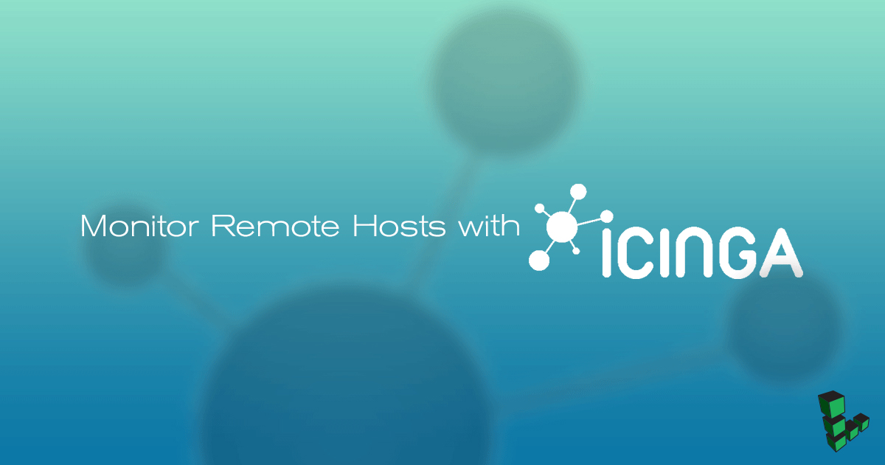

## What is Icinga 2?

This guide is a continuation of our guide on [Icinga 2](/docs/guides/install-icinga2-monitoring-on-debian-9/).
Icinga, is an open source network monitoring application that can be used to monitor critical services and systems on your Linode. Icinga 2 can monitor hosts on a network or it can verify network external protocols, such as the state of an HTTP server, mail server, file-sharing service, or others.

## Before You Begin

The steps and examples in this guide assume the defaults and configurations from the previous guide. Adjust all variables accordingly.

## Monitor Remote Hosts via Simple Host Monitoring

In order to monitor a host and its external services via regular command checks, Icinga 2 uses a mechanism that issues a ping command against the server's IP address at regular intervals and using its built-in commands, regularly verifies the state of remote network services protocols, such as HTTP, SSH, SMTP, IMAP, POP or others.\
Icinga 2 stores Host definitions in objects. These objects and their attributes are used for applying rules for `Service`, `Notification`, `Dependency`, and `Scheduled Downtime` can be found in `hosts.conf` file, in `/etc/icinga2/conf.d/`.

1.  To add a new host definition to be periodically monitored by Icinga 2 engine via ICMP checks, open `hosts.conf` and add the following lines to the bottom of the file:

    
object Host "Linode" {
  import "generic-host"
  address = "10.25.1.31"
  check_command = "hostalive"
}


2.  To check the status of a web server that runs on this node, add the following lines after host definition. This check will verify if the web server is alive and responds with the proper HTTP codes:

    
object Service "http" {
  host_name = "Linode"
  check_command = "http"
}


3.  Restart the service to apply the host definitions and start monitoring the new host resource:

        systemctl restart icinga2.service

4.  Verify the state of the new host by navigating to **Overview** then **Hosts** in Icinga’s Web 2 interface.

5.  To display the status of the host’s HTTP service, navigate to **Overview** then **Servicegroups** and click **HTTP Checks**.

## Monitor Remote Hosts via Icinga 2 Agent Monitoring

Icina2 can monitor a node's internal health parameters, such as CPU load, disk space, memory, and number of running process via a secured channel set up between a master node and client node on port `5665/TCP`. In this instance we’ll configure our Icinga 2 to act as the master node and monitor the remote CentOS 7 client node. In this specific type of configuration, also called a *Top Down Command Endpoint* model, the check commands will be scheduled on the master node and then will be sent to the client via a TLS connection.

1.  Set up the Icinga 2 master node on our Debian 9 server. Configure this instance of Icinga 2 as a master node:

        icinga2 node wizard

2.  Follow the prompts, and enter `n` to install a master setup:

        Please specify if this is a satellite setup ('n' installs a master setup) [Y/n]: n

3.  Press **Enter** to accept the default for each of the following:

        Please specify the common name (CN) [icinga]:
        Please specify the API bind host/port (optional):
        Bind Host []:
        Bind Port []:

4.  Restart the Icinga 2 service to apply the master node configuration and check the daemon status:

        systemctl restart icinga2.service
        systemctl status icinga2.service

5.  Output the port number of this master node and open the port in your Debian firewall:

        netstat -tulpn| grep icinga

6.  Generate a client ticket for your client node. Use the hostname of your client to generate the ticket. In this example the client node hostname is `centos`. Replace the hostname of the client and make sure you run the command with `root` privileges:

        icinga2 pki ticket --cn 'centos'

    The command will generate and display a key. Copy or note this key because you will need it to set up the CentOS client later.

## Configure CentOS 7 Client Node

1.  Log in to your CentOS 7 system with an account with `root` privileges or directly as root and issue the following command to enable EPEL and Icinga 2 repositories in CentOS. Also, make sure your CentOS 7 system is configured with a static IP address.

        yum install epel-release
        yum install https://packages.icinga.com/epel/icinga-rpm-release-7-latest.noarch.rpm

2.  Install the Igina2 engine and Nagios plugins required by Icinga 2 to execute the check commands in CentOS by issuing the following command:

        yum install icinga2 nagios-plugins-all

3.  After the Icinga 2 daemon has been installed in your CentOS system, start the node wizard and configure this system as a satellite node instead of master node:

        icinga2 node wizard

4.  Use the client node wizard to configure the CentOS client node with the following answers when prompted. Press **Enter** to accept the default as shown below:

        Please specify if this is a satellite setup ('n' installs a master setup) [Y/n]: y
        Please specify the common name (CN) [centos]: **Enter**
        Master Common Name (CN from your master setup): icinga
        Do you want to establish a connection to the master from this node? [Y/n]: y
        Master endpoint host (Your master's IP address or FQDN): 10.25.32.120
        Master endpoint port [5665]: **Enter**
        Add more master endpoints? [y/N]: n
        Please specify the master connection for CSR auto-signing (defaults to master endpoint host): **Enter**
        Host [10.25.32.120]: **Enter**
        Port [5665]: **Enter**

5.  Verify the information when prompted:

        Is this information correct? [y/N]: y

6.  Enter the ticket key generated in Step 6 of the previous section:

        Please specify the request ticket generated on your Icinga 2 master.
         (Hint: # icinga2 pki ticket --cn 'centos'): <b>a34c7fcbc4f5311257d2a5d4e7f1961dc3c64cb5 </b> (Enter the ticket key generated on the master node)

7.  Complete the installation:

        Please specify the API bind host/port (optional): **Enter**
        Bind Host []: **Enter**
        Bind Port []: **Enter**
        Accept config from master? [y/N]: y
        Accept commands from master? [y/N]: y

8.  After the client node wizard completes, restart the Icinga 2 service, check Icinga 2 service status, list Icinga’s listening port, and add the Icinga 2 listening port number to the CentOS firewall:

        systemctl restart icinga2
        systemctl status icinga2
        ss –tlpn|grep icinga2
        firewall-cmd --add-port=5665/tcp --permanent
        firewall-cmd --reload

## Set up Icinga 2 Master Agent-based Monitoring

1.  Log in to the Icinga 2 master node and create a CentOS client zone directory, a client configuration, and a services file:

        mkdir /etc/icinga2/zones.d/centos/
        touch /etc/icinga2/zones.d/centos/centos.conf
        touch /etc/icinga2/zones.d/centos/services.conf

2.  Add the following lines to the `centos.conf` zone configuration file:

    
object Zone "centos" {
  endpoints = [ "centos" ]
  parent = "icinga"
}

object Endpoint "centos" {
  host = "192.168.1.100"
}

object Host "centos" {
  import "generic-host"
  address = "192.168.1.100"
  vars.os = "Linux"
  vars.notification["mail"] = {
    groups = [ "icingaadmins" ]
  }
  vars.client_endpoint = name
}


    The CentOS endpoint object zone will report back to its master node defined by the `parent = “icinga”` statement. Replace the CentOS hostname and IP address accordingly.

3.  Update the CentOS zone services configuration file:

    
apply Service "users" {
  import "generic-service"
  check_command = "users"
  command_endpoint = host.vars.client_endpoint
  assign where host.vars.client_endpoint
}

apply Service "procs" {
  import "generic-service"
  check_command = "procs"
  command_endpoint = host.vars.client_endpoint
  assign where host.vars.client_endpoint
}


    In this configuration file we’ve defined the following services checks for the remote client:

    * Verify number of users logged in to the system and the number of processes running.
    * The `command_endpoint` lines force the service checks to be transmitted to the remote CentOS system and executed by the Icinga 2 engine command endpoint.
    * You can add as many commands as you’d like here to be executed internally on the remote host. However, if Icinga sent instructions are not present on the remote node as Nagios plugin scripts, the commands won’t execute and an error will be displayed in the icinga2 web interface.

4.  Restart the icinga2 service to apply the configurations.

5.  Navigate to the Icinga Web 2 interface to verify that the command checks are running on the remote node host.

## That’s all!

You have successfully configured Icinga 2 as a master node and added a CentOS 7 client node to be remotely checked via Icinga 2 agent-based monitoring system and another remote host to be actively monitored via external services command checks.

For other Icinga 2 configurations, installation, and monitoring mechanisms, visit the [official Icinga 2 documentation](https://www.icinga.com/docs/icinga2/latest/doc/01-about/).
