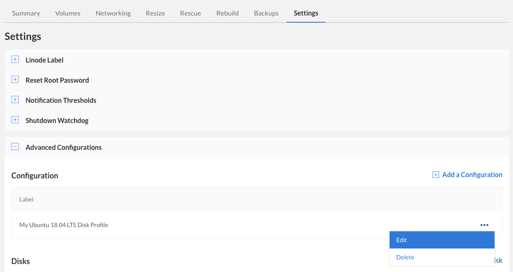
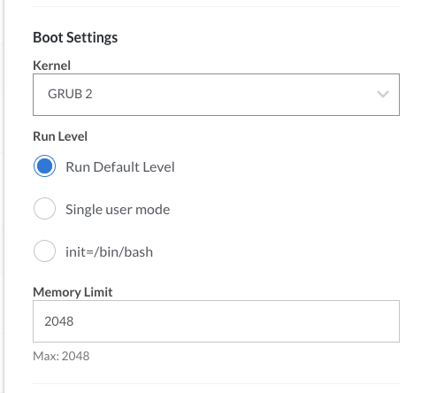
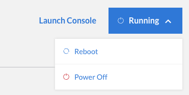

Now that your Linode is up and running, it's time to think about monitoring and maintaining your server. This guide introduces the essential tools and skills you'll need to keep your server up to date and minimize downtime. You'll learn how to monitor the availability and performance of your system, manage your logs, and update your server's software.

## Availability Monitoring

The *availability* of your servers, and the websites and web applications you host on them, can be critically important. If you generate income from a blog or charge subscription fees for your web application, downtime can have a severe impact on your bottom line. Using an availability monitoring tool can help you rapidly detect and resolve service disruptions, thereby mitigating the impact on your websites and web applications.

### Assess Your Needs

Not everyone needs to monitor the availability of their server. For example, if you use your Linode to host a personal picture gallery website for friends and family, the occasional service interruption probably won't bother you. The small inconvenience of your website going offline for a few minutes doesn't justify the time it would take to set up and configure an availability monitoring tool.

If you depend on your website or web application for your livelihood, an availability monitoring tool is practically a necessity. Once set up, the tool actively watches your servers and services and alerts you when they're unavailable. You'll be able to troubleshoot the problem and restore service as quickly as possible.

Whether you use one Linode or dozens of them, mission-critical servers and services should be watched by an independent monitoring tool that can keep tabs on their availability. The tool should have an automated method of detecting service-related incidents and be able to notify you via email, text message, or SMS. That way you'll know that a server or service is down within minutes of it having failed.

### Find the Right Tool

There are several different availability monitoring tools available. Your decision should be based on how many servers you'll be monitoring:

-   **Multiple Servers**: If you run more than one server, the [Elastic Stack](/docs/guides/visualize-apache-web-server-logs-using-elastic-stack-on-debian-8/) is an excellent monitoring tool.
-   **Single Server**: If you only run a single server, you might want to use a third-party service to monitor your Linode. You could also use a network diagnostic tool like [MTR](/docs/guides/diagnosing-network-issues-with-mtr/) to diagnose and isolate networking errors.
-   **Linode Managed**: The [Managed](https://www.linode.com/managed) service lets Linode manage your infrastructure and provides incident response around the clock.

### Configure Shutdown Watchdog



## Performance Monitoring

*Performance* monitoring tools record vital server and service performance metrics. Similar to a vehicle's dashboard, which has gauges for things like speed and oil pressure, performance monitoring tools provide valuable insight into the inner workings of your virtual server. With practice, you'll be able to review this information and determine whether your server is in good health.

### Linode Cloud Manager



### Configure Linode Cloud Manager Email Alerts



### Use Third-Party Tools



## Linode Managed

[Linode Managed](https://www.linode.com/managed) is our monitoring service that offers 24x7 incident response, dashboard metrics for your Linodes, free cPanel, and an automatic backup service. With a three-month Linode Managed commitment, you also get two complimentary standard site migrations performed by our [Professional Services Team](https://www.linode.com/professional-services). If you are running more than one Linode, not all are required to be managed. You can establish separate accounts (e.g., production and development) and monitor only the most critical services running on designated Linode(s). Existing customers can sign up for Linode Managed by [contacting support](https://cloud.linode.com/support/tickets).

## Manage Logs

Important events that occur on your system — things like login attempts or services being restarted — are recorded in your server's *logs*. Similar to car maintenance records and completed tax forms, which provide a paper trail in the event of a problem or discrepancy, log files keep track of system events. You might review logs when troubleshooting errors, tracking usage, or investigating unusual behavior on your system.

### Rotate Logs

As more and more events are logged, the log files on your server get bigger and bigger. Left unchecked, those files can start consuming a surprising amount of disk space. You can mitigate this problem by using [logrotate](/docs/guides/use-logrotate-to-manage-log-files/), a utility that automatically archives and compresses current log files after a certain interval, creates new log files, and deletes old log files after a specified amount of time.

Use the [logrotate guide](/docs/guides/use-logrotate-to-manage-log-files/) to get started.

### Monitor System Logs

It's important to keep an eye on the events recorded in your system logs. But unless you're the type of person who loves scanning through hundreds of lines of log entries, you won't want to open log files unless absolutely necessary. Fortunately, there's an easier way to learn about the most important system events fast. Logwatch is a customizable utility that can automatically parse system logs and email you detailed reports highlighting notable events.

Use the [Logwatch guide](/docs/guides/monitor-systems-logwatch/) to get started.

## Update Software

Linux distributions are frequently updated to fix bugs, add new features, and patch security vulnerabilities. To take advantage of the new packages and patches, you'll need to remember to perform some simple steps every once in a while. This section shows you what to do.

### Update Installed Packages

You learned about the importance of regularly updating your server's packages in the [Setting Up and Securing a Compute Instance](/docs/guides/set-up-and-secure/) guide. If nothing else, installing updates is a fast and easy way to mitigate vulnerabilities on your server.

To check for software updates and install them in Ubuntu or Debian, enter the following commands, one by one:

    apt-get update
    apt-get upgrade --show-upgraded


If you're using a distribution other than Ubuntu or Debian, you can learn more about package management by reading our [Linux Package Management guide](/docs/guides/linux-package-management/).


There are ways to automate the installation of software updates, but this is not recommended. You should always manually review the lists of available patches before installing updates.

### Apply Kernel Updates

When you first sign up for Linode and create a virtual server, the Linode Cloud Manager automatically creates a [configuration profile](/docs/guides/linode-configuration-profiles//) with the latest kernel selected. We [update the kernels](http://www.linode.com/kernels/) as necessary and make them available in the Linode Cloud Manager. In most cases, new kernels will automatically be selected in the configuration profile in the Linode Cloud Manager — once we release a new kernel, all you have to do is reboot your Linode to start using it.

To check for a new kernel and start using it on your Linode:

1.  First, check what version kernel your Linode is currently using. Log in to your Linode and execute the following command:

        cat /proc/version

1.  Examine the output and remember the version number:

      
Linux version 4.15.12-x86_64-linode105 (maker@build.linode.com) (gcc version 4.9.2 (Debian 4.9.2-10+deb8u1)) #1 SMP Thu Mar 22 02:13:40 UTC 2018


1.  Log in to the [Linode Cloud Manager](https://cloud.linode.com).
1.  Click the **Linodes** link in the sidebar.
1.  Select your Linode. The Linode's details page appears.
1.  Select the active configuration profile by clicking the **Edit** link, as shown below.

    

1.  From the **Kernel** menu, verify that **GRUB 2** is selected:

    

1.  If you selected a new kernel, click **Submit**. The Linode's dashboard appears.
1.  Select **Reboot** from the status menu to reboot your Linode and start using the new kernel.

    

### Upgrade to a New Release

Linux distributions such as Ubuntu and Fedora use version numbers to identify the individual versions, or *releases*, of the operating system. It's important to know which release your server is running, as releases are usually supported for one or more years. After support for your release is discontinued, you won't be able to download or apply critical security packages, which can put your server at risk.

There are two ways to upgrade a Linode running an unsupported release. You can upgrade your existing server to the next release, or you can create a new Linode with the newest release available and transfer your files from the old server. See our [Upgrading guides](/docs/security/upgrading) for more information.

 
Check the distribution's website to learn when support for your release will be discontinued. Ubuntu offers a *long-term support* (LTS) release that is supported for five years.

