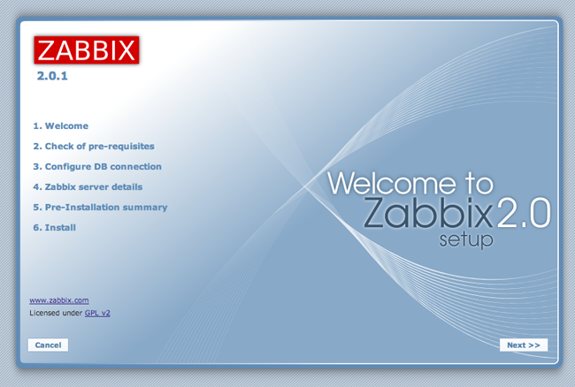
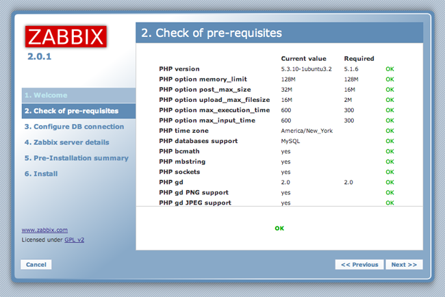
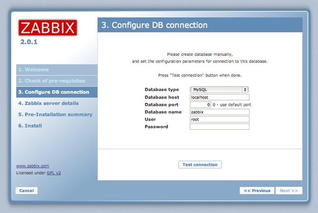
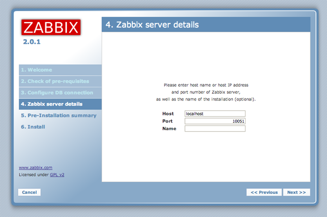
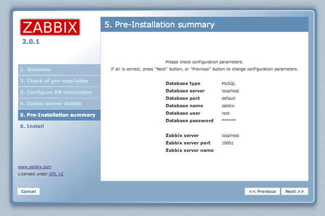
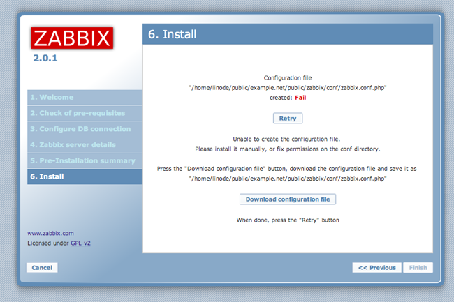
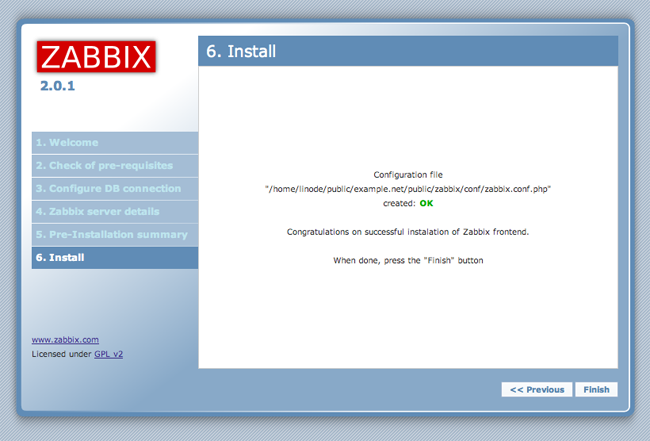
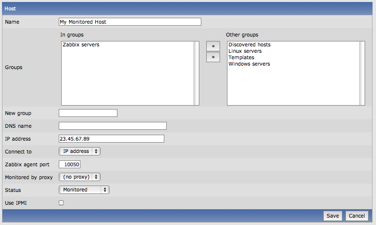

Zabbix is an open source software application that can monitor servers, networks, and applications. You can use Zabbix with any of our plans, and it works on every Linux distribution we offer. Full hardware and software requirements can be found on the [Zabbix requirements page](http://www.zabbix.com/requirements.php).

## Deciding How to Install Zabbix

There are two ways to install Zabbix. You can compile and install Zabbix from source, or you can install Zabbix packages, if your distribution supports it.

Installing the packages is faster and makes things easier to maintain, but the installed version might be older than what's available on the Zabbix website. Compiling and installing from source is a longer process, but it works on every distribution, and you'll get the latest version of Zabbix.

### Installing Packages

If you're running Ubuntu or Debian and would like to install the Zabbix packages, follow these instructions:

Other distributions may also have packages for Zabbix. Check the distribution's website for more information.


1.  Install Zabbix server by entering the following command:

        sudo apt-get install zabbix-server-mysql

2.  Install the Zabbix web interface by entering the following command:

        sudo apt-get install zabbix-frontend-php

3.  Install the Zabbix agent by entering the following command:

        sudo apt-get install zabbix-agent

Zabbix is now installed and running on your Linode.


If you install the Zabbix packages, you do not need to follow the rest of the instructions in this guide.


### Compiling and Installing from Source

If you decide not install the Zabbix packages, or your distribution does not support it, use the instructions in the rest of this guide to compile and install Zabbix from source.

## Prerequisites

You'll need to install some software before you actually install Zabbix itself. It requires a database backend, and in this example we'll use MySQL, but you can also use PostgreSQL, SQLite, Oracle, or IBM DB2. Other mandatory requirements are a C compiler and GNU Make. Optionally, you can also include NET-SNMP for SNMP support, lksemel to enable Jabber messaging, and/or Libcurl to enable the WEB monitoring module.

### Adding a New User

You'll also want to create a new user to run Zabbix. Here's how:

1.  Create a new user by entering the following command:

        sudo adduser zabbix

2.  Add the `zabbix` user to the admin group by entering the following command:

        sudo usermod -a -G sudo zabbix

3.  Start acting as the `zabbix` user by entering the following command:

        su - zabbix

You have successfully added the `zabbix` user.

### Configuring MySQL

You'll first want to install MySQL on your Linode and create a MySQL user for Zabbix. Here's how:

1.  If you haven't already, install and configure MySQL on your Linode. See the [MySQL reference manuals](/docs/databases/mysql/) for more information.
2.  Log in to MySQL by entering the following command:

        mysql -uroot -p

3.  Enter the password for the MySQL root user.
4.  Create a database for Zabbix by entering the following command:

        create database zabbix;

5.  Create a MySQL zabbix user to the access the new database by entering the following command, replacing `Password` with a password:

        grant all privileges on zabbix.* to zabbix@localhost identified by 'Password';

6.  Log out of MySQL by entering the following command:

        quit;

You have configured MySQL for Zabbix.

### Installing Apache and PHP

Zabbix requires Apache and PHP to be installed. Here's how to install them:

1.  Install Apache by entering the following command:

        sudo apt-get install apache2

2.  Install PHP and the required modules by entering the following command:

        sudo apt-get install php5 php-pear php5-suhosin php5-gd php5-curl php5-mysql

3.  Install other required libraries by entering the following command:

        sudo apt-get install libmysqlclient-dev libcurl3-gnutls libcurl3-gnutls-dev

4.  Verify that you have configured a name-based virtual host for Apache. This is required for the Zabbix web interface. For instructions, see [Configuring Name-based Virtual Hosts](/docs/guides/hosting-a-website-ubuntu-18-04/#configure-name-based-virtual-hosts-in-apache-web-server).

The required applications, modules, and libraries have been installed on your Linode.

### Configuring PHP

Now you'll want to make some adjustments to your `php.ini` file for Zabbix. Here's how:

1.  Open the `php.ini` file for editing by entering the following command:

        sudo nano /etc/php5/apache2/php.ini

2.  Verify that the following settings are set in the `php.ini` file.


memory_limit = 128M
post_max_size = 32M
upload_max_filesize = 16M
max_execution_time = 600
max_input_time = 600
date.timezone = America/New_York




You can [use this webpage](http://php.net/manual/en/timezones.php) to find the correct date.timezone value.


3.  Save the changes by restarting Apache. Enter the following command:

        sudo service apache2 restart

PHP is now configured for Zabbix.

### Installing a Compiler

You'll need a C compiler and `make` to install Zabbix. If your Linode is running **Ubuntu or Debian**, use these instructions:

1.  Install `make` by entering the following command:

        sudo apt-get install make

2.  Install the C compiler by entering the following command:

        sudo apt-get install gcc

You have installed the C compiler and `make` on your Linode.

## Zabbix Server

Now that all of the Zabbix prerequisites are ready, we can start installing.

### Downloading and Unpacking

Let's start by downloading and unpacking Zabbix. Here's how:

1.  Find the latest version of Zabbix on the [Zabbix download page](http://www.zabbix.com/download.php). Log in to your Linode and enter the following command, replacing the link with the latest version available on the Zabbix download page:

        wget http://sourceforge.net/projects/zabbix/files/ZABBIX%20Latest%20Stable/2.0.1/zabbix-2.0.1.tar.gz/download

2.  Once we have the latest package downloaded, we'll need to unpack it by entering the following command:

        tar -xzf download

You have successfully downloaded and unpacked Zabbix.

### Configuring MySQL

Populate your Xabbix database by entering the following commands, one by one. Replace `Password` with the Zabbix MySQL user password:

    mysql -D zabbix -uzabbix -pPassword < /home/zabbix/zabbix-2.0.1/database/mysql/schema.sql
    mysql -D zabbix -uzabbix -pPassword < /home/zabbix/zabbix-2.0.1/database/mysql/data.sql
    mysql -D zabbix -uzabbix -pPassword < /home/zabbix/zabbix-2.0.1/database/mysql/images.sql

You have successfully configured MySQL for Zabbix server.

### Compiling and Installing

Now we're ready to compile and install Zabbix server. Here's how:

1.  Change to the Zabbix directory by entering the following command:

        cd zabbix-2.0.1

2.  Enter the following command to compile Zabbix:

        ./configure --enable-server --with-mysql  --with-libcurl

3.  When the configuration completes, you can make and install Zabbix by entering the following command:

        sudo make install

4.  You'll also need to configure and make the agent binaries. Enter the following command to compile these statically so you don't have to download the entire Zabbix package to each monitored host to compile them:

        ./configure --enable-agent --enable-static

5.  Enter the following command to install Zabbix:

        sudo make install

You have successfully compiled and installed Zabbix.

### Creating the Configuration and Log File

Now you'll need to create a configuration file for the Zabbix server in your /etc/zabbix directory. Here's how:

1.  Create a new directory in `/etc` by entering the following command:

        sudo mkdir /etc/zabbix

2.  Create the configuration file by entering the following command:

        sudo touch /etc/zabbix/zabbix_server.conf

3.  Change the owner by entering the following command:

        sudo chown -R zabbix:zabbix /etc/zabbix

4.  Create the log file by entering the following command:

        sudo touch /var/log/zabbix.log

5.  Change the owner of the log file by entering the following command:

        sudo chown zabbix:zabbix /var/log/zabbix.log

6.  Open the Zabbix configuration file for editing by entering the following command:

        sudo nano /etc/zabbix/zabbix_server.conf

7.  Add the following to the `zabbix_server.conf` file. At this point, it only requires your database connection details, though we will also be adding a Zabbix server log as well.

    

DBName = zabbix DBPassword = YourZabbixMySQLpassword DBUser = zabbix LogFile = /var/log/zabbix.log


    
A full list of configuration parameters for `zabbix_server.conf` are [available here](http://www.zabbix.com/documentation/1.8/manual/processes/zabbix_server).


8.  Close and save the file by pressing Control X and then Y.

You have successfully created the configuration file.

### Setting Zabbix to Start Automatically at Boot

To ensure that Zabbix starts every time you reboot your Linode, you'll need to copy the Zabbix `init.d` scripts to the appropriate directory and set the correct permissions. Here's how:

1.  Copy the scripts by entering the following commands, one by one:

        sudo cp /home/zabbix/zabbix-2.0.1/misc/init.d/debian/zabbix-server /etc/init.d
        sudo cp /home/zabbix/zabbix-2.0.1/misc/init.d/debian/zabbix-agent /etc/init.d

2.  Change the permissions by entering the following commands, one by one:

        sudo chmod 755 /etc/init.d/zabbix-server
        sudo chmod 755 /etc/init.d/zabbix-agent

3.  Set Zabbix to start when the machine boots by entering the following commands, one by one:

        sudo update-rc.d zabbix-server defaults
        sudo update-rc.d zabbix-agent defaults

Now the Zabbix server and agent will automatically start every time you boot your Linode.

### Starting Zabbix

Now you can start the Zabbix server and agent by entering the following commands, one by one:

    sudo /etc/init.d/zabbix-server start
    sudo /etc/init.d/zabbix-agent start

Zabbix is now running on your Linode! To verify, enter the following command:

    ps -aux | grep zabbix

# Zabbix Agent

The Zabbix Agent (`zabbix_agentd`) is placed on the client servers you want to monitor.

### Creating a New User

First, you'll want to create a `zabbix user` on the client system. Enter the following command to create the user:

    adduser zabbix

The user has been created.

### Installing and Configuring

Now you'll want to create directories for the Zabbix files on your client server. You'll also need to copy some files to the new directories. Here's how to do it:

1.  Create the directories by entering the following commands, one by one:

        mkdir /opt/zabbix
        mkdir /opt/zabbix/sbin
        mkdir /opt/zabbix/bin
        mkdir /etc/zabbix

2.  Next, you'll want to copy over the necessary files. There are 3 files to copy, as shown below. Place `zabbix_agentd` into `/opt/zabbix/sbin` on your client server. The `zabbix_get` and `zabbix_send` files go into `/opt/zabbix/bin`:

        /usr/local/zabbix/sbin/zabbix_agentd
        /usr/local/zabbix/bin/zabbix_get
        /usr/local/zabbix/bin/zabbix_send

3.  Verify that those files are owned by the `zabbix` user by entering the following command:

        chown -R zabbix:zabbix /opt/zabbix

4.  Create an agent configuration file by entering the following command:

        touch /etc/zabbix/zabbix_agentd.conf

5.  Verify that the file is owned by the `zabbix` user by entering the following command:

        chown -R zabbix:zabbix /etc/zabbix/zabbix_agentd.conf

6.  Open the configuration for editing by entering the following command:

        nano /etc/zabbix/zabbix_agentd.conf

7.  The only option that is required is the `Server` parameter, which is the IP address of your Zabbix monitoring server. Copy and paste the following line into the configuration file, replacing `12.34.56.78` with the IP address of your Zabbix monitoring server.

     

Server = 12.34.56.78


    
A full listing of supported parameters, as well as their default values, is available in [the Zabbix manual](http://www.zabbix.com/documentation/1.8/manual/processes/zabbix_agentd).


8.  Open the `/etc/services` file for editing by entering the following command:

        nano /etc/services

9.  Copy and paste the following lines into the `/etc/services` file:

        zabbix_agent 10050/tcp
        zabbix_trap 10051/tcp

You have successfully installed and configured the agent.

### Starting the Agent

Once you have your files copied and the configuration file in place, start the agent by entering the following command:

    /usr/local/zabbix/sbin/zabbix_agentd

The agent is now running.

## Zabbix Web Interface

Zabbix also has a front-end component that you'll want to install. These instructions show you how.

### Copying Files

The Zabbix frontend is written in PHP. You'll want to copy the front-end files to your web server's public directory. Here's how to create a subdirectory and copy the Zabbix front-end files to it:

We assume that you followed the Hosting a Website guide. If you're using a different DocumentRoot directive than /home/example\_user/public/example.com/public for your virtual host, you'll need to update the path to correctly reflect your DocumentRoot.


1.  Change to your virtual host directory by entering the following command, replacing `example_user` with your username and `example.com` with your domain name:

        cd /home/example_user/public/example.com/public

2.  Create a new directory by entering the following command:

        sudo mkdir zabbix

3.  Change to the Zabbix directory by entering the following command:

        cd /home/zabbix/zabbix-2.0.1/frontends/php

4.  Copy the files by entering the following command, replacing `example_user` with your username and `example.com` with your domain name:

        sudo cp -a . /home/example_user/public/example.com/public/zabbix

You have successfully copied the files.

### Completing the Installation

You'll need to complete the installation of the Zabbix web interface with your web browser. Here's how:

1.  Open up a browser and point it to <http://YourLinodeIP/zabbix> to continue with the installation, where `YourLinodeIP` is the IP address of your Linode.
2.  The introduction page appears, as shown below. Click **Next** to continue.

    

3.  Correct any prerequisite errors, as shown below. Click **Next** to continue.

    

4.  Configure the connection to your Zabbix database, as shown below. After you've entered the information for the MySQL database, click **Next** to continue.

    

5.  Enter the details for your Zabbix server, as shown below. Click **Next** to continue.

    

6.  Check your pre-install summary, as shown below. Click **Next** to continue.

    

7.  Download your Zabbix configuration file, as shown below. Click **Next** to continue.

    

8.  Once you've updated your Zabbix configuration file to the specified location, click **Retry**.
9.  If the configuration file is found, click **Finish**.

    

After you've finished the front-end installation, you'll be forwarded to the Zabbix login page. The default username is `Admin`, the default password is `zabbix`.

## Monitoring a Host

Now you have the Zabbix server and web admin installed, and you just set up the `zabbix_agentd` on your first monitored host. Now you can add that host to your web admin so you can actually monitor it. Here's how:

1.  Log into your web admin by entering the following URL in your web browser, replacing `YourZabbixServerIP` with your Linode's IP address:

        http://YourZabbixServerIP/zabbix

2.  Click the **Configuration** tab, then the **Hosts** menu item, then the **Create Host** button. The screen shown below appears.

    

3.  Enter a name for the host in the **Name** field. This will be displayed on your server list.
4.  Add the IP address of your monitored host to the **IP Address** field.
5.  Click the **Add** button in the top right corner under the **Linked Templates** section.
6.  The template you'll want to use for a Linux server is `Template_Linux`.
7.  Once you have your server information added and your template linked, click **Save**.

You have successfully added the monitored host.

### Using Graphs

If you would like the base graphs for your new monitored host, you can copy those from the Zabbix server. Here's how:

1.  Click on the **Hosts** tab under **Configuration**, then click the **Graphs** link on the **Zabbix server** line.
2.  Select the graphs you'd like to copy over and click **Go** button.
3.  On the next screen, you'll be able to select where to copy those graphs, whether to a Host Group or just a single Host, as shown below.

    

Note that the [Zabbix manual](http://www.zabbix.com/documentation/2.0) has complete documentation on setting up the various actions and operations Zabbix can perform.

## More Information

You may wish to consult the following resources for additional information on this topic. While these are provided in the hope that they will be useful, please note that we cannot vouch for the accuracy or timeliness of externally hosted materials.

- [Zabbix Home Page](http://www.zabbix.com)
- [Zabbix 2.0 Documentation](http://www.zabbix.com/documentation/2.0)

