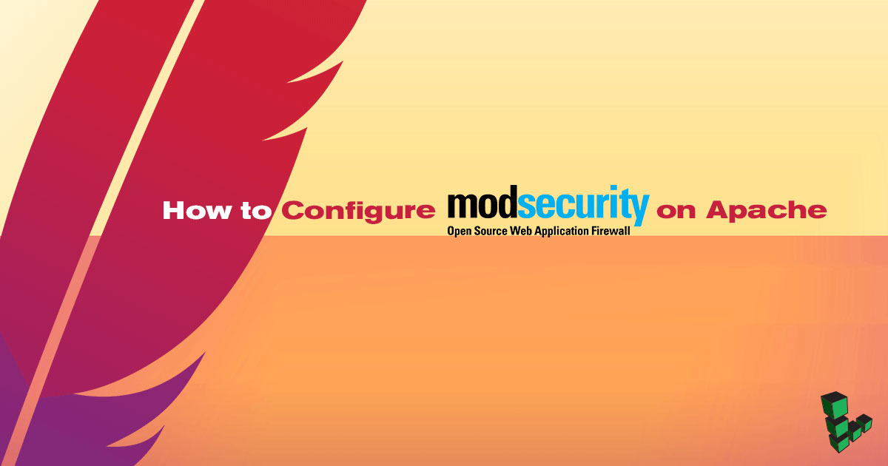

## Introduction

ModSecurity is a web application firewall for the Apache web server. In addition to providing logging capabilities, ModSecurity can monitor HTTP traffic in real time in order to detect attacks. ModSecurity also operates as an intrusion detection tool, allowing you to react to suspicious events that take place on your web systems.

Although ModSecurity comes with a default configuration, this guide will use OWASP ModSecurity Core Rule Set (CRS) version 3.0.2. The [OWASP project's goal](https://www.owasp.org/index.php/Category:OWASP_ModSecurity_Core_Rule_Set_Project) is to "provide an easily 'pluggable' set of generic attack detection rules that provide a base level of protection for any web application," and the CRS is intended to "protect web applications from a wide range of attacks....with a minimum of false alerts." This version of the CRS requires ModSecurity 2.8.0 or higher. Configuration is done through rule sets to prevent common attacks such as SQL injections, cross site scripting, and remote code execution. This guide will show how to set up the default rules. Advanced configurations are left as a challenge for the reader.

## Install ModSecurity

Before you install ModSecurity, you will need to have Apache installed on your Linode. This guide will use a LAMP stack; for installation instructions, see the [LAMP Guides](/docs/websites/lamp/).

### Debian

    sudo apt install libapache2-modsecurity

Restart Apache:

    /etc/init.d/apache2 restart

Verify the version of ModSecurity is 2.8.0 or higher:

    apt-cache show libapache2-modsecurity


When listing all mods using `apachectl -M`, ModSecurity is listed under the name `security2_module`.


### Ubuntu

    sudo apt-get install libapache2-mod-security2

Restart Apache:

    /etc/init.d/apache2 restart

Verify the version of ModSecurity is 2.8.0 or higher:

    apt-cache show libapache2-mod-security2

### CentOS

    yum install mod_security

Restart Apache by entering the following command:

    /etc/init.d/httpd restart

Verify the version of ModSecurity is 2.8.0 or higher:

    yum info mod_security

## OWASP ModSecurity Core Rule Set

The following steps are for Debian based distributions. File paths and commands for RHEL will differ slightly.

1.  Move and change the name of the default ModSecurity file:

        mv /etc/modsecurity/modsecurity.conf-recommended  modsecurity.conf

2.  Install git if needed:

        sudo apt install git

3.  Download the OWASP ModSecurity CRS from Github:

        git clone https://github.com/SpiderLabs/owasp-modsecurity-crs.git

4.  Navigate into the downloaded directory. Move and rename `crs-setup.conf.example` to `crs-setup.conf`. Then move `rules/` as well.

        cd owasp-modsecurity-crs
        mv crs-setup.conf.example /etc/modsecurity/crs-setup.conf
        mv rules/ /etc/modsecurity/

5.  The configuration file should match the path above as defined in the `IncludeOptional` directive. Add another `Include` directive pointing to the rule set:

    
<IfModule security2_module>
        # Default Debian dir for modsecurity's persistent data
        SecDataDir /var/cache/modsecurity

        # Include all the *.conf files in /etc/modsecurity.
        # Keeping your local configuration in that directory
        # will allow for an easy upgrade of THIS file and
        # make your life easier
        IncludeOptional /etc/modsecurity/*.conf
        Include /etc/modsecurity/rules/*.conf
</IfModule>


6.  Restart Apache so that the changes will take effect:

        /etc/init.d/apache2 restart

### ModSecurity Test
OWASP CRS builds on top of ModSecurity so that existing rules can be extended.

1.  Navigate to the default Apache configuration and add two additional directives, using the default configuration as an example:

    
<VirtualHost *:80>
    ServerAdmin webmaster@localhost
    DocumentRoot /var/www/html

    ErrorLog ${APACHE_LOG_DIR}/error.log
    CustomLog ${APACHE_LOG_DIR}/access.log combined

    SecRuleEngine On
    SecRule ARGS:testparam "@contains test" "id:1234,deny,status:403,msg:'Our test rule has triggered'"
</VirtualHost>


2.  Restart Apache then curl the index page to intentionally trigger the alarms:

        curl localhost/index.html?testparam=test

    The response code should be 403. There should be a message in the logs that shows the defined ModSecurity rule worked. You can check using: `sudo tail -f /var/log/apache2/error.log`

    > ModSecurity: Access denied with code 403 (phase 2). String match "test" at ARGS:testparam. [file "/etc/apache2/sites-enabled/000-default.conf"] [line "24"] [id "1234"] [msg "Our test rule has triggered"] [hostname "localhost"] [uri "/index.html"] [unique_id "WfnEd38AAAEAAEnQyBAAAAAB"]

3.  Verify the OWASP CRS is in effect:

        curl localhost/index.html?exec=/bin/bash

    Check the error logs again: the rule has caught the attempted execution of an arbitrary bash script.

    > ModSecurity: Warning. Matched phrase "bin/bash" at ARGS:. [file "/etc/modsecurity/rules/REQUEST-932-APPLICATION-ATTACK-RCE.conf"] [line "448"] [id "932160"] [rev "1"] [msg "Remote Command Execution: Unix Shell Code Found"] [data "Matched Data: bin/bash found within ARGS:: exec/bin/bash"] [severity "CRITICAL"] [ver "OWASP_CRS/3.0.0"] [maturity "1"] [accuracy "8"] [tag "application-multi"] [tag "language-shell"] [tag "platform-unix"] [tag "attack-rce"] [tag "OWASP_CRS/WEB_ATTACK/COMMAND_INJECTION"] [tag "WASCTC/WASC-31"] [tag "OWASP_TOP_10/A1"] [tag "PCI/6.5.2"] [hostname "localhost"] [uri "/index.html"] [unique_id "WfnVf38AAAEAAEqya3YAAAAC"]

## Next Steps

Review the configuration files located in `/etc/modsecurity/*.conf`. Most of the files are commented with definitions of the available options. ModSecurity uses an Anomaly Scoring Level where the highest number (5) is most severe. Review the [wiki](https://github.com/SpiderLabs/ModSecurity/wiki) for additional directives to update the rules when encountering false positives.

