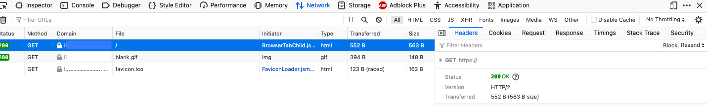

[*HTTP/2*](https://en.wikipedia.org/wiki/HTTP/2) is an update to the original [*Hypertext Transfer Protocol*](https://en.wikipedia.org/wiki/Hypertext_Transfer_Protocol) (HTTP) specification offering improvements in efficiency and latency. The new version, which adds several useful features, is compatible with browsers that only support HTTP/1. HTTP/2 has many advantages and no significant drawbacks, so upgrading to the new version is recommended. This guide explains how to configure and use HTTP/2 on an Apache server and how to test it is working.

## Understanding HTTP/2

HTTP/2 is supported by the majority of the most popular websites and is considered the current standard. It dramatically improves speed and latency due to optimizations in how data is transmitted. However, most of the changes are internal, and users do not have to make any adjustments. HTTP/2 still uses the same fields, format, and status codes, and serves the same function as the original HTTP service. It continues to use [*Transmission Control Protocol*](https://en.wikipedia.org/wiki/Transmission_Control_Protocol) (TCP) for the transport layer and supports all contemporary browsers, web servers, and proxies. A negotiation mechanism helps the client and server elect whether to use HTTP/2 or fall back to HTTP/1.1. Most clients require data encryption whenever HTTP/2 is used. This means HTTPS is the de facto standard in HTTP/2.

For more comprehensive information and a collection of resources about HTTP/2, see our [An Introduction to HTTP/2](/docs/guides/introducing-http-2/) guide.

## Before You Begin

1.  If you have not already done so, create a Linode account and Compute Instance. See our [Getting Started with Linode](/docs/guides/getting-started/) and [Creating a Compute Instance](/docs/guides/creating-a-compute-instance/) guides.

1.  Follow our [Setting Up and Securing a Compute Instance](/docs/guides/set-up-and-secure/) guide to update your system. You may also wish to set the timezone, configure your hostname, create a limited user account, and harden SSH access.

1. Ensure you possess a Fully Qualified Domain Name (FQDN) for the website. The DNS records for the site must point to the Linode server.


The steps in this guide are written for non-root users. Commands that require elevated privileges are prefixed with `sudo`. If you are not familiar with the `sudo` command, see the [Linux Users and Groups](/docs/guides/linux-users-and-groups/) guide.


## A Summary of the HTTP/2 on Apache Configuration Process

The following high-level steps are involved in configuring HTTP/2 on [*Apache*](https://httpd.apache.org/). The commands in this guide work on Ubuntu systems, but are generally applicable to all Linux distributions.

1. Install Apache
1. Install the Necessary PHP Components
1. Configure Apache to Support HTTP/2
1. Enable HTTPS Support

### Install Apache

Run the `apache2 -v` command to determine whether Apache is installed. If it is already present, the command indicates what version is running. In this case, skip this section and proceed to the [Install the Necessary PHP Components](#install-the-necessary-php-components) step. If the command displays an error, Apache is not yet installed. For more information about Apache, see Linode's [Apache Configuration Basics](/docs/web-servers/apache-tips-and-tricks/apache-configuration-basics) guide.


HTTP/2 support requires Apache version 2.4.17 or higher.


1. Update the system packages. Reboot the system if advised to do so.

        sudo apt-get update
        sudo apt-get upgrade

1. Install the `apache2` package.

        sudo apt install apache2

1. Verify Apache is active using `systemctl`.

        systemctl status apache2

    
apache2.service - The Apache HTTP Server
     Loaded: loaded (/lib/systemd/system/apache2.service; enabled; vendor preset: enabled)
     Active: active (running) since Tue 2021-05-04 13:01:06 UTC; 50s ago
    

1. (**Optional**) To configure Apache so it does not launch automatically whenever the server reboots, disable the entry in `systemctl`. To configure it to activate on reboot again, use the `systemctl enable` command.

        systemctl disable apache2

1. Configure the `ufw` firewall to enhance security. Allow `ufw` to accept `OpenSSH` and `Apache Full` connections. `Apache Full` allows both HTTP and HTTPS requests through.

        sudo ufw allow OpenSSH
        sudo ufw allow 'Apache Full'

1. Enable `ufw`.

        sudo ufw enable

1. Confirm the webserver is working. Type the address of the Linode server into the address bar of the browser. If Apache is working properly, the browser displays the default Apache landing page. The connection is still using HTTP/1.1 at this point.

### Install the Necessary PHP Components

To properly configure Apache, you need to upgrade some of your system's `php` modules so they are compatible with HTTP/2.

1. Install the `php7.4-fpm` module. Disable the older version of this module and enable the new one.

        sudo apt-get install php7.4-fpm
        sudo a2dismod php7.4
        sudo a2enconf php7.4-fpm
    
If PHP was not previously installed, the message `ERROR: Module php7.4 does not exist!` is displayed when `php7.4` is disabled. You can ignore this message.
    
1. Enable the `proxy_fcgi` module.

        sudo a2enmod proxy_fcgi

### Configure Apache to Support HTTP/2

To enable HTTP/2 support, enable some additional modules and configure the virtual server to allow the protocol.

1. Disable the `mpm_prefork` module, which is not compatible with HTTP/2. This module might already be disabled.

        sudo a2dismod mpm_prefork
1. Enable the `mpm_event` module.

        sudo a2enmod mpm_event
1. Enable the `ssl` module.

        sudo a2enmod ssl
1. Enable the `http2` module to activate HTTP/2 support.

        sudo a2enmod http2
1. Restart Apache to apply all the changes.

        sudo systemctl restart apache2
1. Verify Apache is still active using the `systemctl status` command.

        systemctl status apache2
1. Locate the `.conf` file that contains the `Protocols` definition. Depending on the installation, this is either found at `/etc/apache2/apache2.conf` or `/etc/apache2/mods-available/http2.conf`. To find the exact file, change to the root directory for Apache and search for the "Protocols" keyword with the `grep` command. Select the file that already contains a "Protocols" configuration. If there are no matches, choose the base `apache2.conf` file.

        cd /etc/apache2
        grep -r Protocols .
    
Earlier versions of Apache have a different file and directory structure. The main Apache `.conf` file might be located at `/etc/httpd/httpd.conf`, `/etc/httpd/conf/httpd.conf`, or `/usr/local/apache2/apache2.conf`.
    
1. Edit this file and add the `h2` and `h2c` protocols to the "Protocols" definition. Apache tries to negotiate the protocols in the order they are listed. Placing `h2` first prioritizes HTTP/2 over HTTP/1.1.

    
    ...
    Protocols h2 h2c http/1.1
    ...
    
    
HTTP/2 support is typically configured on a system-wide basis. If you only want to enable HTTP/2 for one site, add the `h2 h2c` protocols to the virtual server entry for the site instead. For more information about Apache, see Linode's [Apache Configuration Basics](/docs/web-servers/apache-tips-and-tricks/apache-configuration-basics) guide.
    

### Enable HTTPS Support

Most clients only support HTTP/2 if encryption is enabled, so HTTPS must be enabled to use it. HTTPS allows for website authentication and ensures all data is transmitted privately. To accept HTTPS requests, a website must possess a public key certificate signed by a trusted certificate authority. This certificate ensures the owner operates the website in question.

[*Let's Encrypt*](https://letsencrypt.org/) allows website owners to easily generate certificates. The [*Certbot*](https://certbot.eff.org/) tool automates the entire certificate-granting operation. It identifies all of the relevant domains and manages the challenge requests and the granting process. It also makes all necessary changes to the Apache configuration.

Install Certbot using the `snap` utility. Snap is pre-installed on Ubuntu.

1. Run the following commands to update Snap. Verify the current version.

        sudo snap install core
        sudo snap refresh core
        snap version
    
If Snap is not already installed, install it using the command `sudo apt install snapd`.
    
1. Remove any existing Certbot packages to avoid possible conflicts.

        sudo apt-get remove certbot
1. Install Certbot.

        sudo snap install --classic certbot
    The Snap module confirms Certbot is installed.
    
certbot 1.12.0 from Certbot Project (certbot-eff) installed
    
1. Configure a symbolic link to the Certbot directory.

        sudo ln -s /snap/bin/certbot /usr/bin/certbot
1. Run Certbot to generate certificates for each domain. You can create multiple certificates with one command by specifying the `-d` option in front of each domain. Substitute your own domain name in place of `example.com` throughout the following section.

        sudo certbot --apache -d example.com -d www.example.com
    Certbot displays updates about the requests and challenges and then confirms the domains are successfully enabled. You might be required to supply some additional information if you have never used Certbot before.
    
Requesting a certificate for example.com and www.example.com
...
Deploying Certificate to VirtualHost /etc/apache2/sites-enabled/example.com-le-ssl.conf
Deploying Certificate to VirtualHost /etc/apache2/sites-enabled/example.com-le-ssl.conf

- - - - - - - - - - - - - - - - - - - - - - - - - - - - - - - - - - - - - - - -
Congratulations! You have successfully enabled <https://example.com> and
<https://www.example.com>
- - - - - - - - - - - - - - - - - - - - - - - - - - - - - - - - - - - - - - - -
...
    

1. Restart Apache to apply the changes.

        sudo systemctl restart apache2

## Verify HTTP/2 Support is Enabled on Apache

To confirm Apache is using HTTP/2, visit the website using any browser, and use the developer tools to inspect the incoming packets. The following instructions demonstrate this technique on Firefox. Each browser has its own method of inspecting incoming packets. Consult the browser's documentation for more details.

1. Visit the domain using Firefox.
1. Open the Firefox Developer Tools. Select **Tools** followed by **Browser Tools** and then **Web Developer Tools**. This opens a new panel at the bottom of the browser.
1. Select the **Network** tab, and reload the page again.
1. This displays a list of several rows. Click on the row corresponding to the base domain. This reveals a new panel on the bottom right. The **Headers** tab appears by default.

    
1. If HTTP/2 is working, the `Status` reads `OK` and the version is `HTTP/2`.
