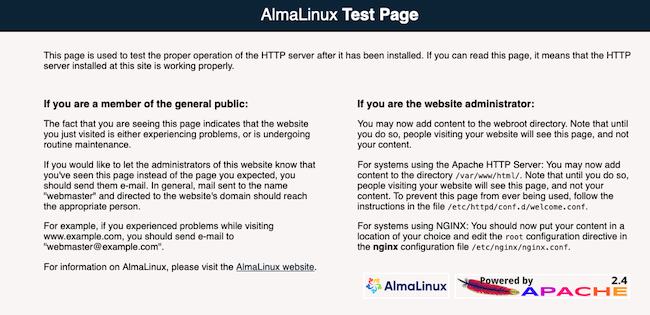

[*AlmaLinux OS*](https://almalinux.org/) is a stable open-source Linux distribution that provides a new alternative to CentOS. As a downstream fork of the *Red Hat Enterprise Linux* (RHEL) codebase, AlmaLinux guarantees ongoing free availability. CloudLinux experts originally built and designed AlmaLinux, but it is now a community-led project. AlmaLinux supports the same software applications that CentOS does, including the [*Apache web server*](https://www.apache.org/). This guide explains how to install, configure, and use Apache on AlmaLinux.

## Advantages of AlmaLinux

As a potential replacement for CentOS, AlmaLinux provides many attractive selling points and features.

- It is fairly quick and easy to migrate from CentOS to AlmaLinux with no significant downtime.
- AlmaLinux supports the same software that CentOS does, and is compatible with all CentOS services and applications.
- The current 8.3 version is supported until 2029, with thoroughly tested updates and security patches throughout this period.
- AlmaLinux is a free open source product with no licenses or restrictions.
- The user community owns and governs AlmaLinux. AlmaLinux receives sponsorship funds from CloudLinux Inc., which guarantees its viability.
- It is based on the CloudLinux OS, an RHEL fork that has existed for over ten years. AlmaLinux is a 1:1 binary fork of RHEL.

## Before You Begin

1.  If you have not already done so, create a Linode account and Compute Instance. See our [Getting Started with Linode](/docs/guides/getting-started/) and [Creating a Compute Instance](/docs/guides/creating-a-compute-instance/) guides.

1.  Follow our [Setting Up and Securing a Compute Instance](/docs/guides/set-up-and-secure/) guide to update your system. You may also wish to set the timezone, configure your hostname, create a limited user account, and harden SSH access.


This guide is written for non-root users. Commands that require elevated privileges are prefixed with `sudo`. If you’re not familiar with the `sudo` command, see the [Linux Users and Groups](/docs/guides/linux-users-and-groups/) guide.


## Install and Enable the Apache Web Server on AlmaLinux

To proceed with the Apache installation, AlmaLinux must already be installed. Instructions for switching to AlmaLinux can be found at their [GitHub site](https://github.com/AlmaLinux/almalinux-deploy).

1. Verify whether there are any updates, using the `dnf check-update` command. If any updates are available, update the Linode. If any kernel components are updated, reboot the Linode.

        sudo dnf check-update
        sudo dnf update
        sudo reboot

1. Install the necessary Apache packages.

        sudo dnf install httpd httpd-tools

1. Apache does not start automatically when it is installed. Start and enable it using the `systemctl` utility.

        sudo systemctl start httpd

1. **(Optional)** To restart Apache every time the system reboots, enable it in `systemctl`.

        sudo systemctl enable httpd
    
Created symlink /etc/systemd/system/multi-user.target.wants/httpd.service → /usr/lib/systemd/system/httpd.service.
    

1. Verify the status of `Apache` using `systemctl status`. It should be `active` and display a status of `running`.

        sudo systemctl status httpd
    
httpd.service - The Apache HTTP Server
Loaded: loaded (/usr/lib/systemd/system/httpd.service; enabled; vendor prese>
Active: active (running) since Fri 2021-06-04 13:07:16 UTC; 4min 52s ago
Docs: man:httpd.service(8)
Main PID: 5933 (httpd)
Status: "Running, listening on: port 80"
    

## Configure the AlmaLinux Firewall to Allow Apache Connections

The `firewalld` service is already installed and enabled as part of AlmaLinux. Additional configuration is required to allow Apache connections to pass through the firewall.


It is strongly recommended that you keep the firewall turned on.

- To temporarily disable the firewall to debug a problem, enter the command `sudo systemctl stop firewalld`.
- The firewall can be restarted using the `sudo systemctl start firewalld` command.
- To disable it permanently, use the `sudo systemctl disable firewalld` command.


1. Use `systemctl` to verify whether `firewalld` is already enabled.

        sudo systemctl status firewalld
    
firewalld.service - firewalld - dynamic firewall daemon
Loaded: loaded (/usr/lib/systemd/system/firewalld.service; enabled; vendor p>
Active: active (running) since Fri 2021-06-04 11:15:33 UTC; 2h 22min ago
    

1. Add rules to allow Apache HTTP and HTTPS connections through the firewall.

        sudo firewall-cmd --zone=public --add-service=http --permanent
        sudo firewall-cmd --zone=public --add-service=https --permanent

1. Reload `firewalld` to apply the changes.

        sudo firewall-cmd --reload

1. Confirm that the applications have been registered.

        sudo firewall-cmd --list-all
    
public (active)
  target: default
  ...
  services: cockpit dhcpv6-client http https ssh
  ...
    


In addition to `firewalld`, the security application SELinux comes pre-loaded with AlmaLinux. Under certain conditions, the two applications might conflict with one another. Verify the status of SELinux using the `sestatus` command. SELinux can be temporarily disabled for debugging purposes using the `sudo setenforce 0` command.


## Test the Apache Web Server and Host a Web Page

1. Verify that the Apache server is working as expected. Visit the IP address of the Linode using a web browser. If everything is configured properly, you should see the `AlmaLinux Test Page` landing page.

    

1. The location for the default web page for the server is `/var/www/html`. If this directory is empty, Apache displays the test page from `/etc/httpd/conf.d/welcome.conf`. If your website has a home page, in this case, `index.html`, copy it into the `/var/www/html` directory.

        cp path-to-home-page/index.html /var/www/html

   
If you do not have an `index.html` file in `/var/www/html` directory, you can create one. This is to confirm that the web server is serving the page from this directory.


1. SELinux is configured to block web access to this directory. Use the `chcon` command to change the security context for the directory to ensure the web page is accessible.

        chcon -R -t httpd_sys_rw_content_t /var/www/html

1. Navigate to the IP address of the Linode again. You should now see the web page contents for the home page of your domain.

1. **(Optional)** You should ideally create a virtual host for each site on the server. For more information on creating virtual hosts on Apache, consult the Linode guide on [Apache Configuration Basics](/docs/guides/apache-configuration-basics/).

## Learn More About AlmaLinux

AlmaLinux documentation is still evolving, but the [*AlmaLinux Wiki*](https://wiki.almalinux.org/#about) contains links to several resources along with release notes and a FAQ. There is also an [*AlmaLinux Forum*](https://almalinux.discourse.group/), and a [*GitHub page*](https://github.com/AlmaLinux).
